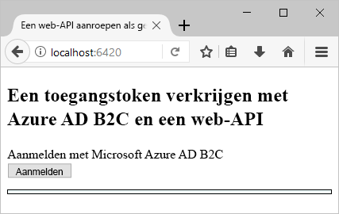
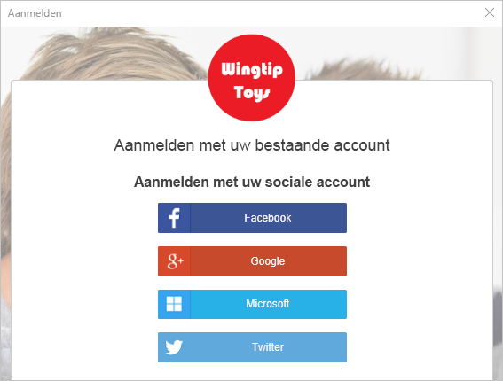
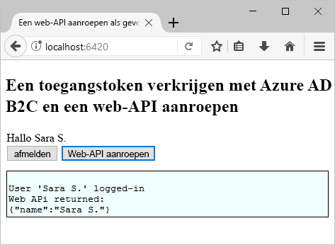

# <a name="quickstart-set-up-sign-in-for-a-single-page-app-using-azure-active-directory-b2c"></a>Snelstartgids: Instellen aanmelden voor een single-page-app met Azure Active Directory B2C

Azure Active Directory (Azure AD) B2C bevat functionaliteit voor identiteitsbeheer in de cloud ter bescherming van uw toepassing, bedrijf en klanten. Met Azure AD B2C zijn uw apps in staat om zich met behulp van open-standaardprotocollen te verifiëren bij sociaalnetwerk- en Enterprise-accounts.

In deze snelstart gebruikt u een Azure AD B2C-voorbeeld-app met één pagina. Deze app wordt gebruikt voor het aanmelden via een id-provider voor sociale netwerken en voor het aanroepen van een met Azure AD B2C beveiligde web-API.

[!INCLUDE [quickstarts-free-trial-note](../../includes/quickstarts-free-trial-note.md)]

## <a name="prerequisites"></a>Vereisten

* [Visual Studio 2017](https://www.visualstudio.com/downloads/) met de **ASP.NET- en webontwikkelworkload**.
* [Node.js](https://nodejs.org/en/download/) installeren
* Een sociaalnetwerkaccount van Facebook, Google, Microsoft of Twitter.

## <a name="download-the-sample"></a>Het voorbeeld downloaden

[Download een ZIP-bestand ](https://github.com/Azure-Samples/active-directory-b2c-javascript-msal-singlepageapp/archive/master.zip) of kloon de voorbeeld-web-app vanuit GitHub.

```
git clone https://github.com/Azure-Samples/active-directory-b2c-javascript-msal-singlepageapp.git
```

## <a name="run-the-sample-application"></a>De voorbeeldtoepassing uitvoeren

Ga als volgt te werk om deze voorbeeldtoepassing uit te voeren vanaf de Node.js-opdrachtprompt: 

```
cd active-directory-b2c-javascript-msal-singlepageapp
npm install && npm update
node server.js
```

De Node.js-app levert het poortnummer waarnaar de app op localhost luistert.

```
Listening on port 6420...
```

Blader naar de app-URL (`http://localhost:6420`) in een webbrowser.



## <a name="create-an-account"></a>Een account maken

Klik op de knop **Aanmelden** om de Azure AD B2C-werkstroom **Registreren of aanmelden** op basis van een Azure AD B2C-beleid te starten. 

In de voorbeeldtoepassing worden verschillende registratiemogelijkheden ondersteund. U kunt bijvoorbeeld een id-provider voor sociale netwerken gebruiken of een lokaal account maken met behulp van een e-mailadres. Voor deze snelstart gebruikt u een account van een id-provider voor sociale netwerken (Facebook, Google, Microsoft of Twitter). 

### <a name="sign-up-using-a-social-identity-provider"></a>Aanmelden met een id-provider voor sociale netwerken

In Azure AD B2C wordt een aangepaste aanmeldingspagina voor het fictieve merk Wingtip Toys weergegeven voor de voorbeeldweb-app. 

1. Klik op de knop van de id-provider voor sociale netwerken die u wilt gebruiken om u aan te melden via een id-provider voor sociale netwerken.

    

    U moet zich verifiëren (aanmelden) met behulp van de referenties van uw sociaalnetwerkaccount en de toepassing autoriseren om informatie uit uw sociaalnetwerkaccount te lezen. Door toegang te verlenen, kan de toepassing profielgegevens van het sociaalnetwerkaccount ophalen, zoals uw naam en plaats. 

2. Voltooi het aanmeldingsproces voor de id-provider. Als u bijvoorbeeld Twitter hebt gekozen, voert u uw referenties voor Twitter in en klikt u op **Aanmelden**.

    

    De profielgegevens van uw nieuwe account worden ingevuld met informatie uit uw sociaalnetwerkaccount. 

3. Werk de velden Weergavenaam, Functie en Plaats bij en klik op **Doorgaan**.  De ingevoerde waarden worden gebruikt voor uw Azure AD B2C-gebruikersaccountprofiel.

    U hebt een nieuw Azure AD B2C-gebruikersaccount gemaakt dat gebruikmaakt van een id-provider. 

## <a name="access-a-protected-web-api-resource"></a>Toegang tot een beveiligde web-API-resource

Klik op de knop **Web-API aanroepen** om de weergavenaam van de web-API-aanroep als JSON-object te retourneren. 



De voorbeeld-app met één pagina bevat een Azure AD-toegangstoken in de aanvraag voor de beveiligde web-API-resource om het JSON-object te kunnen retourneren.

## <a name="clean-up-resources"></a>Resources opschonen

U kunt uw Azure AD B2C-tenant gebruiken voor andere snelstarts of zelfstudies voor Azure AD B2C. Als u deze niet meer nodig hebt, kunt u [uw Azure AD B2C-tenant verwijderen](active-directory-b2c-faqs.md#how-do-i-delete-my-azure-ad-b2c-tenant).

## <a name="next-steps"></a>Volgende stappen

In deze snelstart hebt u een voorbeeld van een voor Azure AD B2C geconfigureerde ASP.NET-app gebruikt. Deze app wordt gebruikt voor het aanmelden via een aangepaste aanmeldingspagina, het aanmelden via een id-provider voor sociale netwerken, het maken van een Azure AD B2C-account en het aanroepen van een met Azure AD B2C beveiligde web-API. 

De volgende stap is het maken van uw eigen Azure AD B2C-tenant en het configureren van het voorbeeld voor uitvoering met deze tenant. 

> [!div class="nextstepaction"]
> [Een Azure Active Directory B2C-tenant maken in Azure Portal](active-directory-b2c-get-started.md)