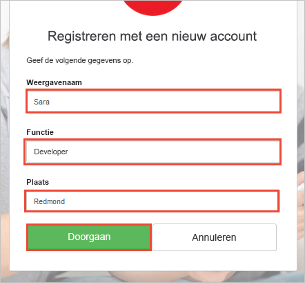
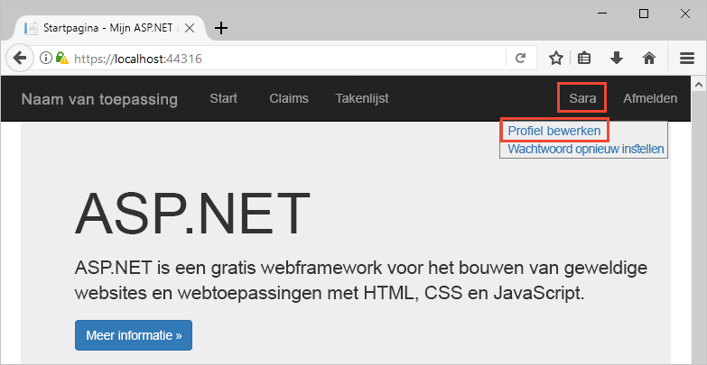

# <a name="quickstart-set-up-sign-in-for-an-aspnet-application-using-azure-active-directory-b2c"></a>Snelstart: aanmelden instellen voor een ASP.NET-toepassing met Azure Active Directory B2C

Azure Active Directory (Azure AD) B2C bevat functionaliteit voor identiteitsbeheer in de cloud ter bescherming van uw toepassing, bedrijf en klanten. Met Azure AD B2C zijn uw apps in staat om zich met behulp van open-standaardprotocollen te verifiëren bij sociaalnetwerk- en Enterprise-accounts.

In deze snelstart gebruikt u een voorbeeld van een voor Azure AD B2C geconfigureerde ASP.NET-app. Deze app wordt gebruikt voor het aanmelden via een id-provider voor sociale netwerken en voor het aanroepen van een met Azure AD B2C beveiligde web-API.

[!INCLUDE [quickstarts-free-trial-note](../../includes/quickstarts-free-trial-note.md)]

## <a name="prerequisites"></a>Vereisten

* [Visual Studio 2017](https://www.visualstudio.com/downloads/) met de **ASP.NET- en webontwikkelworkload**. 
* Een sociaalnetwerkaccount van Facebook, Google, Microsoft of Twitter.

## <a name="download-the-sample"></a>Het voorbeeld downloaden

[Download een ZIP-bestand ](https://github.com/Azure-Samples/active-directory-b2c-dotnet-webapp-and-webapi/archive/master.zip) of kloon de voorbeeld-web-app vanuit GitHub.

```
git clone https://github.com/Azure-Samples/active-directory-b2c-dotnet-webapp-and-webapi.git
```

## <a name="run-the-app-in-visual-studio"></a>De app uitvoeren in Visual Studio

In de projectmap van de voorbeeldtoepassing opent u de `B2C-WebAPI-DotNet.sln`-oplossing in Visual Studio.

Er bevinden zich twee projecten in de voorbeeldoplossing:

**Voorbeeld-web-app (TaskWebApp):** een web-app om een takenlijst te maken of te bewerken. De web-app gebruikt het **registratie- of aanmeldingsbeleid** om gebruikers te registreren of aan te melden.

**Voorbeeld-web-API-app (TaskService):** een web-API die ondersteuning biedt voor het maken, lezen, bijwerken en verwijderen van takenlijstfunctionaliteit. De web-API wordt beveiligd door Azure AD B2C en wordt aangeroepen door de web-app.

Voor deze snelstart voert u de `TaskWebApp`- en `TaskService`- projecten tegelijk uit. 

1. Selecteer de oplossing `B2C-WebAPI-DotNet` in Solution Explorer.
2. Selecteer in het menu van Visual Studio **Project > Opstartprojecten instellen...** . 
3. Selecteer het keuzerondje **Meerdere opstartprojecten**.
4. Wijzig de **actie** voor beide projecten in **Start**. Klik op **OK**.

Druk op **F5** om fouten in beide toepassingen op te sporen. Elke toepassing wordt geopend op een eigen browsertabblad:

`https://localhost:44316/` - Deze pagina is de ASP.NET-webtoepassing. U communiceert rechtstreeks met deze toepassing in de snelstart.
`https://localhost:44332/` - deze pagina is de web-API die wordt aangeroepen door de ASP.NET-webtoepassing.

## <a name="create-an-account"></a>Een account maken

Klik op de koppeling **Registeren/aanmelden** in de ASP.NET-webtoepassing om de werkstroom **Registreren of aanmelden** te starten op basis van een Azure AD B2C-beleid.


In de voorbeeldtoepassing worden verschillende registratiemogelijkheden ondersteund. U kunt bijvoorbeeld een id-provider voor sociale netwerken gebruiken of een lokaal account maken met behulp van een e-mailadres. Voor deze snelstart gebruikt u een account van een id-provider voor sociale netwerken (Facebook, Google, Microsoft of Twitter). 

### <a name="sign-up-using-a-social-identity-provider"></a>Aanmelden met een id-provider voor sociale netwerken

In Azure AD B2C wordt een aangepaste aanmeldingspagina voor het fictieve merk Wingtip Toys weergegeven voor de voorbeeldweb-app. 

1. Klik op de knop van de id-provider voor sociale netwerken die u wilt gebruiken om u aan te melden via een id-provider voor sociale netwerken.

    

    U moet zich verifiëren (aanmelden) met behulp van de referenties van uw sociaalnetwerkaccount en de toepassing autoriseren om informatie uit uw sociaalnetwerkaccount te lezen. Door toegang te verlenen, kan de toepassing profielgegevens van het sociaalnetwerkaccount ophalen, zoals uw naam en plaats. 

2. Voltooi het aanmeldingsproces voor de id-provider. Als u bijvoorbeeld Twitter hebt gekozen, voert u uw referenties voor Twitter in en klikt u op **Aanmelden**.

    

    De profielgegevens van uw nieuwe Azure AD B2C-account worden ingevuld met informatie uit uw sociaalnetwerkaccount.

3. Werk de velden Weergavenaam, Functie en Plaats bij en klik op **Doorgaan**.  De ingevoerde waarden worden gebruikt voor uw Azure AD B2C-gebruikersaccountprofiel.

    

    U hebt de voorbeeld-web-app gebruikt waarin gebruik wordt gemaakt van een Azure AD B2C-beleid om de verificatie uit te voeren met behulp van een id-provider en om een Azure AD B2C-gebruikersaccount te maken. 

## <a name="edit-your-profile"></a>Het profiel bewerken

Azure Active Directory B2C biedt functionaliteit waarmee gebruikers hun profielen kunnen bijwerken. In de voorbeeldweb-app wordt een Azure AD B2C-bewerkingsprofielbeleid gebruikt voor de werkstroom. 

1. Klik in de menubalk van de webtoepassing op uw profielnaam en selecteer **Profiel bewerken** om het profiel te bewerken dat u hebt gemaakt.

    

2. Wijzig uw **weergavenaam** en **plaats**.  
3. Klik op **Doorgaan** om uw profiel bij te werken. De nieuwe weergavenaam wordt in de rechterbovenhoek van de startpagina van de web-app weergegeven.

## <a name="access-a-protected-web-api-resource"></a>Toegang tot een beveiligde web-API-resource

1. Klik op **Takenlijst** om uw takenlijstitems in te voeren en te wijzigen. 

2. Voer tekst in het tekstvak **Nieuw item** in. Klik op **Toevoegen** om de met Azure AD B2C beveiligde web-API aan te roepen, waarmee een takenlijstitem wordt toegevoegd.

    

    De ASP.NET-webtoepassing bevat een Azure AD-toegangstoken in de aanvraag voor de beveiligde web-API-resource, waarmee bewerkingen op de takenlijstitems van de gebruiker kunnen worden uitgevoerd.

U hebt uw Azure AD B2C-gebruikersaccount gebruikt voor het geautoriseerd aanroepen van een web-API die met Azure AD B2C is beveiligd.

## <a name="clean-up-resources"></a>Resources opschonen

U kunt uw Azure AD B2C-tenant gebruiken voor andere snelstarts of zelfstudies voor Azure AD B2C. Als u deze niet meer nodig hebt, kunt u [uw Azure AD B2C-tenant verwijderen](active-directory-b2c-faqs.md#how-do-i-delete-my-azure-ad-b2c-tenant).

## <a name="next-steps"></a>Volgende stappen

In deze snelstart hebt u een voorbeeld van een voor Azure AD B2C geconfigureerde ASP.NET-app gebruikt. Deze app wordt gebruikt voor het aanmelden via een aangepaste aanmeldingspagina, het aanmelden via een id-provider voor sociale netwerken, het maken van een Azure AD B2C-account en het aanroepen van een met Azure AD B2C beveiligde web-API. 

U kunt verdergaan met de zelfstudie als u wilt leren hoe u de ASP.NET-voorbeeld-app kunt configureren voor het gebruik van uw eigen Azure AD B2C-tenant.

> [!div class="nextstepaction"]
> [Zelfstudie: verificatie van gebruikers met Azure Active Directory B2C in een ASP.NET-web-app](active-directory-b2c-tutorials-web-app.md)