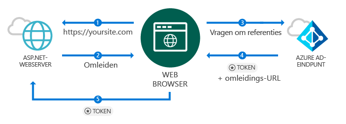
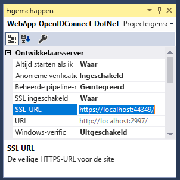
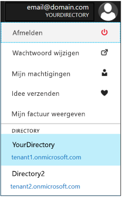
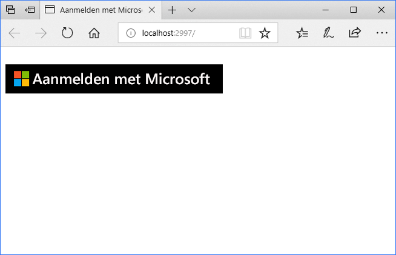
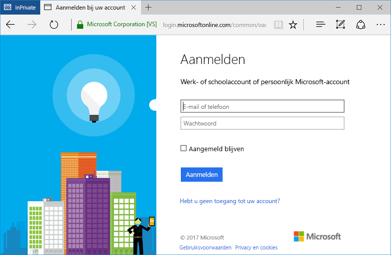

<!--start-intro-->
# <a name="add-sign-in-with-microsoft-to-an-aspnet-web-app"></a>Aanmelden bij Microsoft toevoegen aan een ASP.NET-web-app

Deze handleiding laat zien hoe u aanmelden met Microsoft met behulp van een ASP.NET MVC-oplossing met een traditionele web browser-gebaseerde toepassing met behulp van OpenID Connect implementeren. 

Aan het einde van deze handleiding, uw toepassing accepteert aanmeldingen van werk- en schoolaccounts accounts van organisaties die zijn geïntegreerd met Azure Active Directory.

> [!NOTE]
> Deze Begeleide installatie helpt u om in te schakelen aanmeldingen vanaf werk en school-accounts in uw ASP.NET-toepassing. Als u geïnteresseerd om in te schakelen aanmeldingen voor persoonlijke accounts naast het werk en schoolaccounts bent, kunt u de [v2-eindpunt](azure-ad-endpoint-comparison.md). Zie [deze ASP.NET begeleide instelling voor de v2-eindpunt](tutorial-v2-asp-webapp.md) , evenals [dit document](active-directory-v2-limitations.md) uitleg over de huidige beperkingen van de v2-eindpunt.
<br/><br/>

<!--separator-->

> Deze handleiding is vereist voor Visual Studio 2015 Update 3 of Visual Studio 2017.  Deze nog niet?  [Gratis Visual Studio 2017 downloaden](https://www.visualstudio.com/downloads/)

## <a name="how-this-guide-works"></a>De werking van deze handleiding



Deze handleiding is gebaseerd op het scenario waarbij een browser toegang heeft tot een ASP.NET-website aanvragen van een gebruiker via een knop aanmelden wordt geverifieerd. In dit scenario optreedt de meeste om weer te geven van de webpagina wordt weergegeven op de server.

> [!NOTE]
> Deze Begeleide installatie ziet u hoe u zich aanmelden gebruikers op een ASP.NET-webtoepassing vanaf een lege sjabloon en stappen zoals het toevoegen van een teken in de knop en elke domeincontroller en de methoden, terwijl ook uitleg over enkele concepten bevatten. U kunt ook kunt u ook een project voor aanmelding bij Azure Active Directory maken gebruikers (werk en school-accounts) met behulp van de [Visual Studio websjabloon](https://docs.microsoft.com/aspnet/visual-studio/overview/2013/creating-web-projects-in-visual-studio#organizational-account-authentication-options) en te selecteren *Organisatieaccounts* en vervolgens een van de cloudopties voor - deze optie maakt gebruik van een sjabloon voor uitgebreidere, met extra domeincontrollers, methoden en weergaven.

## <a name="libraries"></a>Bibliotheken

Deze handleiding maakt gebruik van de volgende pakketten:

|Bibliotheek|Beschrijving|
|---|---|
|[Microsoft.Owin.Security.OpenIdConnect](https://www.nuget.org/packages/Microsoft.Owin.Security.OpenIdConnect/)|Middleware waarmee een toepassing wilt OpenIdConnect gebruiken voor verificatie|
|[Microsoft.Owin.Security.Cookies](https://www.nuget.org/packages/Microsoft.Owin.Security.Cookies)|Middleware waarmee een toepassing voor het onderhouden van de sessie van de gebruiker met behulp van cookies|
|[Microsoft.Owin.Host.SystemWeb](https://www.nuget.org/packages/Microsoft.Owin.Host.SystemWeb)|Hiermee kunt op basis van een OWIN-toepassingen worden uitgevoerd op IIS met behulp van de ASP.NET-verzoek-pijplijn|


<!--end-intro-->

<!--start-setup-->

## <a name="set-up-your-project"></a>Instellen van uw project

In deze sectie bevat de stappen voor het installeren en configureren van de verificatiepijplijn via OWIN-middleware op een ASP.NET-project met behulp van OpenID Connect. 

> Voorkeur voor het downloaden van dit voorbeeld Visual Studio-project in plaats daarvan? [Een project hebt gedownload](https://github.com/AzureADQuickStarts/WebApp-OpenIdConnect-DotNet/archive/GuidedSetup.zip) en gaat u naar de [configuratiestap](#configure-your-webconfig-and-register-an-application) het codevoorbeeld configureren voordat u uitvoert.

## <a name="create-your-aspnet-project"></a>Uw ASP.NET-project maken
1. In Visual Studio: `File` > `New` > `Project`<br/>
2. Onder *Visual C# \Web*, selecteer `ASP.NET Web Application (.NET Framework)`.
3. Geef uw toepassing en klikt u op *OK*
4. Selecteer `Empty` en selecteer vervolgens het selectievakje in om toe te voegen `MVC` verwijzingen

## <a name="add-authentication-components"></a>Verificatieonderdelen toevoegen

1. In Visual Studio: `Tools` > `Nuget Package Manager` > `Package Manager Console`
2. Voeg *OWIN-middleware NuGet-pakketten* door het volgende te typen in het venster Package Manager Console:

    ```powershell
    Install-Package Microsoft.Owin.Security.OpenIdConnect
    Install-Package Microsoft.Owin.Security.Cookies
    Install-Package Microsoft.Owin.Host.SystemWeb
    ```

<!--start-collapse-->
> ### <a name="about-these-packages"></a>Over deze pakketten
>De bovenstaande bibliotheken Schakel eenmalige aanmelding (SSO) met behulp van OpenID Connect via verificatie op basis van cookies. Nadat de verificatie is voltooid en het token voor de gebruiker wordt verzonden naar uw toepassing, maakt de OWIN-middleware een sessiecookie. De browser vervolgens deze cookie wordt gebruikt bij volgende aanvragen, zodat de gebruiker hoeft niet te verifiëren en geen aanvullende verificatie nodig is.
<!--end-collapse-->

## <a name="configure-the-authentication-pipeline"></a>De verificatiepijplijn configureren
De volgende stappen uit gebruikt bij het maken van een OWIN-middleware *Opstartklasse* OpenID Connect-verificatie configureren. Deze klasse wordt automatisch uitgevoerd.

> [!TIP]
> Als uw project niet over een `Startup.cs` bestand in de hoofdmap:<br/>
> 1. Met de rechtermuisknop op de hoofdmap van het project: >    `Add` > `New Item...` > `OWIN Startup class`<br/>
> 2. Geef het de naam `Startup.cs`<br/>
>
>> Zorg ervoor dat de geselecteerde klasse is een OWIN-Opstartklasse en niet een standard C#-klasse. Dit bevestigen door te controleren of er `[assembly: OwinStartup(typeof({NameSpace}.Startup))]` boven de naamruimte.


1. Voeg *OWIN* en *Microsoft.IdentityModel* naamruimten aan `Startup.cs`:

    [!code-csharp[main](../../../WebApp-OpenIDConnect-DotNet/WebApp-OpenIDConnect-DotNet\Startup.cs?name=AddedNameSpaces "Startup.cs")]

2. Opstartklasse vervangen door de volgende code:

    [!code-csharp[main](../../../WebApp-OpenIDConnect-DotNet/WebApp-OpenIDConnect-DotNet\Startup.cs?name=Startup "Startup.cs")]
    
<!--start-collapse-->
> [!NOTE]
> De parameters die u opgeeft in *OpenIDConnectAuthenticationOptions* fungeren als coördinaten voor de toepassing om te communiceren met Azure AD. Omdat de middleware OpenID Connect maakt gebruik van cookies, moet u ook het instellen van de cookie-verificatie als de bovenstaande code wordt getoond. De *ValidateIssuer* waarde geeft OpenIdConnect toegang niet beperken tot een specifieke organisatie.
<!--end-collapse-->

<!--end-setup-->

<!--start-use-->

## <a name="add-a-controller-to-handle-sign-in-and-sign-out-requests"></a>Toevoegen van een domeincontroller voor het afhandelen van aanmelding en afmeldingsaanvragen te verzenden

Deze stap ziet u hoe u een nieuwe controller als aanmelden en afmelden methoden beschikbaar wilt maken.

1.  Met de rechtermuisknop op de `Controllers` map en selecteer `Add` > `Controller`
2.  Selecteer `MVC (.NET version) Controller – Empty`.
3.  Klik op *toevoegen*
4.  Geef het de naam `HomeController` en klikt u op *toevoegen*
5.  Voeg *OWIN* naamruimten aan de klasse:

    [!code-csharp[main](../../../WebApp-OpenIDConnect-DotNet/WebApp-OpenIDConnect-DotNet\Controllers\HomeController.cs?name=AddedNameSpaces "HomeController.cs")]

6. Voeg de volgende methoden voor het afhandelen van aanmelden en afmelden bij de domeincontroller door te starten van een verificatiecontrole via code toe:

    [!code-csharp[main](../../../WebApp-OpenIDConnect-DotNet/WebApp-OpenIDConnect-DotNet\Controllers\HomeController.cs?name=SigInAndSignOut "HomeController.cs")]
    
## <a name="create-the-apps-home-page-to-sign-in-users-via-a-sign-in-button"></a>Maken van de startpagina van de app aan te melden bij gebruikers via een knop aanmelden

Maak een nieuwe weergave voor het toevoegen van de knop aanmelden en gebruikersgegevens na verificatie weergeven in Visual Studio:

1.  Met de rechtermuisknop op de `Views\Home` map en selecteer `Add View`
2.  Noem deze `Index`.
3.  De volgende HTML-code, waaronder de knop aanmelden toevoegen aan het bestand:

    [!code-html[main](../../../WebApp-OpenIDConnect-DotNet/WebApp-OpenIDConnect-DotNet/Views/Home/Index.cshtml "Index.cshtml")]

<!--start-collapse-->
> [!NOTE]
> Deze pagina wordt een knop aanmelden in SVG-indeling met een zwarte achtergrond toegevoegd:<br/><br/> Ga voor meer aanmelding knoppen naar [deze pagina](https://docs.microsoft.com/azure/active-directory/develop/active-directory-branding-guidelines "Huisstijlrichtlijnen").
<!--end-collapse-->

## <a name="display-users-claims-by-adding-a-controller"></a>Claims van gebruiker weergeven door het toevoegen van een domeincontroller
Deze controller ziet u het gebruik van de `[Authorize]` kenmerk voor het beveiligen van een domeincontroller. Dit kenmerk wordt beperkt tot de controller alleen waarmee geverifieerde gebruikers. De volgende code maakt gebruik van het kenmerk om weer te geven van gebruikersclaims die zijn opgehaald als onderdeel van de aanmelding.

1.  Met de rechtermuisknop op de `Controllers` map: `Add` > `Controller`
2.  Selecteer `MVC {version} Controller – Empty`.
3.  Klik op *toevoegen*
4.  Geef het de naam `ClaimsController`
5.  Vervang de code van de controllerklasse met de volgende code: Hiermee voegt u toe de `[Authorize]` kenmerk aan de klasse:

    [!code-csharp[main](../../../WebApp-OpenIDConnect-DotNet/WebApp-OpenIDConnect-DotNet\Controllers\ClaimsController.cs?name=ClaimsController "ClaimsController.cs")]

<!--start-collapse-->
> [!NOTE]
> Vanwege het gebruik van de `[Authorize]` kenmerk, alle methoden van deze controller kan alleen worden uitgevoerd als de gebruiker is geverifieerd. Als de gebruiker niet is geverifieerd en probeert te krijgen tot de controller, OWIN een verificatiecontrole Start en het afdwingen van de gebruiker om te verifiëren. De bovenstaande code kijkt naar de verzameling claims van de gebruiker voor specifieke kenmerken die zijn opgenomen in het token van de gebruiker. Deze kenmerken zijn de volledige naam van de gebruiker en gebruikersnaam, evenals het onderwerp van de globale gebruikers-id. Het bevat ook de *Tenant-ID*, die staat voor de ID voor de organisatie van de gebruiker. 
<!--end-collapse-->

## <a name="create-a-view-to-display-the-users-claims"></a>Maken van een weergave om claims van de gebruiker weer te geven

Maak een nieuwe weergave om claims van de gebruiker op een webpagina weer te geven in Visual Studio:

1.  Met de rechtermuisknop op de `Views\Claims` map en: `Add View`
2.  Noem deze `Index`.
3.  De volgende HTML-code toevoegen aan het bestand:

    [!code-html[main](../../../WebApp-OpenIDConnect-DotNet/WebApp-OpenIDConnect-DotNet/Views/Claims/Index.cshtml "Index.cshtml")]
    
<!--end-use-->

<!--start-configure-->
## <a name="configure-your-webconfig-and-register-an-application"></a>Configureer uw *web.config* en een toepassing registreren

1. In Visual Studio, het volgende toevoegen aan `web.config` (te vinden in de hoofdmap) onder de sectie `configuration\appSettings`:

    ```xml
    <add key="ClientId" value="Enter_the_Application_Id_here" />
    <add key="RedirectUrl" value="Enter_the_Redirect_Url_here" />
    <add key="Tenant" value="common" />
    <add key="Authority" value="https://login.microsoftonline.com/{0}" /> 
    ```
2. Selecteer het project in Solution Explorer en bekijk de <i>eigenschappen</i> venster (als er geen een venster met eigenschappen, druk op F4)
3. SSL ingeschakeld om te wijzigen <code>True</code>
4. SSL-URL van het project naar het Klembord kopiëren:<br/><br/><br />
5. In <code>web.config</code>, Vervang <code>Enter_the_Redirect_URL_here</code> met de SSL-URL van uw project 

### <a name="register-your-application-in-the-azure-portal-then-add-its-information-to-webconfig"></a>Uw toepassing registreren in de Azure Portal en vervolgens de informatie toevoegen *web.config*

1. Ga naar de [Microsoft Azure Portal - App-registraties](https://portal.azure.com/#blade/Microsoft_AAD_IAM/ActiveDirectoryMenuBlade/RegisteredApps) een toepassing registreren
2. Selecteer `New application registration`
3. Voer een naam in voor uw toepassing
4. Plak de Visual Studio-project *SSL-URL* in `Sign-on URL` (deze URL wordt ook automatisch toegevoegd aan de lijst met antwoord-URL's voor de toepassing die u registreert)
5. Klik op `Create` om de toepassing te registreren. Hiermee keert u terug naar de lijst met toepassingen
6. Nu zoeken en/of Selecteer de toepassing die u zojuist hebt gemaakt om de eigenschappen te openen
7. Kopieer de guid onder `Application ID` naar het Klembord
8. Ga terug naar Visual Studio en, in `web.config`, Vervang `Enter_the_Application_Id_here` met toepassings-ID van de toepassing die u zojuist hebt geregistreerd

> [!TIP]
> Als uw account is geconfigureerd voor toegang tot meerdere mappen, zorg ervoor dat u hebt geselecteerd dat de juiste map voor de organisatie wilt u de toepassing worden geregistreerd door te klikken op de accountnaam van uw in de rechterbovenhoek rechts in de Azure Portal en vervolgens controleren van de geselecteerde map aangegeven:<br/>

## <a name="configure-sign-in-options"></a>Opties voor aanmelding configureren

U kunt uw toepassing waarmee alleen gebruikers die deel uitmaken van een organisatie Azure Active Directory-exemplaar om aan te melden configureren, of accepteer aanmeldingen van gebruikers die deel uitmaken van elke organisatie. Volg de instructies van een van de volgende opties:

### <a name="configure-your-application-to-allow-sign-ins-of-work-and-school-accounts-from-any-company-or-organization-multi-tenant"></a>Uw toepassing configureren voor het toestaan aanmeldingen van werk- en schoolaccounts accounts van een bedrijf of organisatie (met meerdere tenants)

Volg de volgende stappen uit als u wilt accepteren aanmeldingen van werk- en schoolaccounts accounts van een bedrijf of organisatie die is geïntegreerd met Azure Active Directory. Dit is een algemeen scenario voor *SaaS-toepassingen*:

1. Ga terug naar [Microsoft Azure Portal - App-registraties](https://portal.azure.com/#blade/Microsoft_AAD_IAM/ActiveDirectoryMenuBlade/RegisteredApps) en zoekt u de toepassing die u zojuist hebt geregistreerd
2. Onder `All Settings` selecteren `Properties`
3. Wijziging `Multi-tenanted` eigenschap `Yes` en klikt u op `Save`

Zie voor meer informatie over deze instelling en het concept van toepassingen met meerdere tenants, [in dit artikel](howto-convert-app-to-be-multi-tenant.md "multitenant overzicht").

### <a name="restrict-users-from-only-one-organizations-active-directory-instance-to-sign-in-to-your-application-single-tenant"></a>Voorkomen dat gebruikers kunnen slechts één organisatie Active Directory-exemplaar om aan te melden bij uw toepassing (Eén tenant)

Deze optie is een veelvoorkomend scenario voor *LOB-toepassingen*: als u wilt dat uw toepassing om te accepteren van aanmeldingen alleen vanaf de accounts die deel uitmaken van een specifieke Azure Active Directory-exemplaar (met inbegrip van *gastaccounts*van deze instantie), vervangen de `Tenant` parameter in *web.config* van `Common` met de naam van de tenant van de organisatie – bijvoorbeeld *contoso.onmicrosoft.com*. Hierna wijzigen de `ValidateIssuer` argument in uw [ *OWIN-Opstartklasse* ](#configure-the-authentication-pipeline) naar `true`.

Als u wilt toestaan dat gebruikers van alleen een lijst met specifieke organisaties, stel `ValidateIssuer` true en gebruiken van de `ValidIssuers` parameter opgeven voor een lijst met organisaties.

Een andere optie is voor het implementeren van een aangepaste methode voor het valideren van de uitgevers van certificaten met behulp van *IssuerValidator* parameter. Voor meer informatie over `TokenValidationParameters`, Raadpleeg [dit MSDN-artikel](https://msdn.microsoft.com/library/system.identitymodel.tokens.tokenvalidationparameters.aspx "TokenValidationParameters MSDN-artikel").

<!--end-configure-->

<!--start-configure-arp-->
<!--
## Configure your ASP.NET Web App with the application's registration information

In this step, you will configure your project to use SSL, and then use the SSL URL to configure your application’s registration information. After this, add the application’ registration information to your solution via *web.config*.

1.  In Solution Explorer, select the project and look at the `Properties` window (if you don’t see a Properties window, press F4)
2.  Change `SSL Enabled` to `True`
3.  Copy the value from `SSL URL` above and paste it in the `Redirect URL` field on the top of this page, then click *Update*:<br/><br/><br />
4.  Add the following in `web.config` file located in root’s folder, under section `configuration\appSettings`:

```xml
<add key="ClientId" value="[Enter the application Id here]" />
<add key="RedirectUri" value="[Enter the Redirect URL here]" />
<add key="Tenant" value="common" />
<add key="Authority" value="https://login.microsoftonline.com/{0}" /> 
```
-->
<!--end-configure-arp-->
<!--start-test-->
## <a name="test-your-code"></a>Testen van uw code

Druk op `F5` om uit te voeren van uw project in Visual Studio. De browser wordt geopend en leidt u *http://localhost:{port}* waarin u ziet de *aanmelden bij Microsoft* knop. Ga verder en klik op aanmelden.

Wanneer u klaar bent om te testen, gebruikt u een werkaccount (Azure Active Directory) aan te melden. 





#### <a name="expected-results"></a>Verwachte resultaten
Na het aanmelden, wordt de gebruiker omgeleid naar de startpagina van uw website, die de HTTPS-URL opgegeven in de registratiegegevens van uw toepassing in de Portal voor App-registratie van Microsoft. Deze pagina wordt nu weergegeven *Hallo {User}* en een koppeling naar het afmelden, en een koppeling om te zien van de gebruiker claims: dit is een koppeling naar de controller autoriseren eerder hebt gemaakt.

### <a name="see-users-claims"></a>Zie claims van gebruiker
Selecteer de hyperlink om te zien van claims van de gebruiker. Deze actie leidt u naar de domeincontroller en de weergave die is alleen beschikbaar voor gebruikers die zijn geverifieerd.

#### <a name="expected-results"></a>Verwachte resultaten
 Hier ziet u een tabel met de basiseigenschappen van de aangemelde gebruiker:

| Eigenschap | Waarde | Beschrijving|
|---|---|---|
| Naam | {De volledige gebruikersnaam} | De voor- en achternaam van de gebruiker
|Gebruikersnaam | <span>user@domain.com</span>| De gebruikersnaam die wordt gebruikt voor het identificeren van de aangemelde gebruiker
| Onderwerp| {Subject}|Een tekenreeks voor het aanduiden van de aanmelding van de gebruiker op het web|
| Tenant-id| {Guid}| Een *guid* uniek voor Azure Active Directory-organisatie van de gebruiker.|

Bovendien ziet u een tabel met inbegrip van alle gebruikersclaims in verificatieaanvraag opgenomen. Zie voor een lijst van alle claims in een ID-Token en de bijbehorende uitleg, [artikel](https://docs.microsoft.com/azure/active-directory/develop/active-directory-token-and-claims "lijst van Claims in het ID-Token").


### <a name="test-accessing-a-method-that-has-an-authorize-attribute-optional"></a>Test een methode die u heeft toegang tot een *[autoriseren]* kenmerk (optioneel)
In deze stap test u de toegang tot de controller Claims als anonieme gebruiker:<br/>
Selecteer de koppeling voor afmelden van de gebruiker en de afmelding proces te voltooien.<br/>
Typ nu het volgende in uw browser http://localhost:{port}/claims voor toegang tot uw domeincontroller die is beveiligd met de `[Authorize]` kenmerk

#### <a name="expected-results"></a>Verwachte resultaten
U ontvangt het bericht dat u hoeft te worden geverifieerd om te zien van de weergave.

## <a name="additional-information"></a>Aanvullende informatie

<!--start-collapse-->
### <a name="protect-your-entire-web-site"></a>Beveiligen van uw hele website
Ter bescherming van uw hele website toevoegen de `AuthorizeAttribute` naar `GlobalFilters` in `Global.asax` `Application_Start` methode:

```csharp
GlobalFilters.Filters.Add(new AuthorizeAttribute());
```
<!--end-collapse-->

<div></div>
<br/>

<!--end-test-->