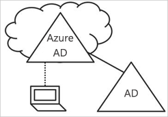
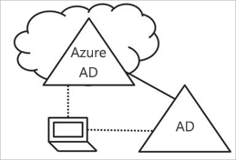

# Inleiding tot Apparaatbeheer in Azure Active Directory

In een wereld mobiliteit, cloud-first kunt Azure Active Directory (Azure AD) single sign-on bij apparaten, apps en services vanaf elke locatie. IT-professionals worden met de komst van apparaten: Bring Your Own Device (BYOD), inclusief momenteel geconfronteerd met twee tegengestelde doelen:

- Zorg ervoor dat de end-gebruikers om productief waar en wanneer
- De zakelijke activa op elk gewenst moment beveiligen

Via apparaten krijgen uw gebruikers toegang tot uw zakelijke activa. Ter bescherming van uw bedrijfsmiddelen, als IT-beheerder, die u wilt hebben controle over deze apparaten. Hiermee kunt u om ervoor te zorgen dat uw gebruikers toegang hebben tot de bronnen van apparaten die voldoen aan uw normen voor beveiliging en naleving. 

Apparaatbeheer is ook de basis vormt voor [apparaat gebaseerde voorwaardelijke toegang](../conditional-access/require-managed-devices.md). Met voorwaardelijke toegang op basis van apparaat, kunt u ervoor zorgen dat toegang tot bronnen in uw omgeving is alleen mogelijk met beheerde apparaten.   

In dit artikel wordt uitgelegd hoe Apparaatbeheer in Azure Active Directory werkt.

## Apparaten onder het beheer van Azure AD

Als u een apparaat onder het beheer van Azure AD, hebt u twee opties:

- Registreren 
- Lid worden

**Registreren van** een apparaat met Azure AD kunt u voor het beheren van een apparaat-id. Wanneer een apparaat is geregistreerd, biedt Azure AD-apparaatregistratie het apparaat met een identiteit die wordt gebruikt voor verificatie van het apparaat wanneer een gebruiker zich aanmeldt bij Azure AD. U kunt de identiteit gebruiken of een apparaat uit te schakelen.

In combinatie met een MDM-oplossing voor mobiele apparaten, zoals Microsoft Intune, worden de apparaatkenmerken in Azure AD bijgewerkt met extra informatie over het apparaat. Hiermee kunt u extra regels voor voorwaardelijke toegang maken die toegang afdwingen van apparaten, zodat ze voldoen aan uw standaarden voor beveiliging en compliance Zie voor meer informatie over inschrijving van apparaten in Microsoft Intune-apparaten inschrijven voor beheer in Intune.

**Lid worden van** een apparaat is een uitbreiding van een apparaat wordt geregistreerd. Dit houdt in dat het vindt u alle voordelen van het registreren van een apparaat en daarnaast ook verandert de status van de lokale van een apparaat. Wijzigen van de lokale status kan uw gebruikers om aan te melden met een apparaat met behulp van een organisatie-werk- of schoolaccount in plaats van een persoonlijk account.

## Azure AD ingeschreven apparaten   

Het doel van geregistreerd bij Azure AD-apparaten is om u te bieden ondersteuning voor de **Bring Your Own Device (BYOD)** scenario. In dit scenario kan een gebruiker toegang tot bronnen van van uw organisatie Azure Active Directory die worden beheerd met behulp van een persoonlijk apparaat.  

De toegang is gebaseerd op een account voor werk of school die is opgegeven op het apparaat.  
Windows 10 kunnen bijvoorbeeld gebruikers een account voor werk of school toevoegen aan een pc, tablet of telefoon.  
Wanneer een gebruiker een werk- of school-account, het apparaat is toegevoegd, is geregistreerd bij Azure AD en (optioneel) die zijn geregistreerd in het mobile device management (MDM)-systeem die uw organisatie heeft geconfigureerd. Gebruikers van uw organisatie kunnen toevoegen een werk- of schoolaccount naar een persoonlijk apparaat eenvoudig:

- Bij het openen van een work-toepassing voor de eerste keer
- Handmatig via de **instellingen** menu in het geval van Windows 10 

U kunt apparaten geregistreerd bij Azure AD configureren voor Windows 10, iOS, Android en macOS.

## Azure AD gekoppelde apparaten

Het doel van Azure AD gekoppelde apparaten is voor het vereenvoudigen van:

- Windows-implementaties van work-apparaten 
- Toegang tot organisatie-apps en bronnen van een Windows-apparaat
- Cloud-gebaseerde beheer van apparaten in eigendom van het werk

Azure AD Join kan worden geïmplementeerd met behulp van de volgende methoden: 
 - [Windows Autopilot](https://docs.microsoft.com/windows/deployment/windows-autopilot/windows-10-autopilot)
 - [Bulk-implementatie](https://docs.microsoft.com/intune/windows-bulk-enroll)
 - [Selfservice-ervaring](azuread-joined-devices-frx.md) 

**Azure AD Join** is bedoeld voor organisaties die willen worden cloud-first (dat wil zeggen, voornamelijk gebruik van cloudservices, met als doel om te beperken van gebruik van een on-premises infrastructuur) of alleen in de cloud (Er zijn geen on-premises infrastructuur). Er zijn geen beperkingen voor de grootte of het type van organisaties die Azure AD Join kunt implementeren. Azure AD Join werkt ook goed in een hybride omgeving, toegang tot zowel cloud en on-premises apps en resources.

Implementatie van Azure AD gekoppelde apparaten biedt de volgende voordelen:

- **Eenmalige aanmelding (SSO)** beheerd naar uw Azure SaaS-apps en services. Uw gebruikers geen aanvullende verificatie wordt gevraagd te zien bij het openen van bronnen op het werk. De SSO-functionaliteit is, zelfs wanneer ze niet zijn verbonden met het domeinnetwerk beschikbaar.

- **Enterprise compatibel roaming** van gebruikersinstellingen op gekoppelde apparaten. Gebruikers moeten geen verbinding maken met een Microsoft-account (bijvoorbeeld Hotmail) om te zien van instellingen op apparaten.

- **Toegang tot Windows Store voor bedrijven** met behulp van een Azure AD-account. Uw gebruikers kunnen kiezen uit een inventaris van toepassingen die vooraf zijn geselecteerd door de organisatie.

- **Windows Hello** ondersteuning voor veilige en gemakkelijke manier toegang tot bronnen op het werk.

- **Beperking van toegang** om te alleen apparaten die voldoen aan het nalevingsbeleid voor apps.

- **Naadloze toegang tot on-premises bronnen** wanneer het apparaat verbinding met de on-premises domeincontroller heeft. 

Terwijl Azure AD join is hoofdzakelijk bedoeld voor organisaties die nog geen een on-premises Windows Server Active Directory-infrastructuur, u kan waarschijnlijk worden gebruikt in scenario's waarbij:

- U wilt overstappen op cloud gebaseerde infrastructuur in met behulp van Azure AD en MDM, zoals Intune.

- U kunt een lid van de on-premises domein, bijvoorbeeld niet gebruiken als u nodig hebt om op te halen van mobiele apparaten zoals tablets en telefoons onder beheer.

- Uw gebruikers voornamelijk toegang nodig voor toegang tot Office 365 of andere SaaS-apps die is geïntegreerd met Azure AD.

- Wilt u een groep gebruikers beheren in Azure AD in plaats van in Active Directory. Dit kunt toepassen, bijvoorbeeld op seizoenswerkers, aannemers of studenten.

- Wilt u lid te worden mogelijkheden bieden aan werknemers in externe filialen met beperkte on-premises infrastructuur.

U kunt Azure AD gekoppelde apparaten voor Windows 10-apparaten kunt configureren.

## Hybride Azure AD gekoppelde apparaten

Voor meer dan tien jaar sterk vebeterd, hebben veel organisaties een lid van het domein met hun on-premises Active Directory gebruikt om in te schakelen:

- IT-afdelingen werken eigendom om apparaten te beheren vanaf een centrale locatie.

- Gebruikers zich aanmelden op hun apparaten bij hun Active Directory werk- of schoolaccount. 

Normaal gesproken organisaties met een on-premises-footprint afhankelijk zijn van imaging methoden voor het inrichten van apparaten en kunnen ze vaak gebruiken **System Center Configuration Manager (SCCM)** of **Groepsbeleid (GP)** beheren ze.

Als uw omgeving een on-premises heeft AD-footprint en u ook voordeel van de mogelijkheden van Azure Active Directory, kunt u hybride Azure AD gekoppelde apparaten implementeren. Dit zijn apparaten die beide zijn gekoppeld aan uw on-premises Active Directory en uw Azure Active Directory.

U moet de apparaten toegevoegd aan hybrid Azure AD gebruiken als:

- Hebt u Win32-apps die zijn geïmplementeerd op deze apparaten die afhankelijk van verificatie van Active Directory-machine zijn.

- Gewenste GP om apparaten te beheren.

- Wilt u doorgaan met installatiekopieën om oplossingen te gebruiken om apparaten te configureren voor uw werknemers.

U kunt configureren dat Hybrid Azure AD gekoppelde apparaten voor Windows 10 en downlevel-apparaten, zoals Windows 8 en Windows 7.

## Samenvatting

Met Apparaatbeheer in Azure AD, kunt u het volgende doen: 

- Het vereenvoudigen van apparaten meebrengen onder het beheer van Azure AD

- Uw gebruikers voorzien van een eenvoudig te gebruiken toegang tot cloud-gebaseerde bronnen van uw organisatie

Als een regel van een miniatuur, moet u het volgende gebruiken:

- Azure AD ingeschreven apparaten:

    - Voor persoonlijke apparaten 

    - Apparaten handmatig te registreren bij Azure AD

- Azure AD gekoppelde apparaten: 

    - Voor apparaten die eigendom zijn van uw organisatie

    - Voor apparaten die zijn **niet** lid is van een on-premises AD

    - Apparaten handmatig te registreren bij Azure AD

    - De status van de lokale van een apparaat wijzigen

- Hybride Azure AD gekoppelde apparaten voor apparaten die zijn gekoppeld aan een on-premises AD     

    - Voor apparaten die eigendom zijn van uw organisatie

    - Voor apparaten die zijn gekoppeld aan een on-premises AD

    - Apparaten automatisch registreren bij Azure AD

    - De status van de lokale van een apparaat wijzigen

## Volgende stappen

- Als u een overzicht van het apparaat in Azure portal te beheren, Zie [apparaten beheert met de Azure-portal](device-management-azure-portal.md)

- Zie voor meer informatie over voorwaardelijke toegang op basis van apparaat, [configureren van beleid voor het apparaat gebaseerde voorwaardelijke toegang van Azure Active Directory](../conditional-access/require-managed-devices.md).

- Instellen:
    - Azure Active Directory ingeschreven Windows 10-apparaten, Zie [over het configureren van Azure Active Directory geregistreerde Windows 10-apparaten](../user-help/device-management-azuread-registered-devices-windows10-setup.md)
    - Azure Active Directory gekoppelde apparaten, Zie [over het configureren van Azure Active Directory gekoppelde apparaten](../user-help/device-management-azuread-joined-devices-setup.md)
    - Hybride Azure AD gekoppelde apparaten, Zie [over het plannen van de implementatie van hybride Azure Active Directory join](hybrid-azuread-join-plan.md).

