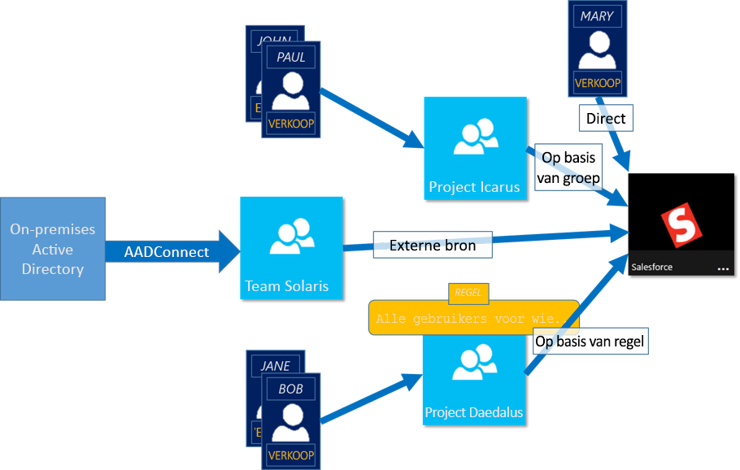
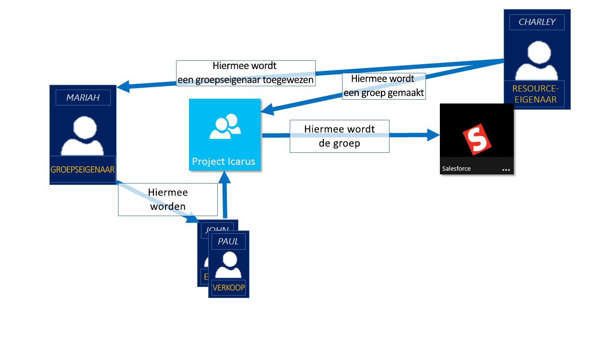

# Toegang tot resources beheren met Azure Active Directory-groepen
Azure Active Directory (AD) is een uitgebreide oplossing voor identiteits- en toegangsbeheer die een robuuste set mogelijkheden biedt voor het beheren van de toegang tot toepassingen en resources die on-premises of in de cloud zijn opgeslagen, waaronder onlineservices van Microsoft zoals Office 365 en een breed scala van SaaS-toepassingen van derden. In dit artikel vindt u algemene informatie, maar als u meteen aan de slag wilt met Azure AD groepen, volgt u de instructies in [Beveiligingsgroepen beheren in Azure AD](active-directory-groups-create-azure-portal.md). Als u zien hoe u PowerShell kunt gebruiken voor het beheren van groepen in Azure Active Directory, leest u [Azure Active Directory-cmdlets voor groepsbeheer](../users-groups-roles/groups-settings-v2-cmdlets.md).

> [!NOTE]
> U hebt een Azure-account nodig voor het gebruik van Azure Active Directory. Als u nog geen account hebt, kunt u [zich registreren voor een gratis Azure-account](https://azure.microsoft.com/pricing/free-trial/).
>
>

Binnen Azure AD is de mogelijkheid om de toegang tot resources te beheren een van de belangrijkste functies. Deze resources kunnen deel uitmaken van de adreslijst, zoals in het geval van machtigingen voor het beheren van objecten door middel van rollen in de adreslijst, of resources die zich buiten de adreslijst bevinden, zoals SaaS-toepassingen, Azure-services, en SharePoint-sites of on-premises resources. Er zijn vier manieren waarop een gebruiker toegangsrechten kan krijgen voor een resource:

1. Directe toewijzing

    Gebruikers kunnen rechtstreeks aan een resource worden toegewezen door de eigenaar van die resource.
2. Groepslidmaatschap

    Een groep kan worden toegewezen aan een resource door de resource-eigenaar. De leden van die groep krijgen dan allemaal toegang tot de resource. Lidmaatschap van de groep kan vervolgens worden beheerd door de eigenaar van de groep. In de praktijk betekent dit dat de eigenaar van de resource de bevoegdheid voor het toewijzen van gebruikers aan de resource delegeert aan de eigenaar van de groep.
3. Op basis van regels

    De resource-eigenaar kan een regel gebruiken om te bepalen welke gebruikers toegang mogen hebben tot een resource. Het resultaat van de regel is afhankelijk van de kenmerken die in de regel worden gebruikt en de waarden van die kenmerken voor specifieke gebruikers. In de praktijk betekent dit dat de resource-eigenaar het recht voor het beheren van toegang tot de resource delegeert aan de gezaghebbende bron voor de kenmerken die worden gebruikt in de regel. De resource-eigenaar beheert de regel nog steeds zelf en bepaalt welke kenmerken en waarden toegang bieden tot de resource.
4. Externe instantie

    De toegang tot een resource wordt afgeleid van een externe bron; bijvoorbeeld een groep die wordt gesynchroniseerd met een gezaghebbende bron, zoals een on-premises adreslijst of een SaaS-app, zoals WorkDay. De resource-eigenaar wijst de groep toe voor toegang tot de resource en de externe bron beheert de leden van de groep.

   

## Video bekijken over toegangsbeheer
U kunt een korte video bekijken waarin dit onderwerp wordt behandeld:

**Azure AD: Inleiding tot dynamisch lidmaatschap voor groepen**

> [!VIDEO https://channel9.msdn.com/Series/Azure-Active-Directory-Videos-Demos/Azure-AD--Introduction-to-Dynamic-Memberships-for-Groups/player]
>
>

## Hoe werkt toegangsbeheer in Azure Active Directory?
Het centrale aspect van het toegangsbeheer van Azure AD is de beveiligingsgroep. Het beheren van de toegang tot resources behulp van een beveiligingsgroep is een bekende aanpak, die wordt gekenmerkt door een flexibele en gemakkelijk te begrijpen manier om de gewenste groep gebruikers toegang te geven tot een resource. De resource-eigenaar (of de beheerder van de adreslijst of directory) kan een groep toewijzen om een bepaald toegangsrecht in te stellen voor de resources waarvan ze eigenaar zijn. De leden van de groep krijgen de toegang en de resource-eigenaar kan het recht voor het beheren van de ledenlijst van een groep aan iemand anders delegeren, zoals een afdelingsmanager of de beheerder van een of helpdesk.

De eigenaar van een groep kan die groep ook beschikbaar maken voor selfservice-aanvragen. Dit houdt in dat een eindgebruiker kan zoeken naar de groep en een verzoek kan indien voor lidmaatschap van de groep, om zo toegang te krijgen tot de resources die worden beheerd via de groep. De eigenaar van de groep kan instellen dat dergelijke verzoeken automatisch worden goedgekeurd of dat ze moeten worden goedgekeurd door de eigenaar van de groep. Wanneer een gebruiker een verzoek indient voor lidmaatschap van een groep, wordt het verzoek doorgestuurd naar de eigenaars van de groep. Als een van de eigenaars het verzoek goedkeurt, krijgt de gebruiker hiervan bericht en wordt de gebruiker opgenomen in de groep. Als het verzoek wordt geweigerd door een van de eigenaars, krijgt de gebruiker hiervan bericht en wordt de gebruiker niet toegevoegd aan de groep.

## Aan de slag met toegangsbeheer
Klaar om te beginnen? Het is verstandig om eerst een paar van de basistaken te proberen die u met Azure AD-groepen kunt doen. Gebruik deze mogelijkheden om aan verschillende groepen personen speciale toegang te bieden tot verschillende resources in uw organisatie. Dit zijn de belangrijkste basisstappen:

* [Een eenvoudige regel maken voor het configureren van dynamisch lidmaatschap voor een groep](active-directory-groups-create-azure-portal.md)
* [Toegang tot SaaS-toepassingen beheren met behulp van een groep](../users-groups-roles/groups-saasapps.md)
* [Een groep beschikbaar maken voor selfservice door eindgebruikers](../users-groups-roles/groups-self-service-management.md)
* [Een on-premises groep synchroniseren met Azure met behulp van Azure AD Connect](../connect/active-directory-aadconnect.md)
* [Eigenaars voor een groep beheren](active-directory-accessmanagement-managing-group-owners.md)

## Volgende stappen
U bent nu bekend met de basisprincipes van toegangsbeheer en dus is het tijd voor enkele meer geavanceerde mogelijkheden die in Azure Active Directory beschikbaar zijn voor het beheren van toegang tot uw toepassingen en resources.

* [Kenmerken gebruiken om geavanceerde regels te maken](../users-groups-roles/groups-dynamic-membership.md)
* [Beveiligingsgroepen beheren in Azure AD](active-directory-groups-create-azure-portal.md)
* [Graph API-naslag voor groepen](https://msdn.microsoft.com/Library/Azure/Ad/Graph/api/groups-operations#GroupFunctions)
* [Azure Active Directory cmdlets for configuring group settings](../users-groups-roles/groups-settings-cmdlets.md) (Azure Active Directory-cmdlets voor het configureren van groepsinstellingen)
