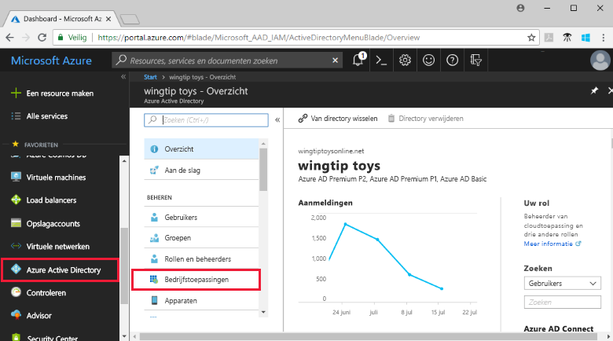
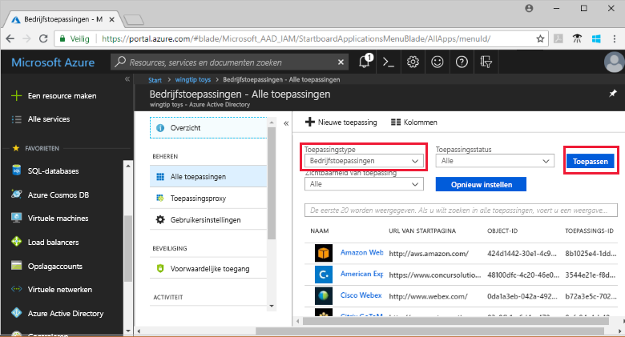
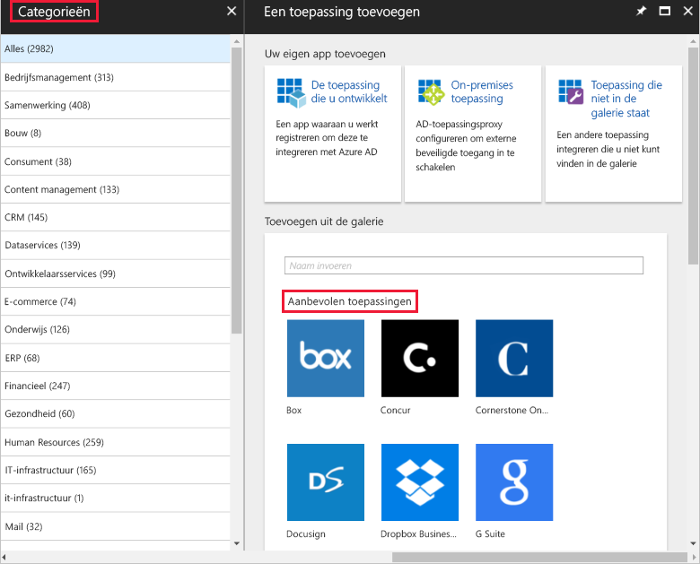
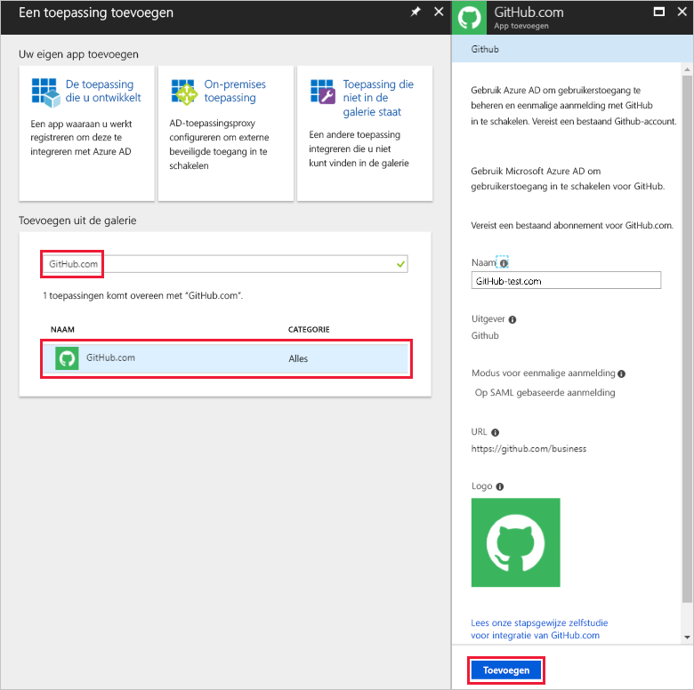
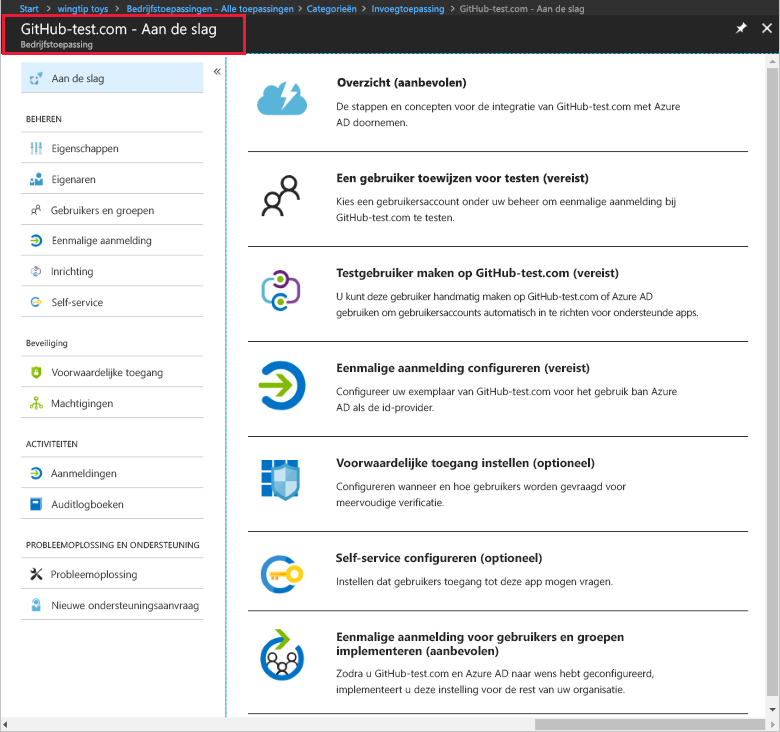
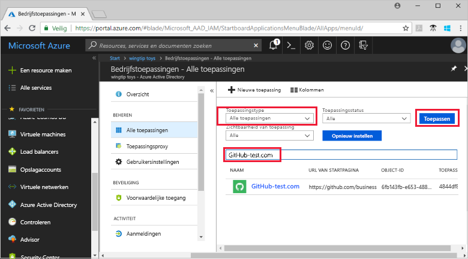
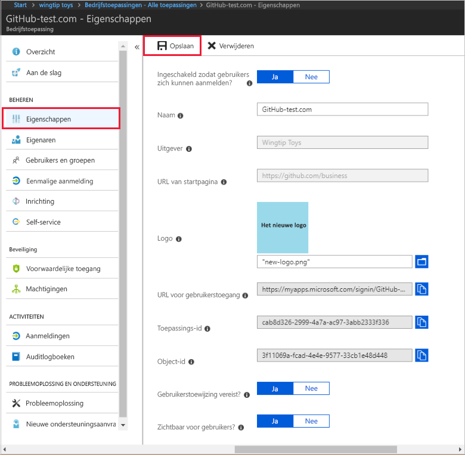

# Quickstart: Een toepassing toevoegen aan uw Azure Active Directory-tenant

Azure AD (Azure Active Directory) heeft een galerie met duizenden vooraf geïntegreerde toepassingen. Sommige toepassingen die worden gebruikt in uw organisatie, bevinden zich waarschijnlijk in de galerie. In deze quickstart wordt de Azure-portal gebruikt om een galerietoepassing toe te voegen aan uw Azure AD-tenant (Azure Active Directory). 
 
Nadat een toepassing is toegevoegd aan de Azure AD-tenant, kunt u:

- Gebruikerstoegang tot de toepassing beheren met een voorwaardelijk toepassingsbeleid.
- Gebruikers configureren voor eenmalige aanmelding bij de toepassing via hun Azure AD-accounts.

## Voordat u begint

Als u een toepassing wilt toevoegen aan uw tenant, hebt u het volgende nodig:

- Een Azure AD-abonnement
- Een abonnement met eenmalige aanmelding voor de toepassing

Meld u bij de [Azure-portal](https://portal.azure.com) aan als globale beheerder van uw Azure AD-tenant, als beheerder van cloudtoepassingen of als toepassingsbeheerder.

Als u de stappen in deze zelfstudie wilt testen, raden we u aan om een niet-productieomgeving te gebruiken. Als u niet beschikt over een niet-productieomgeving in Azure AD, kunt u [een gratis proefversie van één maand krijgen](https://azure.microsoft.com/pricing/free-trial/).

## Een toepassing toevoegen aan uw Azure AD-tenant

Ga als volgt te werk om een galerietoepassing toe te voegen aan de Azure AD-tenant:

1. Klik in de [Azure-portal](https://portal.azure.com) in het navigatiepaneel aan de linkerkant op **Azure Active Directory**. 

2. Klik op de blade **Azure Active Directory** op **Bedrijfstoepassingen**. 

    

3. De blade **Alle toepassingen** wordt geopend met een willekeurige selectie uit de toepassingen in de Azure AD-tenant. 

    

4. Klik boven aan de blade **Alle toepassingen** op **Nieuwe toepassing**.

    

5. Als u een lijst met toepassingen wilt zien in de galerie, kunt u het beste **Categorieën** gebruiken, omdat de pictogrammen onder **Aanbevolen toepassingen** een willekeurige selectie vormen uit de toepassingen in de galerie. 

    

    U kunt op **Meer weergeven** klikken om meer toepassingen te zien. We raden deze manier van zoeken echter niet aan, omdat de galerie duizenden toepassingen bevat.

6. Als u een bepaalde toepassing zoekt, voert u bij **Toevoegen uit de galerie** de naam in van de toepassing die u wilt toevoegen. Selecteer de toepassing in de resultaten en klik op **Toevoegen**. In het volgende voorbeeld ziet u het formulier **App toevoegen** dat wordt weergegeven nadat u hebt gezocht naar GitHub.com.

    

6. In het toepassingsformulier kunt u de eigenschapsinformatie wijzigen. U kunt bijvoorbeeld de naam van de toepassing bewerken zodat deze past bij de behoeften in uw organisatie. In dit voorbeeld wordt de naam **GitHub-test** gebruikt.

8. Als u klaar bent met het wijzigen van de eigenschappen, klikt u op **Toevoegen**.

9. Er wordt nu een pagina Aan de slag weergegeven met de opties voor het configureren van de toepassing voor uw organisatie. 

    

U bent klaar met het toevoegen van de toepassing. Neem gerust even pauze.  In de volgende secties ziet u hoe u het logo kunt wijzigen en andere eigenschappen voor de toepassing kunt bewerken.

## Uw Azure AD-tenanttoepassing zoeken

Laten we aannemen dat u even weg bent gegaan en dat u nu verdergaat met het configureren van de toepassing. Het eerste wat u moet doen, is de toepassing zoeken.

1. Klik in de **[Azure-portal](https://portal.azure.com)** in het navigatiepaneel aan de linkerkant op **Azure Active Directory**. 

2. Klik op de blade Azure Active Directory op **Bedrijfstoepassingen**. 

3. Selecteer in de vervolgkeuzelijst **Toepassingstype** de optie **Alle toepassingen** en klik op **Toepassen**. Zie [Tenanttoepassingen weergeven](view-applications-portal.md) voor meer informatie over de weergaveopties.

4. U ziet nu een lijst met alle toepassingen in de Azure AD-tenant.  De lijst is een willekeurig voorbeeld. Klik een of meer keren op **Meer weergeven** om meer toepassingen te zien. 

5. Als u snel een toepassing wilt vinden in uw tenant, voert u de naam van de toepassing in het zoekvak in en klikt u op **Toepassen**. In dit voorbeeld vinden we de toepassing GitHub-test die we eerder hebben toegevoegd.

    

## Eigenschappen voor gebruikersaanmelding configureren

Nu u de toepassing hebt gevonden, kunt u deze openen en de eigenschappen van de toepassing configureren.

De eigenschappen van de toepassing bewerken

1. Klik op de toepassing om deze te openen.
2. Klik op **Eigenschappen** om de blade Eigenschappen te openen voor bewerken.

    

3. Neem even de tijd om de opties voor aanmelden goed te bestuderen. Met de combinatie van **Ingeschakeld voor gebruikers voor aanmelden**, **Gebruikerstoewijzing vereist** en **Zichtbaar voor gebruiker** wordt bepaald of gebruikers die zijn toegewezen of niet toegewezen aan de toepassing, zich kunnen aanmelden.  Er wordt ook bepaald of een gebruiker de toepassing kan zien in het toegangsvenster. 

    - Met **Ingeschakeld voor gebruikers voor aanmelden** wordt bepaald of gebruikers die zijn toegewezen aan de toepassing, zich kunnen aanmelden.
    - Met **Gebruikerstoewijzing vereist** wordt bepaald of gebruikers die niet zijn toegewezen aan de toepassing, zich kunnen aanmelden.
    - Met **Zichtbaar voor gebruiker** wordt bepaald of gebruikers die zijn toegewezen aan een app, deze kunnen zien in het toegangsvenster en het startprogramma voor O365. 

4. Gebruik de volgende tabellen als hulp bij het kiezen van de opties die het beste passen bij uw behoeften. 

     - Gedrag voor **toegewezen** gebruikers:

       | Instellingen voor toepassingseigenschappen | | | Toegewezen gebruikerservaring | |
       |---|---|---|---|---|
       | Ingeschakeld voor gebruikers voor aanmelden? | Gebruikerstoewijzing vereist? | Zichtbaar voor gebruiker? | Kunnen toegewezen gebruikers zich aanmelden? | Kunnen toegewezen gebruikers de toepassing zien?* |
       | ja | ja | ja | ja | ja  |
       | ja | ja | nee  | ja | nee   |
       | ja | nee  | ja | ja | ja  |
       | ja | nee  | nee  | ja | nee   |
       | nee  | ja | ja | nee  | nee   |
       | nee  | ja | nee  | nee  | nee   |
       | nee  | nee  | ja | nee  | nee   |
       | nee  | nee  | nee  | nee  | nee   |

     - Gedrag voor **niet-toegewezen** gebruikers:
  
       | Instellingen voor toepassingseigenschappen | | | Niet-toegewezen gebruikerservaring | |
       |---|---|---|---|---|
       | Ingeschakeld voor gebruikers voor aanmelden? | Gebruikerstoewijzing vereist? | Zichtbaar voor gebruiker? | Kunnen niet-toegewezen gebruikers zich aanmelden? | Kunnen niet-toegewezen gebruikers de toepassing zien?* |
       | ja | ja | ja | nee  | nee   |
       | ja | ja | nee  | nee  | nee   |
       | ja | nee  | ja | ja | nee   |
       | ja | nee  | nee  | ja | nee   |
       | nee  | ja | ja | nee  | nee   |
       | nee  | ja | nee  | nee  | nee   |
       | nee  | nee  | ja | nee  | nee   |
       | nee  | nee  | nee  | nee  | nee   |

    *Kan de gebruiker de toepassing zien in het toegangsvenster en het startprogramma voor Office 365-apps?

## Een aangepast logo gebruiken

Ga als volgt te werk om een aangepast logo te gebruiken:

1. Maak een logo van 215 x 215 pixels en sla dit op in de PNG-indeling.
2. Aangezien u de toepassing al hebt gevonden, klikt u op de toepassing.
2. Klik op de linkerblade op **Eigenschappen**.
4. Upload het logo.
5. Als u klaar bent, klikt u op **Opslaan**.

    

## Volgende stappen

In deze quickstart hebt u geleerd hoe u een galerietoepassing kunt toevoegen aan uw Azure AD-tenant. U hebt ook geleerd hoe u de eigenschappen van een toepassing kunt bewerken. 

Nu bent u klaar om de toepassing te configureren voor eenmalige aanmelding. 

> [!div class="nextstepaction"]
> [Eenmalige aanmelding configureren](configure-single-sign-on-portal.md)

