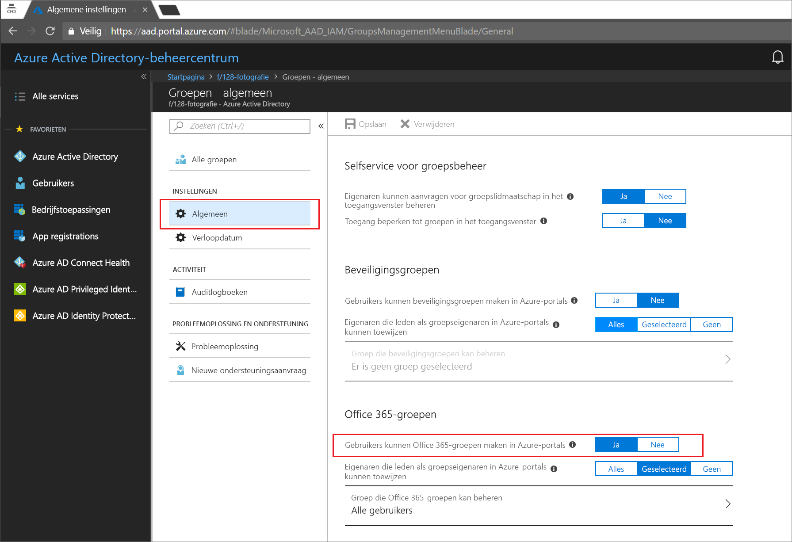

# Snelstart: Office 365-groepen voor verloop instellen in Azure Active Directory

In deze snelstart stelt u het verloopbeleid in voor uw Office 365-groepen. Wanneer gebruikers hun eigen groepen kunnen instellen, kunnen niet-gebruikte groepen zich vermenigvuldigen. Eén manier om niet-gebruikte groepen te beheren, is door verloopbeleid voor deze groepen in te stellen om het handmatig verwijderen van groepen te verminderen.

Verloopbeleid maken is eenvoudig:

* Groepseigenaren worden op de hoogte gesteld als een groep moet worden vernieuwd die op het punt staat te verlopen
* Een groep die niet wordt vernieuwd, wordt verwijderd
* Een verwijderde Office 365-groep kan binnen dertig dagen door een groepseigenaar of een Azure AD-beheerder worden hersteld

Als u geen abonnement op Azure hebt, maakt u een [gratis account](https://azure.microsoft.com/free/) voordat u begint.

## Vereiste

U moet een globale beheerder of beheerder van gebruikersaccounts in de tenant zijn om verloop van groepen in te stellen.

## Maken van gebruikers voor groepen inschakelen

1. Meld u bij de [Azure-portal](https://portal.azure.com) aan met een account van een globale beheerder of beheerder van gebruikersaccounts voor de map.

2. Selecteer **Groepen** en vervolgens **Algemeen**.
  
  

3. Stel **Users can create Office 365 groups** in op **Ja**.

4. Selecteer **Opslaan** om de groepsinstellingen op te slaan als u klaar bent.

## Verloopdatum van de groep instellen

1. Selecteer in de [Azure-portal](https://portal.azure.com) de opties **Azure Active Directory** > **Groepen** > **Verlooptijd** om de instellingen voor het verloop te openen.
  
  

2. Stel het verloopinterval in. Selecteer een vooraf ingestelde waarde of voer een aangepaste waarde van meer dan 31 dagen in. 

3. Geef een e-mailadres op waar meldingen over verlooptijden naartoe moeten worden gestuurd als een groep geen eigenaar heeft.

4. Stel voor deze snelstart **Enable expiration for these Office 365 groups** in op **Alle**.

5. Selecteer **Opslaan** om de instellingen voor het verloop op te slaan als u klaar bent.

Dat is alles. In deze snelstart hebt u het verloopbeleid ingesteld voor de geselecteerde Office 365-groepen.

## Resources opschonen

**Verloopbeleid verwijderen**

1. Zorg dat u bent aangemeld bij de [Azure-portal](https://portal.azure.com) met een account van een globale beheerder voor de tenant.
2. Selecteer **Azure Active Directory** > **Groepen** > **Verlooptijd**.
3. Stel **Enable expiration for these Office 365 groups** in op **Geen**.

**Maken van gebruikers voor groepen uitschakelen**

1. Selecteer **Azure Active Directory** > **Groepen** > **Algemeen**. 
2. Stel **Users can create Office 365 groups in Azure portals** in op **Nee**.

## Volgende stappen

Als u meer informatie wilt over verlooptijden, waaronder technische beperkingen, het toevoegen van een lijst met aangepaste, geblokkeerde woorden, en ervaringen van eindgebruikers voor Office 365-apps, raadpleegt u het volgende artikel met details over verloopbeleid:

> [!div class="nextstepaction"]
> [Verloopbeleid: alle details](groups-lifecycle.md)