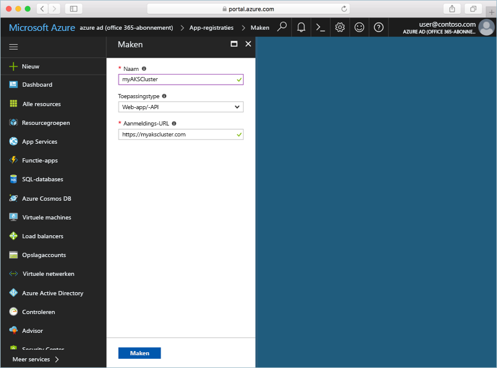
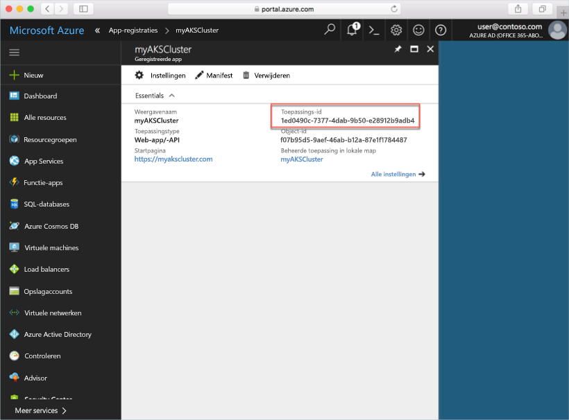
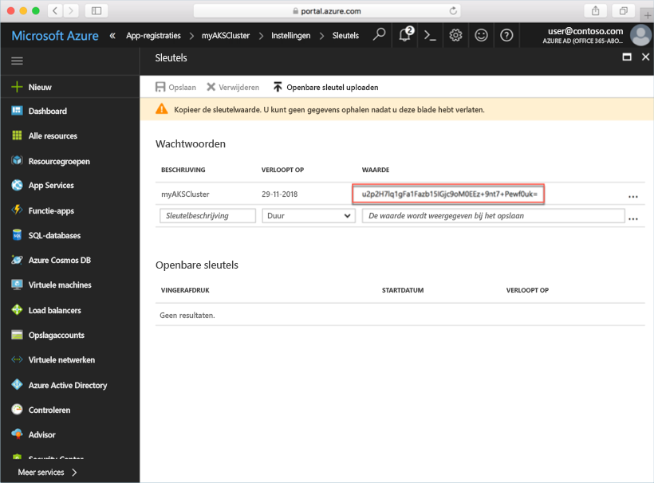
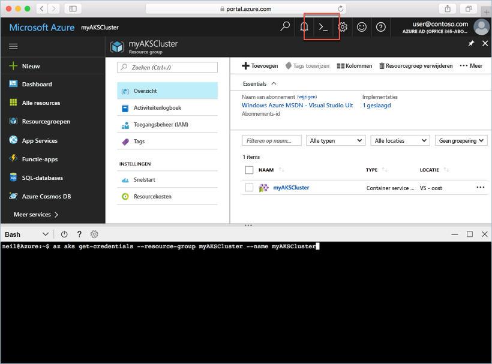

# <a name="quickstart-deploy-an-azure-container-service-aks-cluster"></a>Snelstart: een AKS-cluster (Azure Container Service) implementeren

In deze quickstart implementeert u een AKS-cluster met behulp van Azure Portal. Vervolgens wordt een toepassing met meerdere containers op het cluster uitgevoerd die bestaat uit een web-front-end en een Redis-exemplaar. Zodra de toepassing is voltooid, is deze toegankelijk via internet.


In deze quickstart wordt ervan uitgegaan dat u een basisbegrip hebt van Kubernetes-concepten. Raadpleeg de [Kubernetes-documentatie][kubernetes-documentation] voor gedetailleerde informatie over Kubernetes.

## <a name="sign-in-to-azure"></a>Aanmelden bij Azure

Meld u aan bij Azure Portal op http://portal.azure.com.

## <a name="create-service-principal"></a>Een service-principal maken

Voordat u het AKS-cluster maakt in Azure Portal, moet u een service-principal maken. Deze service-principal wordt gebruikt in Azure om de infrastructuur te beheren die is gekoppeld aan het AKS-cluster.

Selecteer achtereenvolgens **Azure Active Directory** > **App-registraties** > **Registratie van nieuwe toepassing**.

Voer een naam in voor de toepassing. Dit kan elke gewenste waarde zijn. Selecteer **Web-app / API** als toepassingstype. Voer een waarde in bij **Aanmeldings-URL**. Dit kan elke willekeurige waarde in een geldige URL-indeling zijn, maar hoeft geen echt eindpunt te zijn.

Selecteer **Maken** nadat dit is voltooid.



Selecteer de nieuwe toepassingsregistratie en noteer de toepassings-id. Deze waarde is nodig bij het maken van het AKS-cluster.



Vervolgens moet u een wachtwoord voor de service-principal maken. Selecteer **Alle instellingen** > **Sleutels** en voer een waarde in bij de sleutelbeschrijving. Selecteer een tijdsduur. Dit is de periode gedurende welke de service-principal geldig is.

Klik op **Opslaan** en noteer het wachtwoord. Dit wachtwoord is nodig bij het maken van het AKS-cluster.



## <a name="create-aks-cluster"></a>AKS-cluster maken

Selecteer **Een resource maken** > **Containers** > **Azure Container Service - AKS (preview)**.

Geef de volgende informatie op voor het cluster: naam, DNS-voorvoegsel, naam van resourcegroep, locatie en Kubernetes-versie. Noteer de namen van het cluster en de resourcegroep. Deze zijn nodig wanneer er verbinding wordt gemaakt met het cluster.

Selecteer **OK** wanneer dit is voltooid.


Voer in het configuratieformulier de volgende informatie in:

- Gebruikersnaam: de naam voor de beheeraccounts op de clusterknooppunten.
- Openbare SSH-sleutel: gekoppeld aan de sleutel die wordt gebruikt voor toegang tot de clusterknooppunten.
- Client-id voor de service-principal: de toepassings-id van de service-principal die u eerder in dit document hebt gemaakt.
- Clientgeheim voor de service-principal: het wachtwoord voor de service-principal die u eerder in dit document hebt gemaakt.
- Aantal knooppunten: aantal AKS-knooppunten dat moet worden gemaakt.
- VM-grootte van knooppunt: de grootte van de virtuele machine voor de AKS-knooppunten.
- Grootte van de OS-schijf: grootte van de besturingssysteemschijf voor de AKS-knooppunten.

Selecteer **OK** wanneer dit is voltooid. Selecteer vervolgens opnieuw **OK** nadat de validatie is voltooid.


Na enkele ogenblikken is het AKS-cluster geïmplementeerd en klaar voor gebruik.

## <a name="connect-to-the-cluster"></a>Verbinding maken met het cluster

Als u een Kubernetes-cluster wilt beheren, gebruikt u [kubectl][kubectl], de Kubernetes-opdrachtregelclient. De kubectl-client is vooraf geïnstalleerd in Azure Cloud Shell.

Open Cloud Shell met behulp van de knop in de rechterbovenhoek van Azure Portal.



Abonnement opgeven (indien u dat nog niet hebt gedaan)
```azurecli-interactive
az account set -s SUBSCRIPTION_NAME
```

Gebruik de opdracht [az aks get-credentials][az-aks-get-credentials] om kubectl zo te configureren dat deze verbinding maakt met het Kubernetes-cluster.

Kopieer en plak de volgende opdracht in Cloud Shell. Wijzig de naam van de resourcegroep en van het cluster, indien nodig.

```azurecli-interactive
az aks get-credentials --resource-group myAKSCluster --name myAKSCluster
```

Als u de verbinding met uw cluster wilt controleren, gebruikt u de opdracht [kubectl get][kubectl-get] om een lijst met clusterknooppunten te retourneren.

```azurecli-interactive
kubectl get nodes
```

Uitvoer:

```
NAME                       STATUS    ROLES     AGE       VERSION
aks-agentpool-14693408-0   Ready     agent     6m        v1.8.1
aks-agentpool-14693408-1   Ready     agent     6m        v1.8.1
aks-agentpool-14693408-2   Ready     agent     7m        v1.8.1
```

## <a name="run-the-application"></a>De toepassing uitvoeren

In een Kubernetes-manifestbestand wordt een gewenste status voor het cluster gedefinieerd, inclusief zaken zoals welke containerinstallatiekopieën moeten worden uitgevoerd. In dit voorbeeld wordt een manifest gebruikt om alle objecten te maken die nodig zijn om de Azure Vote-toepassing uit te voeren.

Maak een bestand met de naam `azure-vote.yaml` en kopieer de volgende YAML-code naar het bestand. Als u werkt in Azure Cloud Shell, maakt u het bestand met behulp van vi of Nano, zoals bij een virtueel of fysiek systeem.

```yaml
apiVersion: apps/v1beta1
kind: Deployment
metadata:
  name: azure-vote-back
spec:
  replicas: 1
  template:
    metadata:
      labels:
        app: azure-vote-back
    spec:
      containers:
      - name: azure-vote-back
        image: redis
        ports:
        - containerPort: 6379
          name: redis
---
apiVersion: v1
kind: Service
metadata:
  name: azure-vote-back
spec:
  ports:
  - port: 6379
  selector:
    app: azure-vote-back
---
apiVersion: apps/v1beta1
kind: Deployment
metadata:
  name: azure-vote-front
spec:
  replicas: 1
  template:
    metadata:
      labels:
        app: azure-vote-front
    spec:
      containers:
      - name: azure-vote-front
        image: microsoft/azure-vote-front:v1
        ports:
        - containerPort: 80
        env:
        - name: REDIS
          value: "azure-vote-back"
---
apiVersion: v1
kind: Service
metadata:
  name: azure-vote-front
spec:
  type: LoadBalancer
  ports:
  - port: 80
  selector:
    app: azure-vote-front
```

Gebruik de opdracht [kubectl create][kubectl-create] om de toepassing uit te voeren.

```azurecli-interactive
kubectl create -f azure-vote.yaml
```

Uitvoer:

```
deployment "azure-vote-back" created
service "azure-vote-back" created
deployment "azure-vote-front" created
service "azure-vote-front" created
```

## <a name="test-the-application"></a>De toepassing testen

Terwijl de toepassing wordt uitgevoerd, wordt er een [Kubernetes-service][kubernetes-service] gemaakt die de front-end van de toepassing beschikbaar maakt op internet. Dit proces kan enkele minuten duren.

Gebruik de opdracht [kubectl get service][kubectl-get] met het argument `--watch` om de voortgang te controleren.

```azurecli-interactive
kubectl get service azure-vote-front --watch
```

In eerste instantie wordt het *EXTERNE IP-adres* voor de service *azure-vote-front* weergegeven als *in behandeling*.

```
NAME               TYPE           CLUSTER-IP   EXTERNAL-IP   PORT(S)        AGE
azure-vote-front   LoadBalancer   10.0.37.27   <pending>     80:30572/TCP   6s
```

Zodra het *EXTERNE IP-adres* is gewijzigd van *in behandeling* in een *IP-adres*, gebruikt u `CTRL-C` om het controleproces van kubectl te stoppen.

```
azure-vote-front   LoadBalancer   10.0.37.27   52.179.23.131   80:30572/TCP   2m
```

Blader nu naar het externe IP-adres voor een overzicht van de Azure Vote-app.


## <a name="delete-cluster"></a>Cluster verwijderen

Wanneer het cluster niet meer nodig is, verwijdert u de clusterresourcegroep. Hierdoor worden ook alle bijbehorende resources verwijderd. Dit kan worden voltooid in Azure Portal door de resourcegroep te selecteren en op de knop Verwijderen te klikken. U kunt ook de opdracht [az group delete][az-group-delete] gebruiken in Cloud Shell.

```azurecli-interactive
az group delete --name myAKSCluster --no-wait
```

## <a name="get-the-code"></a>Code ophalen

In deze quickstart zijn vooraf gemaakte containerinstallatiekopieën gebruikt om een Kubernetes-implementatie te maken. De gerelateerde toepassingscode, Dockerfile en het Kubernetes-manifestbestand zijn beschikbaar op GitHub.

[https://github.com/Azure-Samples/azure-voting-app-redis][azure-vote-app]

## <a name="next-steps"></a>Volgende stappen

In deze snelstartgids hebt u een Kubernetes-cluster geïmplementeerd en vervolgens een toepassing met meerdere containers naar het cluster geïmplementeerd.

Voor meer informatie over AKS en een volledig stapsgewijs voorbeeld van code tot implementatie gaat u naar de zelfstudie over Kubernetes-clusters.

> [!div class="nextstepaction"]
> [AKS-zelfstudie][aks-tutorial]

<!-- LINKS - external -->
[azure-vote-app]: https://github.com/Azure-Samples/azure-voting-app-redis.git
[kubectl]: https://kubernetes.io/docs/user-guide/kubectl/
[kubectl-create]: https://kubernetes.io/docs/reference/generated/kubectl/kubectl-commands#create
[kubectl-get]: https://kubernetes.io/docs/reference/generated/kubectl/kubectl-commands#get
[kubernetes-documentation]: https://kubernetes.io/docs/home/
[kubernetes-service]: https://kubernetes.io/docs/concepts/services-networking/service/

<!-- LINKS - internal -->
[az-aks-get-credentials]: /cli/azure/aks?view=azure-cli-latest#az_aks_get_credentials
[az-group-delete]: /cli/azure/group#delete
[aks-tutorial]: ./tutorial-kubernetes-prepare-app.md


