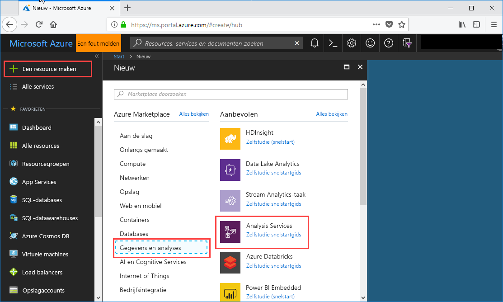
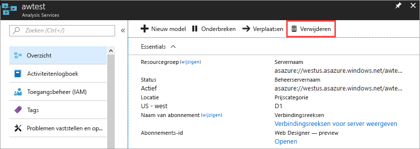

# Een Analysis Services-server maken in Azure portal
Dit artikel begeleidt u bij het maken van een resource van Analysis Services-server in uw Azure-abonnement.

Voordat u begint, moet u het volgende nodig: 

* **Azure-abonnement**: ga naar [gratis proefversie van Azure](https://azure.microsoft.com/offers/ms-azr-0044p/) om een account te maken.
* **Azure Active Directory**: uw abonnement moet worden gekoppeld aan een Azure Active Directory-tenant. En u moet zijn aangemeld bij Azure met een account in dat Azure Active Directory. Raadpleeg voor meer informatie [Verificatie en gebruikersmachtigingen](analysis-services-manage-users.md).

## Aanmelden bij Azure Portal 

Meld u aan bij [Azure Portal](https://portal.azure.com).

## Een server maken

1. Klik op **+ maken van een resource** > **gegevens en analyse** > **Analysis Services**.

    

2. In **Analysis Services**, vul de vereiste velden in en druk vervolgens op **maken**.
   
    
   
   * **Servernaam**: Typ een unieke naam die wordt gebruikt om te verwijzen naar de server.
   * **Abonnement**: Selecteer het abonnement dat deze server zal worden gekoppeld.
   * **Resourcegroep**: Maak een nieuwe resourcegroep of Selecteer een u al hebt. Resourcegroepen zijn ontworpen om u te helpen bij het beheren van een verzameling Azure-resources. Zie voor meer informatie, [resourcegroepen](../azure-resource-manager/resource-group-overview.md).
   * **Locatie**: locatie van deze Azure-datacenter als host fungeert voor de server. Kies een locatie dichtstbijzijnde uw grootste gebruikersgroep.
   * **Prijscategorie**: een prijscategorie selecteren. Als u bezig met testen bent en wilt installeren van de voorbeelddatabase van het model, selecteert u het gratis **D1** laag. Zie voor meer informatie, [Azure Analysis Services-prijzen](https://azure.microsoft.com/pricing/details/analysis-services/). 
    * **Beheerder**: standaard is dit het account dat u bent aangemeld. U kunt een ander account van uw Azure Active Directory.
    * **Back-up van de instelling opslag**: optioneel. Als u al een [opslagaccount](../storage/common/storage-introduction.md), u kunt dit opgeven als de standaardwaarde voor model databaseback-up. U kunt ook opgeven [back-up en herstel](analysis-services-backup.md) instellingen later.
    * **Opslag sleutelverloop**: optioneel. Geef een opslagperiode sleutelverloop.
3. Klik op **Create**.

Maak gewoonlijk duurt minder dan een minuut. Als u hebt geselecteerd **toevoegen aan de Portal**, navigeer naar uw portal om te zien van de nieuwe server. Of Ga naar **alle services** > **Analysis Services** om te zien als de server klaar is.

## Resources opschonen
Wanneer deze niet langer nodig is, moet u uw server verwijderen. In de server **overzicht**, klikt u op **verwijderen**. 

 

## Volgende stappen

[Een voorbeeld-gegevensmodel toevoegen](analysis-services-create-sample-model.md) naar uw server.  
[Installeer een On-premises gegevensgateway](analysis-services-gateway-install.md) als uw gegevensmodel met on-premises gegevensbronnen verbindt.  
[Een model in tabelvorm-project implementeert](analysis-services-deploy.md) vanuit Visual Studio.   

