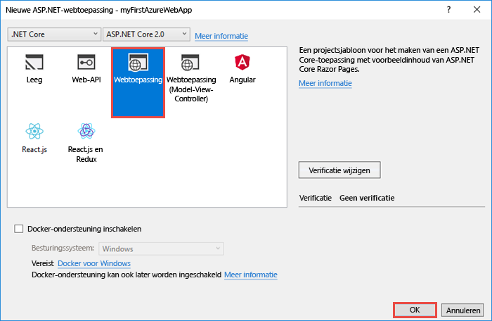
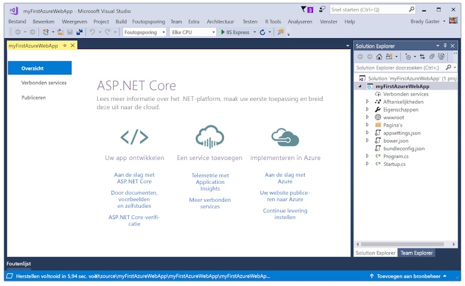
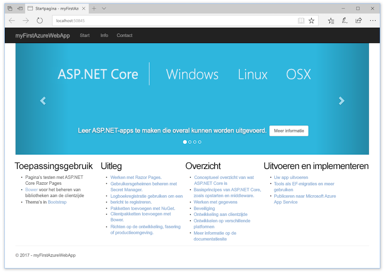
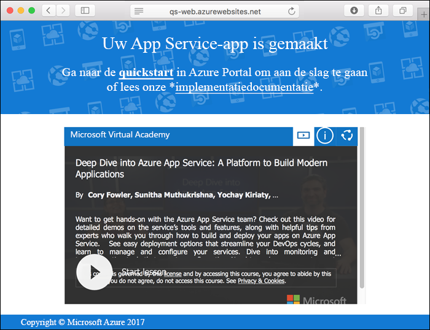
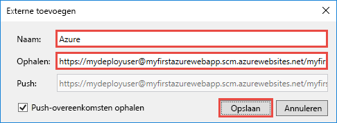
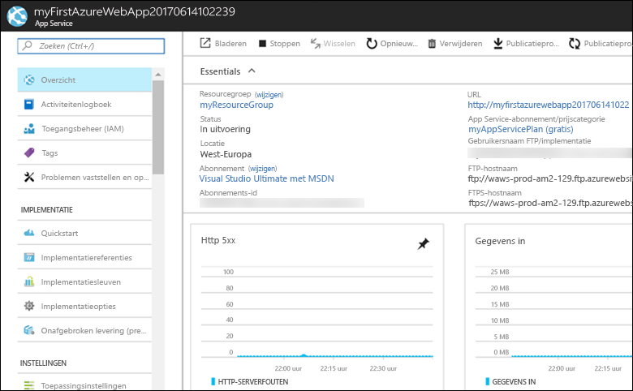

# <a name="create-an-aspnet-core-web-app-in-azure"></a>Een ASP.NET Core-web-app maken in Azure

> [!NOTE]
> In dit artikel gaat u een app implementeren in App Service onder Windows. Zie [Een .NET Core-web-app maken en implementeren in App Service onder Linux ](./containers/quickstart-dotnetcore.md) om een app te implementeren in App Service onder _Linux_.
>
> Bekijk [Een ASP.NET Framework-web-app maken in Azure](app-service-web-get-started-dotnet-framework.md) voor de stappen voor een ASP.NET Framework-app. 
>

[Azure Web Apps](app-service-web-overview.md) biedt een uiterst schaalbare webhostingservice met self-patchfunctie.  Deze snelstartgids laat zien hoe uw eerste ASP.NET Core-web-app implementeert in Azure Web Apps. Als u klaar bent, hebt u een resourcegroep die bestaat uit een App Service-plan en een Azure-web-app met een geïmplementeerde webtoepassing.

[!INCLUDE [quickstarts-free-trial-note](../../includes/quickstarts-free-trial-note.md)]

## <a name="prerequisites"></a>Vereisten

Vereisten voor het voltooien van deze zelfstudie:

* Installeer <a href="https://www.visualstudio.com/downloads/" target="_blank">Visual Studio 2017</a> met de volgende workloads:
    - **ASP.NET- en web-ontwikkeling**
    - **Azure-ontwikkeling**

    

## <a name="create-an-aspnet-core-web-app"></a>Een ASP.NET Core-web-app maken

Maak in Visual Studio een project door **Bestand > Nieuw > Project** te selecteren. 

Selecteer **Visual C# > Web > ASP.NET Core-webtoepassing** in het dialoogvenster **Nieuw project**.

Wijzig de naam van de toepassing in _myFirstAzureWebApp_, selecteer **Nieuwe Git-opslagplaats maken** en selecteer vervolgens **OK**.
   


U kunt elk type ASP.NET Core-web-app implementeren in Azure. Voor deze snelstartgids selecteert u de sjabloon **Webtoepassing** en stelt u verificatie in op **Geen verificatie**.
      
Selecteer **OK**.



Nadat het ASP.NET Core-project is gemaakt, wordt de welkomstpagina van ASP.NET Core weergegeven. Deze biedt talrijke links naar bronnen die u op weg helpen. 



Selecteer in het menu **Fouten opsporen > Starten zonder foutopsporing** om de web-app lokaal uit te voeren.



[!INCLUDE [cloud-shell-try-it.md](../../includes/cloud-shell-try-it.md)]

[!INCLUDE [Configure deployment user](../../includes/configure-deployment-user.md)] 

[!INCLUDE [Create resource group](../../includes/app-service-web-create-resource-group.md)] 

[!INCLUDE [Create app service plan](../../includes/app-service-web-create-app-service-plan.md)] 

[!INCLUDE [Create web app](../../includes/app-service-web-create-web-app.md)] 



## <a name="push-to-azure-from-visual-studio"></a>Pushen naar Azure vanuit Visual Studio

Klik in Visual Studio vanuit het menu **Weergave** op **Team Explorer**. De **Team Explorer** wordt weergegeven.

Klik in de weergave **Start** op **Instellingen** > **Instellingen opslagplaats**.


Selecteer in de **Instellingen opslagplaats** in het gedeelte **Extern** de optie **Toevoegen**. Het dialoogvenster **Extern toevoegen** wordt weergegeven.

Stel het veld **Naam** in op _Azure_ en stel vervolgens het veld **Ophalen** in op de URL die u hebt opgeslagen bij [Een web-app maken](#create-a-web-app). Klik op **Opslaan**.



Deze instelling komt overeen met de Git-opdracht `git remote add Azure <URL>`.

Klik op de knop **Start** bovenaan.

Selecteer **Instellingen** > **Algemene instellingen**. Controleer of de naam en het e-mailadres zijn ingesteld. Selecteer **Bijwerken** indien nodig.

Alle bestanden in de Git-opslagplaats zijn al door Visual Studio doorgevoerd toen het project werd gemaakt. U hoeft de bestanden nu alleen nog naar Azure te pushen.

Klik op de knop **Start** bovenaan. Selecteer **Synchroniseren** > **Acties** > **Opdrachtprompt openen**. 

Voer de volgende opdracht in het opdrachtvenster in en voer het implementatiewachtwoord in wanneer dat wordt gevraagd:

```
git push Azure master
```

Het kan enkele minuten duren voor deze opdracht is uitgevoerd. De opdracht geeft informatie weer die lijkt op het volgende voorbeeld:

```
Counting objects: 4, done.
Delta compression using up to 8 threads.
Compressing objects: 100% (4/4), done.
Writing objects: 100% (4/4), 349 bytes | 349.00 KiB/s, done.
Total 4 (delta 3), reused 0 (delta 0)
remote: Updating branch 'master'.
remote: Updating submodules.
remote: Preparing deployment for commit id '9e20345e9c'.
remote: Generating deployment script.
remote: Project file path: .\myFirstAzureWebApp\myFirstAzureWebApp.csproj
remote: Solution file path: .\myFirstAzureWebApp.sln
remote: Generated deployment script files
remote: Running deployment command...
remote: Handling ASP.NET Core Web Application deployment.
remote:   Restoring packages for D:\home\site\repository\myFirstAzureWebApp\myFirstAzureWebApp.csproj...
remote:   Restoring packages for D:\home\site\repository\myFirstAzureWebApp\myFirstAzureWebApp.csproj...
...
remote: Finished successfully.
remote: Running post deployment command(s)...
remote: Deployment successful.
To https://<app_name>.scm.azurewebsites.net/<app_name>.git
 * [new branch]      master -> master
```

## <a name="browse-to-the-app"></a>Bladeren naar de app

Ga in een browser naar de URL van de Azure-web-app: `http://<app_name>.azurewebsites.net`.

De pagina wordt als een web-app uitgevoerd in Azure App Service.


Gefeliciteerd, uw ASP.NET Core-web-app wordt live uitgevoerd in Azure App Service.

## <a name="update-the-app-and-redeploy"></a>De app bijwerken en opnieuw implementeren

Open vanuit de **Solution Explorer** _Pages/Index.cshtml_.

Zoek ergens bovenaan de HTML-tag `<div id="myCarousel" class="carousel slide" data-ride="carousel" data-interval="6000">` en vervang het volledige element door de volgende code:

```HTML
<div class="jumbotron">
    <h1>ASP.NET in Azure!</h1>
    <p class="lead">This is a simple app that we’ve built that demonstrates how to deploy a .NET app to Azure App Service.</p>
</div>
```

Klik in de **Solution Explorer** met de rechtermuisknop op _Pages/Index.cshtml_ en klik op **Doorvoeren**. Voer een doorvoerbericht in voor uw wijziging en klik op **Alles doorvoeren**.

Push in het opdrachtpromptvenster de codewijzigingen naar Azure.

```bash
git push Azure master
```

Ga wanneer de implementatie is voltooid opnieuw naar `http://<app_name>.azurewebsites.net`.


## <a name="manage-the-azure-web-app"></a>De Azure-web-app beheren

Ga naar <a href="https://portal.azure.com" target="_blank">Azure Portal</a> om de web-app te beheren.

Selecteer in het linkermenu **App Services** en selecteer de naam van uw Azure-web-app.


De pagina Overzicht van uw web-app wordt weergegeven. Hier kunt u algemene beheertaken uitvoeren, zoals bladeren, stoppen, starten, opnieuw opstarten en verwijderen. 



Het linkermenu bevat een aantal pagina's voor het configureren van uw app. 

[!INCLUDE [Clean-up section](../../includes/clean-up-section-portal.md)]

## <a name="next-steps"></a>Volgende stappen

> [!div class="nextstepaction"]
> [ASP.NET Core met SQL Database](app-service-web-tutorial-dotnetcore-sqldb.md)
