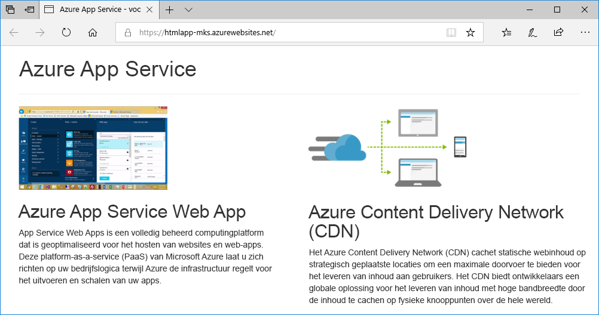
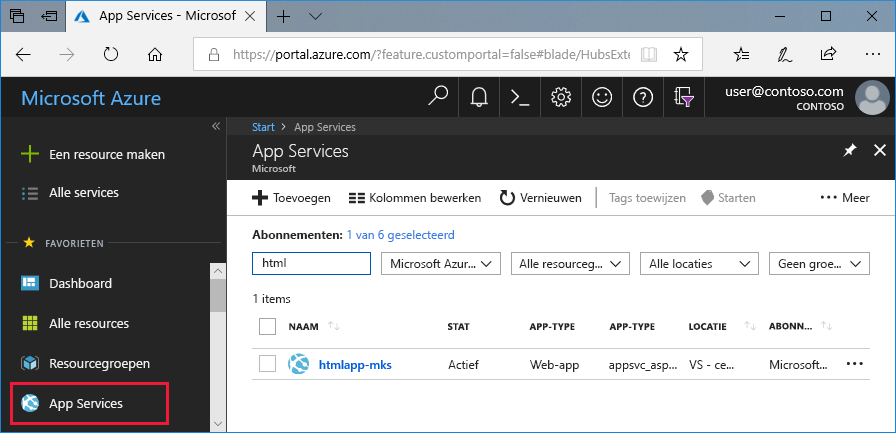
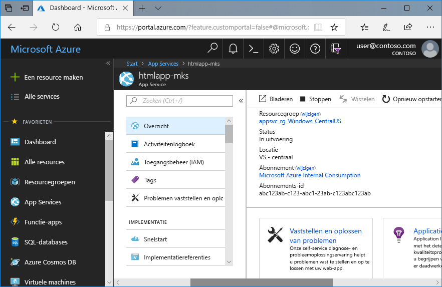

# <a name="create-a-static-html-web-app-in-azure"></a>Een statische HTML-web-app maken in Azure

[Azure Web Apps](app-service-web-overview.md) biedt een uiterst schaalbare webhostingservice met self-patchfunctie.  Deze Quickstart laat zien hoe u een eenvoudige HTML+CSS-site naar Azure Web Apps implementeert. U gaat deze Quickstart in [Cloud Shell](https://docs.microsoft.com/azure/cloud-shell/overview) doen, maar u kunt deze opdrachten ook lokaal uitvoeren met [Azure CLI](/cli/azure/install-azure-cli).


[!INCLUDE [quickstarts-free-trial-note](../../includes/quickstarts-free-trial-note.md)]

[!INCLUDE [cloud-shell-try-it.md](../../includes/cloud-shell-try-it.md)]

## <a name="install-web-app-extension-for-cloud-shell"></a>Web-appuitbreiding voor Cloud Shell installeren

Om deze Quickstart te kunnen doen, installeert u de web-appuitbreiding met [az extension add](https://docs.microsoft.com/cli/azure/extension?view=azure-cli-latest#az-extension-add). Als de extensie al is geïnstalleerd, moet u deze bijwerken naar de nieuwste versie. U kunt de web-appuitbreiding bijwerken door `az extension update -n webapp` te typen.

Voer de volgende opdracht uit om het web-appuitbreiding te installeren:

```bash
az extension add -n webapp
```

Wanneer de uitbreiding is geïnstalleerd, toont de Cloud Shell gegevens voor het volgend voorbeeld:

```bash
The installed extension 'webapp' is in preview.
```

## <a name="download-the-sample"></a>Het voorbeeld downloaden

Maak een map 'quickstart' in de Cloud Shell en ga er vervolgens naartoe.

```bash
mkdir quickstart

cd quickstart
```

Voer vervolgens de volgende opdracht uit om de voorbeeld-app-opslagplaats te klonen naar de map 'quickstart'.

```bash
git clone https://github.com/Azure-Samples/html-docs-hello-world.git
```

## <a name="create-a-web-app"></a>Een webtoepassing maken

Ga naar de map die de voorbeeldcode bevat en voer de opdracht `az webapp up` uit.

Vervang in de volgende opdracht <app-naam> door een unieke app-naam.

```bash
cd html-docs-hello-world

az webapp up -n <app_name>
```

Met de opdracht `az webapp up` worden de volgende acties uitgevoerd:

- Er wordt een standaardresourcegroep gemaakt.

- Er wordt een standaardserviceplan voor de app gemaakt.

- Er wordt een app met de opgegeven naam gemaakt.

- Er worden via zip bestanden van de huidige werkmap naar de web-app [geïmplementeerd](https://docs.microsoft.com/azure/app-service/app-service-deploy-zip).

Het kan enkele minuten duren voor deze opdracht is uitgevoerd. De opdracht geeft informatie weer die lijkt op het volgende voorbeeld:

```json
{
  "app_url": "https://<app_name>.azurewebsites.net",
  "location": "Central US",
  "name": "<app_name>",
  "os": "Windows",
  "resourcegroup": "appsvc_rg_Windows_CentralUS ",
  "serverfarm": "appsvc_asp_Windows_CentralUS",
  "sku": "FREE",
  "src_path": "/home/username/quickstart/html-docs-hello-world ",
  < JSON data removed for brevity. >
}
```

Noteer de waarde van `resourceGroup`. U hebt deze waarde nodig voor de sectie [Resources opschonen](#clean-up-resources).

## <a name="browse-to-the-app"></a>Bladeren naar de app

Ga in een browser naar de URL van de Azure-web-app: `http://<app_name>.azurewebsites.net`.

De pagina wordt als een web-app uitgevoerd in Azure App Service.


**Gefeliciteerd!** U hebt uw eerste HTML-app geïmplementeerd in App Service.

## <a name="update-and-redeploy-the-app"></a>De app bijwerken en opnieuw implementeren

Typ `nano index.html` in de Cloud Shell om de nano-teksteditor te openen. Wijzig in de H1-kop 'Azure App Service - Sample Static HTML Site' in 'Azure App Service', zoals hieronder wordt weergegeven.


Sla uw wijzigingen op en sluit nano af. Sla op met de opdracht `^O` en sluit af met `^X`.

U gaat de app nu opnieuw implementeren met dezelfde opdracht `az webapp up`.

```bash
az webapp up -n <app_name>
```

Wanneer de implementatie is voltooid, gaat u terug naar het browservenster dat is geopend in de stap **Bladeren naar de app** en vernieuwt u de pagina.



## <a name="manage-your-new-azure-web-app"></a>Uw nieuwe Azure-web-app beheren

Ga naar <a href="https://portal.azure.com" target="_blank">Azure Portal</a> om de web-app te beheren die u hebt gemaakt.

Klik in het linkermenu op **App Services** en klik op de naam van uw Azure-web-app.



De pagina Overzicht van uw web-app wordt weergegeven. Hier kunt u algemene beheertaken uitvoeren, zoals bladeren, stoppen, starten, opnieuw opstarten en verwijderen.



Het linkermenu bevat een aantal pagina's voor het configureren van uw app.

## <a name="clean-up-resources"></a>Resources opschonen

In de voorgaande stappen hebt u Azure-resources in een resourcegroep gemaakt. Als u deze resources niet meer nodig denkt te hebben, verwijdert u de resourcegroep door de volgende opdracht in Cloud Shell uit te voeren. De naam van de resourcegroep is automatisch gegenereerd in de stap [Een web-app maken](#create-a-web-app).

```bash
az group delete --name appsvc_rg_Windows_CentralUS
```

Het kan een minuut duren voordat deze opdracht is uitgevoerd.

## <a name="next-steps"></a>Volgende stappen

> [!div class="nextstepaction"]
> [Aangepast domein toewijzen](app-service-web-tutorial-custom-domain.md)
