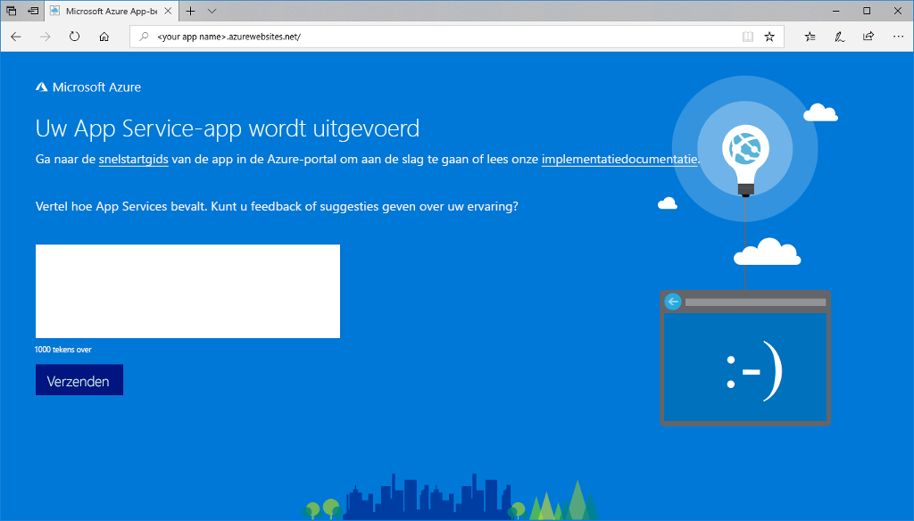

# <a name="create-a-nodejs-web-app-in-azure"></a>Een Node.js-web-app maken in Azure

> [!NOTE]
> In dit artikel gaat u een app implementeren in App Service onder Windows. Zie [Een Node.js-web-app maken en implementeren in Azure App Service onder Linux ](./containers/quickstart-nodejs.md) om een app te implementeren in App Service onder _Linux_.
>

[Azure Web Apps](app-service-web-overview.md) biedt een uiterst schaalbare webhostingservice met self-patchfunctie.  Deze Quickstart laat zien hoe u een Node.js-app naar Azure Web Apps implementeert. U maakt de web-app via de [Azure CLI](https://docs.microsoft.com/cli/azure/get-started-with-azure-cli), en gebruikt ZipDeploy om de voorbeeldcode van Node.js in de web-app te implementeren.


U kunt de onderstaande stappen volgen met behulp van een Mac-, Windows- of Linux-computer. Vanaf het moment dat de vereiste onderdelen zijn geïnstalleerd, duurt het ongeveer vijf minuten om de stappen uit te voeren.   

[!INCLUDE [quickstarts-free-trial-note](../../includes/quickstarts-free-trial-note.md)]

## <a name="prerequisites"></a>Vereisten

Dit zijn de vereisten voor het voltooien van deze snelstart:

* <a href="https://nodejs.org/" target="_blank">Node.js en NPM installeren</a>

## <a name="download-the-sample"></a>Het voorbeeld downloaden

Download het Node.js-voorbeeldproject in [https://github.com/Azure-Samples/nodejs-docs-hello-world/archive/master.zip](https://github.com/Azure-Samples/nodejs-docs-hello-world/archive/master.zip) en pak het ZIP-archief uit.

Navigeer in een terminalvenster naar de hoofdmap van het Node.js-voorbeeldproject (de map die _index.js_ bevat).

> [!NOTE]
> U hoeft onze voorbeeldtoepassing niet te gebruiken, u kunt als u wilt uw eigen Node-code gebruiken. Wees u er echter wel van bewust dat de POORT voor uw toepassing wordt ingesteld tijdens de uitvoering door Azure en beschikbaar is als `process.env.PORT`. Als u gebruikmaakt van express, zorg er dan voor dat u bij het opstarten (`app.listen`) controleert op `process.env.PORT || 3000`. Als u dat niet doet en uw poort komt niet overeen met wat er tijdens de uitvoering is ingesteld door Azure, ziet u een `Service Unavailable`-melding. 

## <a name="run-the-app-locally"></a>De app lokaal uitvoeren

Voer de toepassing lokaal uit zodat u kunt zien hoe deze eruit ziet wanneer u de toepassing implementeert naar Azure. Open een terminalvenster en gebruik het script `npm start` om de ingebouwde Node.js HTTP-server te starten.

```bash
npm start
```

Open een webbrowser en navigeer naar de voorbeeldapp op `http://localhost:1337`.

Het bericht **Hello World** uit de voorbeeld-app wordt weergegeven op de pagina.


Druk in uw terminalvenster op **Ctrl + C** om de webserver af te sluiten.

> [!NOTE]
> In Azure App Service wordt de app uitgevoerd in IIS met [iisnode](https://github.com/tjanczuk/iisnode). Voor het uitvoeren van de app met iisnode staat er een web.config-bestand in de hoofdmap van de app. Dit bestand kan worden gelezen door IIS en de instellingen voor iisnode zijn beschreven in [de GitHub-opslagplaats voor iisnode](https://github.com/tjanczuk/iisnode/blob/master/src/samples/configuration/web.config).

[!INCLUDE [Create ZIP file](../../includes/app-service-web-create-zip.md)]

[!INCLUDE [cloud-shell-try-it.md](../../includes/cloud-shell-try-it.md)]

[!INCLUDE [Create resource group](../../includes/app-service-web-create-resource-group-scus.md)] 

[!INCLUDE [Create app service plan](../../includes/app-service-web-create-app-service-plan-scus.md)] 

## <a name="create-a-web-app"></a>Een webtoepassing maken

Maak in Cloud Shell een web-app in het App Service-plan van `myAppServicePlan` met de opdracht [`az webapp create`](/cli/azure/webapp?view=azure-cli-latest#az-webapp-create). 

Vervang in het volgende voorbeeld `<app_name>` door een unieke naam (geldige tekens zijn `a-z`, `0-9`, en `-`).

```azurecli-interactive
# Bash and Powershell
az webapp create --resource-group myResourceGroup --plan myAppServicePlan --name <app_name>
```

Wanneer de web-app is gemaakt, toont de Azure CLI soortgelijke uitvoer als in het volgende voorbeeld:

```json
{
  "availabilityState": "Normal",
  "clientAffinityEnabled": true,
  "clientCertEnabled": false,
  "cloningInfo": null,
  "containerSize": 0,
  "dailyMemoryTimeQuota": 0,
  "defaultHostName": "<app_name>.azurewebsites.net",
  "enabled": true,
  < JSON data removed for brevity. >
}
```

### <a name="set-nodejs-runtime"></a>Node.js-runtime instellen

Stel de Node-runtime in op 8.11.1. <!-- To see all supported runtimes, run [`az webapp list-runtimes`](/cli/azure/webapp?view=azure-cli-latest#az-webapp-list-runtimes). -->

```azurecli-interactive
# Bash and Powershell
az webapp config appsettings set --resource-group myResourceGroup --name <app_name> --settings WEBSITE_NODE_DEFAULT_VERSION=8.11.1
```

Blader naar uw nieuwe web-app. Vervang _&lt;app-naam>_ door een unieke app-naam.

```bash
http://<app name>.azurewebsites.net
```

Zo zou uw nieuwe web-app er moeten uitzien:



[!INCLUDE [Deploy ZIP file](../../includes/app-service-web-deploy-zip.md)]

## <a name="browse-to-the-app"></a>Bladeren naar de app

Blader naar de geïmplementeerde toepassing via uw webbrowser.

```
http://<app_name>.azurewebsites.net
```

De Node.js-voorbeeldcode wordt uitgevoerd in een web-app van Azure App Service.


**Gefeliciteerd!** U hebt uw eerste Node.js-app geïmplementeerd in App Service.

## <a name="update-and-redeploy-the-code"></a>De code bijwerken en opnieuw implementeren

Open met een teksteditor het bestand `index.js` binnen de Node.js-app en breng een kleine wijziging aan in de tekst in de aanroep naar `response.end`:

```nodejs
response.end("Hello Azure!");
```

Navigeer in het lokale terminalvenster naar de hoofdmap van uw toepassing en maak een nieuw ZIP-bestand voor uw bijgewerkte project.

```
# Bash
zip -r myUpdatedAppFiles.zip .

# PowerShell
Compress-Archive -Path * -DestinationPath myUpdatedAppFiles.zip
``` 

Implementeer dit nieuwe ZIP-bestand in App Service, met behulp van dezelfde stappen als bij [Het ZIP-bestand implementeren](#deploy-zip-file).

Ga terug naar het browservenster dat is geopend in de stap **Bladeren naar de app** en vernieuw de pagina.


## <a name="manage-your-new-azure-web-app"></a>Uw nieuwe Azure-web-app beheren

Ga naar <a href="https://portal.azure.com" target="_blank">Azure Portal</a> om de web-app te beheren die u hebt gemaakt.

Klik in het linkermenu op **App Services** en klik op de naam van uw Azure-web-app.


De pagina Overzicht van uw web-app wordt weergegeven. Hier kunt u algemene beheertaken uitvoeren, zoals bladeren, stoppen, starten, opnieuw opstarten en verwijderen. 


Het linkermenu bevat een aantal pagina's voor het configureren van uw app. 

## <a name="video"></a>Video

Bekijk de video om de inhoud van deze snelstartgids in actie te zien en doorloop de stappen daarna zelf om uw eerste Node.js-app op Azure te publiceren.

> [!VIDEO https://channel9.msdn.com/Shows/Azure-for-Node-Developers/Create-a-Nodejs-app-in-Azure-Quickstart/player]   

[!INCLUDE [cli-samples-clean-up](../../includes/cli-samples-clean-up.md)]

## <a name="next-steps"></a>Volgende stappen

> [!div class="nextstepaction"]
> [Node.js met MongoDB](app-service-web-tutorial-nodejs-mongodb-app.md)
