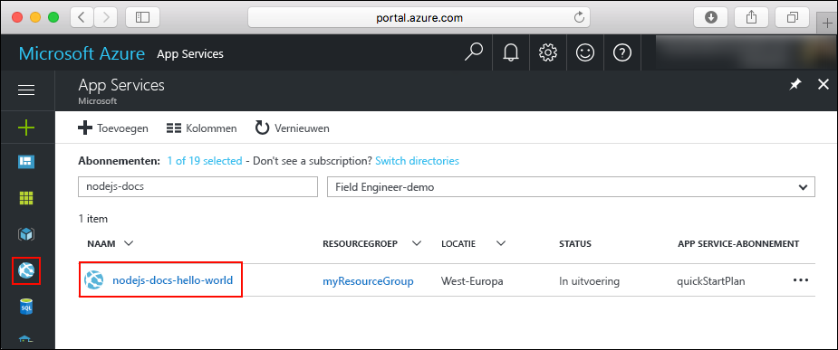

# <a name="create-a-python-web-app-in-azure"></a>Een Python-web-app maken in Azure

[Azure Web Apps](app-service-web-overview.md) biedt een uiterst schaalbare webhostingservice met self-patchfunctie.  Deze snelstartgids helpt u bij het ontwikkelen en implementeren van een Python-app in Azure Web Apps. U maakt de web-app via de [Azure CLI](https://docs.microsoft.com/cli/azure/get-started-with-azure-cli), en gebruikt Git om voorbeeldcode van Python in de web-app te implementeren.


U kunt de onderstaande stappen volgen met behulp van een Mac-, Windows- of Linux-computer. Vanaf het moment dat de vereiste onderdelen zijn geïnstalleerd, duurt het ongeveer vijf minuten om de stappen uit te voeren.

## <a name="prerequisites"></a>Vereisten

Vereisten voor het voltooien van deze zelfstudie:

1. [Git installeren](https://git-scm.com/)
1. [Python installeren](https://www.python.org/downloads/)

[!INCLUDE [quickstarts-free-trial-note](../../includes/quickstarts-free-trial-note.md)]

## <a name="download-the-sample"></a>Het voorbeeld downloaden

Voer in een terminalvenster de volgende opdracht uit om de opslagplaats van de voorbeeld-app te klonen op uw lokale computer.

```bash
git clone https://github.com/Azure-Samples/python-docs-hello-world
```

Ga naar de map die de voorbeeldcode bevat.

```bash
cd python-docs-hello-world
```

## <a name="run-the-app-locally"></a>De app lokaal uitvoeren

Installeer de vereiste pakketten met `pip`.

```bash
pip install -r requirements.txt
```

Voer de toepassing lokaal uit door een terminalvenster te openen en de opdracht `Python` te gebruiken om de ingebouwde Python-webserver te starten.

```bash
python main.py
```

Open een webbrowser en navigeer naar de voorbeeld-app op `http://localhost:5000`.

Het bericht **Hello World** uit de voorbeeld-app wordt weergegeven op de pagina.


Druk in uw terminalvenster op **Ctrl + C** om de webserver af te sluiten.

[!INCLUDE [cloud-shell-try-it.md](../../includes/cloud-shell-try-it.md)]

[!INCLUDE [Configure deployment user](../../includes/configure-deployment-user.md)]

[!INCLUDE [Create resource group](../../includes/app-service-web-create-resource-group.md)]

[!INCLUDE [Create app service plan](../../includes/app-service-web-create-app-service-plan.md)]

## <a name="create-a-web-app"></a>Een webtoepassing maken

[!INCLUDE [Create web app](../../includes/app-service-web-create-web-app-python-no-h.md)]

Blader naar uw nieuwe web-app. Vervang  _&lt;app-naam >_ met een unieke app-naam.

```bash
http://<app name>.azurewebsites.net
```


[!INCLUDE [Push to Azure](../../includes/app-service-web-git-push-to-azure.md)]

```bash
Counting objects: 18, done.
Delta compression using up to 4 threads.
Compressing objects: 100% (16/16), done.
Writing objects: 100% (18/18), 4.31 KiB | 0 bytes/s, done.
Total 18 (delta 4), reused 0 (delta 0)
remote: Updating branch 'master'.
remote: Updating submodules.
remote: Preparing deployment for commit id '44e74fe7dd'.
remote: Generating deployment script.
remote: Generating deployment script for python Web Site
remote: Generated deployment script files
remote: Running deployment command...
remote: Handling python deployment.
remote: KuduSync.NET from: 'D:\home\site\repository' to: 'D:\home\site\wwwroot'
remote: Deleting file: 'hostingstart.html'
remote: Copying file: '.gitignore'
remote: Copying file: 'LICENSE'
remote: Copying file: 'main.py'
remote: Copying file: 'README.md'
remote: Copying file: 'requirements.txt'
remote: Copying file: 'virtualenv_proxy.py'
remote: Copying file: 'web.2.7.config'
remote: Copying file: 'web.3.4.config'
remote: Detected requirements.txt.  You can skip Python specific steps with a .skipPythonDeployment file.
remote: Detecting Python runtime from site configuration
remote: Detected python-3.4
remote: Creating python-3.4 virtual environment.
remote: .................................
remote: Pip install requirements.
remote: Successfully installed Flask click itsdangerous Jinja2 Werkzeug MarkupSafe
remote: Cleaning up...
remote: .
remote: Overwriting web.config with web.3.4.config
remote:         1 file(s) copied.
remote: Finished successfully.
remote: Running post deployment command(s)...
remote: Deployment successful.
To https://<app_name>.scm.azurewebsites.net/<app_name>.git
 * [new branch]      master -> master
```

## <a name="browse-to-the-app"></a>Bladeren naar de app

Blader naar de geïmplementeerde toepassing via uw webbrowser.

```bash
http://<app_name>.azurewebsites.net
```

De Python-voorbeeldcode wordt uitgevoerd in een web-app van Azure App Service.


**Gefeliciteerd!** U hebt uw eerste Python-app geïmplementeerd naar App Service.

## <a name="update-and-redeploy-the-code"></a>De code bijwerken en opnieuw implementeren

Gebruik een lokale teksteditor om het bestand `main.py` in de Python-app te openen en breng een kleine wijziging aan in de tekst naast de instructie `return`:

```python
return 'Hello, Azure!'
```

Uw wijzigingen in Git in het lokale terminalvenster en vervolgens de codewijzigingen pushen naar Azure.

```bash
git commit -am "updated output"
git push azure master
```

Wanneer de implementatie is voltooid, gaat u terug naar het browservenster dat is geopend in de stap [Bladeren naar de app](#browse-to-the-app) en vernieuwt u de pagina.


## <a name="manage-your-new-azure-web-app"></a>Uw nieuwe Azure-web-app beheren

Ga naar <a href="https://portal.azure.com" target="_blank">Azure Portal</a> om de web-app te beheren die u hebt gemaakt.

Klik in het linkermenu op **App Services** en klik op de naam van uw Azure-web-app.



De pagina Overzicht van uw web-app wordt weergegeven. Hier kunt u algemene beheertaken uitvoeren, zoals bladeren, stoppen, starten, opnieuw opstarten en verwijderen.


Het linkermenu bevat een aantal pagina's voor het configureren van uw app.

[!INCLUDE [cli-samples-clean-up](../../includes/cli-samples-clean-up.md)]

## <a name="next-steps"></a>Volgende stappen

> [!div class="nextstepaction"]
> [Een bestaande aangepaste DNS-naam toewijzen aan Azure Web Apps](app-service-web-tutorial-custom-domain.md)
