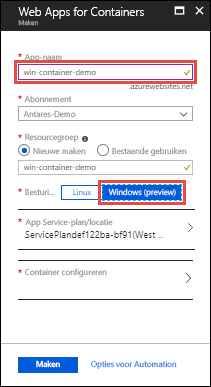
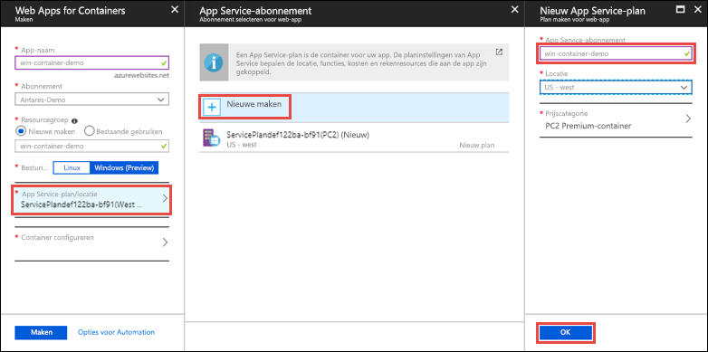
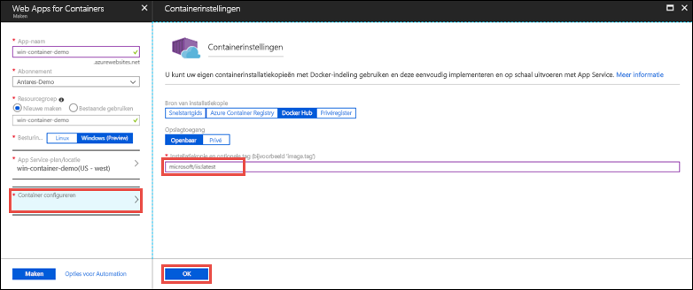
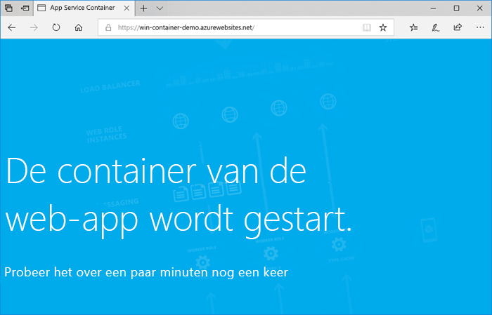

# <a name="run-a-custom-windows-container-in-azure-preview"></a>Een aangepaste Windows-container uitvoeren in Azure (Preview)

[Azure App Service](app-service-web-overview.md) biedt vooraf gedefinieerde toepassingsstacks in Windows, zoals ASP.NET of Node.js, die worden uitgevoerd in IIS. Met de vooraf geconfigureerde Windows-omgeving wordt het besturingssysteem vergrendeld voor beheerderstoegang, software-installaties, wijzigingen aan de Global Assembly Cache, enzovoort. (Zie [Functionaliteit van besturingssystemen in Azure App Service](web-sites-available-operating-system-functionality.md).) Als voor uw toepassing meer toegang is vereist dan is toegestaan in de vooraf geconfigureerde omgeving, kunt u in plaats hiervan een aangepaste Windows-container implementeren. In deze snelstart ziet u hoe u [vanuit Docker Hub](https://hub.docker.com/) een aangepaste IIS-installatiekopie kunt implementeren in Azure App Service.


## <a name="sign-in-to-azure"></a>Aanmelden bij Azure

Meld u aan bij de Azure-portal op https://portal.azure.com.

## <a name="create-a-windows-container-app"></a>Een Windows-container-app maken

1. Kies in de linkerbovenhoek van de Azure-portal **Een resource maken**.

2. Ga in het zoekvak boven de lijst met Azure Marketplace-resources naar **Web App for Containers** en selecteer dit.

3. Geef een app-naam op, bijvoorbeeld *mywebapp*, accepteer de standaardwaarden om een nieuwe resourcegroep te maken, en klik in het vak **OS** op **Windows (Preview)**.

    

4. Maak een App Service-plan door te klikken op **App Service-plan/-locatie** > **Nieuwe maken**. Geef het nieuwe plan een naam, accepteer de standaardwaarden en klik op **OK**.

    

5. Klik op **Container configureren**, typ _microsoft/iis:latest_ in **Installatiekopie en optionele tag**, en klik op **OK**.

    

    In dit artikel gebruikt u de openbare Docker Hub-installatiekopie [microsoft/iis:latest](https://hub.docker.com/r/microsoft/iis/). Als u elders een aangepaste installatiekopie voor de webtoepassing hebt, bijvoorbeeld in [Azure Container Registry](/azure/container-registry/) of in een andere privéopslagplaats, kunt u deze hier configureren.

6. Klik op **Maken** en wacht tot de vereiste resources zijn gemaakt in Azure.

## <a name="browse-to-the-container-app"></a>Naar de container-app bladeren

Als de bewerking in Azure is voltooid, wordt er een melding weergegeven.


1. Klik op **Ga naar resource**.

2. Klik op de app-pagina onder **URL** op de koppeling.

Er wordt een nieuwe browserpagina geopend met de volgende pagina:



Wacht enkele minuten en probeer het opnieuw totdat u de ISS-welkomstpagina ziet:


**Gefeliciteerd!** U voert nu uw eerste aangepaste Windows-container uit in Azure App Service.

## <a name="see-container-start-up-logs"></a>Logboeken voor opstarten van containers bekijken

Het kan enige tijd duren voordat de Windows-container is geladen. Als u de voortgang wilt bekijken, gaat u naar de volgende URL en vervangt u *\<app_name>* door de naam van de app.
```
https://<app_name>.scm.azurewebsites.net/api/logstream
```

De gestreamde logboeken zien er ongeveer als volgt uit:

```
2018-07-27T12:03:11  Welcome, you are now connected to log-streaming service.
27/07/2018 12:04:10.978 INFO - Site: win-container-demo - Start container succeeded. Container: facbf6cb214de86e58557a6d073396f640bbe2fdec88f8368695c8d1331fc94b
27/07/2018 12:04:16.767 INFO - Site: win-container-demo - Container start complete
27/07/2018 12:05:05.017 INFO - Site: win-container-demo - Container start complete
27/07/2018 12:05:05.020 INFO - Site: win-container-demo - Container started successfully
```

## <a name="use-a-different-docker-image"></a>Een andere Docker-installatiekopie gebruiken

U mag ook een andere aangepaste Docker-installatiekopie gebruiken om de app uit te voeren. Kies echter wel de juiste [bovenliggende installatiekopie](https://docs.docker.com/develop/develop-images/baseimages/) voor het gewenste framework: 

- Als u .NET Framework-apps wilt implementeren, gebruikt u een bovenliggende installatiekopie op basis van de release Windows Server Core 2016 [LTSC (Implementatiestatus van het servicekanaal op de lange termijn)](https://docs.microsoft.com/windows-server/get-started/semi-annual-channel-overview#long-term-servicing-channel-ltsc). 
- Als u .NET Core-apps wilt implementeren, gebruikt u een bovenliggende installatiekopie op basis van de release Windows Server Nano 2016 [LTSC (Implementatiestatus van het servicekanaal op de lange termijn)](https://docs.microsoft.com/windows-server/get-started/semi-annual-channel-overview#long-term-servicing-channel-ltsc). 

Het duurt enige tijd om een bovenliggende installatiekopie te downloaden tijdens het opstarten van de app. U kunt deze opstarttijd echter verminderen door een van de volgende bovenliggende installatiekopieën te gebruiken die al in cache zijn opgeslagen in Azure App Service:

- [microsoft/iis](https://hub.docker.com/r/microsoft/iis/):windowsservercore-ltsc2016, nieuwste
- [microsoft/iis](https://hub.docker.com/r/microsoft/iis/):nanoserver-sac2016
- [microsoft/aspnet](https://hub.docker.com/r/microsoft/aspnet/):4.7.2-windowsservercore-ltsc2016, 4.7.2, nieuwste
- [microsoft/dotnet](https://hub.docker.com/r/microsoft/dotnet/):2.1-aspnetcore-runtime
- [microsoft/dotnet](https://hub.docker.com/r/microsoft/dotnet/):2.1-sdk
