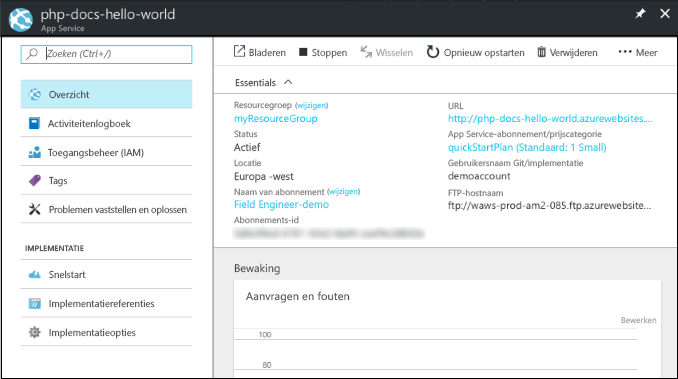

# <a name="deploy-a-python-web-app-in-web-app-for-containers"></a>Een Python-web-app in Web App for Containers implementeren

[App Service onder Linux](app-service-linux-intro.md) biedt een uiterst schaalbare webhostingservice met self-patchfunctie onder het Linux-besturingssysteem. Deze snelstart laat zien hoe u een web-app kunt maken en daar een eenvoudige Flask-app implementeren met behulp van een aangepaste Docker Hub-installatiekopie. U maakt de web-app met behulp van [Azure CLI](https://docs.microsoft.com/cli/azure/get-started-with-azure-cli).


[!INCLUDE [quickstarts-free-trial-note](../../../includes/quickstarts-free-trial-note.md)]

## <a name="prerequisites"></a>Vereisten

Vereisten voor het voltooien van deze zelfstudie:

* <a href="https://git-scm.com/" target="_blank">Git installeren</a>
* <a href="https://www.docker.com/community-edition" target="_blank">Docker Community Edition installeren</a>
* <a href="https://hub.docker.com/" target="_blank">Registreren voor een Docker Hub-account</a>

## <a name="download-the-sample"></a>Het voorbeeld downloaden

Voer de volgende opdrachten uit in een terminalvenster. Hiermee wordt de voorbeeldtoepassing gekloond naar uw lokale machine en navigeert u naar de map met de voorbeeldcode.

```bash
git clone https://github.com/Azure-Samples/python-docs-hello-world
cd python-docs-hello-world
```

Deze opslagplaats bevat een eenvoudige Flask-toepassing in de _/app_-map, en een _Dockerfile_ waarmee drie dingen worden opgegeven:

- Gebruik de basisinstallatiekopie [tiangolo/uwsgi-nginx-flask:python3.6-alpine3.7](https://hub.docker.com/r/tiangolo/uwsgi-nginx-flask/).
- De container moet luisteren op poort 8000.
- Kopieer de map `/app` naar de map `/app` van de container.

De configuratie volgt de [instructies voor de basisinstallatiekopie](https://hub.docker.com/r/tiangolo/uwsgi-nginx-flask/).

## <a name="run-the-app-locally"></a>De app lokaal uitvoeren

Voer de app uit in een Docker-container.

```bash
docker build --rm -t flask-quickstart .
docker run --rm -it -p 8000:8000 flask-quickstart
```

Open een webbrowser en navigeer naar de voorbeeldapp op `http://localhost:8000`.

Het bericht **Hello World** uit de voorbeeld-app wordt weergegeven op de pagina.


Druk in uw terminalvenster op **Ctrl+C** om de container te stoppen.

## <a name="deploy-image-to-docker-hub"></a>De installatiekopie naar Docker Hub implementeren

Meld u aan bij uw Docker Hub-account. Volg de aanwijzing om uw Docker Hub-referenties in te voeren.

```bash
docker login
```

Tag de installatiekopie en push deze naar een nieuwe _openbare_ opslagplaats uw Docker Hub-account, naar een opslagplaats met de naam `flask-quickstart`. Vervang *\<dockerhub_id>* door uw Docker Hub-id.

```bash
docker tag flask-quickstart <dockerhub_id>/flask-quickstart
docker push <dockerhub_id>/flask-quickstart
```

> [!NOTE]
> `docker push` maakt een openbare opslagplaats als de opgegeven opslagplaats niet wordt gevonden. In deze snelstart wordt ervan uitgegaan dat een openbare opslagplaats in Docker Hub wordt gebruikt. Als u liever naar een privé-opslagplaats wilt pushen, moet u later de referenties van uw Docker Hub in Azure App Service configureren. Zie [Een webtoepassing maken](#create-a-web-app).

Nadat de installatiekopie is gepusht, kunt u deze gebruiken in uw Azure-webapp.

[!INCLUDE [cloud-shell-try-it.md](../../../includes/cloud-shell-try-it.md)]

[!INCLUDE [Create resource group](../../../includes/app-service-web-create-resource-group-linux.md)]

[!INCLUDE [Create app service plan](../../../includes/app-service-web-create-app-service-plan-linux.md)]

## <a name="create-a-web-app"></a>Een webtoepassing maken

Maak een [web-app](../app-service-web-overview.md) in het App Service-plan `myAppServicePlan` met de opdracht [az webapp create](/cli/azure/webapp?view=azure-cli-latest#az-webapp-create). Vervang *\<app name>* door een unieke naam en vervang *\<dockerhub_id>* door uw Docker Hub-id.

```azurecli-interactive
az webapp create --resource-group myResourceGroup --plan myAppServicePlan --name <app name> --deployment-container-image-name <dockerhub_id>/flask-quickstart
```

Wanneer de web-app is gemaakt, toont de Azure CLI soortgelijke uitvoer als in het volgende voorbeeld:

```json
{
  "availabilityState": "Normal",
  "clientAffinityEnabled": true,
  "clientCertEnabled": false,
  "cloningInfo": null,
  "containerSize": 0,
  "dailyMemoryTimeQuota": 0,
  "defaultHostName": "<app name>.azurewebsites.net",
  "deploymentLocalGitUrl": "https://<username>@<app name>.scm.azurewebsites.net/<app name>.git",
  "enabled": true,
  < JSON data removed for brevity. >
}
```

Als u eerder naar een privé-opslagplaats hebt geüpload, moet u ook de Docker Hub-referenties configureren in App Service. Zie voor meer informatie [Gebruik een persoonlijke installatiekopie uit Docker Hub](tutorial-custom-docker-image.md#use-a-private-image-from-docker-hub-optional).

### <a name="specify-container-port"></a>Containerpoort opgeven

Zoals opgegeven in de _Dockerfile_, luistert uw container op poort 8000. Om ervoor te zorgen dat uw aanvraag naar de juiste poort wordt doorgestuurd, moet u de app-instelling *WEBSITES_PORT* instellen.

Voer in Cloud Shell de opdracht [`az webapp config appsettings set`](/cli/azure/webapp/config/appsettings?view=azure-cli-latest#az-webapp-config-appsettings-set) uit.


```azurecli-interactive
az webapp config appsettings set --name <app_name> --resource-group myResourceGroup --settings WEBSITES_PORT=8000
```

## <a name="browse-to-the-app"></a>Bladeren naar de app

```bash
http://<app_name>.azurewebsites.net/
```


> [!NOTE]
> Het duurt even voordat de web-app wordt gestart, omdat de Docker Hub-installatiekopie moet worden gedownload en uitgevoerd wanneer de app voor het eerst wordt aangevraagd. Als u in het begin na een lange tijd een foutmelding ziet, vernieuwt u de pagina.

**Gefeliciteerd!** U hebt een aangepaste Docker-installatiekopie waarop een Python-app wordt uitgevoerd naar Web App for Containers geïmplementeerd.

## <a name="update-locally-and-redeploy"></a>Lokaal bijwerken en opnieuw implementeren

Gebruik een lokale teksteditor om het bestand `app/main.py` in de Python-app te openen en breng een kleine wijziging aan in de tekst naast de instructie `return`:

```python
return 'Hello, Azure!'
```

Herbouw de installatiekopie en push deze opnieuw naar Docker Hub.

```bash
docker build --rm -t flask-quickstart .
docker tag flask-quickstart <dockerhub_id>/flask-quickstart
docker push <dockerhub_id>/flask-quickstart
```

Start de app opnieuw in Cloud Shell. Door de app opnieuw te starten, worden alle instellingen toegepast en wordt de meest recente container uit het register opgehaald.

```azurecli-interactive
az webapp restart --resource-group myResourceGroup --name <app_name>
```

Wacht ongeveer 15 seconden tot App Service de bijgewerkte installatiekopie heeft opgehaald. Ga terug naar het browservenster dat is geopend in de stap **Bladeren naar de app** en vernieuw de pagina.


## <a name="manage-your-azure-web-app"></a>Uw Azure-web-app beheren

Ga naar [Azure Portal](https://portal.azure.com) om de web-app te zien die u hebt gemaakt.

Klik vanuit het linkermenu op **App Services** en klik op de naam van uw Azure-web-app.


In de portal wordt standaard de pagina **Overzicht** van de web-app getoond. Deze pagina geeft u een overzicht van hoe uw app presteert. Hier kunt u ook algemene beheertaken uitvoeren, zoals bladeren, stoppen, starten, opnieuw opstarten en verwijderen. De tabbladen aan de linkerkant van de pagina tonen de verschillende configuratiepagina's die u kunt openen.



[!INCLUDE [Clean-up section](../../../includes/cli-script-clean-up.md)]

## <a name="next-steps"></a>Volgende stappen

> [!div class="nextstepaction"]
> [Python met PostgreSQL](tutorial-docker-python-postgresql-app.md)

> [!div class="nextstepaction"]
> [Aangepaste installatiekopieën gebruiken](tutorial-custom-docker-image.md)