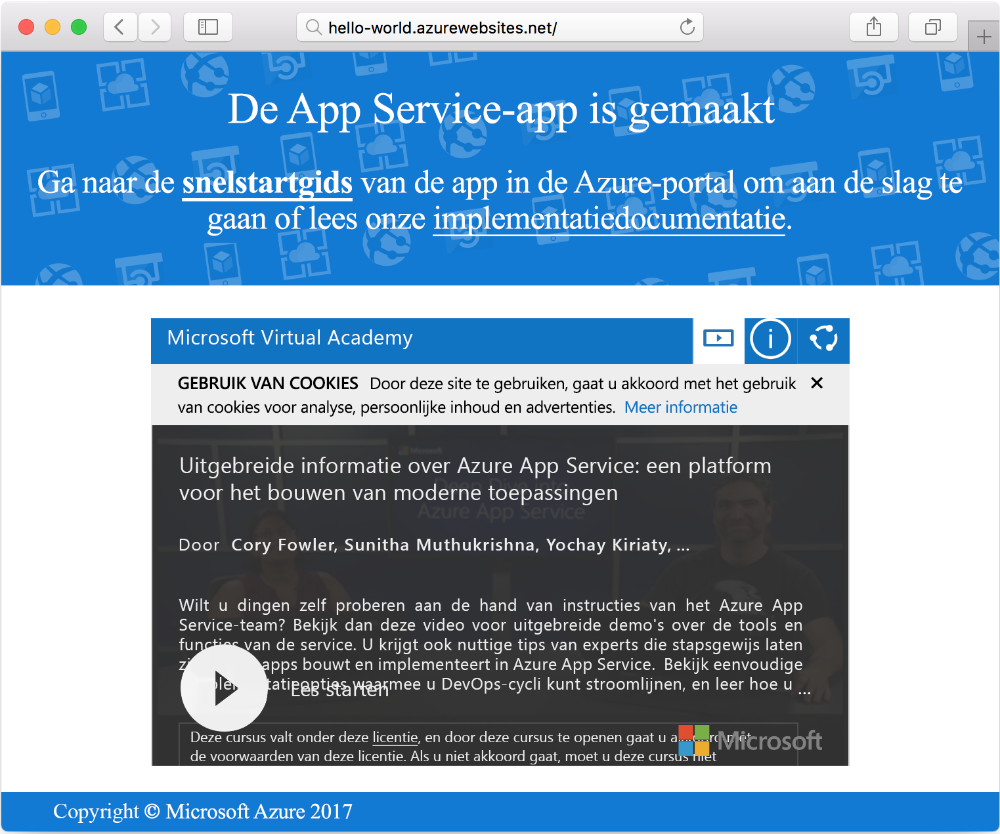

# <a name="create-a-ruby-on-rails-app-in-app-service-on-linux"></a>Een Ruby on Rails-app maken met App Service op Linux

[Azure App Service in Linux](app-service-linux-intro.md) biedt een uiterst schaalbare webhostingservice met self-patchfunctie. Deze snelstart laat zien hoe u een eenvoudige [Ruby on Rails](https://rubyonrails.org/)-toepassing maakt die als een web-app kan worden geïmplementeerd in Azure in Linux.

> [!NOTE]
> De Ruby-ontwikkelstack ondersteunt momenteel alleen Ruby on Rails. Als u een ander platform wilt gebruiken, zoals Sinatra, raadpleegt u de snelstart voor [Web App for Containers](https://docs.microsoft.com/azure/app-service/containers/).


[!INCLUDE [quickstarts-free-trial-note](../../../includes/quickstarts-free-trial-note.md)]

## <a name="prerequisites"></a>Vereisten

* <a href="https://www.ruby-lang.org/en/documentation/installation/#rubyinstaller" target="_blank">Ruby 2.3 of hoger installeren</a>
* <a href="https://git-scm.com/" target="_blank">Git installeren</a>

## <a name="download-the-sample"></a>Het voorbeeld downloaden

Voer in een terminalvenster de volgende opdracht uit om de opslagplaats van de voorbeeld-app te klonen op uw lokale computer:

```bash
git clone https://github.com/Azure-Samples/ruby-docs-hello-world
```

## <a name="run-the-application-locally"></a>De toepassing lokaal uitvoeren

Voer de toepassing lokaal uit zodat u kunt zien hoe deze eruit ziet wanneer u de toepassing implementeert naar Azure. Open een terminalvenster, ga naar de map `hello-world` en gebruik de opdracht `rails server` om de server te starten.

De eerste stap is het installeren van de vereiste gems. Er is een `Gemfile` opgenomen in het voorbeeld, dus u hoeft de te installeren gems niet op te geven. Hiervoor gebruiken we bundler:

```
bundle install
```

Nadat de gems zijn geïnstalleerd, gebruiken we bundler om de app te starten:

```bash
bundle exec rails server
```

Navigeer naar `http://localhost:3000` met uw webbrowser om de app lokaal te testen.


[!INCLUDE [Try Cloud Shell](../../../includes/cloud-shell-try-it.md)]

[!INCLUDE [Configure deployment user](../../../includes/configure-deployment-user.md)]

[!INCLUDE [Create resource group](../../../includes/app-service-web-create-resource-group-linux.md)]

[!INCLUDE [Create app service plan](../../../includes/app-service-web-create-app-service-plan-linux.md)]

## <a name="create-a-web-app"></a>Een webtoepassing maken

[!INCLUDE [Create web app](../../../includes/app-service-web-create-web-app-ruby-linux-no-h.md)] 

Blader naar de site om uw nieuwe web-app met de ingebouwde installatiekopie te bekijken. Vervang _&lt;app-naam>_ door de naam van uw web-app.

```bash
http://<app_name>.azurewebsites.net
```

Zo zou uw nieuwe web-app er moeten uitzien:



## <a name="deploy-your-application"></a>Uw toepassing implementeren

Voer de volgende opdrachten uit om de lokale toepassing in uw Azure-website te implementeren:

```bash
git remote add azure <Git deployment URL from above>
git add -A
git commit -m "Initial deployment commit"
git push azure master
```

Controleer of de externe implementatiebewerkingen met succes voltooid zijn. De uitvoer van de opdrachten moet er ongeveer uitzien als de volgende tekst:

```bash
remote: Using sass-rails 5.0.6
remote: Updating files in vendor/cache
remote: Bundle gems are installed into ./vendor/bundle
remote: Updating files in vendor/cache
remote: ~site/repository
remote: Finished successfully.
remote: Running post deployment command(s)...
remote: Deployment successful.
To https://<your web app name>.scm.azurewebsites.net/<your web app name>.git
  579ccb....2ca5f31  master -> master
myuser@ubuntu1234:~workspace/<app name>$
```

Als de implementatie is voltooid, moet u de web-app opnieuw opstarten om de implementatie van kracht te laten worden. Hiertoe voert u de opdracht [`az webapp restart`](/cli/azure/webapp?view=azure-cli-latest#az-webapp-restart) uit, zoals in dit voorbeeld:

```azurecli-interactive
az webapp restart --name <app name> --resource-group myResourceGroup
```

Navigeer naar uw site en controleer de resultaten.

```bash
http://<app name>.azurewebsites.net
```


> [!NOTE]
> Als u probeert op de site te bladeren terwijl de app opnieuw wordt opgestart, wordt de HTTP-statuscode `Error 503 Server unavailable` geretourneerd. Het opnieuw opstarten kan een paar minuten duren.
>

[!INCLUDE [Clean-up section](../../../includes/cli-script-clean-up.md)]

## <a name="next-steps"></a>Volgende stappen

> [!div class="nextstepaction"]
> [Ruby on Rails met MySQL](tutorial-ruby-postgres-app.md)
