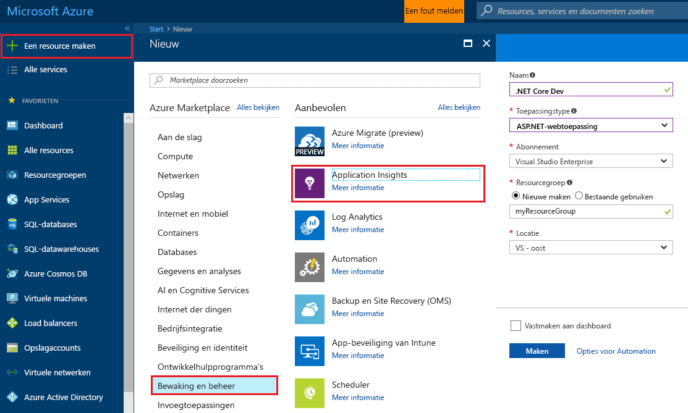
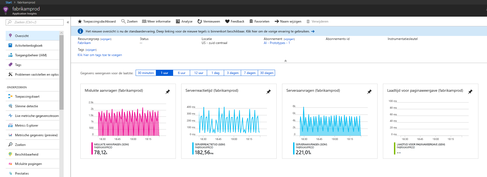
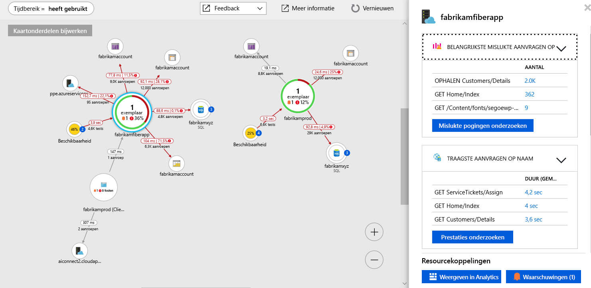
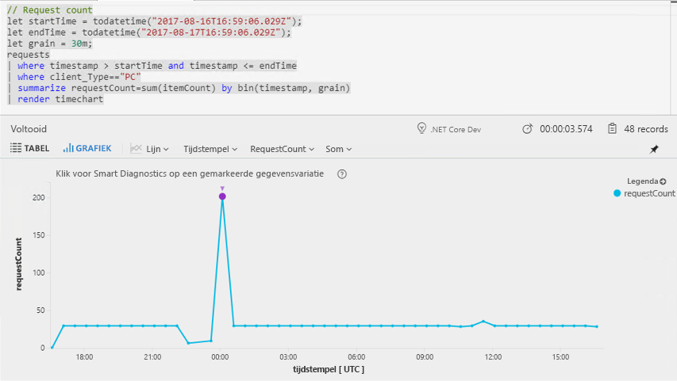
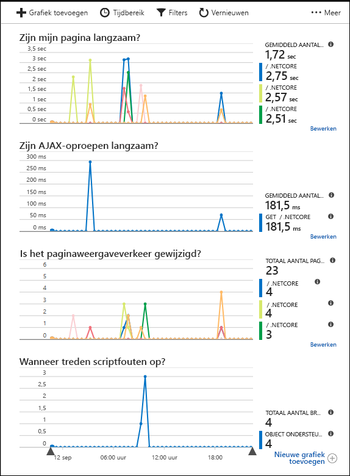

# <a name="start-monitoring-your-aspnet-core-web-application"></a>Beginnen met controleren van de ASP.NET Core-webtoepassing

Met Azure Application Insights kunt u eenvoudig de beschikbaarheid, de prestaties en het gebruik van een webtoepassing controleren. U kunt ook snel fouten in de toepassing identificeren en er een diagnose voor uitvoeren, zonder dat u hoeft te wachten totdat een gebruiker ze heeft gerapporteerd. 

Deze snelstartgids helpt u de Application Insights SDK toe te voegen aan een bestaande ASP.Net Core-webtoepassing. 

## <a name="prerequisites"></a>Vereisten

Dit zijn de vereisten voor het voltooien van deze snelstart:

- [Installeer Visual Studio 2017](https://www.visualstudio.com/downloads/) met de volgende workloads:
  - ASP.NET-ontwikkeling en webontwikkeling
  - Azure-ontwikkeling
- [.NET Core 2.0 SDK installeren](https://www.microsoft.com/net/core)
- U hebt een Azure-abonnement en een bestaande .NET Core-webtoepassing nodig.

Als u geen ASP.NET Core-webtoepassing hebt, kunt u onze stapsgewijze handleiding gebruiken om [een ASP.NET Core-app te maken en Application Insights toe te voegen](app-insights-asp-net-core.md).

Als u nog geen Azure-abonnement hebt, maakt u een [gratis account](https://azure.microsoft.com/free/) voordat u begint.

## <a name="log-in-to-the-azure-portal"></a>Aanmelden bij Azure Portal

Meld u aan bij [Azure Portal](https://portal.azure.com/).

## <a name="enable-application-insights"></a>Application Insights inschakelen

Met Application Insights kunnen telemetriegegevens worden verzameld vanuit elke toepassing met een internetverbinding, ongeacht of deze on-premises wordt uitgevoerd of in de cloud. Gebruik de volgende stappen om deze gegevens te bekijken.

1. Selecteer **Een resource maken** > **Controle en Beheer** > **Application Insights**.

   

    Er wordt een configuratiescherm weergegeven. Gebruik de volgende tabel om de invoervelden in te vullen.

    | Instellingen        |  Waarde           | Beschrijving  |
   | ------------- |:-------------|:-----|
   | **Naam**      | Globaal unieke waarde | Naam die de app beschrijft die u wilt controleren |
   | **Toepassingstype** | ASP.NET-webtoepassing | Type app dat u wilt controleren |
   | **Resourcegroep**     | myResourceGroup      | Naam voor de nieuwe resourcegroep waarin App Insights-gegevens worden gehost |
   | **Locatie** | VS - oost | Kies een locatie in uw buurt of in de buurt van waar de app wordt gehost |

2. Klik op **Create**.

## <a name="configure-app-insights-sdk"></a>App Insights-SDK configureren

1. Open het **project** uit ASP.NET Core-web-app in Visual Studio > Klik met de rechtermuisknop op de naam van de app in **Solution Explorer** > Selecteer **Toevoegen** > **Application Insights Telemetry**.

    

2. Klik op de knop **Gratis starten** > Selecteer de **bestaande resource** die u hebt gemaakt in Azure Portal, > Klik op **Registreren**.

3. Selecteer **Foutopsporing** > **Starten zonder foutopsporing** (Ctrl + F5) om de app te starten

> [!NOTE]
> Het duurt 3-5 minuten voordat de gegevens worden weergegeven in de portal. Let op: als deze app een test-app met weinig verkeer is, worden de meeste metrische gegevens alleen vastgelegd bij actieve aanvragen en bewerkingen.

## <a name="start-monitoring-in-the-azure-portal"></a>Beginnen met controleren in Azure Portal

1. U kunt de pagina **Overzicht** van Application Insights in Azure Portal nu opnieuw openen door **Project** > **Application Insights** > **Application Insights openen** te selecteren om de details te bekijken van de toepassing die momenteel wordt uitgevoerd.

   

2. Klik op **Toepassingsoverzicht** voor een visueel overzicht van de afhankelijkheidsrelaties tussen de onderdelen van de toepassing. Voor elk onderdeel worden KPI's weergegeven, zoals belasting, prestaties, fouten en waarschuwingen.

   

3. Klik op het **App Analytics**-pictogram .  Hierdoor wordt **Application Insights Analytics** geopend. Dit biedt een querytaal met opmaak voor het analyseren van alle gegevens die zijn verzameld met Application Insights. In dit geval wordt er een query gegenereerd waarmee het aantal aanvragen wordt weergegeven als een grafiek. U kunt uw eigen query's schrijven om andere gegevens te analyseren.

   

4. Ga terug naar de pagina **Overzicht** en bekijk de KPI-dashboards.  Dit dashboard biedt statistische gegevens over de toepassingsstatus, waaronder het aantal inkomende aanvragen, de duur van deze aanvragen en eventuele fouten die optreden. 

   

   Als u de grafiek **Laadtijd voor paginaweergave** wilt vullen met **telemetriegegevens aan de clientzijde**, voegt u dit script toe aan elke pagina die u wilt bijhouden:

   ```HTML
   <!-- 
   To collect user behavior analytics about your application, 
   insert the following script into each page you want to track.
   Place this code immediately before the closing </head> tag,
   and before any other scripts. Your first data will appear 
   automatically in just a few seconds.
   -->
   <script type="text/javascript">
     var appInsights=window.appInsights||function(config){
       function i(config){t[config]=function(){var i=arguments;t.queue.push(function(){t[config].apply(t,i)})}}var t={config:config},u=document,e=window,o="script",s="AuthenticatedUserContext",h="start",c="stop",l="Track",a=l+"Event",v=l+"Page",y=u.createElement(o),r,f;y.src=config.url||"https://az416426.vo.msecnd.net/scripts/a/ai.0.js";u.getElementsByTagName(o)[0].parentNode.appendChild(y);try{t.cookie=u.cookie}catch(p){}for(t.queue=[],t.version="1.0",r=["Event","Exception","Metric","PageView","Trace","Dependency"];r.length;)i("track"+r.pop());return i("set"+s),i("clear"+s),i(h+a),i(c+a),i(h+v),i(c+v),i("flush"),config.disableExceptionTracking||(r="onerror",i("_"+r),f=e[r],e[r]=function(config,i,u,e,o){var s=f&&f(config,i,u,e,o);return s!==!0&&t["_"+r](config,i,u,e,o),s}),t
       }({
           instrumentationKey:"<insert instrumentation key>"
       });
       
       window.appInsights=appInsights;
       appInsights.trackPageView();
   </script>
   ```

5. Klik onder de koptekst **Onderzoeken** op **Browser**. Hier vindt u metrische gegevens die betrekking hebben op de prestaties van de app-pagina's. U kunt op **Nieuwe grafiek toevoegen** klikken om aanvullende aangepaste weergaven te maken, of **Bewerken** selecteren om type, hoogte, kleurenpalet, groeperingen en metrische gegevens van bestaande grafieken te wijzigen.

   

## <a name="clean-up-resources"></a>Resources opschonen

Als u van plan bent om door te gaan met andere snelstartgidsen of met de zelfstudies, verwijdert u de resources die u in deze snelstartgids hebt gemaakt niet. Als u niet wilt doorgaan, gebruikt u de volgende stappen om alle resources te verwijderen die door deze Quick Start in Azure Portal zijn gemaakt.

1. Klik in het menu links in Azure Portal op **Resourcegroepen** en klik vervolgens op **myResourceGroup**.
2. Klik op de pagina van uw resourcegroep op **Verwijderen**, typ **myResourceGroup** in het tekstvak en klik vervolgens op **Verwijderen**.

## <a name="next-steps"></a>Volgende stappen

> [!div class="nextstepaction"]
> [Runtime-uitzonderingen zoeken en diagnoses uitvoeren](https://docs.microsoft.com/azure/application-insights/app-insights-tutorial-runtime-exceptions)
