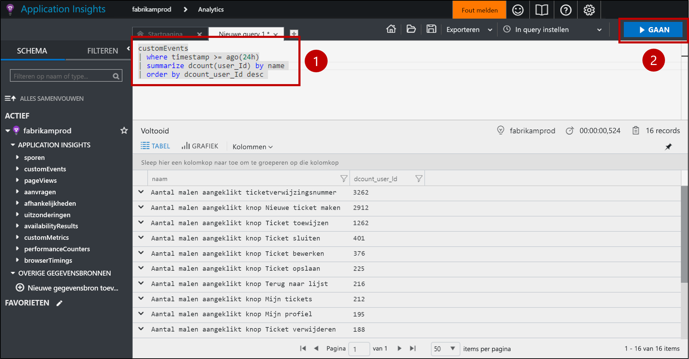
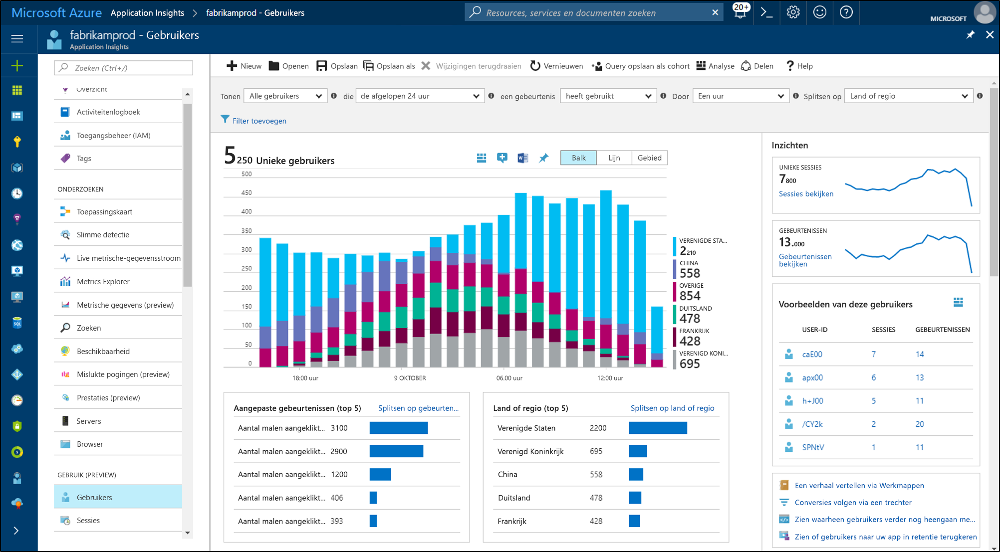

# <a name="start-analyzing-your-mobile-app-with-app-center-and-application-insights"></a>Start het analyseren van uw mobiele app met App Center en Application Insights

Deze snelstartgids leidt u door verbinding te maken van uw app Center-App-exemplaar met Application Insights. Met Application Insights, u kunt een query, segmenteren filteren en analyseren van uw telemetrie met krachtige hulpprogramma's dan beschikbaar zijn vanuit de [Analytics](https://docs.microsoft.com/mobile-center/analytics/) van Center-App service.

## <a name="prerequisites"></a>Vereisten

U hebt het volgende nodig om deze snelstartgids te voltooien:

- Een Azure-abonnement.
- Een iOS-, Android, Xamarin, universeel Windows of systeemeigen reageren app.
 
Als u nog geen Azure-abonnement hebt, maakt u een [gratis account](https://azure.microsoft.com/free/) voordat u begint.

## <a name="onboard-to-app-center"></a>Onboarding van App-Center

Voordat u Application Insights met uw mobiele app gebruiken kunt, moet u vrijgeven uw app [App Center](https://docs.microsoft.com/mobile-center/). Application Insights ontvangt geen telemetrie van uw mobiele app rechtstreeks. Uw app wordt in plaats daarvan aangepaste gebeurtenis telemetrie verzendt naar App Center. Vervolgens exporteert App Center continu kopieën van deze aangepaste gebeurtenissen in Application Insights als de gebeurtenissen worden ontvangen.

Voorbereiden uw app volgt u de App Center Quick Start voor elk platform voor uw app ondersteunt. Afzonderlijke exemplaren van de App Center voor elk platform maken:

* [iOS](https://docs.microsoft.com/mobile-center/sdk/getting-started/ios).
* [Android](https://docs.microsoft.com/mobile-center/sdk/getting-started/android).
* [Xamarin](https://docs.microsoft.com/mobile-center/sdk/getting-started/xamarin).
* [Universeel Windows](https://docs.microsoft.com/mobile-center/sdk/getting-started/uwp).
* [Systeemeigen reageren](https://docs.microsoft.com/mobile-center/sdk/getting-started/react-native).

## <a name="track-events-in-your-app"></a>Houd gebeurtenissen in uw app

Nadat uw app vrijgegeven voor App Center is, moet deze worden aangepast voor het verzenden van telemetrie van aangepaste gebeurtenis met de Center-App SDK. Aangepaste gebeurtenissen zijn het enige type App Center telemetrie die is geëxporteerd naar Application Insights.

Aangepaste gebeurtenissen van iOS-apps worden verzonden, gebruikt u de `trackEvent` of `trackEvent:withProperties` methoden in de App Center SDK. [Meer informatie over het bijhouden van gebeurtenissen van iOS-apps.](https://docs.microsoft.com/mobile-center/sdk/analytics/ios)

```Swift
MSAnalytics.trackEvent("Video clicked")
```

Aangepaste gebeurtenissen van Android-apps worden verzonden, gebruikt u de `trackEvent` methode in de App Center SDK. [Meer informatie over het bijhouden van gebeurtenissen van Android-apps.](https://docs.microsoft.com/mobile-center/sdk/analytics/android)

```Java
Analytics.trackEvent("Video clicked")
```

Aangepaste gebeurtenissen van andere platforms app worden verzonden, gebruikt u de `trackEvent` methoden in hun App Center SDK's.

Om te zorgen dat uw aangepaste gebeurtenissen worden ontvangen, gaat u naar de **gebeurtenissen** tabblad onder de **Analytics** sectie in het midden van de App. Het kan enkele minuten duren voordat gebeurtenissen worden weergegeven uit wanneer deze wordt verzonden vanuit uw app.

## <a name="create-an-application-insights-resource"></a>Een Application Insights-resource maken

Als uw app aangepaste gebeurtenissen verzendt en deze gebeurtenissen worden ontvangen door de App Center, moet u een App Center-type Application Insights-resource maken in de Azure portal:

1. Meld u aan bij [Azure Portal](https://portal.azure.com/).
2. Selecteer **Nieuw** > **Controle + Beheer** > **Application Insights**.

    

    Er verschijnt een configuratie-venster. Gebruik de onderstaande tabel om de invoervelden in te vullen.

    | Instellingen        |  Waarde           | Beschrijving  |
   | ------------- |:-------------|:-----|
   | **Naam**      | Sommige globaal unieke waarde, zoals 'myApp iOS' | Naam die de app beschrijft die u wilt controleren |
   | **Toepassingstype** | App Center-toepassing | Type app dat u wilt controleren |
   | **Resourcegroep**     | Een nieuwe resourcegroep of een bestaande in het menu | De resourcegroep waarin u de nieuwe Application Insights-resource maken |
   | **Locatie** | Een locatie in het menu | Kies een locatie in uw buurt of in de buurt van waar de app wordt gehost |

3. Klik op **Create**.

Als uw app biedt ondersteuning voor meerdere platforms (iOS, Android, enz.), is het raadzaam te maken van afzonderlijke Application Insights-resources, één voor elk platform.

## <a name="export-to-application-insights"></a>Exporteren naar Application Insights

In uw nieuwe Application Insights-resource op de **overzicht** pagina in de **Essentials** sectie aan de bovenkant, Kopieer de instrumentatiesleutel voor deze bron.

In het midden van de App-exemplaar voor uw app:

1. Op de **instellingen** pagina, klikt u op **exporteren**.
2. Kies **nieuwe exporteren**, kies **Application Insights**, klikt u vervolgens op **aanpassen**.
3. Plak uw Application Insights-instrumentatiesleutel in het vak.
4. Toestemming voor het verbeteren van het gebruik van het Azure-abonnement met uw Application Insights-resource. Elke Application Insights-resource is gratis voor de eerste 1 GB aan gegevens ontvangen per maand. [Meer informatie over prijzen voor Application Insights.](https://azure.microsoft.com/pricing/details/application-insights/)

Onthoud dit proces herhalen voor elk platform voor uw app ondersteunt.

Eenmaal [exporteren](https://docs.microsoft.com/mobile-center/analytics/export) is ingesteld, wordt elke aangepaste gebeurtenis is ontvangen door de App Center gekopieerd naar Application Insights. Het kan enkele minuten duren voordat gebeurtenissen naar Application Insights bereikt, dus als ze niet direct wachten met een beetje verder onderzoeken.

Zodat u meer gegevens wanneer u eerst verbinding maakt, worden de meest recente 48 uur van aangepaste gebeurtenissen in het midden van de App automatisch geëxporteerd naar Application Insights.

## <a name="start-monitoring-your-app"></a>Starten van de controle van uw app

Application Insights kunnen opvragen, segmenteren filteren en analyseren van de aangepaste gebeurtenis telemetrie van uw apps, afgezien van de hulpprogramma's voor de analytics die Center-App biedt.

1. **Query uitvoeren op uw aangepaste gebeurtenis telemetrie.** Uit de Application Insights **overzicht** pagina **Analytics**. 

   

   De Application Insights Analytics-portal die zijn gekoppeld aan uw Application Insights-resource wordt geopend. De portal Analytics kunt u rechtstreeks query uitvoeren op uw gegevens dankzij de Log Analytics query language, zodat u willekeurig complexe over uw app en de gebruikers vragen kunt.
   
   Open een nieuw tabblad in de portal Analytics vervolgens plakken in de volgende query. Deze retourneert een telling van het aantal unieke gebruikers hebt verzonden elke aangepaste gebeurtenis van uw app in de afgelopen 24 uur, gesorteerd op basis van de verschillende aantallen.

   ```AIQL
   customEvents
   | where timestamp >= ago(24h)
   | summarize dcount(user_Id) by name 
   | order by dcount_user_Id desc 
   ```

   

   1. De query selecteren door te klikken op een willekeurige plaats in de query in de teksteditor.
   2. Klik vervolgens op **gaat** de query uit te voeren. 

   Meer informatie over [Application Insights Analytics](app-insights-analytics.md) en de [querytaal van logboekanalyse](https://docs.loganalytics.io/docs/Language-Reference).


2. **Segmenteer en filteren van uw aangepaste gebeurtenis telemetrie.** Uit de Application Insights **overzicht** pagina **gebruikers** in de inhoudsopgave.

   

   Het hulpprogramma gebruikers ziet u hoeveel gebruikers van uw app bepaalde knoppen wordt geklikt, bepaalde schermen bezocht of andere actie die u als een gebeurtenis met de App Center SDK bijhoudt is uitgevoerd. Als u hebt een manier te segmenteren en uw App Center gebeurtenissen filteren is geopend, is het hulpprogramma gebruikers een uitstekende keuze.

    

   Bijvoorbeeld, gebruik van uw per Geografie segmenteren door te kiezen **land of regio** in de **gesplitst** vervolgkeuzemenu.

3. **Analyseren op patronen conversie, bewaren en navigatie in uw app.** Uit de Application Insights **overzicht** pagina **gebruiker loopt** in de inhoudsopgave.

   

   Het hulpprogramma gebruiker loopt visualiseren welke gebeurtenissen gebruikers na enkele begin gebeurtenis verzenden. Dit is handig voor het ophalen van een volledig beeld van hoe gebruikers door uw app navigeren. Hij kan ook de plaatsen waar veel gebruikers zijn churning van uw app of dezelfde acties steeds herhalende onthullen.

   Naast de gebruiker loopt beschikt Application Insights over diverse andere gebruik analytics hulpmiddelen om bepaalde vragen te beantwoorden:

   * **Schoorstenen** voor analyseren en de controle van de tarieven voor conversie.
   * **Bewaartermijn** voor het analyseren van hoe goed uw app gebruikers behoudt gedurende een bepaalde periode.
   * **Werkmappen** voor het combineren van visualisaties en tekst in een deelbaar rapport.
   * **Cohorten** voor naamgeving en het opslaan van specifieke groepen van gebruikers of gebeurtenissen, zodat ze gemakkelijk kunnen worden verwezen vanuit andere hulpmiddelen analytics.

## <a name="clean-up-resources"></a>Resources opschonen

Als u niet doorgaan met Application Insights met App Center wilt, export in de App Center uitschakelen en verwijderen van de Application Insights-resource. Hiermee voorkomt u dat u in rekening worden gebracht verder door Application Insights voor deze bron.

Export in de App Center uitschakelen:

1. In het midden van de App, gaat u naar **instellingen** en kies **exporteren**.
2. Klik op de Application Insights-uitvoer die u wilt verwijderen en klik vervolgens op **export verwijderen** onderaan en te bevestigen.

Verwijderen van de Application Insights-resource:

1. Klik in het menu links van de Azure portal op **resourcegroepen** en kies vervolgens de resourcegroep waarin uw Application Insights-resource is gemaakt.
2. Open de Application Insights-resource die u wilt verwijderen. Klik vervolgens op **verwijderen** in het menu van de bron en te bevestigen. Hiermee wordt de kopie van de gegevens die zijn geëxporteerd naar Application Insights permanent verwijderd.

## <a name="next-steps"></a>Volgende stappen

> [!div class="nextstepaction"]
> [Begrijpen hoe klanten uw app gebruiken](app-insights-usage-overview.md)