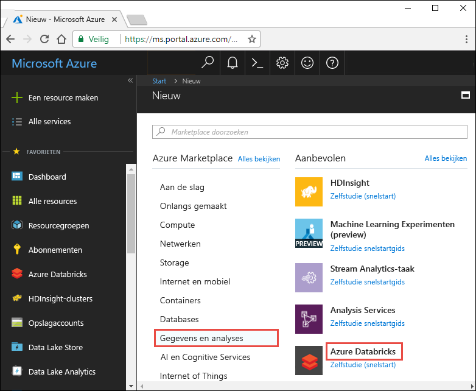
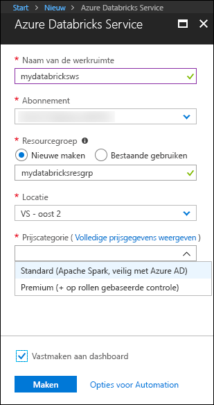
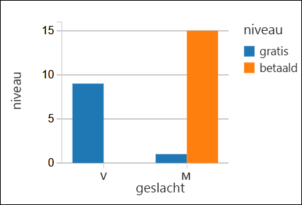

# <a name="quickstart-run-a-spark-job-on-azure-databricks-using-the-azure-portal"></a>Snelstartgids: Een Spark taak uitvoeren op Azure Databricks met de Azure portal

Deze snelstartgids toont het maken van een werkruimte Azure Databricks en een Apache Spark-cluster in deze werkruimte. Ten slotte leert u hoe u een Spark-taak op het cluster Databricks. Zie voor meer informatie over Azure Databricks [wat is Azure Databricks?](what-is-azure-databricks.md)

## <a name="log-in-to-the-azure-portal"></a>Aanmelden bij Azure Portal

Meld u aan bij de [Azure-portal](https://portal.azure.com).

## <a name="create-a-databricks-workspace"></a>Een Databricks-werkruimte maken

In deze sectie maakt u een Azure-Databricks werkruimte met de Azure portal. 

1. Klik in de Azure-portal op  **+** , klikt u op **gegevens en analyse**, en klik vervolgens op **Azure Databricks (Preview)**. 

    

2. Onder **Azure Databricks (Preview)**, klikt u op **maken**.

    > [!NOTE]
    > Azure Databricks is momenteel in de beperkte preview. Als u wilt dat uw Azure-abonnement voor whitelisting voor de preview worden overwogen, moet u uit de [aanmeldingsformulier](https://databricks.azurewebsites.net/).

2. Onder **Azure Databricks Service**, bieden de volgende waarden:

    

    * Voor **Werkruimtenaam**, Geef een naam voor uw werkruimte Databricks.
    * Voor **abonnement**, selecteer uw Azure-abonnement in de vervolgkeuzelijst.
    * Voor **resourcegroep**, opgeven of u wilt een nieuwe resourcegroep maken of een bestaande wilt gebruiken. Een resourcegroep is een container met verwante resources voor een Azure-oplossing. Zie voor meer informatie [overzicht van Azure Resource Group](../azure-resource-manager/resource-group-overview.md).
    * Voor **locatie**, selecteer **VS-Oost 2**. Zie voor andere beschikbare regio's, [Azure-services beschikbaar per regio](https://azure.microsoft.com/regions/services/).

3. Klik op **Create**.

## <a name="create-a-spark-cluster-in-databricks"></a>Maken van een Spark-cluster in Databricks

1. In de Azure portal, gaat u naar de werkruimte Databricks die u hebt gemaakt en klik vervolgens op **initialiseren werkruimte**.

2. U wordt omgeleid naar de Databricks Azure-portal. Klik in de portal op **Cluster**.

    

3. In de **nieuwe cluster** pagina, geef dan de waarden voor het maken van een cluster.

    

    * Voer een naam voor het cluster.
    * Zorg ervoor dat u selecteert de **beëindigen na ___ minuten van activiteit** selectievakje. Geef een duur (in minuten) om te beëindigen van het cluster als het cluster niet wordt gebruikt.
    * Accepteer alle overige standaardwaarden. 
    * Klik op **cluster maken**. Zodra het cluster wordt uitgevoerd, kunt u notitieblokken koppelen aan het cluster en Spark taken uitvoeren.

Zie voor meer informatie over het maken van clusters [een Spark-cluster maken in Azure Databricks](https://docs.azuredatabricks.net/user-guide/clusters/create.html).

## <a name="run-a-spark-sql-job"></a>Een Spark SQL-taak uitvoeren

Voordat u met deze sectie begint, moet u het volgende:

* [Een Azure storage-account maken](../storage/common/storage-create-storage-account.md#create-a-storage-account). 
* Een voorbeeld van een JSON-bestand downloaden [vanuit Github](https://github.com/Azure/usql/blob/master/Examples/Samples/Data/json/radiowebsite/small_radio_json.json). 
* Het voorbeeld JSON-bestand uploaden naar de Azure storage-account dat u hebt gemaakt. U kunt [Microsoft Azure Storage Explorer](../vs-azure-tools-storage-manage-with-storage-explorer.md) om bestanden te uploaden.

Voer de volgende stappen uit voor het maken van een laptop in Databricks, laptop-gegevens lezen uit een Azure Blob storage-account configureren en voer vervolgens een Spark SQL van de gegevens.

1. Klik in het linkerdeelvenster op **werkruimte**. Van de **werkruimte** omlaag, klikt u op **maken**, en klik vervolgens op **Notebook**.

    

2. In de **Notebook maken** dialoogvenster vak, voer een naam, selecteer **Scala** als de taal en selecteer het Spark-cluster dat u eerder hebt gemaakt.

    

    Klik op **Create**.

3. Vervang in het volgende fragment `{YOUR STORAGE ACCOUNT NAME}` met de naam van Azure storage-account dat u hebt gemaakt en `{YOUR STORAGE ACCOUNT ACCESS KEY}` met uw toegangssleutel voor opslagaccount. Plak het codefragment in een lege cel in de notebook en drukt u op SHIFT + ENTER om uit te voeren van de codecel. In dit fragment configureert u de notebook om te lezen van gegevens uit een Azure blob-opslag.

       spark.conf.set("fs.azure.account.key.{YOUR STORAGE ACCOUNT NAME}.blob.core.windows.net", "{YOUR STORAGE ACCOUNT ACCESS KEY}")
    
    Zie voor instructies over het ophalen van de opslagaccountsleutel [beheren van uw toegangssleutels voor opslag](../storage/common/storage-create-storage-account.md#manage-your-storage-account)

    > [!NOTE]
    > U kunt ook Azure Data Lake Store met een Spark-cluster op Azure Databricks gebruiken. Zie voor instructies [gebruik Data Lake Store met Azure Databricks](https://go.microsoft.com/fwlink/?linkid=864084).

4. Voer een SQL-instructie voor het maken van een tijdelijke tabel met gegevens uit het voorbeeldgegevensbestand JSON, **small_radio_json.json**. Vervang de tijdelijke aanduiding voor waarden met de containernaam en de naam van het opslagaccount in het volgende codefragment. Plak het codefragment in een codecel in de notebook en druk vervolgens op SHIFT + ENTER. In het codefragment `path` geeft de locatie van het voorbeeld JSON-bestand dat u hebt geüpload naar uw Azure Storage-account.

    ```sql
    %sql 
    CREATE TEMPORARY TABLE radio_sample_data
    USING json
    OPTIONS (
     path "wasbs://{YOUR CONTAINER NAME}@{YOUR STORAGE ACCOUNT NAME}.blob.core.windows.net/small_radio_json.json"
    )
    ```

    Zodra de opdracht is voltooid, hebt u alle gegevens van het JSON-bestand als een tabel in Databricks cluster.

    De `%sql` taal magic-opdracht kunt u een SQL-code uitvoert vanuit de laptop, zelfs als de laptop van een ander type is. Zie voor meer informatie [talen in een laptop mengen](https://docs.azuredatabricks.net/user-guide/notebooks/index.html#mixing-languages-in-a-notebook).

5. We bekijken een momentopname van de voorbeeld-JSON-gegevens voor een beter begrip van de query die wordt uitgevoerd. Plak het volgende codefragment in de codecel en druk op **SHIFT + ENTER**.

    ```sql
    %sql 
    SELECT * from radio_sample_data
    ```

6. U ziet een uitvoer in tabelvorm zoals weergegeven in de volgende schermafbeelding (alleen bepaalde kolommen worden weergegeven):

    

    Onder meer de voorbeeldgegevens worden vastgelegd het geslacht van de doelgroep van een kanaal keuzerondjes (kolomnaam **geslacht**) en of het abonnement is gratis of betaalde (kolomnaam **niveau**).

7. U wordt nu een visuele representatie van deze gegevens weergeven voor elk geslacht, hoeveel gebruikers hebben gratis accounts en hoeveel worden betaald abonnees. Van de onderkant van de uitvoer in tabelvorm, klikt u op de **staafdiagram** pictogram en klik vervolgens op **tekenen opties**.

    

8. In **aanpassen tekenen**, slepen en neerzetten waarden zoals weergegeven in de schermafbeelding.

    

    * Stel **sleutels** naar **geslacht**.
    * Stel **reeksgroeperingen** naar **niveau**.
    * Stel **waarden** naar **niveau**.
    * Stel **aggregatie** naar **aantal**.

    Klik op **Toepassen**.

9. De uitvoer ziet u de visuele representatie zoals beschreven in de volgende schermafbeelding:

     

## <a name="clean-up-resources"></a>Resources opschonen

Tijdens het maken van het Spark-cluster als u het selectievakje geselecteerd **beëindigen na ___ minuten van activiteit**, het cluster wordt automatisch beëindigd als deze niet actief voor de opgegeven tijd is.

Als u het selectievakje niet hebt geselecteerd, moet u het cluster handmatig beëindigen. Om dit te doen vanuit de werkruimte Azure Databricks in het linkerdeelvenster klikt u op **Clusters**. Voor het cluster dat u wilt beëindigen, de cursor op het weglatingsteken onder plaatst **acties** kolom en klik op de **beëindigen** pictogram.


## <a name="next-steps"></a>Volgende stappen

In dit artikel wordt gemaakt van een Spark-cluster in Azure Databricks en een Spark-taak met gegevens in Azure storage is uitgevoerd. U kunt ook zoeken op [Spark gegevensbronnen](https://docs.azuredatabricks.net/spark/latest/data-sources/index.html) om gegevens uit andere gegevensbronnen importeren in Azure Databricks te leren. Ga naar het volgende artikel voor meer informatie over het gebruik van Azure Data Lake Store met Azure Databricks.

> [!div class="nextstepaction"]
>[Gebruik Data Lake Store met Azure Databricks](https://go.microsoft.com/fwlink/?linkid=864084)