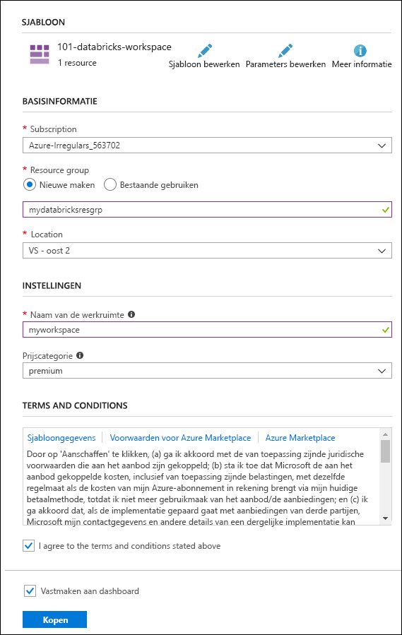
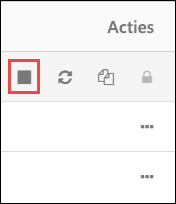

# <a name="quickstart-run-a-spark-job-on-azure-databricks-using-the-azure-resource-manager-template"></a>Snelstart: Een Spark-taak uitvoeren op Azure Databricks met de Resource Manager-sjabloon

Deze snelstart laat zien hoe u een Azure Databricks-werkruimte maakt met behulp van de Azure Resource Manager-sjabloon. U gebruikt de werkruimte om een Apache Spark-cluster te maken en een Spark-taak uit te voeren op het Databricks-cluster. Zie [Wat is Azure Databricks?](what-is-azure-databricks.md) voor meer informatie over Azure Databricks.

In deze snelstart analyseert u als onderdeel van de Spark-taak abonnementsgegevens van een radiozender voor meer inzicht in vrij/betaald gebruik op basis van demografische gegevens.

Als u geen abonnement op Azure hebt, maakt u een [gratis account](https://azure.microsoft.com/free/) voordat u begint.

## <a name="create-an-azure-databricks-workspace"></a>Een Azure Databricks-werkruimte maken

In deze sectie gaat u een Azure Databricks-werkruimte maken met behulp van de Resource Manager-sjabloon.

1. Klik op de volgende afbeelding om de sjabloon in Azure Portal te openen.

   <a href="https://portal.azure.com/#create/Microsoft.Template/uri/https%3A%2F%2Fraw.githubusercontent.com%2FAzure%2Fazure-quickstart-templates%2Fmaster%2F101-databricks-workspace%2Fazuredeploy.json" target="_blank"></a>

2. Geef de vereiste waarden op voor het maken van uw Azure-Databricks-werkruimte

   

   Geef de volgende waarden op:

   |Eigenschap  |Beschrijving  |
   |---------|---------|
   |**Abonnement**     | Selecteer uw Azure-abonnement in de vervolgkeuzelijst.        |
   |**Resourcegroep**     | Geef aan of u een nieuwe resourcegroep wilt maken of een bestaande groep wilt gebruiken. Een resourcegroep is een container met gerelateerde resources voor een Azure-oplossing. Zie [Overzicht van Azure Resource Manager](../azure-resource-manager/resource-group-overview.md) voor meer informatie. |
   |**Locatie**     | Selecteer **US - oost 2**. Zie [Producten beschikbaar per regio](https://azure.microsoft.com/regions/services/) voor andere beschikbare regio's.        |
   |**Werkruimtenaam**     | Geef een naam op voor uw Databricks-werkruimte.        |
   |**Prijscategorie**     |  U kunt kiezen tussen **Standard** en **Premium**. Bekijk de pagina [Prijzen voor Databricks](https://azure.microsoft.com/pricing/details/databricks/) voor meer informatie over deze categorieën.       |

3. Selecteer **Ik ga akkoord met de bovenstaande voorwaarden**, selecteer **Vastmaken aan dashboard** en klik op **Kopen**.

4. Het maken van de werkruimte duurt enkele minuten. Tijdens het maken van de werkruimte wordt rechts in de portal de tegel **Implementatie verzenden voor Azure Databricks** weergegeven. Mogelijk moet u op uw dashboard naar rechts scrollen om de tegel te zien. Bovenaan het scherm wordt ook een voortgangsbalk weergegeven. U kunt beide gebieden bekijken voor de voortgang.

   

## <a name="create-a-spark-cluster-in-databricks"></a>Een Spark-cluster maken in Databricks

1. Ga in Azure Portal naar de Databricks-werkruimte die u hebt gemaakt en klik op **Werkruimte starten**.

2. U wordt omgeleid naar de Azure Databricks-portal. Klik in de portal op **Cluster**.

   

3. Op de pagina **Nieuw cluster** geeft u de waarden op waarmee een nieuw cluster wordt gemaakt.

   

   Accepteer alle andere standaardwaarden, anders dan de volgende:

   * Voer een naam in voor het cluster.
   * Voor dit artikel maakt u een cluster met een **4.0**-runtime.
   * Zorg ervoor dat u het selectievakje **Beëindigen na\_\_ minuten van inactiviteit** inschakelt. Geef een duur (in minuten) op waarna het cluster moet worden beëindigd als het niet wordt gebruikt.

   Selecteer **Cluster maken**. Zodra het cluster wordt uitgevoerd, kunt u notitieblokken koppelen aan het cluster en Spark-taken uitvoeren.

Zie [Een Spark-cluster maken in Azure Databricks](https://docs.azuredatabricks.net/user-guide/clusters/create.html) voor meer informatie over het maken van clusters.

## <a name="run-a-spark-sql-job"></a>Een Spark SQL-taak uitvoeren

Voordat u met deze sectie begint, moet u eerst aan de volgende vereisten voldoen:

* [Maak een Azure Blob-opslagaccount](../storage/common/storage-quickstart-create-account.md).
* Download een voorbeeld-JSON-bestand [vanuit Github](https://github.com/Azure/usql/blob/master/Examples/Samples/Data/json/radiowebsite/small_radio_json.json).
* Upload het JSON-voorbeeldbestand naar het Azure Blob-opslagaccount dat u hebt gemaakt. U kunt [Microsoft Azure Storage Explorer](../vs-azure-tools-storage-manage-with-storage-explorer.md) gebruiken om bestanden te uploaden.

Voer de volgende taken uit om een notitieblok in Databricks te maken. Configureer het notitieblok om de gegevens te lezen uit een Azure Blob-opslagaccount en voer vervolgens een Spark SQL-taak uit op de gegevens.

1. Klik in het linkerdeelvenster op **Werkruimte**. Klik in de vervolgkeuzelijst **Werkruimte** op **Maken** en klik vervolgens op **Notitieblok**.

   

2. Voer in het dialoogvenster **Notitieblok maken** een naam in, selecteer **Scala** als taal en selecteer het Spark-cluster dat u eerder hebt gemaakt.

   

   Klik op **Create**.

3. In deze stap koppelt u het Storage-account aan het Databricks Apache Spark-cluster. U kunt dat op twee manieren doen. Koppel het Azure Storage-account rechtstreeks aan het Databricks Filesystem (DBFS) of open het Azure Storage-account rechtstreeks vanuit de toepassing die u maakt.

   > [!IMPORTANT]
   >In dit artikel wordt gebruikgemaakt van de **methode waarbij de opslag aan DBFS wordt gekoppeld**. Hierdoor wordt gegarandeerd dat de gekoppelde opslag aan het bestandssysteem van het cluster zelf wordt gekoppeld. Vandaar dat een toepassing die toegang tot het cluster heeft, ook gebruik kan maken van de gekoppelde opslag. De methode met rechtstreekse toegang is beperkt tot de toepassing van waaruit u de toegang configureert.
   >
   > Als u de methode met de koppeling wilt gebruiken, moet u een Spark-cluster maken met Databricks-runtimeversie **4.0** (de versie die u in dit artikel hebt gekozen).

   In het volgende codefragment vervangt u `{YOUR CONTAINER NAME}`, `{YOUR STORAGE ACCOUNT NAME}` en `{YOUR STORAGE ACCOUNT ACCESS KEY}` door de desbetreffende waarden voor uw Azure Storage-account. Plak het volgende codefragment in een lege cel en druk op Shift+Enter om de codecel uit te voeren.

   * **Het opslagaccount koppelen aan DBFS (aanbevolen)**. Met dit codefragment wordt het pad voor het Azure Storage-account gekoppeld aan `/mnt/mypath`. Als u later het Azure Storage-account opent, hoeft u het volledige pad niet meer op te geven. U kunt gewoon `/mnt/mypath` gebruiken.

          dbutils.fs.mount(
            source = "wasbs://{YOUR CONTAINER NAME}@{YOUR STORAGE ACCOUNT NAME}.blob.core.windows.net/",
            mountPoint = "/mnt/mypath",
            extraConfigs = Map("fs.azure.account.key.{YOUR STORAGE ACCOUNT NAME}.blob.core.windows.net" -> "{YOUR STORAGE ACCOUNT ACCESS KEY}"))

   * **Het opslagaccount rechtstreeks openen**

          spark.conf.set("fs.azure.account.key.{YOUR STORAGE ACCOUNT NAME}.blob.core.windows.net", "{YOUR STORAGE ACCOUNT ACCESS KEY}")

    Zie [Toegangssleutels beheren voor uw opslagaccount](../storage/common/storage-account-manage.md#access-keys) voor instructies over het ophalen van de toegangssleutel voor uw opslagaccount.

   > [!NOTE]
   > U kunt ook Azure Data Lake Store met een Spark-cluster in Azure Databricks gebruiken. Zie [Data Lake Store met Azure Databricks gebruiken](https://go.microsoft.com/fwlink/?linkid=864084) voor instructies.

4. Voer een SQL-instructie uit om een tijdelijke tabel te maken met gegevens uit het JSON-voorbeeldgegevensbestand, **small_radio_json.json**. Vervang in het volgende codefragment de tijdelijke aanduidingen voor waarden door de containernaam en de naam van het opslagaccount. Plak het codefragment in een lege codecel in het notitieblok en druk op Shift+Enter. In het codefragment duidt `path` de locatie aan van het voorbeeld-JSON-bestand dat u hebt geüpload naar uw Azure Storage-account.

   ```sql
   %sql
   DROP TABLE IF EXISTS radio_sample_data;
   CREATE TABLE radio_sample_data
   USING json
   OPTIONS (
    path "/mnt/mypath/small_radio_json.json"
   )
   ```

   Zodra de opdracht is voltooid, hebt u alle gegevens van het JSON-bestand als een tabel in het Databricks-cluster.

   De magic-opdracht in de taal `%sql` stelt u in staat u SQL-code uit te voeren vanuit het notitieblok, zelfs als het notitieblok van een ander type is. Zie [Talen combineren in een notitieblok](https://docs.azuredatabricks.net/user-guide/notebooks/index.html#mixing-languages-in-a-notebook) voor meer informatie.

5. Laten we eens een momentopname bekijken van de voorbeeld-JSON-gegevens om een beter begrip te krijgen van de query die u uitvoert. Plak het volgende codefragment in de codecel en druk op **Shift+Enter**.

   ```sql
   %sql
   SELECT * from radio_sample_data
   ```

6. U ziet uitvoer in tabelvorm zoals weergegeven in de volgende schermafbeelding (alleen bepaalde kolommen worden weergegeven):

   

   Naast andere gegevens wordt in de voorbeeldgegevens ook het geslacht van de doelgroep van een radiokanaal vastgelegd (kolomnaam **geslacht**) en of het om een gratis dan wel betaald abonnement gaat (kolomnaam **niveau**).

7. U gaat nu een visuele weergave van deze gegevens maken om voor elk geslacht te zien kunnen hoeveel gebruikers een gratis account hebben en hoeveel een betaald. Klik onder in de tabel met uitvoer op het pictogram voor het **staafdiagram** en klik vervolgens op **Tekenopties**.

   

8. In **Tekening aanpassen** sleept en zet u de waarden neer zoals in de schermafbeelding wordt weergegeven.

   

   * Stel **Sleutels** in op **geslacht**.
   * Stel **Reeksgroeperingen** in op **niveau**.
   * Stel **Waarden** in op **niveau**.
   * Stel **Aggregatie** in op **AANTAL**.

   Klik op **Toepassen**.

9. De uitvoer toont de visuele weergave zoals de volgende schermafbeelding laat zien:

   

## <a name="clean-up-resources"></a>Resources opschonen

Nadat u het artikel hebt doorgenomen, kunt u het cluster beëindigen. Dit doet u door vanuit de Azure Databricks-werkruimte in het linkerdeelvenster **Clusters** te selecteren. Voor het cluster dat u wilt beëindigen, plaatst u de cursor op het weglatingsteken onder de kolom **Acties** en selecteert u het **beëindigingspictogram**.



Als u het cluster niet handmatig beëindigt, stopt het cluster automatisch, op voorwaarde dat het selectievakje **Beëindigen na \_\_ minuten inactiviteit** is ingeschakeld tijdens het maken van het cluster. In dat geval stopt het cluster automatisch als het gedurende de opgegeven tijd inactief is geweest.

## <a name="next-steps"></a>Volgende stappen

In dit artikel hebt u een Spark-cluster in Azure Databricks gemaakt en een Spark-taak met gegevens in Azure Storage uitgevoerd. U kunt ook zoeken op [Spark gegevensbronnen](https://docs.azuredatabricks.net/spark/latest/data-sources/index.html) voor meer informatie over het importeren van gegevens uit andere gegevensbronnen in Azure Databricks. U kunt ook kijken naar de Resource Manager-sjabloon om een [Azure Databricks-werkruimte met aangepast VNET-adres te maken](https://github.com/Azure/azure-quickstart-templates/tree/master/101-databricks-workspace-with-custom-vnet-address).

Ga naar het volgende artikel voor informatie over het uitvoeren van een ETL-bewerking (Extraction, Transformation, and Loading) met behulp van Azure Databricks.

> [!div class="nextstepaction"]
> [Gegevens uitpakken, transformeren en laden met Azure Databricks](databricks-extract-load-sql-data-warehouse.md)
