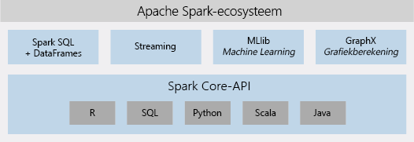

# Wat is Azure Databricks?

Azure Databricks is een Apache Spark gebaseerde analytics platform geoptimaliseerd voor het Microsoft Azure cloud services-platform. Met de grondleggers van Apache Spark ontworpen, is Databricks geïntegreerd met Azure met één klik instellen, gestroomlijnde werkstromen en een interactieve werkruimte waarmee u samenwerking tussen gegevenswetenschappers en gegevens engineers bedrijfsanalisten.

![Wat is Azure Databricks? ] (./media/what-is-azure-databricks/azure-databricks-overview.png "Wat is Azure Databricks?")

## Apache Spark gebaseerde analytics platform

Azure Databricks omvat de volledige open source Apache Spark-cluster technologieën en -mogelijkheden. Spark in Azure Databricks omvat de volgende onderdelen:

* **Spark SQL en DataFrames**: Spark SQL is de Spark-module voor het werken met gestructureerde gegevens. Een DataFrame is een gedistribueerde verzameling van gegevens die zijn ingedeeld in kolommen met een naam. Het is conceptueel gelijk is aan een tabel in een relationele database of een gegevensframe in R/Python.

* **Streaming**: realtime-gegevensverwerking en -analyse voor analytische en interactieve toepassingen. Kan worden geïntegreerd met HDFS, Flume en Kafka.

* **MLib**: die bestaat uit algemene learning-algoritmen en hulpprogramma's, met inbegrip van classificatie, regressie, clustering, samenwerking filteren, dimensionaliteit vermindering, evenals onderliggende optimalisatie primitieven Machine Learning-bibliotheek.

* **GraphX**: grafieken en berekeningen van een breed bereik van grafiek gebruiksvoorbeelden van cognitieve analytische gegevens te verkennen.

* **Spark Core API**: biedt ondersteuning voor R, SQL, Python, Scala en Java.

## Apache Spark in Azure Databricks

Azure Databricks bouwt voort op de mogelijkheden van Spark door een nul-management-cloudplatform omvat:

- Volledig beheerde Spark-clusters
- Een interactieve werkruimte exploratie-en visualisatie
- Een platform voor het aansturen van uw favoriete Spark-toepassingen

### Volledig beheerde Apache Spark-clusters in de cloud

Azure Databricks heeft een veilige en betrouwbare productie-omgeving in de cloud, beheerd en ondersteund door experts van Spark. U kunt:

* Clusters maken in seconden.
* Dynamisch automatisch schalen omhoog en omlaag-clusters zonder Server-clusters, waaronder en ze delen in teams. 
* Clusters programmatisch met behulp van de REST API's gebruiken. 
* Beveiligde gegevens integratiemogelijkheden gebouwd boven op Spark waarmee u kunt uw gegevens zonder centralisering verenigen gebruiken. 
* Directe toegang krijgen tot de nieuwste functies van Apache Spark van elke versie.

### Databricks Runtime
De Databricks Runtime is ingebouwd in Apache Spark en systeemeigen is gebouwd voor de Azure-cloud. 

Met de **zonder server** optie, Azure Databricks isoleert volledig uit de complexiteit van de infrastructuur en de noodzaak van gespecialiseerde kennis instellen en configureren van de gegevensinfrastructuur van uw. De optie zonder server helpt gegevens verzameld snel als een team herhalen.

Voor gegevens-engineers die geïnteresseerd zijn de prestaties van productietaken, biedt Azure Databricks een Spark-engine die sneller is en zodat via verschillende optimalisaties op het i/o-laag en de verwerking van laag (Databricks i/o-).

### Werkruimte voor samenwerking

Azure Databricks stroomlijnt via een samenwerking en geïntegreerde omgeving, het proces van het verkennen van gegevens en maken van een prototype actief gegevensgestuurde toepassingen in Spark.

* Bepalen hoe u gegevens met eenvoudige gegevensverkenning.
* Documenteer uw voortgang in notitieblokken in R, Python, Scala of SQL.
* Gegevens in een paar muisklikken visualiseren en vertrouwde hulpprogramma's zoals Matplotlib, ggoplot of d3 gebruiken.
* Interactieve dashboards gebruiken om dynamische rapporten te maken.
* Gebruik van Spark en interactie met de gegevens tegelijk.

## Enterprise-beveiliging

Azure Databricks biedt bedrijfsniveau Azure-beveiliging, waaronder Azure Active Directory-integratie, besturingselementen op basis van rollen en sla's die uw gegevens en uw bedrijf te beveiligen.

* Integratie met Azure Active Directory kunt u complete op basis van een Azure-oplossingen met behulp van Azure Databricks uitvoeren.
* Azure Databricks rollen gebaseerde toegang kunt fijnmazig gebruikersmachtigingen voor laptops, clusters, taken en gegevens.
* Bedrijfsniveau Sla's. 

## Integratie met Azure-services

Azure Databricks nauw worden geïntegreerd met Azure-databases en winkels: SQL Data Warehouse, Cosmos DB Data Lake Store en Blob Storage. 

## Integratie met Power BI
Dankzij uitgebreide integratie met Power BI kunt Azure Databricks u detecteren en uw indrukwekkende inzichten te delen snel en eenvoudig. U kunt ook andere BI-tools zoals Tableau Software via JDBC/ODBC cluster eindpunten.

## Volgende stappen

* [Snelstartgids: Een Spark-taak uitvoeren op Azure Databricks](quickstart-create-databricks-workspace-portal.md)
* [Werken met Spark-clusters](https://docs.azuredatabricks.net/user-guide/clusters/index.html)
* [Werken met laptops](https://docs.azuredatabricks.net/user-guide/notebooks/index.html)
* [Spark taken maken](https://docs.azuredatabricks.net/user-guide/jobs.html)

 

