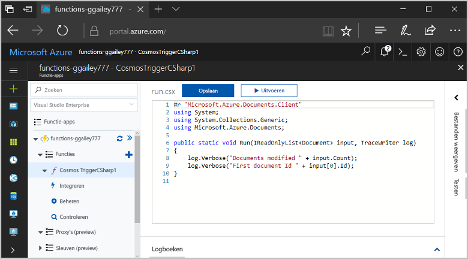
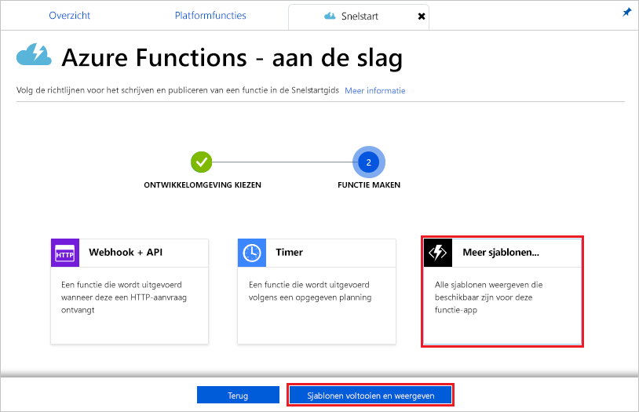
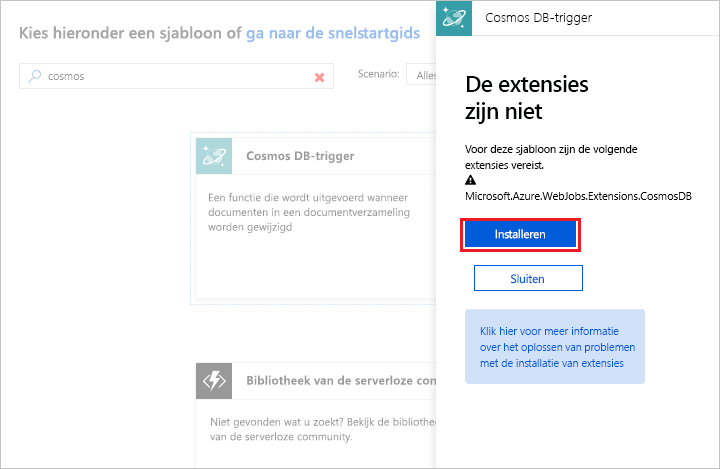
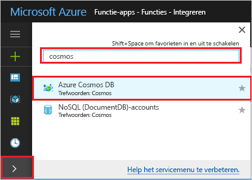
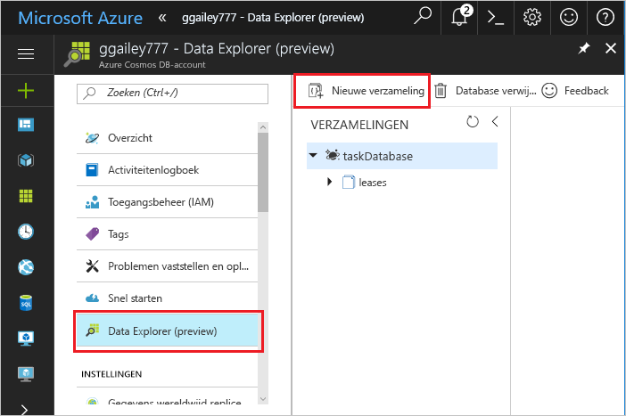

# Een door Azure Cosmos DB geactiveerde functie maken

Leer hoe u een functie maakt die wordt geactiveerd wanneer gegevens worden toegevoegd of gewijzigd in Azure Cosmos DB. Zie [Azure Cosmos DB: Serverless database computing using Azure Functions](..\cosmos-db\serverless-computing-database.md) (Azure Cosmos DB: database berekenen zonder server met Azure Functions) voor meer informatie over Azure Cosmos DB.

## Vereisten

Vereisten voor het voltooien van deze zelfstudie:

+ Als u nog geen abonnement op Azure hebt, maak dan een [gratis account](https://azure.microsoft.com/free/?WT.mc_id=A261C142F) aan voordat u begint.

> [!NOTE]
> [!INCLUDE [SQL API support only](../../includes/functions-cosmosdb-sqlapi-note.md)]

## Maak een Azure Cosmos DB-account

U moet een Azure Cosmos DB-account hebben dat gebruikmaakt van de SQL-API voordat u de trigger maakt.

[!INCLUDE [cosmos-db-create-dbaccount](../../includes/cosmos-db-create-dbaccount.md)]

## Een Azure-functie-app maken

[!INCLUDE [Create function app Azure portal](../../includes/functions-create-function-app-portal.md)]

Vervolgens maakt u een functie in de nieuwe functie-app.

## Een Azure Cosmos DB-trigger maken

1. Vouw de functie-app uit en klik op de knop **+** naast **Functies**. Als dit de eerste functie in de functie-app is, selecteert u **In de portal** en vervolgens **Doorgaan**. Anders gaat u verder met stap drie.

   

1. Kies **Meer sjablonen** en vervolgens **Voltooien en sjablonen weergeven**.

    

1. Typ `cosmos` in het zoekveld en kies vervolgens de sjabloon **Azure Cosmos DB-trigger**.

1. Als u hierom wordt gevraagd, selecteert u **Installeren** om de Azure Storage-extensie en alle eventuele afhankelijkheden in de functie-app te installeren. Wanneer de installatie is voltooid, selecteert u **Doorgaan**.

    

1. Configureer de nieuwe trigger met de instellingen zoals opgegeven in de tabel onder de afbeelding.

    

    | Instelling      | Voorgestelde waarde  | Beschrijving                                |
    | ------------ | ---------------- | ------------------------------------------ |
    | **Naam** | Standaard | Gebruik de standaardnaam voor de functie die wordt voorgesteld in de sjabloon.|
    | **Verbinding met het Azure Cosmos DB-account** | Nieuwe instelling | Selecteer **Nieuw** en kies vervolgens uw **abonnement**, het **Database-account** dat u eerder hebt gemaakt, en **Selecteren**. Hiermee maakt u een toepassingsinstelling voor uw accountverbinding. Deze instelling wordt gebruikt door de binding om verbinding te maken met de database. |
    | **Naam van verzameling** | Items | Naam van de verzameling die moet worden gecontroleerd. |
    | **Leaseverzameling maken als deze nog niet bestaat** | Geselecteerd | De verzameling bestaat nog niet, dus moet u deze maken. |
    | **Databasenaam** | Taken | Naam van de database met de verzameling die moet worden gecontroleerd. |

1. Klik op **Maken** om de door Azure Cosmos DB geactiveerde functie te maken. Nadat de functie is gemaakt, wordt de functiecode op basis van een sjabloon weergegeven.  

    

    Met deze functiesjabloon worden het aantal documenten en de eerste document-id naar de logboeken geschreven.

Vervolgens maakt u verbinding met het Azure Cosmos DB-account en maakt u de verzameling `Items` in de `Tasks`-database.

## De verzameling Items maken

1. Open een tweede exemplaar van [Azure Portal](https://portal.azure.com) op een nieuw tabblad in de browser.

1. Vouw aan de linkerkant van de portal de pictogrammenbalk uit, typ `cosmos` in het zoekveld en selecteer **Azure Cosmos DB**.

    

1. Kies uw Azure Cosmos DB-account en selecteer vervolgens **Data Explorer**. 

1. Kies in **Verzamelingen** de optie **taskDatabase**, en selecteer **Nieuwe verzameling**.

    

1. Gebruik in **Verzameling toevoegen** de instellingen die worden weergegeven in de tabel onder de afbeelding. 

    

    | Instelling|Voorgestelde waarde|Beschrijving |
    | ---|---|--- |
    | **Database-id** | Taken |De naam voor de nieuwe database. Dit moet overeenkomen met de naam die is gedefinieerd in de functiebinding. |
    | **Verzamelings-id** | Items | De naam voor de nieuwe verzameling. Dit moet overeenkomen met de naam die is gedefinieerd in de functiebinding.  |
    | **Opslagcapaciteit** | Vast (10 GB)|Gebruik de standaardwaarde. Deze waarde is de opslagcapaciteit van de database. |
    | **Doorvoer** |400 RU| Gebruik de standaardwaarde. U kunt de doorvoer later opschalen als u de latentie wilt beperken. |
    | **[Partitiesleutel](../cosmos-db/partition-data.md)** | /category|Een partitiesleutel waarmee gegevens gelijkmatig worden gedistribueerd naar elke partitie. Het is belangrijk dat u de juiste partitiesleutel selecteert bij het maken van een prestatieverzameling. | 

1. Klik op **OK** om de verzameling Items te maken. Het kan even duren voor de verzameling is gemaakt.

Nadat de verzameling die is opgegeven in de functiebinding, is gemaakt, kunt u de functie testen door documenten toe te voegen aan deze nieuwe verzameling.

## De functie testen

1. Vouw de nieuwe verzameling **taskCollection** uit in Data Explorer, kies **Documenten** en selecteer vervolgens **Nieuw document**.

    

1. Vervang de inhoud van het nieuwe document door de volgende inhoud en kies vervolgens **Opslaan**.

        {
            "id": "task1",
            "category": "general",
            "description": "some task"
        }

1. Schakel over naar het eerste browsertabblad dat de functie in de portal bevat. Vouw de functielogboeken uit en controleer of de functie is geactiveerd met behulp van het nieuwe document. U ziet nu dat de waarde voor de `task1`-document-id naar de logboeken is geschreven. 

    

1. (Optioneel) Ga terug naar het document, breng een wijziging aan en klik op **Bijwerken**. Ga vervolgens terug naar de functielogboeken en controleer of met de update ook de functie is geactiveerd.

## Resources opschonen

[!INCLUDE [Next steps note](../../includes/functions-quickstart-cleanup.md)]

## Volgende stappen

U hebt een functie gemaakt die wordt uitgevoerd wanneer een document wordt toegevoegd of gewijzigd in uw Azure Cosmos DB-account.

[!INCLUDE [Next steps note](../../includes/functions-quickstart-next-steps.md)]

Zie [Azure Cosmos DB bindings for Azure Functions](functions-bindings-cosmosdb.md) (Azure Cosmos DB-bindingen voor Azure Functions) voor meer informatie over Azure Cosmos DB-triggers.
