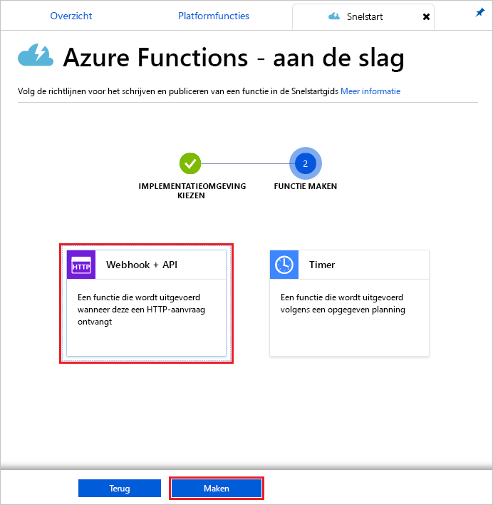

# Uw eerste Azure-functie maken
## Overzicht
Azure Functions is een gebeurtenisafhankelijke, compute-on-demand-ervaring die het bestaande Azure-toepassingsplatform uitbreidt met mogelijkheden voor het implementeren van code die wordt geactiveerd door gebeurtenissen in andere Azure-services, SaaS-producten en on-premises systemen. Met Azure Functions schalen uw toepassingen mee met uw behoeften en betaalt u alleen voor de resources die u gebruikt. U kunt Azure Functions gebruiken om geplande of geactiveerde code-eenheden te implementeren in diverse programmeertalen. Zie [Overzicht van Azure Functions](functions-overview.md) voor meer informatie.

In dit onderwerp wordt beschreven hoe u de snelstartgids voor Azure Functions in de portal kunt gebruiken voor het maken van een eenvoudige ‘hallo wereld’ Node.js-functie die wordt opgeroepen met een HTTP-trigger. U kunt ook een korte video bekijken om te zien hoe deze stappen worden uitgevoerd in de portal.

## Video bekijken
In de volgende video laten we zien hoe u de eenvoudige stappen in deze zelfstudie uitvoert. 

[!VIDEO https://channel9.msdn.com/Series/Windows-Azure-Web-Sites-Tutorials/Create-your-first-Azure-Function-simple/player]

## Een functie maken vanuit de snelstartgids
Een functie-app fungeert als host voor de uitvoering van uw functies in Azure. Volg deze stappen om een nieuwe functie-app en de nieuwe functie te maken. De nieuwe functie-app wordt gemaakt met een standaardconfiguratie. Zie [de andere snelstartzelfstudie voor het maken van Azure Functions](functions-create-first-azure-function-azure-portal.md) voor een expliciet voorbeeld van hoe u de functie-app maakt.

Voordat u uw eerste functie kunt maken, moet u een actief Azure-account hebben. Als u nog geen Azure-account hebt, zijn er [gratis accounts beschikbaar](https://azure.microsoft.com/free/).

1. Ga naar de [Azure Functions-portal](https://functions.azure.com/signin) en meld u aan met uw Azure-account.
2. Typ een unieke **Naam** voor uw nieuwe functie-app of accepteer de gegenereerde naam, selecteer de gewenste **Regio** en klik op **Create + get started**. 
3. Klik in het tabblad **Snelstartgids** op **WebHook en API** en op **JavaScript** en klik vervolgens op **Een functie maken**. Er wordt een nieuwe, vooraf gedefinieerde Node.js-functie gemaakt. 
   
    
4. (Optioneel) Op dit punt in de snelstartgids kunt u ervoor kiezen om een rondleiding te volgen over de Azure Functions-functionaliteit in de portal.   Wanneer u de rondleiding hebt voltooid of overgeslagen, kunt u de nieuwe functie testen met de HTTP-trigger.

## De functie testen
Omdat de Azure Functions-snelstartgidsen functionele code bevatten, kunt u uw nieuwe functie meteen testen.

1. Ga naar het tabblad **Develop** en bekijk het venster **Code**. U zult zien dat deze Node.js-code een HTTP-aanvraag verwacht met een waarde *name* die wordt doorgegeven in de berichttekst of in een queryreeks. Wanneer de functie wordt uitgevoerd, wordt deze waarde in het antwoordbericht geretourneerd.
   
    
2. Blader omlaag naar het tekstvak **Request body**, wijzig de waarde van de eigenschap *name* in uw naam en klik op **Run**. De uitvoering wordt geactiveerd door een HTTP-testaanvraag, informatie wordt geschreven naar de streaminglogboeken en het antwoord ‘hallo’ wordt weergegeven in de **Output**. 
3. Om de uitvoering van dezelfde functie te activeren vanuit een ander browservenster of tabblad, kopieert u de waarde **Function URL** in het tabblad **Develop** en plakt u die in de adresbalk van een browser. Voeg de queryreekswaarde `&name=yourname` toe en druk op enter. Dezelfde informatie wordt naar de logboeken geschreven en hetzelfde antwoord ‘hallo’ wordt in de browser weergegeven.

## Volgende stappen
Deze snelstartgids demonstreert een zeer eenvoudige uitvoering van een basisfunctie die door HTTP wordt geactiveerd. Zie de volgende onderwerpen voor meer informatie over het gebruik van de mogelijkheden van Azure Functions in uw apps.

* [Naslaginformatie over Azure Functions voor ontwikkelaars](functions-reference.md)  
  Naslaginformatie voor programmeurs over het coderen van functies en het definiëren van triggers en bindingen.
* [Azure Functions testen](functions-test-a-function.md)  
  Beschrijft de verschillende hulpprogramma’s en technieken voor het testen van uw functies.
* [Azure Functions schalen](functions-scale.md)  
  Beschrijft de serviceabonnementen die beschikbaar zijn voor Azure Functions, zoals het serviceabonnement Dynamic, en helpt u bij het kiezen van het juiste abonnement. 
* [Wat is Azure App Service?](../app-service/app-service-value-prop-what-is.md)  
  Azure Functions maakt gebruik van het Azure App Service-platform voor kernfunctionaliteit zoals implementaties, omgevingsvariabelen en diagnostische procedures. 

[!INCLUDE [Getting Started Note](../../includes/functions-get-help.md)]

<!--HONumber=Sep16_HO3-->

