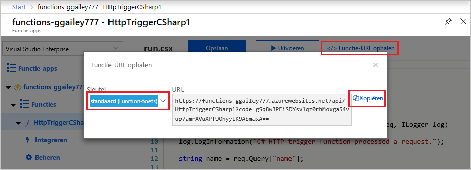

# Uw eerste functie maken in Azure Portal

Met Azure Functions kunt u uw code in een serverloze omgeving uitvoeren zonder dat u eerst een virtuele machine moet maken of een webtoepassing moet publiceren. In dit onderwerp leert u hoe met Azure Functions een 'Hallo wereld-functie' in Azure Portal kunt maken.

[!INCLUDE [quickstarts-free-trial-note](../../includes/quickstarts-free-trial-note.md)]

## Meld u aan bij Azure.

Meld u aan bij [Azure Portal](https://portal.azure.com/).

## Een functie-app maken

U moet een functie-app hebben die als host fungeert voor de uitvoering van uw functies. Met een functie-app kunt u functies groeperen in een logische eenheid, zodat u resources eenvoudiger kunt beheren, implementeren en delen. 

[!INCLUDE [Create function app Azure portal](../../includes/functions-create-function-app-portal.md)]

[!INCLUDE [functions-portal-favorite-function-apps](../../includes/functions-portal-favorite-function-apps.md)]

Vervolgens maakt u een functie in de nieuwe functie-app.

## Een door HTTP geactiveerde functie maken

1. Vouw de nieuwe functie-app uit en klik vervolgens op de knop  **+**  naast **Functies**.

2.  Selecteer op de pagina **Ga snel aan de slag** de optie **WebHook + API**, kies een taal voor uw functie en klik op **Deze functie maken**. 
   
    

Een functie wordt gemaakt in de door u gekozen taal met de sjabloon voor een door HTTP geactiveerde functie. U kunt de nieuwe functie uitvoeren door een HTTP-aanvraag te verzenden.

## De functie testen

1. Klik in de nieuwe functie op **</> Functie-URL ophalen**, selecteer **Standaard (functietoets)** en klik vervolgens op **Kopieer**. 

    

2. Plak de URL van de functie in de adresbalk van uw browser. Voeg de queryreeks `&name=<yourname>` toe aan het einde van deze URL en druk op de toets `Enter` op het toetsenbord om de aanvraag uit te voeren. Hier ziet u een voorbeeld van het antwoord dat wordt geretourneerd door de functie in de Edge-browser:

    

    De aanvraag-URL bevat een sleutel die standaard is vereist, en waarmee u via HTTP toegang hebt tot de functie.   

## De functielogboeken weergeven 

Wanneer uw functie wordt uitgevoerd, wordt traceringsinformatie naar de logboeken geschreven. Als u de trace-uitvoer van de vorige uitvoering wilt zien, gaat u terug naar de functie in de portal en klikt u op de pijl-omhoog onder aan het scherm om de **logboeken** uit te klappen. 

## Resources opschonen

[!INCLUDE [Clean up resources](../../includes/functions-quickstart-cleanup.md)]

## Volgende stappen

U hebt een functie-app met een eenvoudige door HTTP geactiveerde functie gemaakt.  

[!INCLUDE [Next steps note](../../includes/functions-quickstart-next-steps.md)]

Zie [Azure Functions HTTP and webhook bindings](functions-bindings-http-webhook.md) (Azure Functions-HTTP- en webhookbindingen) voor meer informatie.

