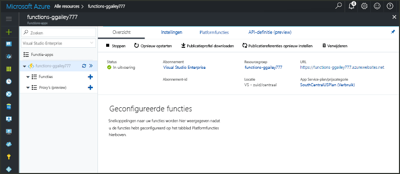

# Een door een GitHub-webhook geactiveerde functie maken

Ontdek hoe u een functie maakt die wordt geactiveerd door een HTTP-webhookaanvraag met een specifieke GitHub-nettolading.

## Vereisten

+ Een GitHub-account met ten minste één project.
+ Een Azure-abonnement. Als u nog geen abonnement hebt, maakt u een [gratis account](https://azure.microsoft.com/free/?WT.mc_id=A261C142F) voordat u begint.

## Een Azure-functie-app maken

[!INCLUDE [Create function app Azure portal](../../includes/functions-create-function-app-portal.md)]

Vervolgens maakt u een functie in de nieuwe functie-app.

## Een door een GitHub-webhook geactiveerde functie maken

1. Vouw de functie-app uit en klik op de knop **+** naast **Functies**. Als dit de eerste functie in de functie-app is, selecteert u **Aangepaste functie**. U ziet nu de volledige set het functiesjablonen.

    

2. Typ `github` in het zoekveld en kies vervolgens de gewenste taal voor de trigger-sjabloon voor de GitHub-webhook. 

      

2. Typ een **Naam** voor de functie en selecteer vervolgens **Maken**. 

      

3. Klik in de nieuwe functie op **</> Functie-URL ophalen**, kopieer de waarden en sla deze op. Doe hetzelfde voor **</> GitHub-geheim ophalen**. U hebt deze waarden nodig voor het configureren van de webhook in GitHub.

    

Vervolgens maakt u een webhook in uw GitHub-opslagplaats.

## De webhook configureren

1. Navigeer naar een van uw opslagplaatsen in GitHub. U kunt ook een opslagplaats gebruiken die u hebt gesplitst. Gebruik <https://github.com/Azure-Samples/functions-quickstart> als u een fork van een opslagplaats wilt maken.

2. Kies **Instellingen** > **Opties** en zorg ervoor dat **Problemen** onder **Functies** is ingeschakeld.

   

1. Kies in **Instellingen** voor **Webhooks** > **Webhook toevoegen**.

    

1. Gebruik de instellingen zoals die in de volgende tabel zijn opgegeven en klik vervolgens op **Webhook toevoegen**:

    

| Instelling | Voorgestelde waarde | Beschrijving |
|---|---|---|
| **URL van de nettolading** | Gekopieerde waarde | Gebruik de waarde die wordt geretourneerd door **</> Functie-URL ophalen**. |
| **Inhoudstype** | application/json | De functie verwacht een JSON-nettolading. |
| **Geheim**   | Gekopieerde waarde | Gebruik de waarde die wordt geretourneerd door **</> GitHub-geheim ophalen**. |
| Gebeurtenistriggers | Ik wil afzonderlijke gebeurtenissen selecteren | We willen alleen activeren bij gebeurtenissen met een opmerking bij actie van het item.  |
| | Opmerking bij actie item |  |

Nu is de webhook zo geconfigureerd dat de functie wordt geactiveerd wanneer er een nieuwe probleemopmerking wordt toegevoegd.

## De functie testen

1. Open in uw GitHub-opslagplaats het tabblad **Problemen** in een nieuw browservenster.

1. Klik in het nieuwe venster op **Nieuw probleem**, voer een titel in en klik op **Nieuw probleem verzenden**.

1. Typ een opmerking bij probleem en klik op **Opmerking**.

    

1. Ga terug naar de portal en bekijk de logboeken. Hier ziet u een traceervermelding met de tekst van de nieuwe opmerking.

     

## Resources opschonen

[!INCLUDE [Next steps note](../../includes/functions-quickstart-cleanup.md)]

## Volgende stappen

U hebt een functie gemaakt die wordt geactiveerd wanneer een aanvraag wordt ontvangen van een GitHub-webhook.

[!INCLUDE [Next steps note](../../includes/functions-quickstart-next-steps.md)]

Zie [Azure Functions HTTP and webhook bindings](functions-bindings-http-webhook.md) (Azure Functions-HTTP- en webhookbindingen) voor meer informatie over webhooktriggers.
