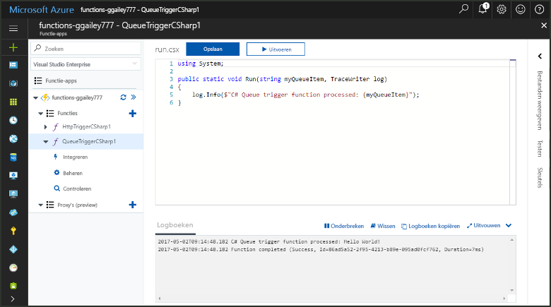
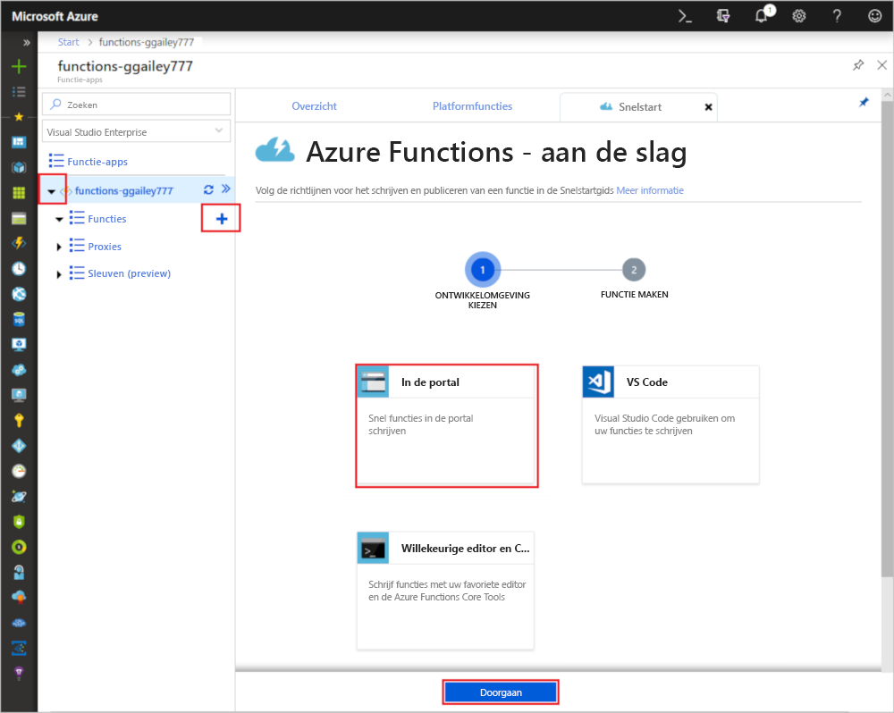
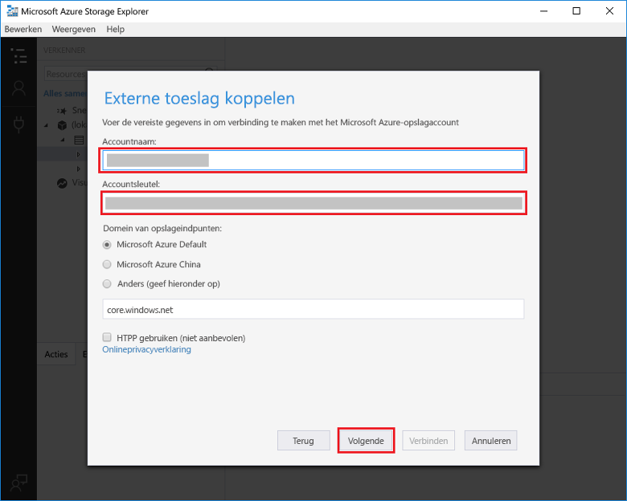
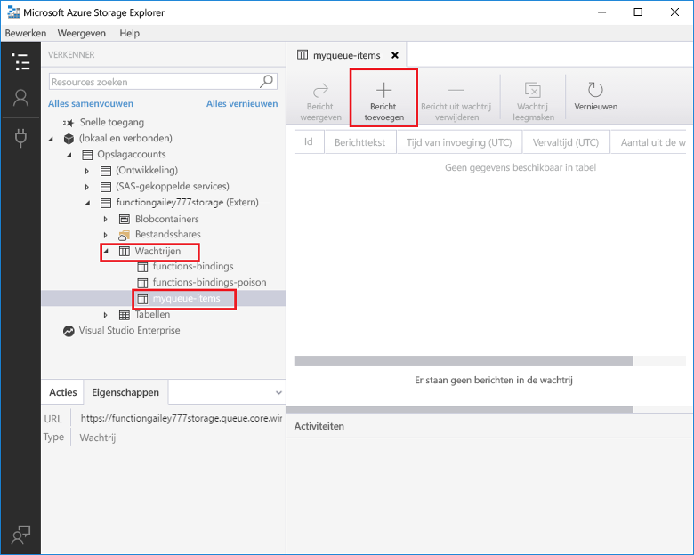

# Een door Azure Queue Storage geactiveerde functie maken

Ontdek hoe u een functie maakt die wordt geactiveerd wanneer er berichten worden verzonden naar een Azure Storage-wachtrij.

## Vereisten

- De [Microsoft Azure Storage Explorer](http://storageexplorer.com/) downloaden en installeren.

- Een Azure-abonnement. Als u nog geen abonnement hebt, maakt u een [gratis account](https://azure.microsoft.com/free/?WT.mc_id=A261C142F) voordat u begint.

## Een Azure-functie-app maken

[!INCLUDE [Create function app Azure portal](../../includes/functions-create-function-app-portal.md)]

Vervolgens maakt u een functie in de nieuwe functie-app.

## Een door een wachtrij geactiveerde functie maken

1. Vouw de functie-app uit en klik op de knop **+** naast **Functies**. Als dit de eerste functie in de functie-app is, selecteert u **In de portal** en vervolgens **Doorgaan**. Anders gaat u naar stap 3.

   

1. Kies **Meer sjablonen** en vervolgens **Voltooien en sjablonen weergeven**.

    

1. Typ `queue` in het zoekveld en kies vervolgens de sjabloon **Wachtrijtrigger**.

1. Als u hierom wordt gevraagd, selecteert u **Installeren** om de Azure Storage-extensie en alle eventuele afhankelijkheden in de functie-app te installeren. Wanneer de installatie is voltooid, selecteert u **Doorgaan**.

    

1. Gebruik de instellingen zoals opgegeven in de tabel onder de afbeelding.

    

    | Instelling | Voorgestelde waarde | Beschrijving |
    |---|---|---|
    | **Naam** | Uniek in uw functie-app | Naam van deze door een wachtrij geactiveerde functie. |
    | **Wachtrijnaam**   | myqueue-items    | De naam van de wachtrij waarmee u verbinding moet maken in uw opslagaccount. |
    | **Opslagaccountverbinding** | AzureWebJobStorage | U kunt de opslagaccountverbinding gebruiken die al door de functie-app wordt gebruikt of u kunt een nieuwe maken.  |    

1. Klik op **Maken** om de functie te maken.

Vervolgens maakt u verbinding met uw Azure Storage-account en maakt u de opslagwachtrij **myqueue-items**.

## De wachtrij maken

1. Klik in de functie op **Integreren**, vouw **Documentatie** uit en kopieer de **Accountnaam** en de **Accountsleutel**. Met deze referenties kunt u verbinding maken met het opslagaccount in Azure Storage Explorer. Als u uw opslagaccount al hebt verbonden, gaat u naar stap 4.

    

1. Voer het hulpprogramma [Microsoft Azure Storage Explorer](http://storageexplorer.com/) uit, klik op het verbindingspictogram aan de linkerkant, kies **Een opslagaccountnaam en -sleutel gebruiken** en klik op **Volgende**.

    

1. Voer de **Accountnaam** en de **Accountsleutel** van stap 1 in. Klik op **Volgende** en vervolgens op **Verbinding maken**.

    

1. Vouw het gekoppelde opslagaccount uit. Klik met de rechtermuisknop op **Wachtrijen**, klik op **Wachtrij maken**, typ `myqueue-items` en druk vervolgens op Enter.

    

Nu u een opslagwachtrij hebt, kunt u de functie testen door een bericht toe te voegen aan de wachtrij.

## De functie testen

1. Blader in Azure Portal naar de functie, vouw de **Logboeken** onder aan de pagina uit en controleer of logboekstreaming niet is onderbroken.

1. Vouw in Storage Explorer uw opslagaccount, **Wachtrijen** en **myqueue-items** uit en klik vervolgens op **Bericht toevoegen**.

    

1. Typ uw "Hallo wereld"- bericht in **Berichttekst** en klik op **OK**.

1. Wacht een paar seconden en ga vervolgens terug naar de functielogboeken en controleer of het nieuwe bericht is gelezen.

    

1. Klik in Storage Explorer op **Vernieuwen** en controleer of het bericht is verwerkt en niet langer in de wachtrij staat.

## Resources opschonen

[!INCLUDE [Next steps note](../../includes/functions-quickstart-cleanup.md)]

## Volgende stappen

U hebt een functie gemaakt die wordt uitgevoerd wanneer er een bericht wordt toegevoegd aan een opslagwachtrij.

[!INCLUDE [Next steps note](../../includes/functions-quickstart-next-steps.md)]

Zie [Azure Functions Storage queue bindings](functions-bindings-storage-queue.md) (Opslagwachtrijbindingen van Azure Functions) voor meer informatie over activeringen van Queue Storage.
