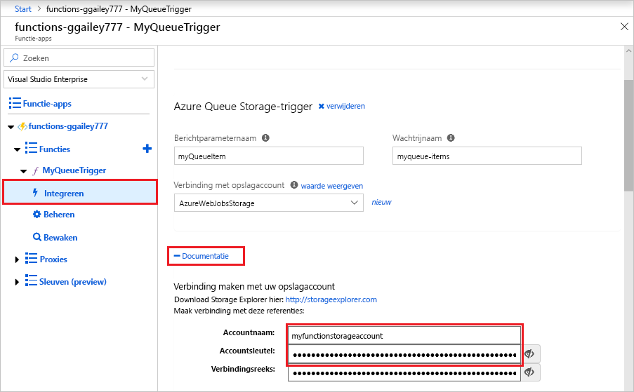

# Een door Azure Queue Storage geactiveerde functie maken

Ontdek hoe u een functie maakt die wordt geactiveerd wanneer er berichten worden verzonden naar een Azure Storage-wachtrij.

Het doorlopen van de stappen in dit onderwerp kost u minder dan vijf minuten.

## Vereisten

Voordat u dit voorbeeld kunt uitvoeren moet u ervoor zorgen dat u het volgende hebt gedaan:

- De [Microsoft Azure Storage Explorer](http://storageexplorer.com/) downloaden en installeren.

Als u nog geen abonnement op Azure hebt, maak dan een [gratis account](https://azure.microsoft.com/free/?WT.mc_id=A261C142F) aan voordat u begint.

[!INCLUDE [functions-portal-favorite-function-apps](../../includes/functions-portal-favorite-function-apps.md)]

## Een Azure-functie-app maken

[!INCLUDE [Create function app Azure portal](../../includes/functions-create-function-app-portal.md)]

Vervolgens maakt u een functie in de nieuwe functie-app.

## Een door een wachtrij geactiveerde functie maken

Vouw uw functie-app uit, klik op de knop **+** naast **Functies** en klik op de sjabloon **QueueTrigger** voor de gewenste taal. Gebruik vervolgens de instellingen zoals die in de tabel zijn opgegeven en klik op **Maken**.

| Instelling | Voorgestelde waarde | Beschrijving |
|---|---|---|
| **Wachtrijnaam**   | myqueue-items    | De naam van de wachtrij waarmee u verbinding moet maken in uw opslagaccount. |
| **Opslagaccountverbinding** | AzureWebJobStorage | U kunt de opslagaccountverbinding gebruiken die al door de functie-app wordt gebruikt of u kunt een nieuwe maken.  |
| **Een naam voor de functie opgeven** | Uniek in uw functie-app | Naam van deze door een wachtrij geactiveerde functie. |

Vervolgens maakt u verbinding met uw Azure Storage-account en maakt u de opslagwachtrij **myqueue-items**.

## De wachtrij maken

1. Klik in de functie op **Integreren**, vouw **Documentatie** uit en kopieer de **Accountnaam** en de **Accountsleutel**. Met deze referenties kunt u verbinding maken met het opslagaccount. Als u uw opslagaccount al hebt verbonden, gaat u naar stap 4.

    v

1. Voer het hulpprogramma [Microsoft Azure Storage Explorer](http://storageexplorer.com/) uit, klik op het verbindingspictogram aan de linkerkant, kies **Een opslagaccountnaam en -sleutel gebruiken** en klik op **Volgende**.

    

1. Voer de **Accountnaam** en de **Accountsleutel** van stap 1 in. Klik op **Volgende** en vervolgens op **Verbinding maken**.

    

1. Vouw het gekoppelde opslagaccount uit. Klik met de rechtermuisknop op **Wachtrijen**, klik op **Wachtrij maken**, typ `myqueue-items` en druk op Enter.

    

Nu u een opslagwachtrij hebt, kunt u de functie testen door een bericht toe te voegen aan de wachtrij.

## De functie testen

1. Blader in Azure Portal naar de functie, vouw de **Logboeken** onderaan de pagina uit en zorg ervoor dat logboekstreaming niet wordt onderbroken.

1. Vouw in Storage Explorer uw opslagaccount, **Wachtrijen** en **myqueue-items** uit en klik vervolgens op **Bericht toevoegen**.

    

1. Typ uw "Hallo wereld"- bericht in **Berichttekst** en klik op **OK**.

1. Wacht een paar seconden en ga vervolgens terug naar de functielogboeken en controleer of het nieuwe bericht is gelezen.

    

1. Klik in Storage Explorer op **Vernieuwen** en controleer of het bericht is verwerkt en niet langer in de wachtrij staat.

## Resources opschonen

[!INCLUDE [Next steps note](../../includes/functions-quickstart-cleanup.md)]

## Volgende stappen

U hebt een functie gemaakt die wordt uitgevoerd wanneer er een bericht wordt toegevoegd aan een opslagwachtrij.

[!INCLUDE [Next steps note](../../includes/functions-quickstart-next-steps.md)]

Zie [Azure Functions Storage queue bindings](functions-bindings-storage-queue.md) (Opslagwachtrijbindingen van Azure Functions) voor meer informatie over activeringen van Queue Storage.
