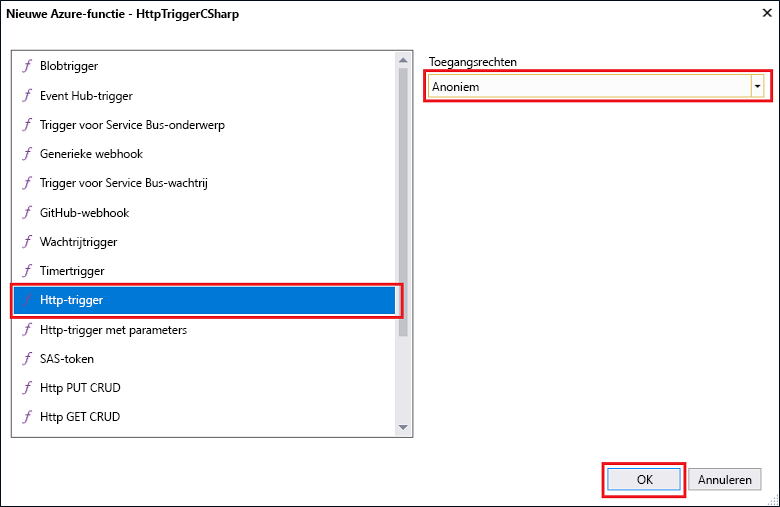

# Uw eerste functie maken met Visual Studio

Met Azure Functions kunt u uw code in een [serverloze](https://azure.microsoft.com/overview/serverless-computing/) omgeving uitvoeren zonder dat u eerst een virtuele machine moet maken of een webtoepassing moet publiceren.

> [!VIDEO https://www.youtube-nocookie.com/embed/DrhG-Rdm80k]

In dit onderwerp leert u hoe u met de Visual Studio 2017-hulpprogramma’s voor Azure Functions lokaal een Hallo wereld-functie kunt maken en testen. Vervolgens publiceert u de functiecode op Azure. Deze hulpprogramma's zijn beschikbaar als onderdeel van de Azure-ontwikkelworkload in Visual Studio 2017 versie 15.3 of een latere versie.

## Vereisten

Voor deze zelfstudie installeert u het volgende:

* [Visual Studio 2017 versie 15.4](https://www.visualstudio.com/vs/) of een latere versie, waaronder de **Azure-ontwikkelworkload**.

    
    
[!INCLUDE [quickstarts-free-trial-note](../../includes/quickstarts-free-trial-note.md)] 

## Een Azure Functions-project in Visual Studio maken

[!INCLUDE [Create a project using the Azure Functions template](../../includes/functions-vstools-create.md)]

Nu u het project hebt gemaakt, kunt u uw eerste functie maken.

## De functie maken

1. Klik in **Solution Explorer** met de rechtermuisknop op het projectknooppunt en selecteer  > **Nieuw item****Toevoegen**. Selecteer **Azure-functie**, voer `HttpTriggerCSharp.cs` in als **Naam** in en klik op **Toevoegen**.

2. Selecteer **HttpTrigger**, selecteer bij **Toegangsrechten** de optie **Anoniem** en klik op **OK**. De gemaakte functie wordt geopend door een HTTP-aanvraag vanaf een client. 

    

    Er wordt een codebestand toegevoegd aan het project met daarin een klasse waarmee de functiecode wordt geïmplementeerd. Deze code is gebaseerd op een sjabloon waarmee een naamwaarde wordt geretourneerd en teruggestuurd. Met het kenmerk **FunctionName** wordt de naam van de functie ingesteld. Met het kenmerk **HttpTrigger** wordt het bericht aangegeven dat de functie activeert. 

    

Nu u een HTTP-geactiveerde-functie hebt gemaakt, kunt u deze testen op uw lokale computer.

## De functie lokaal testen

Met Azure Functions Core-hulpprogramma's kunt u Azure Functions-projecten uitvoeren op uw lokale ontwikkelcomputer. De eerste keer dat u een functie vanuit Visual Studio start, wordt u gevraagd deze hulpprogramma's te installeren.  

1. Druk op F5 om de functie testen. Accepteer desgevraagd de aanvraag van Visual Studio om Azure Functions Core (CLI)-hulpprogramma's te downloaden en installeren.  Mogelijk moet u ook een firewall-uitzondering inschakelen, zodat de hulpprogramma's HTTP-aanvragen kunnen afhandelen.

2. Kopieer de URL van uw functie vanuit de uitvoer van de Azure Functions-runtime.  

    

3. Plak de URL van de HTTP-aanvraag in de adresbalk van uw browser. Voeg de queryreeks `?name=<yourname>` toe aan de URL en voer de aanvraag uit. Hieronder ziet u de reactie op de lokale GET-aanvraag die door de functie wordt geretourneerd, weergegeven in de browser: 

    

4. Als u de foutopsporing wilt stoppen, klikt u op de knop **Stop** op de werkbalk van Visual Studio.

Nadat u hebt gecontroleerd of de functie correct wordt uitgevoerd op uw lokale computer, is het tijd om het project te publiceren naar Azure.

## Het project naar Azure publiceren

Voordat u uw project kunt publiceren, moet u een functie-app in uw Azure-abonnement hebben. U kunt rechtstreeks vanuit Visual Studio een functie-app maken.

[!INCLUDE [Publish the project to Azure](../../includes/functions-vstools-publish.md)]

## Uw functie testen in Azure

1. Kopieer de basis-URL van de functie-app van de pagina Profiel publiceren. Vervang het `localhost:port`-deel van de URL dat u hebt gebruikt bij het lokaal testen van de functie door de nieuwe basis-URL. Zorg ervoor dat u net als eerder de queryreeks `?name=<yourname>` toevoegt aan de URL en de aanvraag uitvoert.

    De URL die uw HTTP-geactiveerde functie aanroept, ziet er als volgt uit:

        http://<functionappname>.azurewebsites.net/api/<functionname>?name=<yourname> 

2. Plak deze nieuwe URL van de HTTP-aanvraag in de adresbalk van uw browser. Hieronder ziet u het antwoord op de externe GET-aanvraag dat door de functie wordt geretourneerd, weergegeven in de browser: 

    
 
## Volgende stappen

U hebt een C#-functie-app met een eenvoudige HTTP-geactiveerde functie gemaakt in Visual Studio. 

+ Zie [Het project configureren voor lokale ontwikkeling](functions-develop-vs.md#configure-the-project-for-local-development) in de sectie [Azure Functions-tools voor Visual Studio](functions-develop-vs.md) voor meer informatie over het configureren van uw project ter ondersteuning van andere soorten triggers en bindingen.
+ Zie voor meer informatie over het lokale testen en foutopsporing met behulp van de Azure Functions Core Tools, [Code and test Azure Functions locally](functions-run-local.md). 
+ Zie [Using .NET class libraries with Azure Functions](functions-dotnet-class-library.md) (.NET-klassebibliotheken gebruiken met Azure Functions) voor meer informatie over het ontwikkelen van functies als .NET-klassebibliotheken. 

