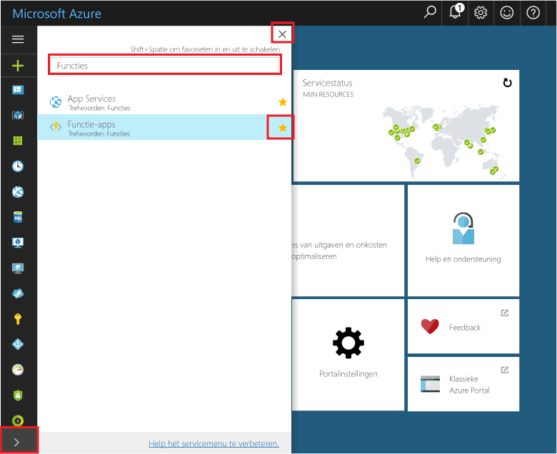
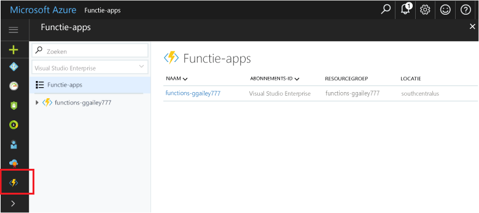

# Het beheren van een functie-app in de Azure portal 

In de Azure Functions biedt een functie-app de uitvoeringscontext voor uw afzonderlijke functies. De functie app-gedrag van toepassing op alle functies die worden gehost door een bepaalde functie-app. In dit onderwerp wordt beschreven hoe configureren en beheren van uw apps functie in de Azure-portal.

Om te beginnen, gaat u naar de [Azure-portal](http://portal.azure.com) en meld u aan bij uw Azure-account. Typ de naam van uw functie-app in de zoekbalk boven in de portal en selecteer deze in de lijst. Na het selecteren van de functie-app, ziet u de volgende pagina:

## Favoriete functies in de portal 

Kan worden soms moeilijk te vinden van uw resources in de [Azure-portal]. Gemakkelijker te vinden van de functie-apps die u hebt gemaakt, toevoegen functie Apps aan uw Favorieten in de portal. 

1. Meld u aan bij [Azure-portal].

2. Klik op de pijl linksonder om alle services uit te vouwen, typ `Functions` in het veld **Filter** en klik vervolgens op de ster naast **Functie-apps**.  
 
    

    Hiermee wordt het pictogram Functies toegevoegd aan het menu aan de linkerkant van de portal.

3. Sluit het menu en scrol omlaag naar het pictogram Functies. Klik op dit pictogram om een lijst met al uw functie-apps weer te geven. Klik op uw functie-app om met functies in deze app te werken. 
 
    
 
[Azure-portal]: https://portal.azure.com/

## Tabblad voor de functie app-instellingen

De **instellingen** tabblad is waarin u de functies runtime-versie die wordt gebruikt door de functie-app kunt bijwerken. Het is ook waar u de sleutels van de host gebruikt voor het beperken van HTTP-toegang tot alle functies die worden gehost door de functie-app beheren.

Functies ondersteunt zowel verbruik die als host fungeert als App Service-hostingplannen. Zie voor meer informatie [Kies de juiste service-abonnement voor Azure Functions](functions-scale.md). Voor betere voorspelbaarheid in het plan verbruik functies kunt u platform-gebruik beperken door een dagelijkse gebruiksquotum instellen in gigabytes seconden. Zodra de dagelijkse gebruiksquotum is bereikt, wordt de functie-app is gestopt. Een functie-app gestopt als gevolg van de quota voor bestedingslimiet bereikt kan opnieuw worden ingeschakeld vanuit de context hetzelfde als het tot stand brengen van de dagelijkse quotum uitgaven zijn. Zie de [Azure Functions pagina met prijzen](http://azure.microsoft.com/pricing/details/functions/) voor meer informatie over de facturering.   

## Tabblad voor platform-onderdelen

Functie apps in uitgevoerd en worden beheerd, door de Azure App Service-platform. Als zodanig hebben uw functie apps toegang tot de meeste van de functies van Azure core webhosting-platform. De **platformfuncties** tabblad is waar u de vele nieuwe functies van de App Service-platform die u in uw apps functie gebruiken kunt toegang. 

> [!NOTE]
> Niet alle App Service-functies zijn beschikbaar wanneer een functie-app wordt uitgevoerd op het verbruik hosting-plan.

De rest van dit onderwerp richt zich op de volgende App Service-functies in de Azure-portal die handig voor functies zijn:

+ [App Service editor](#editor)
+ [Toepassingsinstellingen](#settings) 
+ [Console](#console)
+ [Geavanceerde tools (Kudu)](#kudu)
+ [Implementatie-opties](#deployment)
+ [CORS](#cors)
+ [Verificatie](#auth)
+ [API-definitie](#swagger)

Zie voor meer informatie over het werken met App Service-instellingen, [Azure App Service-instellingen configureren](../app-service/web-sites-configure.md).

### App Service Editor

| | |
|-|-|
|   | De App Service-editor is een geavanceerde in de portal-editor die u gebruiken kunt om JSON-configuratiebestanden en codebestanden die met te wijzigen. Als u deze optie kiest, wordt een afzonderlijke browsertabblad met een basic-editor gestart. Hiermee kunt u integreren met de Git-opslagplaats, uitvoeren en foutopsporing van code en de functie app-instellingen wijzigen. Deze editor biedt een verbeterde development environment voor uw functies vergeleken met de standaardblade voor de functie-app.    |

### Toepassingsinstellingen

| | |
|-|-|
|  | De App Service **toepassingsinstellingen** blade is waar u configureren en beheren van de framework-versies, foutopsporing op afstand, app-instellingen en verbindingsreeksen. Wanneer u de functie-app met andere Azure en services van derden integreren, kunt u deze instellingen hier wijzigen. Als u wilt verwijderen van een instelling, schuif naar rechts en selecteer de **X** pictogram aan de rechterkant van de regel (niet weergegeven in de volgende afbeelding).

### Console

| | |
|-|-|
|  | De console in de portal is een hulpprogramma developer ideaal als u liever om te communiceren met de functie-app vanaf de opdrachtregel. Veelgebruikte opdrachten zijn directory en maken van het bestand en navigatie, evenals batch-bestanden en scripts uitvoeren. |

### Geavanceerde tools (Kudu)

| | |
|-|-|
|  | De geavanceerde hulpprogramma's voor App Service (ook wel bekend als Kudu) bieden toegang tot geavanceerde beheerfuncties van uw app in de functie. U beheert van kudu bovendien, systeemgegevens, app-instellingen, omgevingsvariabelen, site-uitbreidingen, HTTP-headers en servervariabelen. U kunt ook starten **Kudu** door te bladeren naar het eindpunt SCM voor uw app in de functie, zoals `https://<myfunctionapp>.scm.azurewebsites.net/` |

### <a name="deployment">Implementatie-opties

| | |
|-|-|
|  | Functies kunt u uw functiecode op uw lokale machine ontwikkelen. Vervolgens kunt u uw lokale functie app-project uploaden naar Azure. Naast het uploaden van de traditionele FTP-functies kunt u een functie-app met populaire continue integratie-oplossingen zoals GitHub, VSTS Dropbox, Bitbucket en anderen implementeren. Zie voor meer informatie [continue implementatie voor Azure Functions](functions-continuous-deployment.md). Als u wilt uploaden handmatig met behulp van FTP- of lokale Git, moet u ook [configureren van de referenties voor uw implementatie](functions-continuous-deployment.md#credentials). |

### CORS

| | |
|-|-|
|  | Om te voorkomen dat schadelijke code wordt uitgevoerd in uw services, blokkeert App Service aanroepen naar uw apps functie van externe bronnen. Functies biedt ondersteuning voor cross-origin-resource delen (CORS) zodat u het definiëren van een 'whitelist' toegestane oorsprongen waarvan van uw functies kunnen externe aanvragen accepteert.  |

### Verificatie

| | |
|-|-|
|  | Wanneer functies een HTTP-trigger gebruikt, kunt u vereisen aanroepen voor het eerst worden geverifieerd. App Service biedt ondersteuning voor Azure Active Directory-verificatie en meld u aan met sociale providers, zoals Microsoft, Facebook en Twitter. Zie voor meer informatie over het configureren van specifieke verificatieproviders [overzicht van Azure App Service-authenticatie](../app-service/app-service-authentication-overview.md). |

### API-definitie

| | |
|-|-|
|  | Functies biedt ondersteuning voor Swagger wilt toestaan dat clients eenvoudiger uw HTTP-geactiveerde functies gebruiken. Bezoek voor meer informatie over het maken van API-definities met Swagger [Host een RESTful-API met CORS in Azure App Service](../app-service/app-service-web-tutorial-rest-api.md). U kunt ook functies proxy's gebruiken voor het definiëren van een één API-gebied voor meerdere functies. Zie voor meer informatie [werken met Azure Functions-proxy's](functions-proxies.md). |

## Volgende stappen

+ [Azure App Service-instellingen configureren](../app-service/web-sites-configure.md)
+ [Doorlopende implementatie voor Azure Functions](functions-continuous-deployment.md)

