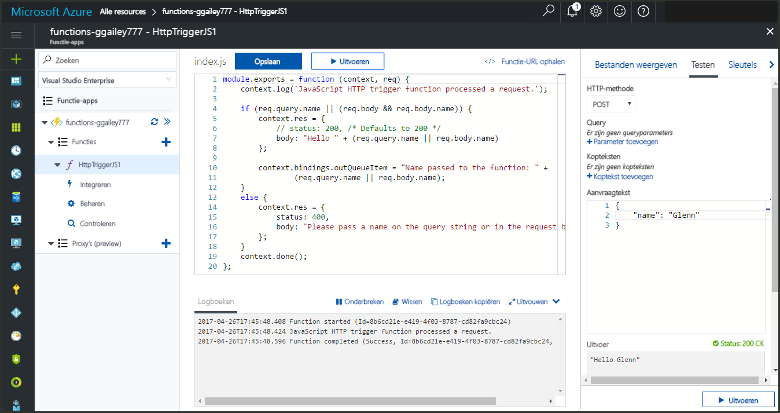
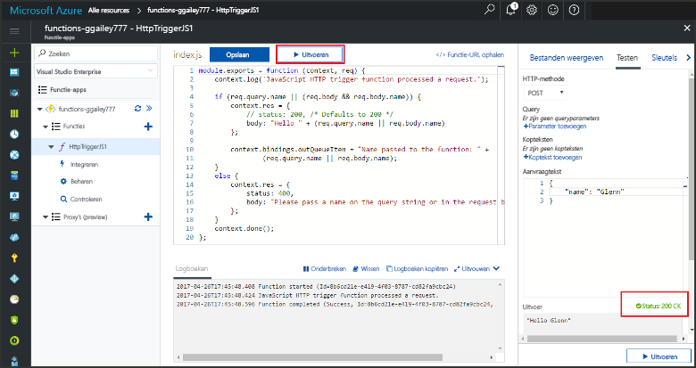
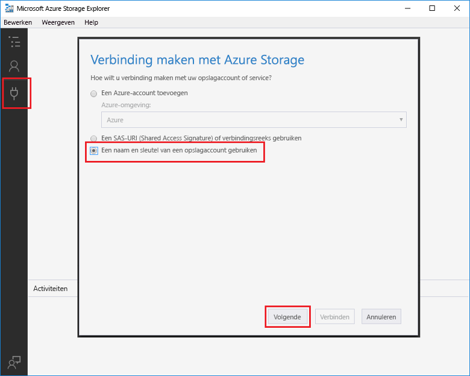
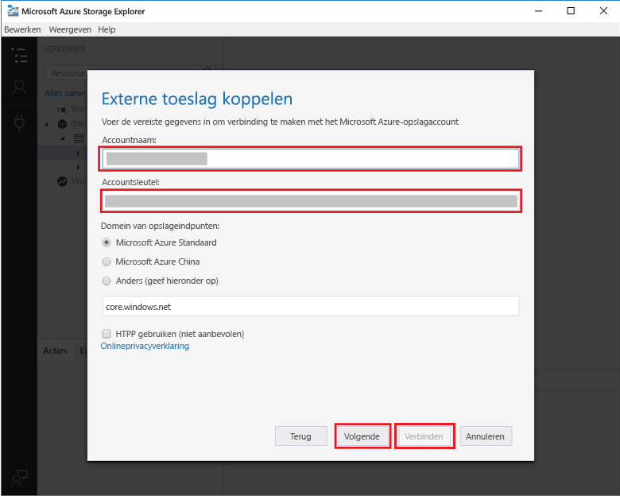

# <a name="add-messages-to-an-azure-storage-queue-using-functions"></a>Berichten aan een Azure Storage-wachtrij toevoegen met behulp van Functions

In Azure Functions bieden invoer- en uitvoerbindingen een verklarende manier om verbinding te maken met externe servicegegevens vanuit uw functie. In dit onderwerp vindt u informatie over hoe u een bestaande functie kunt bijwerken door een uitvoerbinding toe te voegen waarmee u berichten naar Azure Queue Storage verzendt.  



## <a name="prerequisites"></a>Vereisten 

[!INCLUDE [Previous topics](../../includes/functions-quickstart-previous-topics.md)]

* [Microsoft Azure Storage Explorer](http://storageexplorer.com/) installeren.

## <a name="add-binding"></a>Een uitvoerbinding toevoegen
 
1. Vouw de functie-app en de functie uit.

2. Selecteer **Integreren** en **+ Nieuwe uitvoer**. Selecteer vervolgens **Azure Queue Storage** en selecteer **Selecteren**.
    
    

3. Gebruik de instellingen zoals opgegeven in de tabel: 

    

    | Instelling      |  Voorgestelde waarde   | Beschrijving                              |
    | ------------ |  ------- | -------------------------------------------------- |
    | **Wachtrijnaam**   | myqueue-items    | De naam van de wachtrij waarmee u verbinding moet maken in uw opslagaccount. |
    | **Opslagaccountverbinding** | AzureWebJobStorage | U kunt de opslagaccountverbinding gebruiken die al door de functie-app wordt gebruikt of u kunt een nieuwe maken.  |
    | **Naam van de berichtparameter** | outQueueItem | De naam van de uitvoerbindingparameter. | 

4. Klik op **Opslaan** om de binding toe te voegen.
 
Nu u een uitvoerbinding hebt gedefinieerd, moet u de code bijwerken, zodat u de binding kunt gebruiken om berichten aan een wachtrij toe te voegen.  

## <a name="update-the-function-code"></a>De functiecode bijwerken

1. Selecteer de functie om de functiecode in de editor weer te geven. 

2. Werk de functiedefinitie voor een C#-functie als volgt bij om de **outQueueItem**-opslagbindingsparameter toe te voegen. Sla deze stap over voor een JavaScript-functie.

    ```cs   
    public static async Task<HttpResponseMessage> Run(HttpRequestMessage req, 
        ICollector<string> outQueueItem, TraceWriter log)
    {
        ....
    }
    ```

3. Voeg de volgende code aan de functie toe net voordat de methode retourneert. Gebruik het juiste fragment voor de taal van uw functie.

    ```javascript
    context.bindings.outQueueItem = "Name passed to the function: " + 
                (req.query.name || req.body.name);
    ```

    ```cs
    outQueueItem.Add("Name passed to the function: " + name);     
    ```

4. Selecteer **Opslaan** om de wijzigingen op te slaan.

De waarde die aan de HTTP-trigger wordt doorgegeven, is opgenomen in een bericht dat aan de wachtrij wordt toegevoegd.
 
## <a name="test-the-function"></a>De functie testen 

1. Nadat de codewijzigingen zijn opgeslagen, selecteert u **Uitvoeren**. 

    

2. Raadpleeg de logboeken om er zeker van te zijn dat de functie is voltooid. Wanneer de uitvoerbinding voor het eerst wordt gebruikt, wordt er door de runtime van Functions een nieuwe wachtrij met de naam **outqueue** gemaakt in uw opslagaccount.

Vervolgens kunt u verbinding maken met uw opslagaccount om de nieuwe wachtrij en het bericht dat u hieraan hebt toegevoegd te controleren. 

## <a name="connect-to-the-queue"></a>Verbinding met de wachtrij maken

Sla de eerste drie stappen over als u Storage Explorer al hebt geïnstalleerd en met uw opslagaccount hebt verbonden.    

1. Selecteer in de functie **Integreren** en de nieuwe **Azure Queue Storage**-uitvoerbinding, en vouw vervolgens **Documentatie** uit. Kopieer de **Accountnaam** en de **Accountsleutel**. Met deze referenties kunt u verbinding maken met het opslagaccount.
 
    

2. Voer het hulpprogramma [Microsoft Azure Storage Explorer](http://storageexplorer.com/) uit, selecteer het verbindingspictogram aan de linkerkant, kies **Een opslagaccountnaam en -sleutel gebruiken** en selecteer **Volgende**.

    
    
3. Plak de **accountnaam** en **accountsleutel** uit stap 1 in de bijbehorende velden, en selecteer vervolgens **Volgende** en **Verbinden**. 
  
    

4. Vouw het gekoppelde opslagaccount uit. Klik met de rechtermuisknop op **Wachtrijen** en controleer of er een wachtrij met de naam **myqueue-items** bestaat. Er moet ook al een bericht in de wachtrij worden weergegeven.  
 
    
 

## <a name="clean-up-resources"></a>Resources opschonen

[!INCLUDE [Next steps note](../../includes/functions-quickstart-cleanup.md)]

## <a name="next-steps"></a>Volgende stappen

U hebt een uitvoerbinding aan een bestaande functie toegevoegd. 

[!INCLUDE [Next steps note](../../includes/functions-quickstart-next-steps.md)]

Zie [Azure Functions Storage queue bindings](functions-bindings-storage-queue.md) (Opslagwachtrijbindingen van Azure Functions) voor meer informatie over de binding met Queue Storage. 


