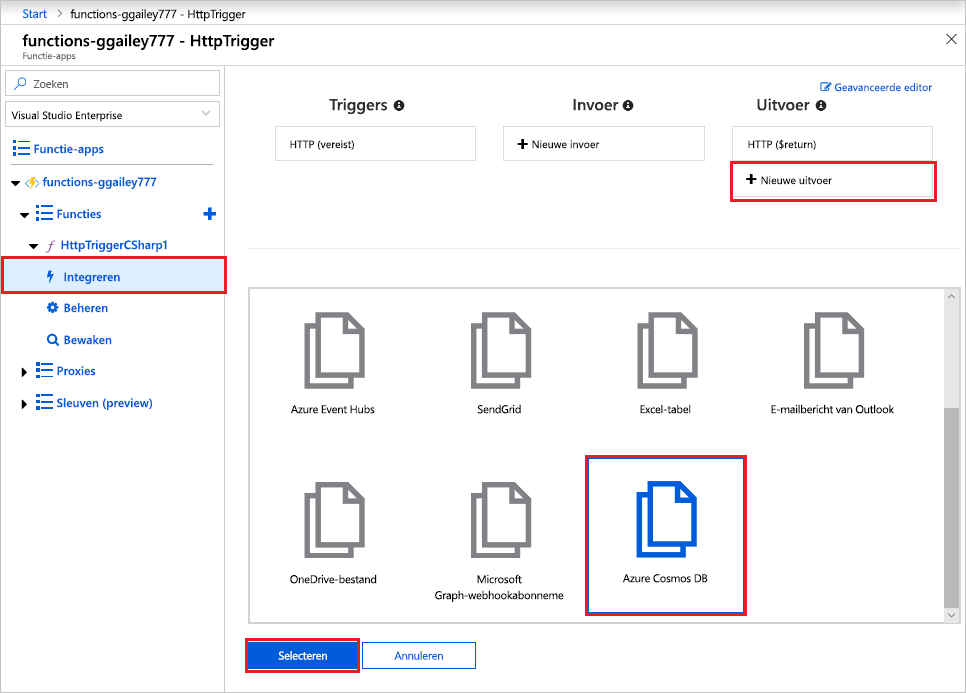

# <a name="store-unstructured-data-using-azure-functions-and-cosmos-db"></a>Ongestructureerde gegevens opslaan met behulp van Azure Functions en Cosmos DB

[Azure Cosmos DB](https://azure.microsoft.com/services/cosmos-db/) is een geweldige manier om ongestructureerde gegevens en JSON-gegevens op te slaan. Cosmos DB biedt, in combinatie met Azure Functions, een snelle en eenvoudige manier om gegevens op te slaan met veel minder code dan nodig is voor het opslaan van gegevens in een relationele database.

In Azure Functions bieden invoer- en uitvoerbindingen een verklarende manier om verbinding te maken met externe servicegegevens vanuit uw functie. In dit onderwerp wordt uitgelegd hoe u een bestaande C#-functie kunt bijwerken voor het toevoegen van een uitvoerbinding die niet-gestructureerde gegevens in een Cosmos-DB-document opslaat. 


## <a name="prerequisites"></a>Vereisten

Vereisten voor het voltooien van deze zelfstudie:

[!INCLUDE [Previous quickstart note](../../includes/functions-quickstart-previous-topics.md)]

## <a name="add-an-output-binding"></a>Een uitvoerbinding toevoegen

1. Vouw de functie-app en de functie uit.

1. Selecteer rechts boven op de pagina **Integreren** en **+ Nieuwe uitvoer**. Kies **Azure Cosmos DB**, en klik op **Selecteren**.

    

3. Gebruik de **Azure Cosmos DB-uitvoer**instellingen zoals opgegeven in de tabel: 

    

    | Instelling      | Voorgestelde waarde  | Beschrijving                                |
    | ------------ | ---------------- | ------------------------------------------ |
    | **Parameternaam van document** | taskDocument | Naam die in code verwijst naar het Cosmos DB-object. |
    | **Databasenaam** | taskDatabase | Naam van database waarin documenten worden opgeslagen. |
    | **Naam van verzameling** | TaskCollection | Naam van verzameling met Cosmos DB-databases. |
    | **Indien waar, worden de Cosmos-DB-database en -verzameling gemaakt** | Geselecteerd | De verzameling bestaat nog niet, dus moet u deze maken. |

4. Selecteer **Nieuw** naast het label **Cosmos DB-documentverbinding** en selecteer **+ Nieuwe maken**. 

5. Gebruik de instellingen voor **Nieuw account** zoals opgegeven in de tabel: 

    

    | Instelling      | Voorgestelde waarde  | Beschrijving                                |
    | ------------ | ---------------- | ------------------------------------------ |
    | **ID** | Naam van de database | Unieke id voor de Cosmos DB-database  |
    | **API** | SQL (DocumentDB) | Selecteer de documentdatabase-API.  |
    | **Abonnement** | Azure-abonnement | Azure-abonnement  |
    | **Resourcegroep** | myResourceGroup |  Gebruik de bestaande resourcegroep die uw functie-app bevat. |
    | **Locatie**  | West-Europa | Selecteer een locatie die zich in de buurt van uw functie-app bevindt of van andere apps die gebruikmaken van de opgeslagen documenten.  |

6. Klik op **OK** om de database te maken. Het maken van de database kan een paar minuten duren. Nadat de database is gemaakt, wordt de verbindingsreeks voor de database opgeslagen als een functie-app-instelling. De naam van deze app-instelling wordt ingevoegd in **Cosmos DB-accountverbinding**. 
 
8. Nadat de verbindingsreeks is ingesteld, selecteert u **Opslaan** om de binding te maken.

## <a name="update-the-function-code"></a>De functiecode bijwerken

Vervang de bestaande C#-functiecode door het volgende:

```csharp
using System.Net;

public static HttpResponseMessage Run(HttpRequestMessage req, out object taskDocument, TraceWriter log)
{
    string name = req.GetQueryNameValuePairs()
        .FirstOrDefault(q => string.Compare(q.Key, "name", true) == 0)
        .Value;

    string task = req.GetQueryNameValuePairs()
        .FirstOrDefault(q => string.Compare(q.Key, "task", true) == 0)
        .Value;

    string duedate = req.GetQueryNameValuePairs()
        .FirstOrDefault(q => string.Compare(q.Key, "duedate", true) == 0)
        .Value;

    taskDocument = new {
        name = name,
        duedate = duedate.ToString(),
        task = task
    };

    if (name != "" && task != "") {
        return req.CreateResponse(HttpStatusCode.OK);
    }
    else {
        return req.CreateResponse(HttpStatusCode.BadRequest);
    }
}

```
In dit codevoorbeeld worden de queryreeksen van de HTTP-aanvraag gelezen en toegewezen aan het velden in het `taskDocument`-object. De `taskDocument`-binding verzendt de objectgegevens van deze bindingsparameter voor opslag in de gebonden documentdatabase. De database wordt de eerste keer dat de functie wordt uitgevoerd gemaakt.

## <a name="test-the-function-and-database"></a>De functie en database testen

1. Vouw het rechtervenster uit en selecteer **Testen**. Klik onder **Query** op **+ Parameter toevoegen** en voeg de volgende parameters toe aan de querytekenreeks:

    + `name`
    + `task`
    + `duedate`

2. Klik op **Uitvoeren** en controleer of een 200-status wordt geretourneerd.

    

1. Vouw aan de linkerkant van Azure Portal de pictogrammenbalk uit, typ `cosmos` in het zoekveld en selecteer **Azure Cosmos DB**.

    

2. Selecteer de database die u hebt gemaakt en selecteer vervolgens **Data Explorer**. Vouw de knooppunten **Verzamelingen** uit, selecteer het nieuwe document en controleer of het document uw querytekenreekswaarden, samen met enkele aanvullende metagegevens, bevat. 

    

U hebt een binding toegevoegd aan uw HTTP-trigger die niet-gestructureerde gegevens in een Cosmos-DB-database opslaat.

[!INCLUDE [Clean-up section](../../includes/clean-up-section-portal.md)]

## <a name="next-steps"></a>Volgende stappen

[!INCLUDE [functions-quickstart-next-steps](../../includes/functions-quickstart-next-steps.md)]

Zie [Azure Functions Cosmos DB bindings](functions-bindings-documentdb.md) (Bindingen tussen Azure Functions en Cosmos DB) voor meer informatie over de binding met een Cosmos DB database.

