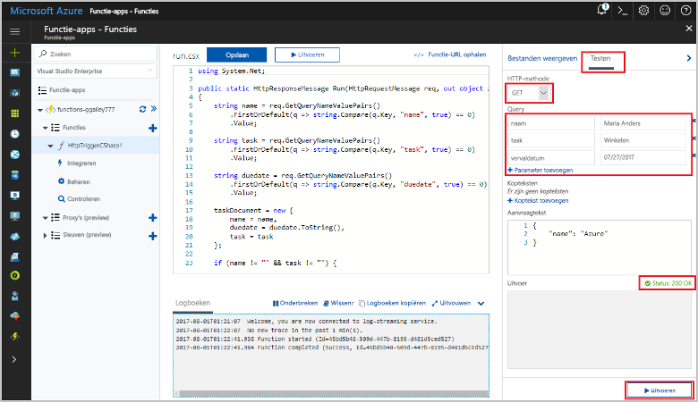
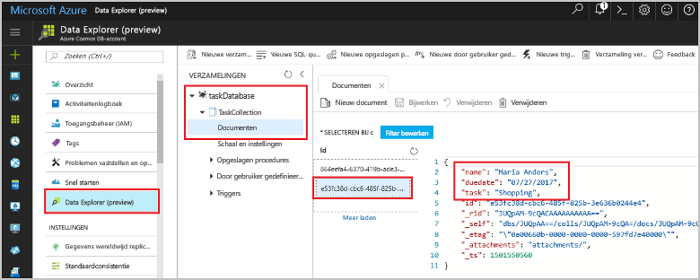

<a id="store-unstructured-data-using-azure-functions-and-cosmos-db" class="xliff"></a>

# Ongestructureerde gegevens opslaan met behulp van Azure Functions en Cosmos DB

Azure Cosmos DB is een geweldige manier om ongestructureerde gegevens en JSON-gegevens op te slaan. Cosmos DB biedt, in combinatie met Azure Functions, een snelle en eenvoudige manier om gegevens op te slaan met veel minder code dan nodig is voor het opslaan van gegevens in een relationele database.

Deze zelfstudie laat stapsgewijs zien hoe u Azure Portal gebruikt om een Azure-functie te maken waarmee ongestructureerde gegevens kunnen worden opgeslagen in een Cosmos DB-document. 

<a id="prerequisites" class="xliff"></a>

## Vereisten

[!INCLUDE [Previous quickstart note](../../includes/functions-quickstart-previous-topics.md)]

[!INCLUDE [functions-portal-favorite-function-apps](../../includes/functions-portal-favorite-function-apps.md)]

<a id="create-a-function" class="xliff"></a>

## Een functie maken

Maak een nieuwe C#-generieke webhook met de naam `MyTaskList`.

1. Vouw de lijst met bestaande functies uit en klik op het plusteken (+) om een nieuwe functie te maken
1. Selecteer GenericWebHook-CSharp en geef deze de naam `MyTaskList`


<a id="add-an-output-binding" class="xliff"></a>

## Een uitvoerbinding toevoegen

Een Azure-functie kan één trigger bevatten en een willekeurig aantal invoer- of uitvoerbindingen. In dit voorbeeld maken we gebruik van een HTTP-aanvraag als trigger en van het Cosmos DB-document als de uitvoerbinding.

1. Klik op het tabblad *Integreren* van de functie om de trigger en bindingen van de functie weer te geven en te wijzigen.
1. Kies de koppeling *Nieuwe uitvoer* rechtsboven op de pagina.

Opmerking: De HTTP-aanvraagtrigger is al geconfigureerd. De Cosmos DB-documentbinding moet echter worden toegevoegd.


1. Voer de vereiste gegevens in voor het maken van de binding. Gebruik de onderstaande tabel om de waarden te bepalen.


|  Veld | Waarde  |
|---|---|
| Parameternaam van document | Naam die in code verwijst naar het Cosmos DB-object |
| Databasenaam | Naam van database waarin documenten worden opgeslagen |
| Naam van verzameling | Naam van groepering met Cosmos DB-databases |
| Wilt u de Cosmos-database en verzameling voor u laten maken? | Ja of nee |
| Cosmos DB-accountverbinding | Verbindingsreeks die verwijst naar de Cosmos DB-database |

U moet ook de verbinding met de Cosmos DB-database configureren.

1. Klik op de koppeling Nieuw naast het label *Cosmos DB-documentverbinding.
1. Vul de velden in en selecteer de vereiste opties voor het maken van het Cosmos DB-document.


|  Veld | Waarde  |
|---|---|
| Id | Unieke id voor de Cosmos DB-database  |
| NoSQL-API | Cosmos DB of MongoDB  |
| Abonnement | MSDN-abonnement  |
| Resourcegroep  | Maak een nieuwe groep of selecteer een bestaande groep.  |
| Locatie  | West-Europa  |

1. Klik op de knop *OK*. U moet mogelijk enkele minuten wachten totdat de resources zijn gemaakt met Azure.
1. Klik op de knop *Opslaan*.

<a id="update-the-function-code" class="xliff"></a>

## De functiecode bijwerken

Vervang de functiecodesjabloon door:

Let op: de code voor dit voorbeeld wordt alleen weergegeven in C#.

```csharp
using System.Net;

public static HttpResponseMessage Run(HttpRequestMessage req, out object taskDocument, TraceWriter log)
{
    string name = req.GetQueryNameValuePairs()
        .FirstOrDefault(q => string.Compare(q.Key, "name", true) == 0)
        .Value;

    string task = req.GetQueryNameValuePairs()
        .FirstOrDefault(q => string.Compare(q.Key, "task", true) == 0)
        .Value;

    string duedate = req.GetQueryNameValuePairs()
        .FirstOrDefault(q => string.Compare(q.Key, "duedate", true) == 0)
        .Value;

    taskDocument = new {
        name = name,
        duedate = duedate.ToString(),
        task = task
    };

    if (name != "" && task != "") {
        return req.CreateResponse(HttpStatusCode.OK);
    }
    else {
        return req.CreateResponse(HttpStatusCode.BadRequest);
    }
}

```

In dit codevoorbeeld worden de queryreeksen van de HTTP-aanvraag gelezen en toegewezen als leden van een `taskDocument`-object. Met het `taskDocument`-object worden de gegevens automatisch opgeslagen in de Cosmos DB-database en wordt de database zelfs automatisch gemaakt bij het eerste gebruik.

<a id="test-the-function-and-database" class="xliff"></a>

## De functie en database testen

1. Klik op het tabblad Functie op de koppeling *Test* aan de rechterkant van de portal. Voer vervolgens de volgende HTTP-queryreeksen in:

| Queryreeksen | Waarde |
|---|---|
| naam | Chris P. Bacon |
| taak | Een BLT-sandwich maken |
| einddatum | 12/05/2017 |

1. Klik op de koppeling *Uitvoeren*.
1. Controleer of de functie een antwoordcode *HTTP 200 OK* heeft geretourneerd.



Bevestig dat er een vermelding is gemaakt in de Cosmos DB-database.

1. Ga naar uw database in Azure Portal en selecteer de vermelding.
1. Selecteer de optie *Data Explorer*.
1. Vouw de knooppunten uit totdat u de vermeldingen van het document bereikt.
1. Bevestig de databasevermelding. De database bevat naast uw gegevens nog aanvullende metagegevens.



Als de gegevens zich in het document bevinden, hebt u een Azure-functie gemaakt waarmee ongestructureerde gegevens kunnen worden opgeslagen in een Cosmos DB-database.

<a id="clean-up-resources" class="xliff"></a>

## Resources opschonen

[!INCLUDE [Next steps note](../../includes/functions-quickstart-cleanup.md)]

<a id="next-steps" class="xliff"></a>

## Volgende stappen

Raadpleeg de volgende onderwerpen voor meer informatie over Azure Functions:

[!INCLUDE [Getting help note](../../includes/functions-get-help.md)]

[!INCLUDE [functions-quickstart-next-steps](../../includes/functions-quickstart-next-steps.md)]

