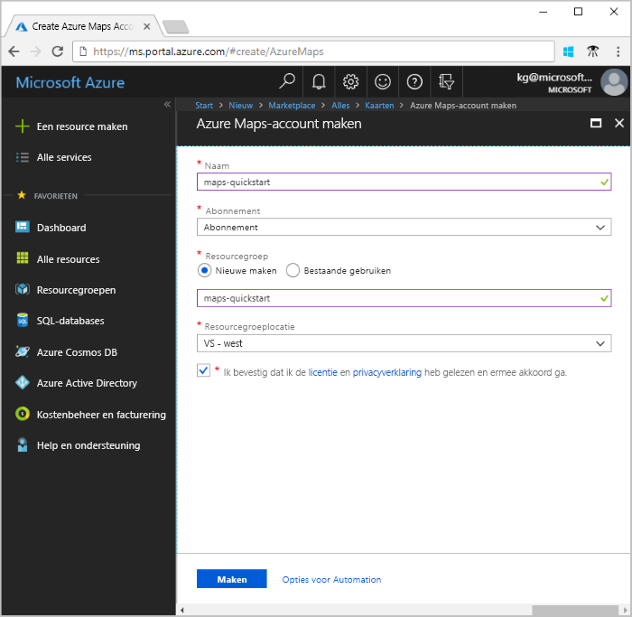

# Een interactieve kaartzoekopdracht starten met Azure Maps

In dit artikel wordt gedemonstreerd hoe u een kaart maakt met Azure Maps om gebruikers een interactieve zoekervaring te bieden. U leert de basisstappen voor het maken van uw eigen Maps-account en voor het ophalen van de sleutel van uw account voor gebruik in de demo-webtoepassing.

Als u nog geen abonnement op Azure hebt, maak dan een [gratis account](https://azure.microsoft.com/free/?WT.mc_id=A261C142F) aan voordat u begint.

## Aanmelden bij Azure Portal

Meld u aan bij [Azure Portal](https://portal.azure.com/).

## Een account maken en de sleutel ophalen

1. Klik in de linkerbovenhoek van [Azure Portal](https://portal.azure.com) op **Een resource maken**.
2. Typ **Maps** in het vak *Marketplace doorzoeken*.
3. Selecteer **Toewijzingen** in de *Resultaten*. Klik op de knop **Maken** die onder de kaart wordt weergegeven.
4. Voer de volgende waarden in op de pagina **Azure Kaarten-account maken**:
    - De *Naam* van uw nieuwe account.
    - Het *Abonnement* dat u wilt gebruiken voor dit account.
    - De *Resourcegroep* voor dit account. U kunt kiezen om een *Nieuwe* of *Bestaande* resourcegroep te gebruiken.
    - Selecteer een *Loacatie voor de resourcegroep*.
    - Lees de *licentie* en de *privacyverklaring*, en schakel het selectievakje in om de voorwaarden te accepteren.
    - Klik ten slotte op de knop **Maken**.

    

5. Nadat uw account is gemaakt, opent u het account en zoekt u de sectie Instellingen van het accountmenu. Klik op **Sleutels** om de primaire en secundaire sleutel voor uw Azure Maps-account weer te geven. Kopieer de waarde van de **Primaire sleutel** naar uw lokale klembord voor gebruik in de volgende sectie.

## De toepassing downloaden

1. Download of kopieer de inhoud van het bestand [interactiveSearch.html](https://github.com/Azure-Samples/azure-maps-samples/blob/master/src/interactiveSearch.html).
2. Sla de inhoud van dit bestand lokaal op als **AzureMapDemo.html** en open de inhoud in een teksteditor.
3. Zoek naar de tekenreeks `<insert-key>` en vervang deze door de waarde voor de **Primaire sleutel** die u in de voorgaande sectie hebt verkregen.

## De toepassing starten

1. Open het bestand **AzureMapDemo.html** in een browser naar keuze.
2. Bekijk de kaart van Los Angeles. Zoom in en uit om te zien hoe de kaart automatisch met meer of minder informatie wordt weergegeven, afhankelijk van het zoomniveau. 
3. Wijzig de standaardinstelling voor het midden van de kaart. Zoek in het bestand **AzureMapDemo.html** naar de variabele **center**. Vervang de lengte- en breedtegraad voor deze variabele door deze nieuwe waarden: **[-74.0060, 40.7128]**. Sla het bestand op en vernieuw de browser.
4. Probeer de interactieve zoekervaring uit. Zoek in het zoekvak linksboven in de demo-webtoepassing naar **restaurants**.
5. Beweeg de muis over de lijst met adressen/locaties die wordt weergegeven onder het zoekvak en zie hoe de bijbehorende speld op de kaart informatie over die locatie weergeeft. Ten behoeve van de privacy van particuliere bedrijven worden er fictieve namen en adressen weergegeven.

    

## Resources opschonen

In de zelfstudies vindt u gedetailleerde informatie over het gebruik en de configuratie van Maps met uw account. Als u wilt doorgaan met de zelfstudies, verwijder dan niet de resources die u in deze snelstart hebt gemaakt. Als u niet wilt doorgaan, gebruikt u de volgende stappen om alle resources die via deze Snelstartgids zijn gemaakt, te verwijderen.

1. Sluit de browser waarin de **AzureMapDemo.html**-webtoepassing wordt uitgevoerd.
2. Klik in het linkermenu van Azure Portal op **Alle resources** en selecteer uw Maps-account. Klik bovenaan de blade **Alle resources** op **Verwijderen**.

## Volgende stappen

In deze snelstart hebt u een Azure Maps-account gemaakt en een demo-toepassing gestart. Als u meer informatie wilt over het maken van uw eigen toepassing met de API's van Maps, gaat u verder met de volgende zelfstudie.

> [!div class="nextstepaction"]
> [Zoeken naar bezienswaardigheden met Maps](./tutorial-search-location.md)

Bekijk de handleidingen hieronder voor meer voorbeelden van code en interactieve codering.

> [!div class="nextstepaction"]
> [Zoeken naar een adres met behulp van Azure Maps REST API’s](./how-to-search-for-address.md)

> [!div class="nextstepaction"]
> [Kaartbesturingselement in Azure Maps gebruiken](./how-to-use-map-control.md)
