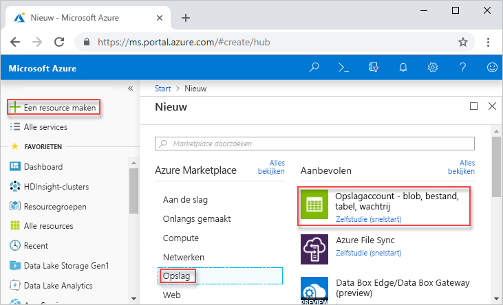
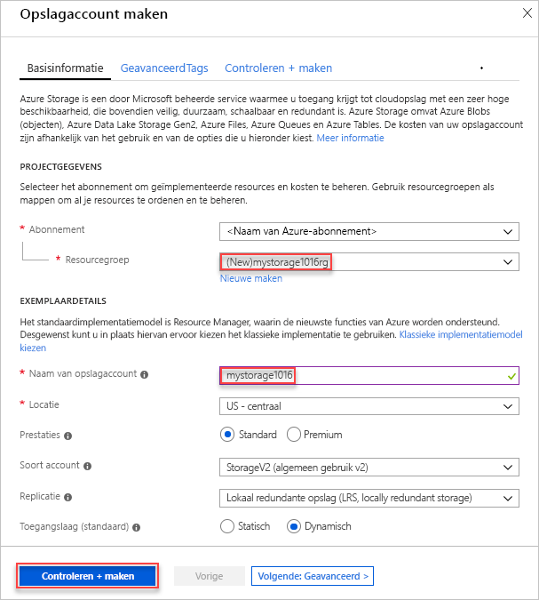
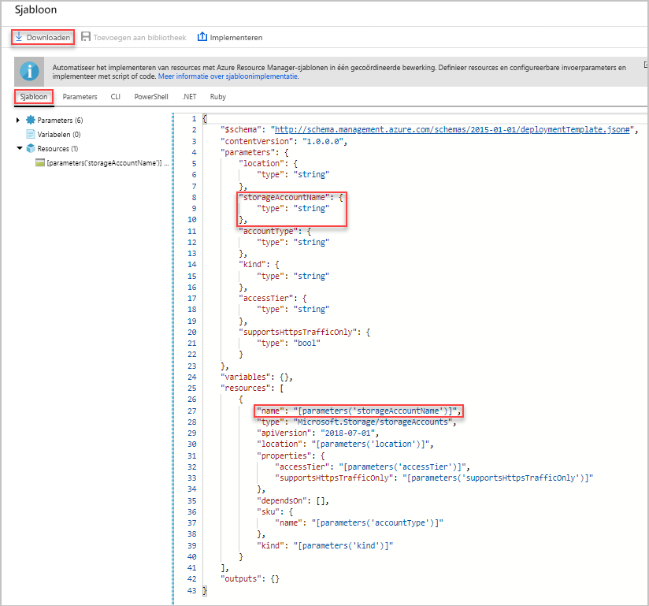
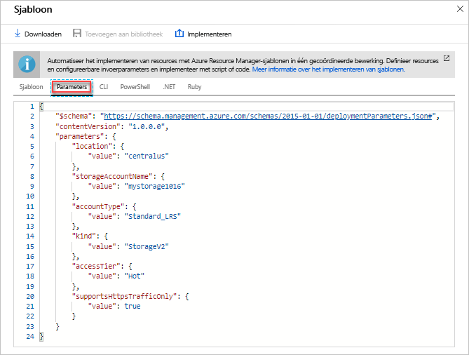
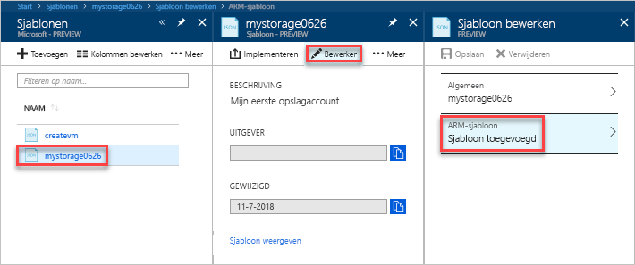
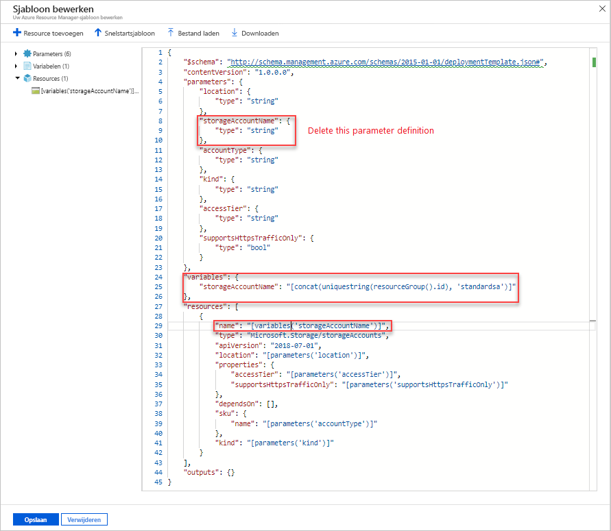
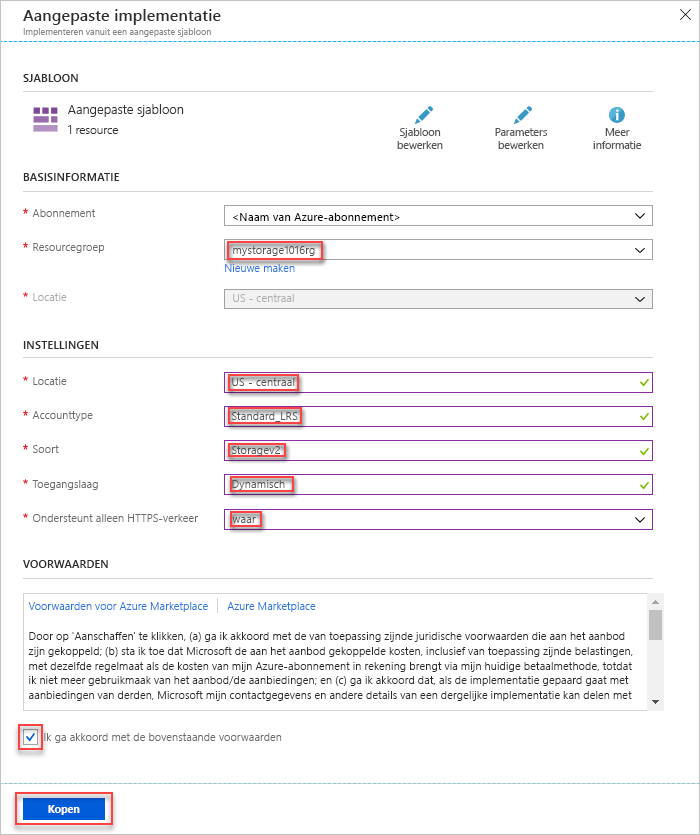

# <a name="quickstart-create-and-deploy-azure-resource-manager-templates-by-using-the-azure-portal"></a>Snelstart: Azure Resource Manager-sjablonen maken en implementeren via Azure Portal

Leer hoe u uw eerste Azure Resource Manager-sjabloon maakt door er een via Azure Portal te maken en hoe u de sjabloon vanaf de portal bewerkt en implementeert.

Resource Manager-sjablonen zijn JSON-bestanden die de resources definiëren die u voor uw oplossing moet implementeren. Als u een sjabloon wilt maken, hoeft u niet altijd bij het begin te beginnen. In deze zelfstudie leert u hoe u via Azure Portal een sjabloon kunt genereren. Vervolgens kunt u de sjabloon aanpassen en implementeren.

Met de instructies in deze zelfstudie wordt een Azure Storage-account gemaakt. U kunt dezelfde procedure gebruiken om andere Azure-resources te maken.

Als u geen abonnement op Azure hebt, maakt u een [gratis account](https://azure.microsoft.com/free/) voordat u begint.

## <a name="generate-a-template-using-the-portal"></a>Een sjabloon maken via de portal

In deze sectie maakt u een Storage-account via Azure Portal. Voordat u het Storage-account implementeert, hebt u de optie de sjabloon te bekijken die op basis van uw configuraties in de portal is gemaakt. U kunt de sjabloon opslaan voor later gebruik.

1. Meld u aan bij [Azure Portal](https://portal.azure.com).
2. Selecteer **Een resource maken** > **Opslag** > **Opslagaccount - blob, bestand, tabel, wachtrij**.

    
3. Voer de volgende informatie in. Zorg ervoor dat u in de volgende stap **Opties voor Automation** in laats van **maken** selecteert, zodat u de sjabloon kunt zien voor dat deze wordt geïmplementeerd.

    - **Naam**: geef het opslagaccount een unieke naam. In de schermafbeelding is de naam *mystorage0626*.
    - **Resourcegroep**: maak een nieuwe Azure-resourcegroep met een naam naar keuze. In de schermafbeelding is de naam van de resourcegroep *mystorage0626rg*.

    Voor de overige eigenschappen kunt u de standaardwaarden gebruiken.

    

    > [!NOTE]
    > Sommige geëxporteerde sjablonen moeten worden bewerkt voordat u ze implementeren.

4. Selecteer **Opties voor Automation** onder aan het scherm. In de portal wordt de sjabloon op het tabblad **Sjabloon** getoond:

    

    In het hoofdvenster wordt de sjabloon getoond. Het is een JSON-bestand met vier elementen van het hoogste niveau. Zie [Informatie over de structuur en de syntaxis van Azure Resource Manager-sjablonen](./resource-group-authoring-templates.md) voor meer informatie

    Onder het element **Parameter** zijn vijf parameters gedefinieerd. Selecteer het tabblad **Parameter** als u de waarden wilt zien die u tijdens de implementatie opgeeft.

    

    Deze waarden geven aan wat u hebt geconfigureerd in de vorige sectie. Met behulp van zowel de sjabloon- als de parameterbestanden kunt u een Azure Storage-account maken.

5. Boven aan de tabbladen bevinden zich drie menuopdrachten:

    - **Downloaden**: download de sjabloon- en de parameterbestanden op uw lokale computer.
    - **Toevoegen aan bibliotheek**: voeg de sjabloon toe aan de bibliotheek voor later gebruik.
    - **Implementeren**: implementeer het Azure Storage-account in Azure.

    In deze zelfstudie gebruikt u de optie **Toevoegen aan bibliotheek**.

6. Selecteer **Toevoegen aan bibliotheek**.
7. Voer **Naam** en **Beschrijving** in en selecteer **Opslaan**.

> [!NOTE]
> De functie van de sjabloonbibliotheek is in de previewfase. De meeste personen kiezen ervoor hun sjablonen op te slaan op hun lokale computer of in een openbare opslagplaats, bijvoorbeeld Github.  

## <a name="edit-and-deploy-the-template"></a>De sjabloon bewerken en implementeren

In deze sectie opent u de opgeslagen sjabloon vanuit de sjabloonbibliotheek, bewerkt u de sjabloon in de portal en implementeert u de herziene sjabloon. Als u een complexere sjabloon wilt bewerken, kunt u gebruikmaken van Visual Studio Code. Dit biedt meer functionaliteit.

1. Selecteer in Azure Portal **All services** in het linkermenu, voer **template** in het filtervak in en selecteer **Sjabloon (PREVIEW)**.

    
2. Selecteer de sjabloon die u in de laatste sectie hebt opgeslagen. De naam in de schermafbeelding is *mystorage0626*.
3. Selecteer **Bewerken** en vervolgens **Sjabloon toegevoegd**.

    

4. Voeg een element **variables** toe en voeg vervolgens één variabele toe zoals weergegeven in de volgende schermafbeelding:

    ```json
    "variables": {
        "storageAccountName": "[concat(uniquestring(resourceGroup().id), 'standardsa')]"
    },
    ```
    

    Er worden hier twee functies gebruikt: *concat()* en *uniqueString()*. uniqueString() is handig bij het maken van een unieke naam voor een resource.

5. Verwijder de parameter **name** (gemarkeerd in de vorige schermafbeelding).
6. Werk het naamelement bij van de resource **Microsoft.Storage/storageAccounts** voor gebruik van de nieuw gedefinieerde variabele in plaats van de parameter:

    ```json
    "name": "[variables('storageAccountName')]",
    ```

    De uiteindelijke sjabloon moet er als volgt uitzien:

    ```json
    {
        "$schema": "https://schema.management.azure.com/schemas/2015-01-01/deploymentTemplate.json#",
        "contentVersion": "1.0.0.0",
        "parameters": {
            "location": {
                "type": "string"
            },
            "accountType": {
                "type": "string"
            },
            "kind": {
                "type": "string"
            },
            "httpsTrafficOnlyEnabled": {
                "type": "bool"
            }
        },
        "variables": {
            "storageAccountName": "[concat(uniquestring(resourceGroup().id), 'standardsa')]"
        },
        "resources": [
            {
                "apiVersion": "2018-02-01",
                "name": "[variables('storageAccountName')]",
                "location": "[parameters('location')]",
                "type": "Microsoft.Storage/storageAccounts",
                "sku": {
                    "name": "[parameters('accountType')]"
                },
                "kind": "[parameters('kind')]",
                "properties": {
                    "supportsHttpsTrafficOnly": "[parameters('httpsTrafficOnlyEnabled')]",
                    "encryption": {
                        "services": {
                            "blob": {
                                "enabled": true
                            },
                            "file": {
                                "enabled": true
                            }
                        },
                        "keySource": "Microsoft.Storage"
                    }
                },
                "dependsOn": []
            }
        ]
    }
    ```
7. Selecteer **OK** en selecteer vervolgens **Opslaan** om de wijzigingen op te slaan.
8. Selecteer **Implementeren**.
9. Voer de volgende waarden in:

    - **Abonnement**: selecteer uw Azure-abonnement.
    - **Resourcegroep**: geef de resourcegroep een unieke naam.
    - **Locatie**: selecteer een locatie voor de resourcegroep.
    - **Locatie**: selecteer een locatie voor het opslagaccount.  U kunt dezelfde locatie gebruiken als voor de resourcegroep.
    - **Accounttype**: voer voor deze snelstart **Standard_LRS** in.
    - **Soort**: voer voor deze snelstart **Opslag** in.
    - **Alleen HTTPS-verkeer ingeschakeld**.  Selecteer voor deze snelstart **false**.
    - **Ik ga akkoord met de bovenstaande voorwaarden**: (selecteren)

    Dit is een schermafbeelding van een voorbeeldimplementatie:

    

10. Selecteer **Aankoop**.
11. Selecteer het belpictogram (meldingen) boven in het scherm om de implementatiestatus te zien.

## <a name="clean-up-resources"></a>Resources opschonen

Schoon de geïmplementeerd Azure-resources, wanneer u deze niet meer nodig hebt, op door de resourcegroep te verwijderen.

1. Selecteer **Resourcegroep** in het linkermenu van Azure Portal.
2. Voer de naam van de resourcegroep in het veld **Filter by name** in.
3. Selecteer de naam van de resourcegroep.  U ziet het opslagaccount in de resourcegroep.
4. Selecteer **Resourcegroep verwijderen** in het bovenste menu.

## <a name="next-steps"></a>Volgende stappen

In deze zelfstudie hebt u geleerd hoe u een sjabloon genereert in Azure Portal en hoe u de sjabloon via de portal implementeert. De gebruikte sjabloon in deze snelstart is een eenvoudige sjabloon met één Azure-resource. Als de sjabloon complex is, kunt u beter Visual Studio Code of Visual Studio gebruiken om de sjabloon te ontwikkelen.

> [!div class="nextstepaction"]
> [Create templates by using Visual Studio Code](./resource-manager-quickstart-create-templates-use-visual-studio-code.md) (Sjablonen maken met Visual Studio Code)
