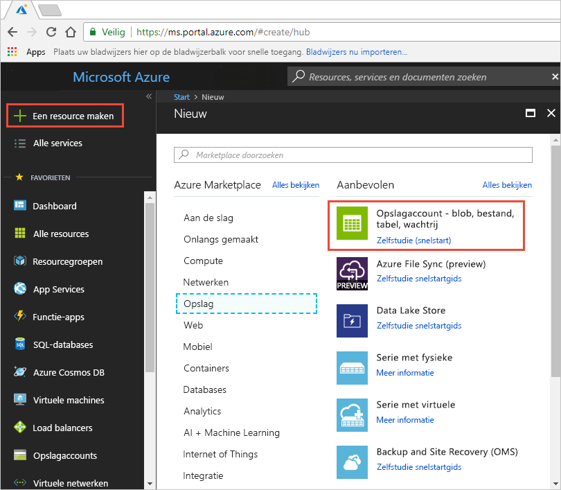
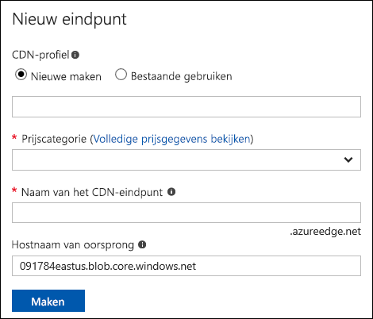

# Quickstart: Een Azure Storage-account integreren met Azure CDN
In deze snelstart gaat u ervoor zorgen dat [Azure Content Delivery Network (CDN)](cdn-overview.md) inhoud van Azure Storage in de cache kan opslaan. Azure CDN biedt ontwikkelaars een mondiale oplossing voor het leveren van inhoud met hoge bandbreedte. Het kan worden gebruikt om blobs en statische inhoud van rekeninstanties in de cache op fysieke knooppunten in de Verenigde Staten, Europa, Azië, Australië en Zuid-Amerika op te slaan.

[!INCLUDE [quickstarts-free-trial-note](../../includes/quickstarts-free-trial-note.md)]

## Aanmelden bij Azure Portal
Meld u met uw Azure-account aan bij het [Azure Portal](https://portal.azure.com).

## Create a storage account
Gebruik de volgende procedure om een nieuw opslagaccount voor een Azure-abonnement te maken. Een opslagaccount biedt toegang tot Azure Storage-services. Het opslagaccount vertegenwoordigt het hoogste niveau van de naamruimte voor het verkrijgen van toegang tot elk van de onderdelen van de Azure Storage-service: Azure Blob Storage, Queue Storage en Table Storage. Zie [Inleiding tot Microsoft Azure Storage](../storage/common/storage-introduction.md) voor meer informatie.

Als u een opslagaccount wilt maken, moet u de servicebeheerder of een co-beheerder voor het gekoppelde abonnement zijn.

U kunt verschillende methoden, waaronder Azure Portal en PowerShell gebruiken om een opslagaccount te maken. In deze snelstart wordt getoond hoe Azure Portal moet worden gebruikt.   

**Een opslagaccount maken voor een Azure-abonnement**

1. Selecteer linksboven in Azure Portal **Een resource maken**. 

    Het deelvenster **Nieuw** verschijnt.

2. Selecteer **Storage** en vervolgens **Storage-account - blob, file, table, queue**.
    
    

    Het deelvenster **Opslagaccount maken**  wordt weergegeven.   

    

3. Voer in het vak **Naam** een subdomeinnaam in. De naam mag 3-24 kleine letters en cijfers bevatten.
   
    Deze waarde wordt de hostnaam binnen de URI die wordt gebruikt om blob-, wachtrij- of tabelresources te adresseren. Gebruik een URI in de volgende indeling om een containerresource in Blob Storage te adresseren:
   
    http://*&lt;StorageAcountLabel&gt;*.blob.core.windows.net/*&lt;mycontainer&gt;*

    waar *&lt;StorageAccountLabel&gt;* naar de waarde verwijst die u hebt ingevoerd in het vak **Naam**.
   
    > [!IMPORTANT]    
    > Het URL-label vormt het subdomein van de URI van het opslagaccount en moet uniek zijn in alle gehoste services in Azure.
   
    Deze waarde wordt ook gebruikt als de naam van het opslagaccount in de portal, of wanneer u met dit account via een programma verbinding maakt.
    
4. Gebruik voor de resterende instellingen de waarden die in de volgende tabel zijn opgegeven:

    | Instelling  | Waarde |
    | -------- | ----- |
    | **Implementatiemodel** | Gebruik de standaardwaarde. |
    | **Type account** | Gebruik de standaardwaarde. |
    | **Locatie**    | Selecteer **VS Centraal** in de vervolgkeuzelijst. |
    | **Replicatie** | Gebruik de standaardwaarde. |
    | **Prestaties** | Gebruik de standaardwaarde. |
    | **Veilige overdracht vereist** | Gebruik de standaardwaarde. |
    | **Abonnement** | Kies een Azure-abonnement in de vervolgkeuzelijst. |
    | **Resourcegroep** | Selecteer **Nieuwe maken** en voer *my-resource-group-123* in als naam voor de resourcegroep. Deze naam moet wereldwijd uniek zijn. Als deze al in gebruik is, kunt u een andere naam invoeren of **Bestaande gebruiken** selecteren en **my-resource-group-123** in de vervolgkeuzelijst selecteren.  Zie [Overzicht van Azure Resource Manager](../azure-resource-manager/resource-group-overview.md#resource-groups) voor informatie over resourcegroepen.| 
    | **Virtuele netwerken configureren** | Gebruik de standaardwaarde. |  
    
5. Selecteer **Aan dashboard vastmaken** om het opslagaccount in het dashboard op te slaan nadat het is gemaakt.
    
6. Selecteer **Maken**. Het kan enkele minuten duren voordat het opslagaccount is gemaakt.

## Azure CDN inschakelen voor het opslagaccount

U kunt Azure CDN voor uw opslagaccount rechtstreeks vanuit uw opslagaccount inschakelen. Als u voor uw CDN-eindpunt geavanceerde configuratie-instellingen wilt opgeven, zoals het optimalisatietype, kunt u in plaats daarvan de [Azure CDN-extensie](cdn-create-new-endpoint.md) gebruiken om een CDN-profiel of een CDN-eindpunt te maken.

1. Selecteer een opslagaccount van het dashboard en selecteer vervolgens **Azure CDN** in het linkerdeelvenster. Als de knop **Azure CDN** niet meteen zichtbaar is, kunt u ernaar zoeken door 'CDN' te typen in het vak **Zoeken** in het linkerdeelvenster.
    
    De pagina **Azure CDN** wordt weergegeven.

    
    
2. Maak een nieuw eindpunt door de vereiste informatie in te voeren die is weergegeven in de volgende tabel:

    | Instelling  | Waarde |
    | -------- | ----- |
    | **CDN-profiel** | Selecteer **Nieuwe maken** en geef *my-cdn-profile-123* op als uw profielnaam. Deze naam moet wereldwijd uniek zijn. Als deze al in gebruik is, kunt u een andere naam invoeren.  |
    | **Prijscategorie** | Selecteer **Standard - Verizon** in de vervolgkeuzelijst. |
    | **Naam van CDN-eindpunt** | Voer *my-endpoint-123* in als hostnaam van uw eindpunt. Deze naam moet wereldwijd uniek zijn. Als deze al in gebruik is, kunt u een andere naam invoeren. Deze naam wordt gebruikt voor toegang tot uw resources in de cache van de domein- _&lt;eindpuntnaam&gt;_.azureedge.net. Een nieuw CDN-eindpunt gebruikt standaard de hostnaam van uw opslagaccount als de bronserver.|

3. Selecteer **Maken**. Zodra het eindpunt is gemaakt, wordt dit weergegeven in de lijst met eindpunten.

    

## Aanvullende CDN-functies inschakelen
Vanuit de pagina **Azure CDN** van het opslagaccount, selecteert u het CDN-eindpunt in de lijst om de configuratiepagina van het CDN-eindpunt te openen. Op deze pagina kunt u extra CDN-functies inschakelen voor uw levering, zoals [Compressie](cdn-improve-performance.md), [Queryreeksen opslaan in cache](cdn-query-string.md) en [Geo-filteren](cdn-restrict-access-by-country.md). 
    

## Toegang tot CDN-inhoud
Gebruik de CDN-URL op de portal om toegang te krijgen tot inhoud van de cache op het CDN. Het adres van een blob in de cache heeft de volgende indeling:

http://<*EndpointName*\>.azureedge.net/<*myPublicContainer*\>/<*BlobName*\>

> [!NOTE]
> Nadat u ervoor hebt gezorgd dat Azure CDN toegang tot een opslagaccount heeft, komen alle openbaar beschikbare objecten in aanmerking om in de cache van CDN POP te worden geplaatst. Als u een object wijzigt dat zich momenteel in de cache op het CDN bevindt, is de nieuwe inhoud niet beschikbaar via Azure CDN totdat de inhoud van Azure CDN wordt vernieuwd na het verstrijken van de Time-to-Live-periode voor inhoud in de cache.

## Inhoud verwijderen uit Azure CDN
Als u niet langer een object in de cache in Azure CDN nodig hebt, kunt u een van de volgende stappen uitvoeren:

* Maak de container persoonlijk in plaats van openbaar. Zie [Anonieme leestoegang tot containers en blobs beheren](../storage/blobs/storage-manage-access-to-resources.md) voor meer informatie.
* Schakel het CDN-eindpunt uit of verwijder het met behulp van Azure Portal.
* Wijzig de gehoste service zodat deze niet meer reageert op aanvragen voor het object.

Een object dat al in de cache in Azure CDN is geplaatst, blijft in de cache totdat de Time-to-Live-periode voor het object is verstreken of totdat het eindpunt is [opgeschoond](cdn-purge-endpoint.md). Als de Time-to-Live-periode is verstreken, bepaalt Azure CDN of het CDN-eindpunt nog geldig is en het object nog steeds anoniem toegankelijk is. Als dat niet het geval is, wordt het object niet langer in de cache bewaard.

## Resources opschonen
In de voorgaande stappen hebt u een CDN-profiel en een eindpunt in een resourcegroep gemaakt. Sla deze resources op als u naar [Vervolgstappen](#next-steps) wilt gaan en informatie wilt krijgen over het toevoegen van een aangepast domein aan uw eindpunt. Als u echter denkt deze resources in de toekomst niet meer nodig te hebben, kunt u ze verwijderen door de resourcegroep te verwijderen. Op deze manier voorkomt u bijkomende kosten:

1. Selecteer in het linkermenu in het Azure Portal **Resourcegroepen** en selecteer vervolgens **my-resource-group-123**.

2. Selecteer op de **Resourcegroep**-pagina **Resourcegroep verwijderen**, voer *mijn-resource-group-123* in het tekstvak in en selecteer **Verwijderen**.

    Deze actie zal de resourcegroep, het profiel en het eindpunt dat u in deze snelstart hebt gemaakt verwijderen.

3. Als u uw opslagaccount wilt verwijderen, selecteert u dit in het dashboard en selecteert u vervolgens **Verwijderen** in het menu bovenaan.

## Volgende stappen
Zie voor meer informatie over het toevoegen van een aangepast domein aan uw CDN-eindpunt, de volgende zelfstudie:

> [!div class="nextstepaction"]
> [Zelfstudie: Een aangepast domein toevoegen aan uw Azure CDN-eindpunt](cdn-map-content-to-custom-domain.md)

