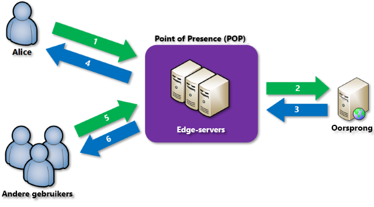

# Wat is een netwerk voor contentlevering in Azure?
Een netwerk voor contentlevering (CDN) is een gedistribueerd netwerk van servers dat webinhoud efficiënt aan gebruikers kan leveren. In CDN's wordt gecachede inhoud opgeslagen op randservers in aanwezigheidspunt (POP)-locaties in de buurt van eindgebruikers om de latentie zo klein mogelijk te maken. 

Azure Content Delivery Network (CDN) biedt ontwikkelaars een globale oplossing voor het snel leveren van inhoud met hoge bandbreedte door de inhoud op strategische, fysieke knooppunten in de hele wereld in de cache op te slaan. Azure CDN kan ook dynamische inhoud versnellen die niet in de cache kan worden opgeslagen. Hiervoor wordt met behulp van CDN POP's gebruikgemaakt van diverse netwerkoptimalisaties. Bijvoorbeeld optimalisatie van routes om Border Gateway Protocol (BGP) te omzeilen.

De voordelen van het gebruik van Azure CDN voor het leveren van websitemateriaal zijn:

* Betere prestaties en een verbeterde gebruikerservaring voor eindgebruikers, met name bij het gebruik van toepassingen waarin meerdere retouren zijn vereist om inhoud te laden.
* Grote schaalbaarheid, zodat korte hoge belastingen beter kunnen worden verwerkt, bijvoorbeeld bij het starten van een product.
* Distribueren van gebruikersaanvragen en uitvoeren van inhoud vanaf randservers, zodat er minder verkeer naar de oorspronkelijke server wordt verzonden.

Zie [Azure CDN POP-locaties](cdn-pop-locations.md) om een lijst met de huidige CDN-knooppuntlocaties te bekijken.

## Hoe werkt het?

1. Een gebruiker (Alice) gebruikt een URL met een speciale domeinnaam, zoals _&lt;endpoint name&gt;_.azureedge.net, om een bestand (ook wel een asset genoemd) aan te vragen. Deze naam kan een hostnaam van een eindpunt of een aangepast domein zijn. De DNS stuurt de aanvraag door naar de best presterende POP-locatie, die meestal de POP is die zich geografisch gezien het dichtstbij de gebruiker bevindt.
    
2. Als het bestand niet beschikbaar is in het cachegeheugen van de randservers in de POP, vraagt de POP het bestand aan bij de oorspronkelijke server. De oorspronkelijke server kan een Azure-web-app, Azure Cloud-service, Azure Storage-account of een openbaar toegankelijke webserver zijn.
   
3. De oorspronkelijke server retourneert het bestand naar een randserver in de POP.
    
4. Een randserver in de POP neemt het bestand op in de cache en retourneert het bestand naar de oorspronkelijke aanvrager (Alice). Het bestand blijft in de cache op de randserver in de POP, totdat de door de HTTP-headers opgegeven Time to Live (TTL) verloopt. Als de oorspronkelijke server geen TTL heeft opgegeven, is de standaard-TTL zeven dagen.
    
5. Vervolgens kunnen extra gebruikers hetzelfde bestand aanvragen met dezelfde URL die Alice heeft gebruikt. Het bestand kan ook naar dezelfde POP worden doorgestuurd.
    
6. Als de TTL voor het bestand niet is verlopen, retourneert de POP-randserver het bestand rechtstreeks vanuit de cache. Dit proces resulteert in een snellere, responsievere gebruikerservaring.

## Vereisten
Als u Azure CDN wilt gebruiken, dient u ten minste één Azure-abonnement te hebben. U dient ook ten minste één CDN-profiel te maken. Dit is een verzameling CDN-eindpunten. Elk CDN-eindpunt stelt een specifieke configuratie voor van het gedrag van en de toegang tot contentlevering. U kunt meerdere profielen gebruiken om de CDN-eindpunten te ordenen op basis van het internetdomein, de webtoepassing of andere criteria. [Prijsstelling van Azure CDN](https://azure.microsoft.com/pricing/details/cdn/) wordt toegepast op het niveau van het CDN-profiel, dus u dient meerdere CDN-profielen te maken als u een combinatie van prijscategorieën wilt gebruiken. Zie [Understanding Azure CDN billing](cdn-billing.md) (Facturering voor Azure CDN begrijpen) voor meer informatie over de factureringsstructuur van Azure CDN.

### Beperkingen
Elk Azure-abonnement kent standaardlimieten voor de volgende resources:
 - Het aantal CDN-profielen dat kan worden gemaakt.
 - Het aantal eindpunten dat kan worden gemaakt in een CDN-profiel. 
 - Het aantal aangepaste domeinen dat kan worden toegewezen aan een eindpunt.

Zie [CDN-limieten](https://docs.microsoft.com/azure/azure-subscription-service-limits#cdn-limits) voor meer informatie over limieten van CDN-abonnementen.
    
## Functies van Azure CDN
Azure CDN biedt de volgende belangrijke functies:

- [Dynamische siteversnelling](cdn-dynamic-site-acceleration.md)
- [Regels voor CDN-caching](cdn-caching-rules.md)
- [Ondersteuning voor aangepaste HTTPS-domeinen](cdn-custom-ssl.md)
- [Diagnostische logboeken van Azure](cdn-azure-diagnostic-logs.md)
- [Bestandscompressie](cdn-improve-performance.md)
- [Geofilters](cdn-restrict-access-by-country.md)

Zie [Azure CDN-producteigenschappen](cdn-features.md) voor een complete lijst met eigenschappen waarvoor elk Azure CDN-product ondersteuning biedt.

## Volgende stappen
- Zie [Aan de slag met Azure CDN](cdn-create-new-endpoint.md) om aan de slag te gaan met CDN.
- Beheer uw CDN-eindpunten via [Microsoft Azure Portal](https://portal.azure.com) of met [PowerShell](cdn-manage-powershell.md).
- Meer informatie over hoe u Azure CDN kunt automatiseren met [.NET](cdn-app-dev-net.md) of [Node.js](cdn-app-dev-node.md).
- Bekijk de [Azure-video's](https://azure.microsoft.com/resources/videos/index/?services=cdn&sort=newest) als u Azure CDN in actie wilt zien.
- Zie het [Azure CDN-blog](https://azure.microsoft.com/blog/tag/azure-cdn/) voor informatie over de nieuwste Azure CDN-functies.

