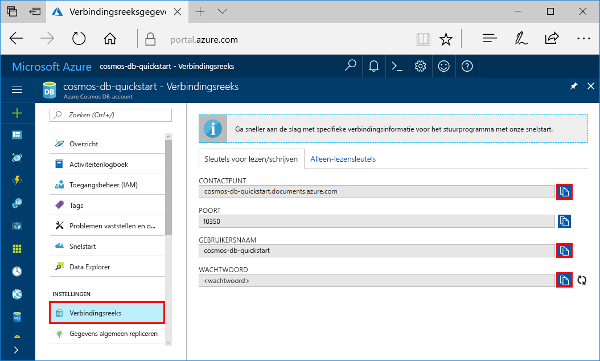

# <a name="quickstart-build-a-cassandra-app-with-net-and-azure-cosmos-db"></a>Snelstartgids: Een app Cassandra met .NET- en Azure Cosmos DB bouwen

Deze snelstartgids laat zien hoe u .NET- en de Azure DB die Cosmos [Cassandra API](cassandra-introduction.md) voor het bouwen van een app profiel door het klonen van een voorbeeld van GitHub. Deze snelstartgids leidt u door het maken van een Azure DB die Cosmos-account via het web gebaseerde Azure-portal.   

Azure Cosmos-database is de service van Microsoft wereldwijd gedistribueerde database voor meerdere model. U kunt snel maken en query document, tabel, sleutel / waarde- en grafiek databases, die allemaal van de algemene distributie en de mogelijkheden van de horizontale schaal de kern van Azure Cosmos DB profiteren. 

## <a name="prerequisites"></a>Vereisten

Toegang tot de API van Azure Cosmos DB Cassandra preview-programma. Als u nog niet voor toegang tot toegepast [nu aanmelden](https://aka.ms/cosmosdb-cassandra-signup).

Als u Visual Studio 2017 geïnstalleerd nog geen hebt, kunt u downloaden en gebruiken de **gratis** [Visual Studio 2017 Community Edition](https://www.visualstudio.com/downloads/). Zorg ervoor dat u **Azure-ontwikkeling** inschakelt tijdens de installatie van Visual Studio.

[!INCLUDE [quickstarts-free-trial-note](../../includes/quickstarts-free-trial-note.md)]U kunt ook [gratis Azure Cosmos DB probeer](https://azure.microsoft.com/try/cosmosdb/) gratis verbintenissen en zonder een Azure-abonnement.

Installeer [Git](https://www.git-scm.com/) klonen in het voorbeeld.

<a id="create-account"></a>
## <a name="create-a-database-account"></a>Een databaseaccount maken

[!INCLUDE [cosmos-db-create-dbaccount-cassandra](../../includes/cosmos-db-create-dbaccount-cassandra.md)]


## <a name="clone-the-sample-application"></a>De voorbeeldtoepassing klonen

Nu gaan we werken met code. We gaan een Cassandra API-app vanuit GitHub, de verbindingsreeks instellen en voer dit klonen. U zult zien hoe gemakkelijk het is om op een programmatische manier met gegevens te werken. 

1. Open een git-terminalvenster zoals git bash, en gebruik de `cd` opdracht om te wijzigen naar een map voor het installeren van de voorbeeld-app. 

    ```bash
    cd "C:\git-samples"
    ```

2. Voer de volgende opdracht uit om de voorbeeldopslagplaats te klonen. Deze opdracht maakt u een kopie van de voorbeeld-app op uw computer.

    ```bash
    git clone https://github.com/Azure-Samples/azure-cosmos-db-cassandra-dotnet-getting-started.git
    ```

3. Open het oplossingsbestand CassandraQuickStartSample in Visual Studio. 

## <a name="review-the-code"></a>De code bekijken

Deze stap is optioneel. Als u wilt weten hoe de databaseresources worden gemaakt in de code bent, kunt u de volgende codefragmenten bekijken. De codefragmenten zijn afkomstig uit de `Program.cs` bestand in de map C:\git-samples\azure-cosmos-db-cassandra-dotnet-getting-started\CassandraQuickStartSample geïnstalleerd. Anders kunt u verder gaan naar [bijwerken van de verbindingsreeks](#update-your-connection-string).

* De sessie door verbinding te maken met een eindpunt van de cluster Cassandra initialiseren. De Cassandra-API voor Azure Cosmos DB ondersteunt alleen TLSv1.2. 

  ```csharp
   var options = new Cassandra.SSLOptions(SslProtocols.Tls12, true, ValidateServerCertificate);
   options.SetHostNameResolver((ipAddress) => CassandraContactPoint);
   Cluster cluster = Cluster.Builder().WithCredentials(UserName, Password).WithPort(CassandraPort).AddContactPoint(CassandraContactPoint).WithSSL(options).Build();
   ISession session = cluster.Connect();
   ```

* Maak een nieuwe keyspace.

    ```csharp
    session.Execute("CREATE KEYSPACE uprofile WITH REPLICATION = { 'class' : 'NetworkTopologyStrategy', 'datacenter1' : 1 };"); 
    ```

* Een nieuwe tabel maken.

   ```csharp
  session.Execute("CREATE TABLE IF NOT EXISTS uprofile.user (user_id int PRIMARY KEY, user_name text, user_bcity text)");
   ```

* Gebruiker entiteiten worden ingevoegd door IMapper-object met een nieuwe sessie die verbinding met de keyspace uprofile maakt.

    ```csharp
    mapper.Insert<User>(new User(1, "LyubovK", "Dubai"));
    ```
    
* Query voor het ophalen van alle gebruikersgegevens.

    ```csharp
   foreach (User user in mapper.Fetch<User>("Select * from user"))
   {
      Console.WriteLine(user);
   }
    ```
    
 * Query uitvoeren voor een enkele gebruiker informatie.

    ```csharp
    mapper.FirstOrDefault<User>("Select * from user where user_id = ?", 3);
    ```

## <a name="update-your-connection-string"></a>Uw verbindingsreeks bijwerken

Ga nu terug naar Azure Portal om de verbindingsreeksinformatie op te halen en kopieer deze in de app. De verbindingsinformatie Hiermee kan uw app om te communiceren met uw gehoste-database.

1. In de [Azure-portal](http://portal.azure.com/), klikt u op **verbindingsreeks**. 

    Gebruik de  knop aan de rechterkant van het scherm om de waarde van de gebruikersnaam te kopiëren.

    

2. Open het bestand Program.cs in Visual Studio-2017. 

3. De waarde van de gebruikersnaam van de portal plakken via `<FILLME>` op regel 13.

    Regel 13 van Program.cs er nu ongeveer 

    `private const string UserName = "cosmos-db-quickstart";`

3. Ga terug naar de portal en kopieer de waarde van het wachtwoord. De waarde van het wachtwoord van de portal via plakken `<FILLME>` op regel 14.

    Regel 14 van Program.cs er nu ongeveer 

    `private const string Password = "2Ggkr662ifxz2Mg...==";`

4. Ga terug naar de portal en kopieer de waarde van de CONTACTPERSOON punt. De waarde van het punt van CONTACT vanuit de portal via plakken `<FILLME>` op regel 15.

    Regel 15 van Program.cs nu zijn vergelijkbaar met 

    `private const string CassandraContactPoint = "cosmos-db-quickstarts.documents.azure.com"; //  DnsName`

5. Sla het bestand Program.cs.
    
## <a name="run-the-app"></a>De app uitvoeren

1. Klik in Visual Studio **extra** > **NuGet Package Manager** > **Package Manager Console**.

2. Bij de opdrachtprompt de volgende opdracht te gebruiken om de .NET-stuurprogramma NuGet-pakket te installeren. 

    ```cmd
    Install-Package CassandraCSharpDriver
    ```
3. Klik op CTRL+F5 om de toepassing te starten. Uw app wordt weergegeven in het consolevenster. 

    

    Druk op CTRL + c drukken om te stoppen exection van het programma en sluit het consolevenster. 
    
    U kunt nu Data Explorer openen in de Azure portal om te zien van de query, wijzigen en werken met deze nieuwe gegevens. 

    

## <a name="review-slas-in-the-azure-portal"></a>SLA’s bekijken in Azure Portal

[!INCLUDE [cosmosdb-tutorial-review-slas](../../includes/cosmos-db-tutorial-review-slas.md)]

## <a name="clean-up-resources"></a>Resources opschonen

[!INCLUDE [cosmosdb-delete-resource-group](../../includes/cosmos-db-delete-resource-group.md)]

## <a name="next-steps"></a>Volgende stappen

In deze Quick Start hebt u geleerd hoe u een Azure Cosmos DB-account kunt maken, hoe u een verzameling kunt maken met Data Explorer en hebt u een web-app uitgevoerd. Nu kunt u aanvullende gegevens in uw Cosmos DB-account importeren. 

> [!div class="nextstepaction"]
> [Cassandra gegevens importeren in Azure Cosmos-DB](cassandra-import-data.md)
