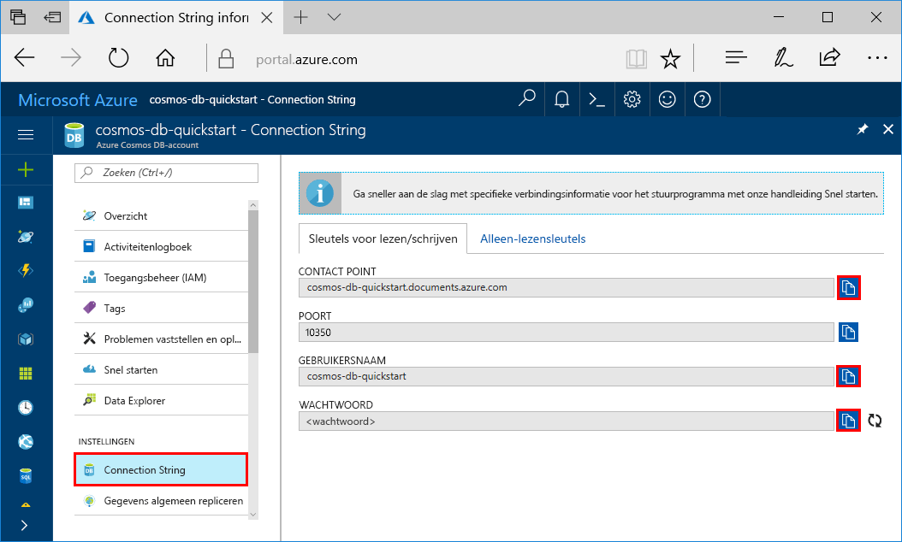
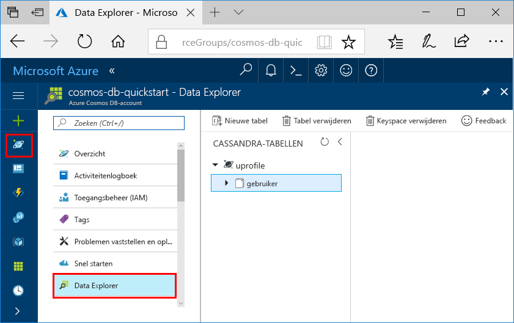

# <a name="quickstart-build-a-cassandra-app-with-nodejs-and-azure-cosmos-db"></a>Snelstartgids: Een app Cassandra met Node.js en Azure Cosmos DB bouwen

Deze snelstartgids laat zien hoe u Node.js en de Azure DB die Cosmos [Cassandra API](cassandra-introduction.md) voor het bouwen van een app profiel door het klonen van een voorbeeld van GitHub. Deze snelstartgids leidt u door het maken van een Azure DB die Cosmos-account via het web gebaseerde Azure-portal.

Azure Cosmos-database is de service van Microsoft wereldwijd gedistribueerde database voor meerdere model. U kunt snel maken en query document, tabel, sleutel / waarde- en grafiek databases, die allemaal van de algemene distributie en de mogelijkheden van de horizontale schaal de kern van Azure Cosmos DB profiteren. 

## <a name="prerequisites"></a>Vereisten

[!INCLUDE [quickstarts-free-trial-note](../../includes/quickstarts-free-trial-note.md)]U kunt ook [gratis Azure Cosmos DB probeer](https://azure.microsoft.com/try/cosmosdb/) gratis verbintenissen en zonder een Azure-abonnement.

Toegang tot de API van Azure Cosmos DB Cassandra preview-programma. Als u nog niet voor toegang tot toegepast [nu aanmelden](cassandra-introduction.md#sign-up-now).

Daarnaast doet u het volgende:
* [Node.js](https://nodejs.org/en/) versie v0.10.29 of hoger
* [Git](http://git-scm.com/)

## <a name="create-a-database-account"></a>Een databaseaccount maken

Voordat u een documentdatabase maken kunt, moet u een Cassandra-account maken met Azure Cosmos DB.

[!INCLUDE [cosmos-db-create-dbaccount-cassandra](../../includes/cosmos-db-create-dbaccount-cassandra.md)]

## <a name="clone-the-sample-application"></a>De voorbeeldtoepassing klonen

Nu gaan we kloon een Cassandra-API-app vanuit github, de verbindingsreeks instellen en uitvoeren. U zult zien hoe gemakkelijk het is om op een programmatische manier met gegevens te werken. 

1. Open een git-terminalvenster zoals git bash, en gebruik de `cd` opdracht om te wijzigen naar een map voor het installeren van de voorbeeld-app. 

    ```bash
    cd "C:\git-samples"
    ```

2. Voer de volgende opdracht uit om de voorbeeldopslagplaats te klonen. Deze opdracht maakt u een kopie van de voorbeeld-app op uw computer.

    ```bash
    git clone https://github.com/Azure-Samples/azure-cosmos-db-cassandra-nodejs-getting-started.git
    ```

## <a name="review-the-code"></a>De code bekijken

Deze stap is optioneel. Als u wilt weten hoe de databaseresources worden gemaakt in de code bent, kunt u de volgende codefragmenten bekijken. De codefragmenten zijn afkomstig uit de `uprofile.js` bestand in de map C:\git-samples\azure-cosmos-db-cassandra-nodejs-getting-started. Anders kunt u verder gaan naar [bijwerken van de verbindingsreeks](#update-your-connection-string). 

* Gebruikersnaam en wachtwoord is ingesteld met behulp van de pagina van de tekenreeks verbinding in de Azure portal. 'path\to\cert' bevat een pad naar een X509 certificaat. 

   ```nodejs
   var ssl_option = {
        cert : fs.readFileSync("path\to\cert"),
        rejectUnauthorized : true,
        secureProtocol: 'TLSv1_2_method'
        };
   const authProviderLocalCassandra = new cassandra.auth.PlainTextAuthProvider(config.username, config.password);
   ```

* De `client` is geïnitialiseerd met contactPoint informatie. De contactPoint wordt opgehaald uit de Azure-portal.

    ```nodejs
    const client = new cassandra.Client({contactPoints: [config.contactPoint], authProvider: authProviderLocalCassandra, sslOptions:ssl_option});
    ```

* De `client` maakt verbinding met de Azure-API voor Cassandra Cosmos DB.

    ```nodejs
    client.connect(next);
    ```

* Een nieuwe keyspace wordt gemaakt.

    ```nodejs
    function createKeyspace(next) {
        var query = "CREATE KEYSPACE IF NOT EXISTS uprofile WITH replication = {\'class\': \'NetworkTopologyStrategy\', \'datacenter1\' : \'1\' }";
        client.execute(query, next);
        console.log("created keyspace");    
  }
    ```

* Een nieuwe tabel is gemaakt.

   ```nodejs
   function createTable(next) {
    var query = "CREATE TABLE IF NOT EXISTS uprofile.user (user_id int PRIMARY KEY, user_name text, user_bcity text)";
        client.execute(query, next);
        console.log("created table");
   },
   ```

* Sleutel/waarde-entiteiten worden ingevoegd.

    ```nodejs
    ...
       {
          query: 'INSERT INTO  uprofile.user  (user_id, user_name , user_bcity) VALUES (?,?,?)',
          params: [5, 'IvanaV', 'Belgaum', '2017-10-3136']
        }
    ];
    client.batch(queries, { prepare: true}, next);
    ```

* Query voor het ophalen van alle sleutelwaarden ophalen.

    ```nodejs
   var query = 'SELECT * FROM uprofile.user';
    client.execute(query, { prepare: true}, function (err, result) {
      if (err) return next(err);
      result.rows.forEach(function(row) {
        console.log('Obtained row: %d | %s | %s ',row.user_id, row.user_name, row.user_bcity);
      }, this);
      next();
    });
    ```  
    
* De query voor het ophalen van een sleutel-waarde.

    ```nodejs
    function selectById(next) {
        console.log("\Getting by id");
        var query = 'SELECT * FROM uprofile.user where user_id=1';
        client.execute(query, { prepare: true}, function (err, result) {
        if (err) return next(err);
            result.rows.forEach(function(row) {
            console.log('Obtained row: %d | %s | %s ',row.user_id, row.user_name, row.user_bcity);
        }, this);
        next();
        });
    }
    ```  

## <a name="update-your-connection-string"></a>Uw verbindingsreeks bijwerken

Ga nu terug naar Azure Portal om de verbindingsreeksinformatie op te halen en kopieer deze in de app. Hierdoor kan uw app kan communiceren met uw gehoste-database.

1. In de [Azure-portal](http://portal.azure.com/), klikt u op **verbindingsreeks**. 

    Gebruik de  knop aan de rechterkant van het scherm voor het kopiëren van de bovenste waarde, het CONTACT-punt.

    

2. Open het `config.js`-bestand. 

3. De waarde van het punt van CONTACT vanuit de portal via plakken `<FillMEIN>` op regel 4.

    Regel 4 nu zijn vergelijkbaar met 

    `config.contactPoint = "cosmos-db-quickstarts.documents.azure.com:10350"`

4. De waarde van de gebruikersnaam van de portal kopiëren en plakken via `<FillMEIN>` op regel 2.

    Regel 2 nu zijn vergelijkbaar met 

    `config.username = 'cosmos-db-quickstart';`
    
5. De waarde van het wachtwoord van de portal kopiëren en plakken via `<FillMEIN>` op regel 3.

    Regel 3 nu zijn vergelijkbaar met

    `config.password = '2Ggkr662ifxz2Mg==';`

6. Sla het bestand config.js.
    
## <a name="use-the-x509-certificate"></a>Gebruik de X509-certificaat 

1. Als u het Baltimore CyberTrust Root toevoegen moet, heeft het serienummer 02:00:00:b9 en SHA1 vingerafdruk d4🇩🇪20:d0:5e:66:fc:53:fe:1a:50:88:2 c: 78:db:28:52:ca:e4:74. Deze kan worden gedownload vanuit https://cacert.omniroot.com/bc2025.crt, opgeslagen op een lokaal bestand met extensie .cer. 

2. Open uprofile.js en path\to\cert om te verwijzen naar het nieuwe certificaat te wijzigen. 

3. Uprofile.js opslaan. 

## <a name="run-the-app"></a>De app uitvoeren

1. Voer in het terminalvenster git `npm install` voor het installeren van de vereiste npm-modules.

2. Voer `node uprofile.js` om uw knooppunttoepassing te starten.

3. Controleer of de resultaten naar verwachting vanaf de opdrachtregel.

    

    Druk op CTRL + c drukken om te stoppen exection van het programma en sluit het consolevenster. 

    U kunt nu Data Explorer openen in de Azure portal om te zien van de query, wijzigen en werken met deze nieuwe gegevens. 

     

## <a name="review-slas-in-the-azure-portal"></a>SLA’s bekijken in Azure Portal

[!INCLUDE [cosmosdb-tutorial-review-slas](../../includes/cosmos-db-tutorial-review-slas.md)]

## <a name="clean-up-resources"></a>Resources opschonen

[!INCLUDE [cosmosdb-delete-resource-group](../../includes/cosmos-db-delete-resource-group.md)]

## <a name="next-steps"></a>Volgende stappen

In deze Quick Start hebt u geleerd hoe u een Azure Cosmos DB-account kunt maken, hoe u een verzameling kunt maken met Data Explorer en hebt u een app uitgevoerd. Nu kunt u aanvullende gegevens in uw Cosmos DB-account importeren. 

> [!div class="nextstepaction"]
> [Cassandra gegevens importeren in Azure Cosmos-DB](cassandra-import-data.md)


