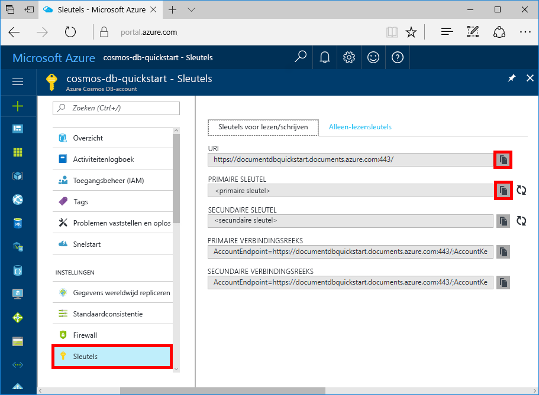

# <a name="quickstart-build-a-net-web-app-with-azure-cosmos-db-using-the-sql-api-and-the-azure-portal"></a>Quickstart: Een .NET-web-app met Azure Cosmos DB ontwikkelen met de SQL API en de Azure-portal

Azure Cosmos DB is de globaal gedistribueerde multimodel-databaseservice van Microsoft. U kunt snel databases maken van documenten, sleutel/waarde-paren en grafieken en hier query’s op uitvoeren. Deze databases genieten allemaal het voordeel van de globale distributie en horizontale schaalmogelijkheden die ten grondslag liggen aan Azure Cosmos DB. 

Deze snelstartgids laat zien hoe u een [SQL-API](sql-api-introduction.md)-account van Azure Cosmos DB, een documentdatabase en een verzameling kunt maken met behulp van Azure Portal. U moet vervolgens een Takenlijst-web-app maken en implementeren op de [SQL .NET API](sql-api-sdk-dotnet.md), zoals wordt weergegeven in de volgende schermopname. 


## <a name="prerequisites"></a>Vereisten

Als u Visual Studio 2017 nog niet hebt geïnstalleerd, kunt u het downloaden en de **gratis** [Community Edition van Visual Studio 2017](https://www.visualstudio.com/downloads/) gebruiken. Zorg ervoor dat u **Azure-ontwikkeling** inschakelt tijdens de installatie van Visual Studio.

[!INCLUDE [quickstarts-free-trial-note](../../includes/quickstarts-free-trial-note.md)] 
[!INCLUDE [cosmos-db-emulator-docdb-api](../../includes/cosmos-db-emulator-docdb-api.md)]  

<a id="create-account"></a>
## <a name="create-a-database-account"></a>Een databaseaccount maken

[!INCLUDE [cosmos-db-create-dbaccount](../../includes/cosmos-db-create-dbaccount.md)]

<a id="create-collection"></a>
## <a name="add-a-collection"></a>Een verzameling toevoegen

[!INCLUDE [cosmos-db-create-collection](../../includes/cosmos-db-create-collection.md)]

<a id="add-sample-data"></a>
## <a name="add-sample-data"></a>Voorbeeldgegevens toevoegen

[!INCLUDE [cosmos-db-create-sql-api-add-sample-data](../../includes/cosmos-db-create-sql-api-add-sample-data.md)]

## <a name="query-your-data"></a>Uw gegevens opvragen

[!INCLUDE [cosmos-db-create-sql-api-query-data](../../includes/cosmos-db-create-sql-api-query-data.md)]

## <a name="clone-the-sample-application"></a>De voorbeeldtoepassing klonen

Nu gaan we werken met code. We gaan nu een SQL API-app klonen vanaf GitHub, de verbindingsreeks instellen en de app uitvoeren. U zult zien hoe gemakkelijk het is om op een programmatische manier met gegevens te werken. 

1. Open een opdrachtprompt, maak een nieuwe map met de naam git-samples en sluit vervolgens de opdrachtprompt.

    ```bash
    md "C:\git-samples"
    ```

2. Open een git-terminalvenster, bijvoorbeeld git bash, en gebruik de `cd`-opdracht om naar de nieuwe map te gaan voor het installeren van de voorbeeld-app.

    ```bash
    cd "C:\git-samples"
    ```

3. Voer de volgende opdracht uit om de voorbeeldopslagplaats te klonen. Deze opdracht maakt een kopie van de voorbeeld-app op uw computer.

    ```bash
    git clone https://github.com/Azure-Samples/documentdb-dotnet-todo-app.git
    ```

4. Open vervolgens het todo-oplossingenbestand in Visual Studio. 

## <a name="review-the-code"></a>De code bekijken

Deze stap is optioneel. Als u wilt weten hoe de databaseresources in de code worden gemaakt, kunt u de volgende codefragmenten bekijken. Als u deze stap wilt overslaan, kunt u verdergaan naar [Uw verbindingsreeks bijwerken](#update-your-connection-string). 

De volgende codefragmenten zijn allemaal afkomstig uit het bestand DocumentDBRepository.cs.

* De DocumentClient wordt geïnitialiseerd op regel 76.

    ```csharp
    client = new DocumentClient(new Uri(ConfigurationManager.AppSettings["endpoint"]), ConfigurationManager.AppSettings["authKey"]);
    ```

* Er wordt een nieuwe database gemaakt op regel 91.

    ```csharp
    await client.CreateDatabaseAsync(new Database { Id = DatabaseId });
    ```

* Er wordt een nieuwe verzameling gemaakt op regel 110.

    ```csharp
    await client.CreateDocumentCollectionAsync(
        UriFactory.CreateDatabaseUri(DatabaseId),
        new DocumentCollection
            {
               Id = CollectionId
            },
        new RequestOptions { OfferThroughput = 400 });
    ```

## <a name="update-your-connection-string"></a>Uw verbindingsreeks bijwerken

Ga nu terug naar Azure Portal om de verbindingsreeksinformatie op te halen en kopieer deze in de app.

1. Klik in [Azure Portal](http://portal.azure.com/), in uw Azure Cosmos DB-account, in het linker navigatiegedeelte op **Sleutels** en klik vervolgens op **Sleutels voor lezen/schrijven**. In de volgende stap gebruikt u de kopieerknoppen aan de rechterkant van het scherm om de URI en primaire sleutel in het bestand web.config te kopiëren.

    

2. Open in Visual Studio 2017 het bestand web.config. 

3. Kopieer uw URI-waarde vanaf de portal (met de kopieerknop) en geef deze als waarde aan de eindpuntsleutel in web.config. 

    `<add key="endpoint" value="FILLME" />`

4. Kopieer vervolgens de waarde van uw PRIMAIRE SLEUTEL vanaf de portal en geef deze als authKey-waarde in web.config. U hebt uw app nu bijgewerkt met alle informatie die nodig is voor de communicatie met Azure Cosmos DB. 

    `<add key="authKey" value="FILLME" />`
    
## <a name="run-the-web-app"></a>De web-app uitvoeren
1. Klik in Visual Studio met de rechtermuisknop op het project in **Solution Explorer** en klik vervolgens op **NuGet-pakketten beheren**. 

2. Typ in het NuGet-vak **Bladeren** *DocumentDB*.

3. Installeer vanuit de resultaten de bibliotheek **Microsoft.Azure.DocumentDB**. Hiermee installeert u het pakket Microsoft.Azure.DocumentDB, evenals alle afhankelijkheden.

4. Klik op Ctrl+F5 om de toepassing uit te voeren. Uw app wordt in uw browser weergegeven. 

5. Klik op **Nieuwe maken** in de browser en maak een paar nieuwe taken in uw taken-app.

   

U kunt nu teruggaan naar Data Explorer en deze nieuwe gegevens bekijken, wijzigen, een query erop uitvoeren of er iets anders mee doen. 

## <a name="review-slas-in-the-azure-portal"></a>SLA’s bekijken in Azure Portal

[!INCLUDE [cosmosdb-tutorial-review-slas](../../includes/cosmos-db-tutorial-review-slas.md)]

## <a name="clean-up-resources"></a>Resources opschonen

[!INCLUDE [cosmosdb-delete-resource-group](../../includes/cosmos-db-delete-resource-group.md)]

## <a name="next-steps"></a>Volgende stappen

In deze Quick Start hebt u geleerd hoe u een Azure Cosmos DB-account kunt maken, hoe u een verzameling kunt maken met Data Explorer en hebt u een web-app uitgevoerd. Nu kunt u aanvullende gegevens in uw Cosmos DB-account importeren. 

> [!div class="nextstepaction"]
> [Gegevens importeren in Azure Cosmos DB](import-data.md)


