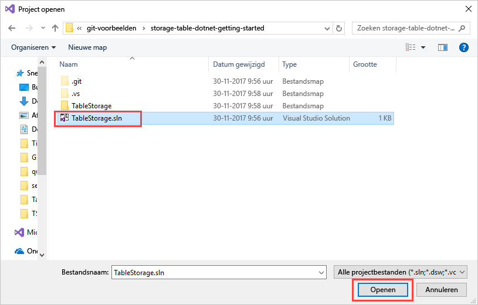
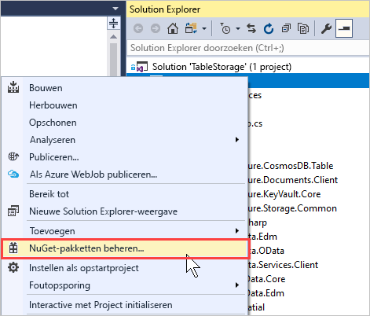
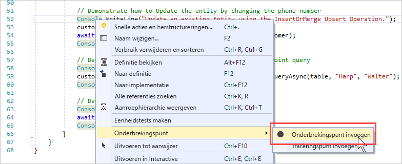

# <a name="quickstart-build-a-table-api-app-with-net-and-azure-cosmos-db"></a>Quickstart: Een Table-API compileren met .NET en Azure Cosmos DB 

Deze quickstart laat zien hoe u .NET en de [Table-API](table-introduction.md) van Azure Cosmos DB gebruikt voor het compileren van een app door een voorbeeld uit GitHub te klonen. In deze quickstart ziet u ook hoe u een Azure Cosmos DB-account maakt en hoe u Data Explorer gebruikt om tabellen en entiteiten te maken in Azure Portal op internet.

Azure Cosmos DB is de globaal gedistribueerde multimodel-databaseservice van Microsoft. U kunt snel databases maken van documenten, sleutel/waarde-paren en grafieken en hier query’s op uitvoeren. Deze databases genieten allemaal het voordeel van de globale distributie en horizontale schaalmogelijkheden die ten grondslag liggen aan Azure Cosmos DB. 

## <a name="prerequisites"></a>Vereisten

Als u Visual Studio 2017 nog niet hebt geïnstalleerd, kunt u het downloaden en de **gratis** [Community Edition van Visual Studio 2017](https://www.visualstudio.com/downloads/) gebruiken. Zorg ervoor dat u **Azure-ontwikkeling** inschakelt tijdens de installatie van Visual Studio.

[!INCLUDE [quickstarts-free-trial-note](../../includes/quickstarts-free-trial-note.md)]

## <a name="create-a-database-account"></a>Een databaseaccount maken

> [!IMPORTANT] 
> U moet een nieuw Table-API-account maken om te kunnen werken met de algemeen beschikbare SDK's voor de Table-API. Table-API-accounts die zijn gemaakt tijdens de preview worden niet ondersteund door de algemeen beschikbare SDK's.
>

[!INCLUDE [cosmos-db-create-dbaccount-table](../../includes/cosmos-db-create-dbaccount-table.md)]

## <a name="add-a-table"></a>Een tabel toevoegen

[!INCLUDE [cosmos-db-create-table](../../includes/cosmos-db-create-table.md)]

## <a name="add-sample-data"></a>Voorbeeldgegevens toevoegen

[!INCLUDE [cosmos-db-create-table-add-sample-data](../../includes/cosmos-db-create-table-add-sample-data.md)]

## <a name="clone-the-sample-application"></a>De voorbeeldtoepassing klonen

We gaan nu een Table-app klonen vanaf GitHub, de verbindingsreeks instellen en de app uitvoeren. U zult zien hoe gemakkelijk het is om op een programmatische manier met gegevens te werken. 

1. Open een opdrachtprompt, maak een nieuwe map met de naam git-samples en sluit vervolgens de opdrachtprompt.

    ```bash
    md "C:\git-samples"
    ```

2. Open een git-terminalvenster, bijvoorbeeld git bash, en gebruik de `cd`-opdracht om naar de nieuwe map te gaan voor het installeren van de voorbeeld-app.

    ```bash
    cd "C:\git-samples"
    ```

3. Voer de volgende opdracht uit om de voorbeeldopslagplaats te klonen. Deze opdracht maakt een kopie van de voorbeeld-app op uw computer.

    ```bash
    git clone https://github.com/Azure-Samples/storage-table-dotnet-getting-started.git
    ```
## <a name="open-the-sample-application-in-visual-studio"></a>De voorbeeldtoepassing openen in Visual Studio

1. In Visual Studio opent u het menu **Bestand**, kiest u **Openen** en vervolgens **Project/oplossing**. 

    

2. Navigeer naar de map waarin u de voorbeeldtoepassing hebt gekloond en open het bestand TableStorage.sln.

    

## <a name="update-your-connection-string"></a>Uw verbindingsreeks bijwerken

Ga nu terug naar Azure Portal om de verbindingsreeksinformatie op te halen en kopieer deze in de app. Hierdoor kan de app communiceren met de gehoste database. 

1. Klik in [Azure Portal](http://portal.azure.com/) op **Verbindingsreeks**. 

    Gebruik de kopieerknop aan de rechterkant van het venster om de **PRIMARY CONNECTION STRING** te kopiëren.

    

2. In Visual Studio opent u het bestand App.config. 

3. Verwijder de opmerking bij de StorageConnectionString op regel 8 en markeer StorageConnectionString op regel 7 als commentaar. Dit omdat deze zelfstudie geen gebruikmaakt van de Azure SDK Storage Emulator. Regel 7 en 8 moeten er nu zo uitzien:

    ```
    <!--key="StorageConnectionString" value="UseDevelopmentStorage=true;" />-->
    <add key="StorageConnectionString" value="DefaultEndpointsProtocol=https;AccountName=[AccountName];AccountKey=[AccountKey]" />
    ```

4. Plak de **PRIMARY CONNECTION STRING** vanuit de portal in de waarde StorageConnectionString op regel 8. Plak de tekenreeks tussen de aanhalingstekens. 

    > [!IMPORTANT]
    > Als uw eindpunt documents.azure.com gebruikt, hebt u blijkbaar een preview-account en moet u een [nieuw Table-API-account](#create-a-database-account) maken om te kunnen werken met de algemeen beschikbare SDK voor Table- API. 
    > 

    Regel 8 moet nu ongeveer als volgt uitzien:

    ```
    <add key="StorageConnectionString" value="DefaultEndpointsProtocol=https;AccountName=<account name>;AccountKey=txZACN9f...==;TableEndpoint=https://<account name>.table.cosmosdb.azure.com;" />
    ```

5. Druk op CTRL+S om het App.config-bestand op te slaan.

U hebt uw app nu bijgewerkt met alle informatie die nodig is voor de communicatie met Azure Cosmos DB. 

## <a name="build-and-deploy-the-app"></a>De app compileren en implementeren

1. Klik in Visual Studio met de rechtermuisknop op het project **TableStorage** in **Solution Explorer** en klik vervolgens op **NuGet-pakketten beheren**. 

   
2. Typ in het NuGet-vak **Bladeren** *Microsoft.Azure.CosmosDB.Table*. Daarmee wordt de clientbibliotheek Cosmos DB-tabel API gevonden.
   
   

3. Klik op **Installeren** om de bibliotheek **Microsoft.Azure.CosmosDB.Table** te installeren. Hiermee worden het pakket voor de Azure Cosmos DB-tabel API en alle daarvoor vereiste onderdelen geïnstalleerd.

    

4. Open BasicSamples.cs. Klik met de rechtermuisknop op regel 52, selecteer **Onderbrekingspunt** en selecteer **Onderbrekingspunt invoegen**. Voeg nog een onderbrekingspunt in op regel 55.

    

5. Druk op F5 om de toepassing uit te voeren.

    In het consolevenster wordt de naam van de nieuwe tabeldatabase (in dit geval demo91ab4) weergegeven in Azure Cosmos DB. 
    
    

    Als u een fout over afhankelijkheden krijgt, bekijkt u de [Probleemoplossing](table-sdk-dotnet.md#troubleshooting).

    Als u het eerste onderbrekingspunt bereikt, gaat u terug naar de Data Explorer in Azure Portal. Klik op de knop **Vernieuwen**, vouw de demo*-tabel uit en klik op **Entiteiten**. Het tabblad **Entiteiten** aan de rechterkant geeft de nieuwe entiteit weer die is toegevoegd voor Walter Harp. U ziet dat het telefoonnummer voor de nieuwe entiteit 425-555-0101 is.

    
    
6. Sluit het tabblad **Entiteiten** in Data Explorer.
    
7. Druk op F5 om de app uit te voeren tot het volgende onderbrekingspunt wordt bereikt. 

    Wanneer u het onderbrekingspunt bereikt, gaat u terug naar Azure Portal en klikt u opnieuw op **Entiteiten** om het tabblad **Entiteiten** te openen. U ziet dat het telefoonnummer is bijgewerkt naar 425-555-0105.

8. Druk op F5 om de app uit te voeren. 
 
   De app voegt entiteiten toe voor gebruik in een geavanceerde voorbeeld-app die momenteel niet door de tabel-API wordt ondersteund. De app verwijdert vervolgens de tabel die door de voorbeeld-app is gemaakt.

9. Druk in het consolevenster op Enter om te stoppen met de uitvoering van de app. 
  

## <a name="review-slas-in-the-azure-portal"></a>SLA’s bekijken in Azure Portal

[!INCLUDE [cosmosdb-tutorial-review-slas](../../includes/cosmos-db-tutorial-review-slas.md)]

## <a name="clean-up-resources"></a>Resources opschonen

[!INCLUDE [cosmosdb-delete-resource-group](../../includes/cosmos-db-delete-resource-group.md)]

## <a name="next-steps"></a>Volgende stappen

In deze Quick Start hebt u geleerd hoe u een Azure Cosmos DB-account kunt maken, hebt u een tabel gemaakt met de Data Explorer en hebt u een app uitgevoerd.  Nu kunt u een query uitvoeren op uw gegevens met de Table-API.  

> [!div class="nextstepaction"]
> [Tabelgegevens importeren in de Table-API](table-import.md)

