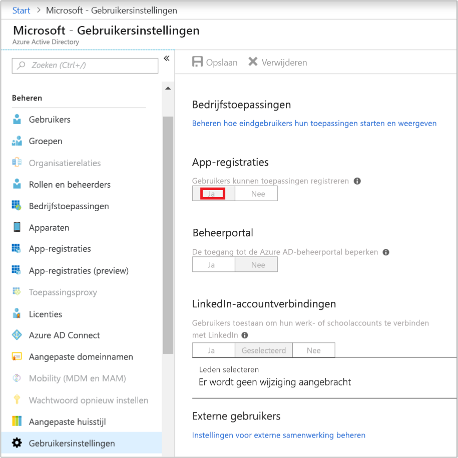
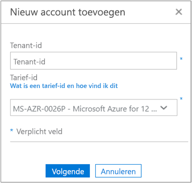
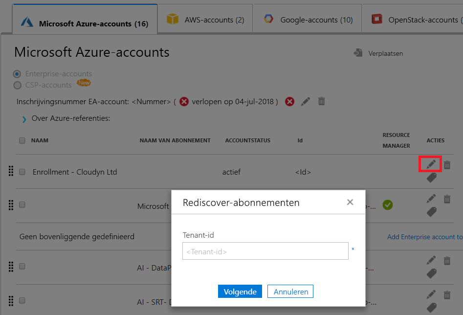

# Azure-abonnementen en accounts met Azure kosten Management activeren

Toevoegen of bijwerken van de referenties van uw Azure Resource Manager kunt Azure kostenbeheer voor het detecteren van de accounts en -abonnementen binnen uw Azure-Tenant. Als u ook Azure Diagnostics-extensie is ingeschakeld op uw virtuele machines hebt, kan Azure kosten Management uitgebreide metrische gegevens zoals CPU en geheugen verzamelen. Dit artikel wordt beschreven hoe u toegang met behulp van Azure Resource Manager-API's voor nieuwe en bestaande accounts. Ook wordt beschreven hoe algemene account problemen kunt oplossen.

Azure Kostenbeheer heeft geen toegang tot de meeste van de gegevens van uw Azure-abonnement wanneer het abonnement _niet-geactiveerde_. U moet bewerken _niet-geactiveerde_ accounts zodat Azure kosten Management er toegang toe hebben.

## Vereiste machtigingen voor Azure

Specifieke machtigingen nodig zijn om de procedures in dit artikel te voltooien. U of uw tenantbeheerder moet hebben beide van de volgende machtigingen:

- Machtiging voor het registreren van de toepassing CloudynCollector bij uw Azure AD-tenant.
- De mogelijkheid om de toepassing toewijzen aan een rol in uw Azure-abonnementen.

Uw Azure-abonnementen uw accounts moeten hebben `Microsoft.Authorization/*/Write` toegang tot de toepassing CloudynCollector toewijzen. Deze actie wordt verleend via de [eigenaar](../active-directory/role-based-access-built-in-roles.md#owner) rol of [beheerder voor gebruikerstoegang](../active-directory/role-based-access-built-in-roles.md#user-access-administrator) rol.

Als uw account is toegewezen aan de **Inzender** rol, u hebt niet voldoende machtiging voor het toewijzen van de toepassing. U ontvangt een fout opgetreden bij een poging de CloudynCollector toepassing toewijzen aan uw Azure-abonnement.

### Controleer de machtigingen voor Azure Active Directory

1. Meld u aan bij de [Azure-portal](https://portal.azure.com).
2. Selecteer in de Azure-portal **Azure Active Directory**.
3. Selecteer in Azure Active Directory, **gebruikersinstellingen**.
4. Controleer de **App registraties** optie.
    - Als deze is ingesteld op **Ja**, en vervolgens de niet-beheerders kunnen zich registreren AD-apps. Deze instelling betekent dat elke gebruiker in de Azure AD-tenant een app kunt registreren. U kunt doorgaan met machtigingen voor vereist Azure-abonnement.  
    
    - Als de **App registraties** optie is ingesteld op **Nee**, en vervolgens alleen tenant administratieve gebruikers zich apps in Azure Active Directory registreren kunnen. Uw tenantbeheerder moet de toepassing CloudynCollector registreren.

## Toevoegen van een account of een abonnement bijwerken

Wanneer u een account update een abonnement toevoegt, kunt u Azure kosten Management toegang verlenen tot uw Azure-gegevens.

### Een nieuwe account (abonnement) toevoegt

1. In de beheerportal van Azure kosten op het symbool tandwielpictogram in de rechterbovenhoek en selecteer **Accounts in de Cloud**.
2. Klik op **nieuwe account toevoegt** en de **nieuwe account toevoegt** verschijnt. Geef de vereiste informatie.  
    

### Een abonnement bijwerken

1. Als u wilt bijwerken een _niet-geactiveerde_ abonnement dat al voorkomt in Azure kostenbeheer in beheer van Accounts, klikt u op het symbool bewerken Pen rechts van de bovenliggende _tenant-GUID_. Abonnementen zijn gegroepeerd onder een bovenliggende-tenant, dus Vermijd abonnementen afzonderlijk activeren.
    
2. Indien nodig, de Tenant-ID invoeren. Als u uw Tenant-ID niet weet, gebruikt u de volgende stappen uit te vinden:
    1. Meld u aan bij de [Azure-portal](https://portal.azure.com).
    2. Selecteer in de Azure-portal **Azure Active Directory**.
    3. Als u de tenant-ID, selecteer **eigenschappen** voor uw Azure AD-tenant.
    4. Kopieer de map-ID-GUID. Deze waarde is uw tenant-ID.
    Zie voor meer informatie [tenant-ID ophalen](../azure-resource-manager/resource-group-create-service-principal-portal.md#get-tenant-id).
3. Indien nodig, selecteert u uw snelheid. Als u niet dat uw tarief-ID weet, gebruikt u de volgende stappen uit te vinden.
    1. In de rechterbovenhoek van de Azure portal uw gebruikersgegevens op en klik op **weergeven van mijn factuur**.
    2. Onder **factureringsaccount**, klikt u op **abonnementen**.
    3. Onder **abonnementen**, selecteer het abonnement.
    4. De snelheid van de ID die wordt weergegeven onder **bieden ID**. Kopieer de ID bieden voor het abonnement.
4. In het nieuwe account toevoegen (of een abonnement bewerken) in het vak **opslaan** (of **volgende**). U wordt omgeleid naar de Azure-portal.
5. Aanmelden bij de portal. Klik op **accepteren** autoriseren Azure kosten Management Collector toegang heeft tot uw Azure-account.

    U bent omgeleid naar de pagina Azure kosten Management Accounts beheren en uw abonnement is bijgewerkt met **active** accountstatus. Een groen vinkje symbool onder de Resource Manager-kolom moet worden weergegeven.

    Als er geen een groen vinkje voor een of meer van de abonnementen, betekent dit dat u bent niet gemachtigd om de reader-app (CloudynCollector) voor het abonnement te maken. Herhaal dit proces moet een gebruiker met hogere machtigingen voor het abonnement.

Bekijk de [verbinding te maken in Azure Resource Manager met Azure kosten Management door Cloudyn](https://youtu.be/oCIwvfBB6kk) video die bij het proces helpt.

>[!VIDEO https://www.youtube.com/embed/oCIwvfBB6kk?ecver=1]

## Oplossen van algemene problemen van de indirecte enterprise installeren

Wanneer u de beheerportal van Azure kosten voor het eerst gebruikt, ziet u mogelijk de volgende berichten te zien als u een Enterprise Agreement of Cloud Solution Provider (CSP) gebruiker:

- *De opgegeven API-sleutel is geen sleutel bovenste niveau inschrijving* weergegeven in de **instellen van Azure kosten Management** wizard.
- *Directe inschrijving – niet* weergegeven in de Enterprise Agreement-portal.
- *Er is geen gebruiksgegevens gevonden voor de afgelopen 30 dagen. Neem contact op met uw leverancier om te controleren of de opmaak is ingeschakeld voor uw Azure-account* weergegeven in de beheerportal van Azure kosten.

De voorgaande berichten geven aan dat u een Enterprise Agreement voor Azure via een wederverkoper of CSP hebt aangeschaft. Uw wederverkoper of CSP moet inschakelen _markup_ voor uw Azure-account zodat u kunt uw gegevens weergeven in Azure kosten Management.

Ga als volgt de problemen op te lossen:

1. Uw reseller nodig heeft om in te schakelen _markup_ voor uw account. Voor instructies raadpleegt u de [indirecte Onboarding-handleiding voor klant](https://ea.azure.com/api/v3Help/v2IndirectCustomerOnboardingGuide).
2. U de Enterprise Agreement voor Azure-sleutel voor gebruik met Azure kosten Management genereren. Zie voor instructies [registreren van een Enterprise Agreement voor Azure en de weergave kostengegevens](https://docs.microsoft.com/en-us/azure/cost-management/quick-register-ea).

Alleen een beheerder van de Azure-service kunt kostenbeheer inschakelen. U hebt onvoldoende beheerdersmachtigingen voor CO.

Voordat u de Azure Enterprise Agreement API-sleutel voor het instellen van Azure kosten Management genereren kunt, moet u de Azure-facturering API inschakelen door de instructies op:

- [Overzicht van de rapportage-API's voor Enterprise-klanten](../billing/billing-enterprise-api.md)
- [Microsoft Azure enterprise portal rapportage-API](https://ea.azure.com/helpdocs/reportingAPI) onder **gegevenstoegang tot de API inschakelen**

U moet wellicht ook geven afdeling beheerders, account eigenaars en enterprise-administrators machtigingen voor _kosten weergeven_ met de API voor facturering.

## Volgende stappen

- Als u nog niet de eerste zelfstudie hebt voltooid voor het beheer van kosten, leest u op het [gebruik en kosten bekijken](tutorial-review-usage.md).
