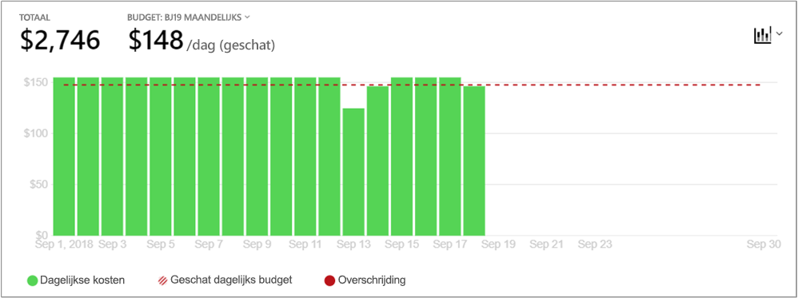
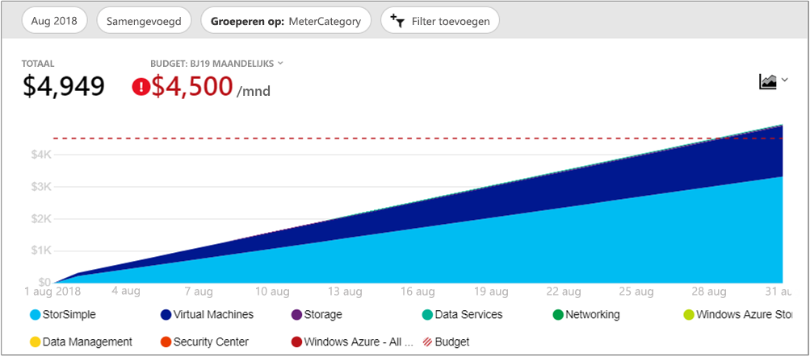

# Snelstart, de kosten van Azure verkennen en analyseren met Kostenanalyse

Voordat u de kosten van Azure goed kunt beheren en optimaliseren, moet u de oorsprong van de kosten in uw bedrijf weten. Het is ook handig om te weten hoeveel uw diensten kosten en welke omgevingen en systemen erdoor worden ondersteund. Inzicht in de volle breedte van alle kosten is noodzakelijk om nauwkeurig de uitgavenpatronen van uw bedrijf te leren kennen. Uitgavenpatronen kunnen worden gebruikt om kostenbeheersingsmechanismen als budgetten af te dwingen.

In deze snelstart gebruikt u kostenanalyse om de kosten van Azure voor uw bedrijf te verkennen en te analyseren. U kunt de totale kosten per bedrijf weergeven, zodat u begrijpt waar de kosten worden opgebouwd en uitgavenpatronen kunt identificeren. U kunt de totale kosten bekijken om geschatte kostentrends per maand, per kwartaal en zelfs per jaar naast een budget te leggen. Een budget helpt bij het in acht nemen van financiële beperkingen. En een budget wordt gebruikt om dagelijkse en maandelijkse kosten te bekijken om onregelmatigheden in de uitgaven te isoleren. Plus, u kunt de gegevens van het huidige rapport downloaden voor verdere analyse of om in een extern systeem te gebruiken.

In deze snelstart leert u de volgende zaken:

- Kosten in kostenanalyse beoordelen
- Kostenweergaven aanpassen
- Gegevens van kostenanalyse downloaden

## Vereisten

Kostenanalyse is beschikbaar voor alle klanten met een [Enterprise Overeenkomst (EO)](https://azure.microsoft.com/pricing/enterprise-agreement/). U moet minimaal leestoegang hebben tot een of meer van de volgende bereiken om kostengegevens te kunnen bekijken.

- Het bereik van het *factureringsaccount* is opgegeven in https://ea.azure.com en vereist toegang op het niveau van Enterprise-beheerder. Er is geen EA-instelling vereist. Factureringsgegevens in kostenanalyse worden samengevoegd voor alle abonnementen in de Enterprise Overeenkomst. Een factureringsaccount wordt vaak aangeduid als de *Enterprise Overeenkomst* of *Inschrijving*.

- Het bereik van de *afdeling* is opgegeven in https://ea.azure.com en vereist toegang op het niveau van Afdelingsbeheerder. De instelling **DA-kosten weergeven** moet zijn ingeschakeld in de EA-portal. Factureringsgegevens in kostenanalyse worden samengevoegd voor alle abonnementen die behoren tot het inschrijvingsaccount dat is gekoppeld aan de afdeling.

- Het bereik van het *inschrijvingsaccount* is opgegeven in https://ea.azure.com en vereist toegang op het niveau van Accounteigenaar. De instelling **AO-kosten weergeven** moet zijn ingeschakeld in de EA-portal. Factureringsgegevens in kostenanalyse worden samengevoegd voor alle abonnementen die behoren tot het inschrijvingsaccount. Het inschrijvingsaccount wordt vaak aangeduid als de *accounteigenaar*.

- Het bereik van de *beheergroep* wordt opgegeven in https://portal.azure.com en vereist toegang op het niveau van Lezer Cost Management(of Lezer). De instelling **AO-kosten weergeven** moet zijn ingeschakeld in de EA-portal. Factureringsgegevens in kostenanalyse worden samengevoegd voor alle abonnementen onder de beheergroep.

- Het bereik van het *abonnement* wordt opgegeven in https://portal.azure.com en vereist toegang op het niveau van Lezer Cost Management (of Lezer). De instelling **AO-kosten weergeven** moet zijn ingeschakeld in de EA-portal. Factureringsgegevens in kostenanalyse worden samengevoegd voor alle resources en resourcegroepen in het abonnement.

- Het bereik van de *resourcegroep* wordt opgegeven in https://portal.azure.com en vereist toegang op het niveau van Lezer Cost Management (of Lezer). De instelling **AO-kosten weergeven** moet zijn ingeschakeld in de EA-portal. Factureringsgegevens in kostenanalyse worden samengevoegd voor alle resources in de resourcegroep.

Voor meer informatie over de configuratie van de instellingen **DA-kosten weergeven** en **AO-kosten weergeven** raadpleegt u [Toegang tot kosten inschakelen](../billing/billing-enterprise-mgmt-grp-troubleshoot-cost-view.md#enabling-access-to-costs).

## Aanmelden bij Azure

- Meld u aan bij Azure Portal op http://portal.azure.com.

## Kosten in kostenanalyse beoordelen

Al u uw kosten met kostenanalyse wilt bekijken, navigeert u in de Azure Portal naar **Kostenbeheer + facturering** &gt; **Kostenbeheer** &gt; **Bereik wijzigen**, kiest u een bereik en klikt u vervolgens op **Selecteren**.

Het bereik dat u selecteert wordt door Cost Management gebruikt om gegevens te bundelen en toegang tot de kostengegevens te beheren. Wanneer u gebruikmaakt van bereiken, moet u geen meervoudige selectie maken. In plaats daarvan selecteert u een groter bereik dat de andere bereiken omvat en filtert u vervolgens wat u wilt. Dit is belangrijk om te begrijpen, omdat bepaalde personen geen toegang mogen hebben in een bovenliggend bereik waartoe een onderliggend bereik behoort.

Klik op **Kostenanalyse openen**.

De initiële kostenanalyseweergave omvat de volgende gebieden:

**Totaal**, toont de totale kosten voor de huidige maand.

**Budget**, toont de geplande uitgavenlimiet voor het geselecteerde bereik, indien beschikbaar.

**Cumulatieve kosten**, toont de totale opgebouwde dagelijkse kosten vanaf het begin van de maand. Nadat u een [budget hebt gemaakt](tutorial-acm-create-budgets.md) voor uw factureringsrekening of abonnement, kunt u snel uw uitgaventrend ten opzichte van het budget bekijken. Beweeg de muisaanwijzer over een datum om de opgebouwde kosten voor die dag te zien.

**Draaigrafieken (ringdiagrammen)**, bieden dynamische draaigrafieken en specificeren de totale kosten, gedetailleerd per algemene standaardeigenschappen. Hiermee ziet u het grootste en kleinste bedrag aan opgebouwde kosten voor de huidige maand. U kunt draaigrafieken op elk moment wijzigen door een andere pivot te selecteren. Kosten worden standaard weergegeven op: service (metercategorie), locatie (regio) en onderliggend bereik. Inschrijvingsaccounts bijvoorbeeld onder factureringsaccounts, resourcegroepen onder abonnementen en bronnen onder brongroepen.

## Kostenweergaven aanpassen

De standaardweergave biedt snel antwoorden op veelgestelde vragen als:

- Hoeveel heb ik uitgegeven?
- Blijf ik binnen mijn budget?

Er zijn echter veel gevallen waar u een meer gedetailleerde analyse nodig hebt. Het aanpassen begint bovenaan de pagina, met de selectie van de datum.

Kostenanalyse toont standaard de gegevens voor de huidige maand. Gebruik de datumselector om snel te schakelen naar: afgelopen maand, deze maand, dit kwartaal, dit jaar of een aangepast datumbereik van uw keuze. De selectie van de laatste maand is de snelste manier om uw laatste Azure-factuur te analyseren en eenvoudig kosten te vergelijken. De opties voor het huidige kwartaal en jaar helpen kosten te traceren voor langeretermijnbudgetten. U kunt ook een ander datumbereik selecteren. U kunt bijvoorbeeld een enkele dag, de afgelopen zeven dagen of een datum die maximaal een jaar vóór de huidige maand valt, kiezen.

Kostenanalyse toont standaard **opgebouwde** kosten. Opgebouwde kosten zijn inclusief alle kosten voor elke dag plus de afgelopen dagen, voor een continu groeiend zicht op uw dagelijks opgebouwde kosten. Deze weergave is geoptimaliseerd om u te laten zien hoe u het doet in verhouding met het budget voor het geselecteerde tijdsbereik.

Er is ook de **dagelijkse** weergave die de kosten voor elke dag toont. De dagelijkse weergave toont geen groeitrend. De weergave is ontworpen om u onregelmatigheden als pieken of dalen in de kosten per dag te laten zien. Als u een budget hebt geselecteerd, toont de dagelijkse weergave ook een schatting van hoe uw dagelijkse budget eruit zou kunnen zien. Als uw dagelijkse kosten stelselmatig boven het geschatte dagelijkse budget uitkomen, dan kunt u ervan uitgaan dat u uw maandelijkse budget overschrijdt. Het geschatte dagelijkse budget is eenvoudig een manier om u te helpen uw budget op een lager niveau te visualiseren. Wanneer u schommelingen hebt in uw dagelijkse kosten dan is de vergelijking tussen het geschatte dagelijkse budget en uw maandelijkse budget minder nauwkeurig.

U kunt **Groeperen op** kiezen om een groepencategorie te selecteren om de gegevens te wijzigen die worden weergegeven in het bovengebied van de grafiek. Met groeperen kunt u snel zien hoe uw uitgaven worden gecategoriseerd per resourcetype. Dit is een overzicht van Azure-servicekosten voor een weergave van de afgelopen maand.

Draaigrafieken onder het totaaloverzicht bovenaan tonen weergaven voor verschillende groeperingen en filtercategorieën. Wanneer u een groepencategorie kiest, staat de volledige verzameling gegevens onderaan de weergave. Hier ziet u een voorbeeld voor resourcegroepen.

De voorgaande afbeelding toont de resourcegroepnamen. Er zijn geen weergavecodes beschikbaar voor de bronnen in de kostenanalyseweergaven, -filters of -groeperingen.

Als u kosten groepeert op een specifiek kenmerk, worden de bovenste tien kostenposten van hoog naar laag weergegeven. Als er meer dan tien groepen zijn, worden de negen grootste kostenposten weergegeven, evenals een groep **Overige**, waaronder alle overige groepen vallen.

*Klassiek*: virtuele ASM-machines (Azure Service Management), netwerken en opslagresources delen geen gedetailleerde factureringsgegevens. Ze worden samengevoegd als **Klassieke services** wanneer kosten worden gegroepeerd.

## Gegevens van kostenanalyse downloaden

U kunt gegevens van kostenanalyse **Downloaden** om een CSV-bestand te genereren van alle gegevens die momenteel worden weergegeven in de Azure Portal. Alle toegepaste filters en groeperingen zijn opgenomen in het bestand. Onderliggende gegevens voor de Totaalgrafiek bovenaan die niet actief worden weergegeven, zijn opgenomen in het bestand.

## Volgende stappen

Ga door naar de eerste zelfstudie voor informatie over het maken en beheren van een budget.

> [!div class="nextstepaction"]
> [Budgetten maken en beheren](tutorial-acm-create-budgets.md)
