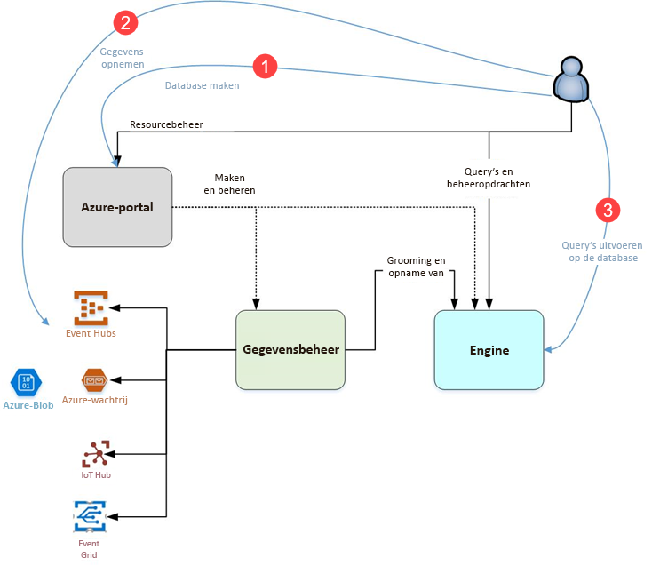

# Wat is Azure Data Explorer?

Azure Data Explorer is een snelle en zeer schaalbare service om gegevens in logboeken en telemetrie te verkennen. Hiermee verwerkt u de vele gegevensstromen die door moderne software worden uitgevoerd, zodat u de gegevens kunt verzamelen, opslaan en analyseren. Azure Data Explorer is ideaal om grote hoeveelheden diverse gegevens van elke gegevensbron te analyseren, zoals websites, toepassingen, IoT-apparaten en meer. Deze gegevens worden gebruikt voor diagnose, bewaking, rapportage, machine learning en aanvullende analysemogelijkheden. Azure Data Explorer maakt het eenvoudig om deze gegevens op te namen en stelt u in staat om binnen enkele seconden complexe ad-hocquery's uit te voeren op de gegevens.

## Wat maakt Azure Data Explorer uniek?

- Schaalt snel naar terabytes aan gegevens, in enkele minuten, waardoor snelle iteraties van gegevensverkenning relevante inzichten kunnen ontdekken.

- Biedt een innovatieve querytaal die is geoptimaliseerd voor gegevensanalyses met hoge prestaties.

- Ondersteunt de analyse van grote hoeveelheden heterogene gegevens (gestructureerd en ongestructureerd).

- Biedt de mogelijkheid om precies datgene te bouwen en te implementeren dat u nodig hebt door het te combineren met andere services om een veel​​omvattende, krachtige en interactieve oplossing voor gegevensanalyse te leveren.

## Datawarehousingwerkstroom

Azure Data Explorer kan worden geïntegreerd met andere belangrijke services om een ​​end-to-end-oplossing te bieden die gegevensverzameling, opname, opslag, indexering, query's en visualisatie omvat. Het heeft een centrale rol in de datawarehousing-stroom door de **EXPLORE**-stap van de stroom uit te voeren op terabytes aan diverse onbewerkte gegevens.

Azure Data Explorer ondersteunt verschillende opnamemethoden, waaronder connectoren voor algemene services zoals Event Hub, programmatische opname met SDK's, zoals .NET en Python, en directe toegang tot de engine voor verkenningsdoeleinden. Azure Data Explorer kan worden geïntegreerd met analyse- en modelleringsservices voor aanvullende analyse en visualisatie van gegevens.

## Azure Data Explorer-stroom

Het volgende diagram toont de verschillende aspecten van het werken met Azure Data Explorer.

Werk in Azure Data Explorer volgt het volgende algemene patroon:

1. **Database maken:** maak een *cluster* en maak vervolgens een of meer *databases* in dat cluster. [Snelstart: een Azure Data Explorer-cluster en -database maken](create-cluster-database-portal.md)

1. **Gegevens opnemen:**  laad gegevens in databasetabellen zodat u er query's op kunt uitvoeren. [Snelstart: gegevens uit Event Hub opnemen in Azure Data Explorer](ingest-data-event-hub.md)

1. **Query’s uitvoeren op de database:**  gebruik onze ​​webtoepassing om query's en resultaten uit te voeren, te beoordelen en te delen. Het is beschikbaar in Azure-portal en als op zichzelf staande toepassing. Bovendien kunt u query's ook programmatisch (met behulp van een SDK) of naar een REST API-eindpunt verzenden. [Snelstart: query’s uitvoeren op gegevens in Azure Data Explorer](web-query-data.md)

## Query-ervaring

Een query in Azure Data Explorer is een alleen-lezen aanvraag om gegevens te verwerken en de resultaten van deze verwerking te retourneren, zonder de gegevens of metagegevens te wijzigen. U blijft uw query’s verfijnen totdat u uw analyse hebt voltooid. Azure Data Explorer maakt dit proces eenvoudig vanwege de zeer snelle ad hoc query-ervaring.

Azure Data Explorer verwerkt grote hoeveelheden gestructureerde, semi-gestructureerde (JSON-achtige geneste typen) en ongestructureerde (vrije tekst) gegevens even goed. Hiermee kunt u zoeken naar specifieke teksttermen, bepaalde gebeurtenissen lokaliseren en metrische berekeningen uitvoeren op gestructureerde gegevens. Azure Data Explorer overbrugt de wereld van ongestructureerde tekstlogboeken en gestructureerde getallen en dimensies door in runtime waarden uit vrije-tekstvelden te extraheren. Gegevensverkenning wordt vereenvoudigd door snelle tekstindexering, kolomopslag en tijdreeksbewerkingen te combineren.

De mogelijkheden van Azure Data Explorer worden uitgebreid met andere services die zijn gebouwd op de krachtige querytaal, waaronder [Log Analytics](/azure/log-analytics/), [Application Insights](/azure/application-insights/), [Time Series Insights](/azure/time-series-insights/) en [Windows Defender Advanced Threat Protection](/windows/security/threat-protection/windows-defender-atp/windows-defender-advanced-threat-protection/).

## Feedback

We willen graag uw feedback over Azure Data Explorer en de querytaal horen op:

- [Vragen stellen op het forum op MSDN](https://social.msdn.microsoft.com/Forums/en-US/home?forum=AzureKusto)

- [Productsuggesties doen in User Voice](http://aka.ms/AzureDataExplorer.UserVoice)

## Volgende stappen

[Snelstart: een Azure Data Explorer-cluster en -database maken](create-cluster-database-portal.md)

[Snelstart: gegevens uit Event Hub opnemen in Azure Data Explorer](ingest-data-event-hub.md)

[Snelstart: query’s uitvoeren op gegevens in Azure Data Explorer](web-query-data.md)
