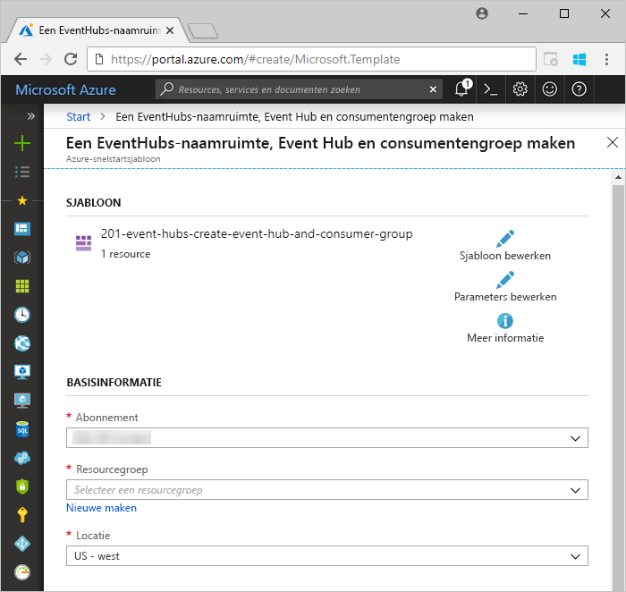
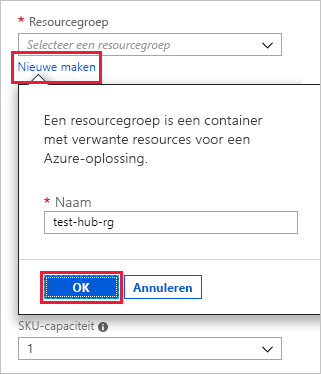
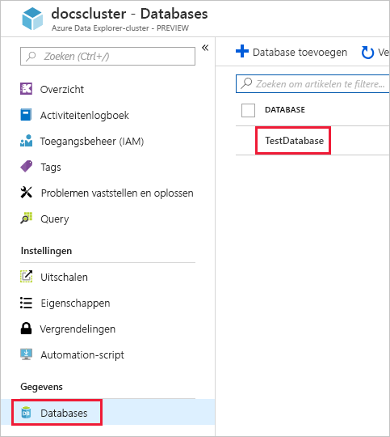
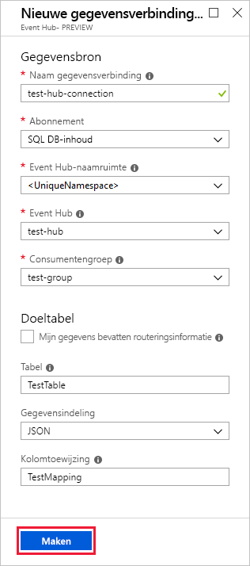
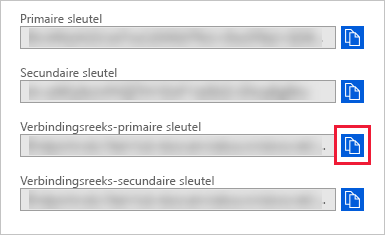
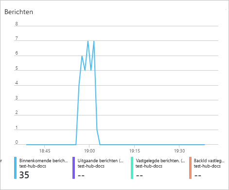
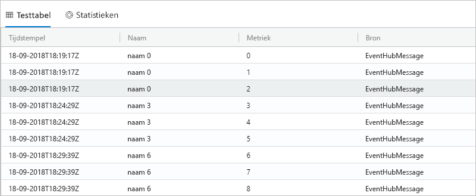
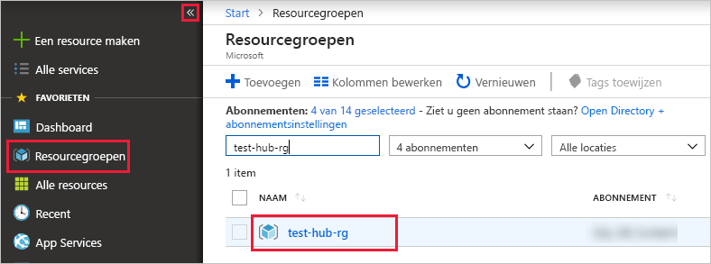

# <a name="quickstart-ingest-data-from-event-hub-into-azure-data-explorer"></a>Quickstart: Gegevens uit Event Hub opnemen in Azure Data Explorer

Azure Data Explorer is een snelle en zeer schaalbare service voor gegevensverkenning voor telemetrische gegevens en gegevens uit logboeken. Azure Data Explorer biedt opname (laden van gegevens) vanuit Event Hubs, een big data-streamingplatform en service voor gebeurtenisopname. Event Hubs kunnen miljoenen gebeurtenissen per seconde in bijna realtime verwerken. In deze quickstart maakt u een Event Hub, maakt u verbinding met deze hub vanuit Azure Data Explorer, en ziet u de gegevens door het systeem stromen.

Als u nog geen abonnement op Azure hebt, maak dan een [gratis Azure-account](https://azure.microsoft.com/free/) aan voordat u begint.

## <a name="prerequisites"></a>Vereisten

Naast een Azure-abonnement hebt u het volgende nodig om deze quickstart te voltooien:

* [Een cluster en database voor testdoeleinden](create-cluster-database-portal.md)

* [Een voorbeeld-app](https://github.com/Azure-Samples/event-hubs-dotnet-ingest) waarmee gegevens worden gegenereerd

* [Visual Studio 2017-versie 15.3.2 of groter](https://www.visualstudio.com/vs/) om de voorbeeld-app uit te voeren

## <a name="sign-in-to-the-azure-portal"></a>Aanmelden bij Azure Portal

Meld u aan bij [Azure Portal](https://portal.azure.com/).

## <a name="create-an-event-hub"></a>Een Event Hub maken

In deze quickstart genereert u voorbeeldgegevens en verzendt u deze naar een Event Hub. De eerste stap is het maken van een Event Hub. U doet dit met behulp van een ARM-sjabloon (Azure Resource Manager) in de Azure-portal.

1. Selecteer de volgende knop om de implementatie te starten.

    [](https://portal.azure.com/#create/Microsoft.Template/uri/https%3A%2F%2Fraw.githubusercontent.com%2FAzure%2Fazure-quickstart-templates%2Fmaster%2F201-event-hubs-create-event-hub-and-consumer-group%2Fazuredeploy.json)

    Als u op de knop **Implementeren in Azure** klikt, wordt u naar de Azure-portal geleid om een implementatieformulier in te vullen.

    

1. Selecteer het abonnement waarvoor u de Event Hub wilt maken, en maak een resourcegroep met de naam *test-hub-rg*.

    

1. Vul het formulier in met de volgende gegevens.

    

    Gebruik de standaardwaarden voor alle instellingen die niet zijn vermeld in de volgende tabel.

    **Instelling** | **Voorgestelde waarde** | **Beschrijving van veld**
    |---|---|---|
    | Abonnement | Uw abonnement | Selecteer het Azure-abonnement dat u wilt gebruiken voor de Event Hub.|
    | Resourcegroep | *test-hub-rg* | Maak een nieuwe resourcegroep. |
    | Locatie | *US - west* | Selecteer *US - west* voor deze quickstart. Selecteer voor een productiesysteem de regio die het beste voldoet aan uw behoeften.
    | Naam van naamruimte | Een unieke naam voor de naamruimte | Kies een unieke naam waarmee de naamruimte kan worden geïdentificeerd. Bijvoorbeeld *mijntestnaamruimte*. De domeinnaam *servicebus.windows.net* wordt toegevoegd aan de naam die u opgeeft. De naam mag alleen letters, cijfers en afbreekstreepjes bevatten. De naam moet beginnen met een letter en moet eindigen met een letter of een cijfer. De waarde moet minimaal 6 en maximaal 50 tekens lang zijn.
    | Naam van Event Hub | *test-hub* | De Event Hub bevindt zich onder de naamruimte, wat een unieke bereikcontainer biedt. De naam van de Event Hub moet uniek zijn binnen de naamruimte. |
    | Naam van consumentengroep | *test-group* | Met consumentengroepen kunnen meerdere gebruikstoepassingen elk een afzonderlijke weergave van de gebeurtenisstroom hebben. |
    | | |

1. Selecteer **Aankopen**. Hiermee bevestigt u dat u resources maakt in het abonnement.

1. Selecteer in de werkbalk de optie **Meldingen** (het belpictogram) om het inrichtingsproces te controleren. Het kan enkele minuten duren voordat het implementatieproces is voltooid, maar u kunt nu doorgaan met de volgende stap.

## <a name="create-a-target-table-in-azure-data-explorer"></a>Een doeltabel maken in Azure Data Explorer

Nu maakt u een tabel in Azure Data Explorer waarnaar via Event Hubs gegevens worden verzonden. U maakt de tabel in het cluster en de database die zijn ingericht in **Vereisten**.

1. Selecteer in de Azure-portal, onder het cluster, de optie **Query**.

    

1. Kopieer de volgende opdracht in het venster en selecteer **Uitvoeren**.

    ```Kusto
    .create table TestTable (TimeStamp: datetime, Name: string, Metric: int, Source:string)
    ```

    

1. Kopieer de volgende opdracht in het venster en selecteer **Uitvoeren**.

    ```Kusto
    .create table TestTable ingestion json mapping 'TestMapping' '[{"column":"TimeStamp","path":"$.timeStamp","datatype":"datetime"},{"column":"Name","path":"$.name","datatype":"string"},{"column":"Metric","path":"$.metric","datatype":"int"},{"column":"Source","path":"$.source","datatype":"string"}]'
    ```
    Met deze opdracht worden binnenkomende JSON-gegevens toegewezen aan de kolomnamen en gegevenstypen die worden gebruikt bij het maken van de tabel.

## <a name="connect-to-the-event-hub"></a>Verbinding maken met de Event Hub

Nu maakt u vanuit Azure Data Explorer verbinding met de Event Hub, zodat de gegevens die worden verzonden naar de Event Hub, naar de testtabel worden gestreamd.

1. Selecteer op de werkbalk de optie **Meldingen** om te controleren of de implementatie van de Event Hub is geslaagd.

1. Selecteer onder het gemaakte cluster de optie **Databases** en vervolgens **TestDatabase**.

    

1. Selecteer **Gegevensopname** en vervolgens **Gegevensverbinding toevoegen**.

    

1. Vul het formulier in met de volgende gegevens en selecteer vervolgens **Maken**.

    

    **Instelling** | **Voorgestelde waarde** | **Beschrijving van veld**
    |---|---|---|
    | Naam van gegevensverbinding | *test-hub-connection* | De naam van de verbinding die u wilt maken in Azure Data Explorer.|
    | Event hub-naamruimte | Een unieke naam voor de naamruimte | De naam die u eerder hebt gekozen om de naamruimte te identificeren. |
    | Event Hub | *test-hub* | De Event Hub die u hebt gemaakt. |
    | Consumentengroep | *test-group* | De consumentengroep die u hebt gedefinieerd in de gemaakte Event Hub. |
    | Tabel | *TestTable* | De tabel die u hebt gemaakt in **TestDatabase**. |
    | Gegevensindeling | *JSON* | JSON- en CSV-indelingen worden ondersteund. |
    | Toewijzen van kolommen | *TestMapping* | De toewijzing die u hebt gemaakt in **TestDatabase**. |

    Voor deze quickstart gebruikt u *statische routering* uit de Event Hub, waarbij u de tabelnaam, bestandsindeling en toewijzing opgeeft. U kunt ook gebruikmaken van dynamische routering, waarbij deze eigenschappen worden ingesteld via de toepassing.

## <a name="copy-the-connection-string"></a>De verbindingsreeks kopiëren

Wanneer u de app uitvoert om voorbeeldgegevens te genereren, hebt u de verbindingsreeks nodig voor de naamruimte van de Event Hub.

1. Onder de naamruimte van de Event Hub die u hebt gemaakt, selecteert u **Gedeeld toegangsbeleid** en vervolgens **RootManageSharedAccessKey**.

    

1. Kopieer **Verbindingsreeks - primaire sleutel**.

    

## <a name="generate-sample-data"></a>Voorbeeldgegevens genereren

Nu Azure Data Explorer en de Event Hub zijn verbonden, gebruikt u de voorbeeld-app die u hebt gedownload, om gegevens te genereren.

1. Open de voorbeeld-app in Visual Studio.

1. Werk in het bestand *program.cs* de constante `connectionString` bij voor de verbindingsreeks die u hebt gekopieerd uit de naamruimte van de Event Hub.

    ```csharp
    const string eventHubName = "test-hub";
    // Copy the connection string ("Connection string-primary key") from your Event Hub namespace.
    const string connectionString = @"<YourConnectionString>";
    ```

1. Bouw de app en voer deze uit. Via de app worden berichten verzonden naar de Event Hub, en wordt elke tien seconden de status afgedrukt.

1. Nadat een aantal berichten is verzonden via de app, gaat u naar de volgende stap: de stroom aan gegevens controleren die in de Event Hub en testtabel stromen.

## <a name="review-the-data-flow"></a>De gegevensstroom controleren

1. In de Azure-portal, onder uw Event Hub, ziet u de piek in activiteit terwijl de app wordt uitgevoerd.

    

1. Ga terug naar de app en stop deze nadat de limiet van 99 berichten is bereikt.

1. Voer de volgende query uit in de testdatabase om te controleren hoeveel berichten tot nu toe de database hebben bereikt.

    ```Kusto
    TestTable
    | count
    ```

1. Voer de volgende query uit om de inhoud van de berichten te zien.

    ```Kusto
    TestTable
    ```

    De resultatenset ziet er ongeveer als volgt uit.

    

## <a name="clean-up-resources"></a>Resources opschonen

Als u niet van plan bent de Event Hub opnieuw te gebruiken, wist u de **test-hub-rg** om te voorkomen dat er kosten in rekening worden gebracht.

1. Selecteer in Azure Portal **Resourcegroepen** aan de linkerkant en selecteer vervolgens de resourcegroep die u hebt gemaakt.  

    Als het menu links is samengevouwen, selecteert u  om het menu uit te vouwen.

   

1. Selecteer onder **test-resource-group** de optie **Resourcegroep verwijderen**.

1. Typ in het nieuwe venster de naam van de resourcegroep die u wilt verwijderen (*test-hub-rg*), en klik vervolgens op **Verwijderen**.

## <a name="next-steps"></a>Volgende stappen

> [!div class="nextstepaction"]
> [Quickstart: Gegevens doorzoeken in Azure Data Explorer](web-query-data.md)
