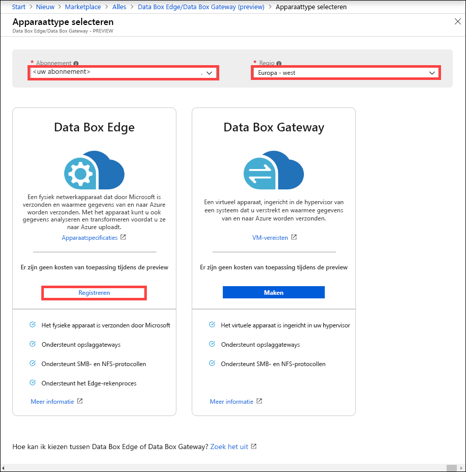
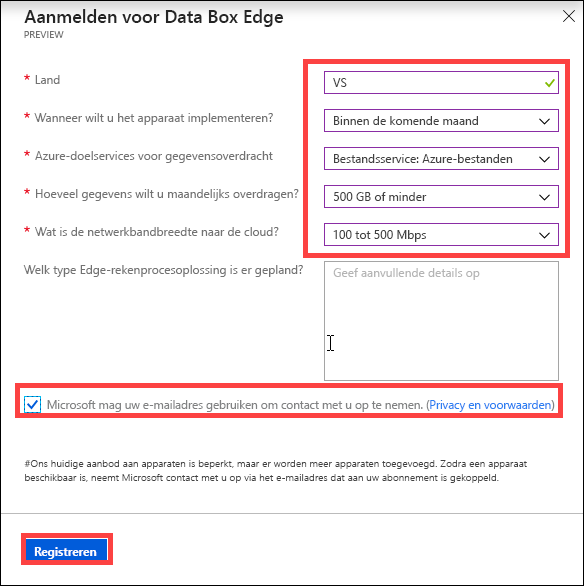

# Wat is Azure Data Box Edge (preview-versie)? 

Azure Data Box Edge is een opslagoplossing waarmee u gegevens kunt verwerken en via een netwerk kunt verzenden naar Azure. In dit artikel staat een overzicht van de Data Box Edge-oplossing, voordelen, belangrijkste mogelijkheden en de scenario’s waarin u dit apparaat kunt implementeren. 

Data Box Edge maakt gebruik van een fysiek apparaat dat door Microsoft wordt geleverd, om de veilige gegevensoverdracht te versnellen. Het fysieke apparaat bevindt zich op uw locatie en u schrijft gegevens ernaar met behulp van het NFS- en SMB-protocol. 

Data Box Edge heeft alle gatewaymogelijkheden van Data Box Gateway. Daarnaast is Data Box voorzien van Edge-rekenmogelijkheden met AI die u helpen gegevens te analyseren, verwerken of filteren terwijl ze naar Azure-blok-blobopslag, Azure-pagina-blobopslag of Azure Files worden verzonden.  

> [!IMPORTANT]
> - Data Box Edge is in de preview-fase. [Registreer u](#sign-up) voor deze service!
> - Lees de [gebruiksvoorwaarden voor de preview](https://azure.microsoft.com/support/legal/preview-supplemental-terms/) voordat u deze oplossing implementeert.

## Gebruiksvoorbeelden

Azure Data Box Edge is een Edge-rekenapparaat met AI dat mogelijkheden voor netwerkgebaseerde gegevensoverdracht biedt. Hier volgen de verschillende scenario’s waarin Data Box Edge kan worden gebruikt voor gegevensoverdracht.

- **Gegevens voorverwerken**: Analyseer gegevens uit on-premises of IoT-apparaten om snel resultaten te verkrijgen terwijl u dicht bij de plek blijft waar gegevens worden gegenereerd. Data Box Edge draagt de volledige gegevensset over naar de cloud om deze geavanceerder te verwerken of grondiger te analyseren.  Voorverwerking kan worden gebruikt om: 

    - Gegevens samen te voegen.
    - Gegevens te wijzigen, bijvoorbeeld om persoonlijk identificeerbare informatie (PII) te verwijderen.
    - Een subset van de benodigde gegevens te maken en deze over te dragen voor grondigere analyse in de cloud.
    - IoT-gebeurtenissen te analyseren en erop te reageren. 

- **Azure Machine Learning afleiden**: Met Data Box Edge kunt u ML-modellen (Machine Learning) uitvoeren om snel resultaten te verkrijgen die kunnen worden gebruikt voordat de gegevens naar de cloud worden verzonden. De volledige gegevensset wordt overgedragen om uw ML-modellen te blijven trainen en verbeteren.

- **Gegevens via een netwerk naar Azure overdragen**: Gebruik Data Box Edge om gegevens gemakkelijk en snel naar Azure over te dragen voor verdere berekeningen en analyses of voor archivering. 

## Voordelen

Data Box Edge biedt de volgende voordelen:

- **Gemakkelijke gegevensoverdracht**: Het verplaatsen van gegevens in en uit Azure-opslag is net zo gemakkelijk als het werken met een lokale netwerkshare.  
- **Hoge prestaties**: Hoogpresterende overdrachten van en naar Azure. 
- **Snelle toegang**: De recentste bestanden worden in de cache opgeslagen voor snelle toegang tot on-premises bestanden.  
- **Beperkt bandbreedtegebruik**: Gegevens kunnen zelfs naar Azure worden geschreven wanneer het netwerk wordt beperkt voor minder gebruik tijdens piekuren.  
- **Gegevenstransformatie**: Gegevens kunnen worden geanalyseerd, verwerkt of gefilterd terwijl ze naar Azure worden verplaatst.

## Belangrijkste mogelijkheden

Data Box Edge biedt de volgende mogelijkheden:

|Mogelijkheid |Beschrijving  |
|---------|---------|
|Hoge prestaties     | Volledig geautomatiseerde en zeer geoptimaliseerde gegevensoverdracht en bandbreedte.|
|Ondersteunde protocollen     | Ondersteuning voor het standaard SMB- en NFS-protocol voor gegevensopname.   Ga naar [Systeemvereisten voor Data Box Edge](http://aka.ms/dbe-docs) voor meer informatie over ondersteunde versies.|
|Berekenen       |Gegevens kunnen worden geanalyseerd, verwerkt of gefilterd.|
|Toegang tot gegevens     | Rechtstreekse gegevenstoegang vanuit Azure Storage Blobs en Azure Files met behulp van cloud-API’s voor aanvullende gegevensverwerking in de cloud.|
|Snelle toegang     | Lokale cache op het apparaat voor snelle toegang tot laatst gebruikte bestanden.|
|Offline upload     | Modus zonder verbinding ondersteunt scenario’s voor offline uploaden.|
|Gegevensvernieuwing     | Mogelijkheid om lokale bestanden te vernieuwen met de meest recente uit de cloud.|
|Versleuteling    | BitLocker-ondersteuning om gegevens lokaal te versleutelen en de gegevensoverdracht naar de cloud via *HTTPS* te beveiligen.       |
|Flexibiliteit     | Ingebouwde netwerkflexibiliteit.        |

## Functies en specificaties

Het fysieke Data Box Edge-apparaat biedt de volgende functies:

| Functies/specificaties                                          | Beschrijving              |
|---------------------------------------------------------|--------------------------|
| Dimensies   | Breedte: 43,8 cm Lengte: 69,2 cm Hoogte: 4,5 cm (exclusief oren en voedingseenheidshendels)  |            
| Rackruimte|1U wanneer in het rack geplaatst|
| Kabels| 2 X voedingskabels 2 X 1 Gbps RJ45-kabels 2 X 10 Gbps SFP+ koperen kabels|
| Onderdelen|2 ingebouwde voedingseenheden|
| CPU|2 Intel Xeon-processors met elk 10 cores  |
| Geheugen| 64 GB RAM|
| Disks| 8 NVMe SSD’s, elke schijf is 1,6 TB   Het systeem werkt niet als één NVMe SSD niet werkt. |
| Lokale opslagcapaciteit| Totale capaciteit van 12,8 TB|
| Netwerkinterfaces| 2 X 1 GbE-interfaces: Eén beheerinterface, niet configureerbaar door gebruikers, gebruikt voor eerste installatie. De andere gegevensinterface kan door gebruikers worden geconfigureerd en is standaard DHCP.  2 X 25 GbE-interfaces: Deze kunnen ook als 10 GbE-interfaces werken. Deze gegevensinterfaces kunnen door gebruikers worden geconfigureerd als DHCP (standaard) of statisch.   2 X 25 GbE-interfaces: Deze gegevensinterfaces kunnen door gebruikers worden geconfigureerd als DHCP (standaard) of statisch.|

## Onderdelen

De Data Box Edge-oplossing bestaat uit een Data Box Edge-resource, een fysiek Data Box Edge-apparaat en een lokale webinterface.

* **Fysiek Data Box Edge-apparaat**: Een 1U rackserver die door Microsoft wordt geleverd en die kan worden geconfigureerd om gegevens naar Azure te verzenden. 
    
* **Data Box Edge-resource**: Een resource in de Azure-portal waarmee u een Data Box Edge-apparaat kunt beheren via een webinterface waartoe u toegang hebt vanaf verschillende geografische locaties. Gebruik de Data Box Edge-resource om resources te maken en beheren, apparaten en waarschuwingen te bekijken en beheren, en shares te beheren.  

    <!---->

    Ga naar [De Data Box Edge-service gebruiken om uw Data Box Edge-apparaat te beheren](http://aka.ms/dbe-docs) voor meer informatie.

* **Lokale Data Box-webinterface**: Gebruik de lokale webinterface om diagnoses uit te voeren, het Data Box Edge-apparaat uit te schakelen of opnieuw op te starten, logboeken met kopieerbewerkingen te bekijken en contact op te nemen met Microsoft Ondersteuning om een serviceaanvraag in te dienen.

    <!---->

    Ga naar [De webgebaseerde gebruikersinterface gebruiken om uw Data Box te beheren](http://aka.ms/dbe-docs) voor informatie over het gebruik van de webgebaseerde gebruikersinterface.

## Beschikbaarheid in regio’s

Het fysieke Data Box Edge-apparaat, de Azure-resource en het doelopslagaccount waarnaar u gegevens overdraagt hoeven zich niet allemaal in dezelfde regio te bevinden.

- **Beschikbaarheid van resources**: Voor deze release is de Data Box Edge-resource beschikbaar in de volgende regio’s:
    - **Verenigde Staten** - West 2 en Oost
    - **Europese Unie** - West-Europa
    - **Azië en Stille Oceaan** - Zuidoost-Azië

- **Doelopslagaccounts**: De opslagaccounts waarin de gegevens worden opgeslagen, zijn beschikbaar in alle Azure-regio’s. 

    De regio’s waar de opslagaccounts Data Box-gegevens opslaan, moeten zich voor optimale prestaties dicht bij het apparaat bevinden. Een opslagaccount dat zich ver van het apparaat vandaan bevindt, resulteert in lange latenties en tragere prestaties. 

## Aanmelden

Data Box Edge is in de preview-fase en u moet zich registreren. Voer de volgende stappen uit om u te registreren voor Data Box Gateway:

1. Meld u aan bij Azure Portal via: [https://aka.ms/databox-edge](https://aka.ms/databox-edge).

2. Kies het abonnement dat u wilt gebruiken voor de preview-versie van Data Box Edge. Selecteer de regio waar u de Data Box Edge-resource wilt implementeren. Klik bij de Data Box Edge-optie op **Registreren**.

    

3.  Beantwoord de vragen met betrekking tot in welk land de gegevens zich bevinden, het tijdskader, de Azure-doelservice voor gegevensoverdracht, de netwerkbandbreedte en de frequentie van gegevensoverdracht. Lees de **privacyverklaring en voorwaarden** en schakel het selectievakje in zodat **Microsoft uw e-mailadres kan gebruiken om contact met u op te nemen**.

    

4. Nadat u zich hebt geregistreerd en aan de preview mag meedoen, kunt u een Data Box Edge bestellen.

## Volgende stappen

- De [Systeemvereisten voor Data Box Edge](http://aka.ms/dbe-docs) lezen.
- De [limieten voor Data Box Edge](http://aka.ms/dbe-docs) begrijpen.
- [Azure Data Box Edge](http://aka.ms/dbe-docs) in de Azure-portal implementeren.

