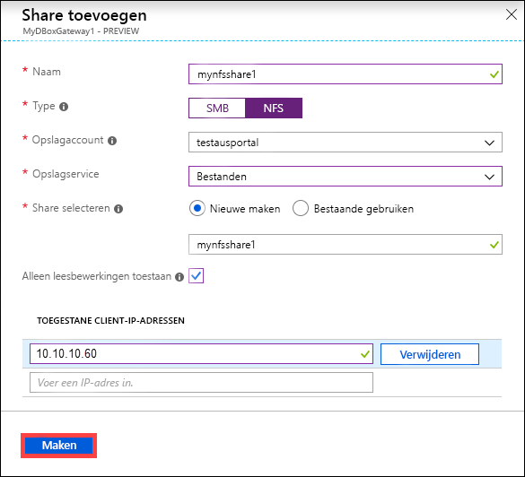
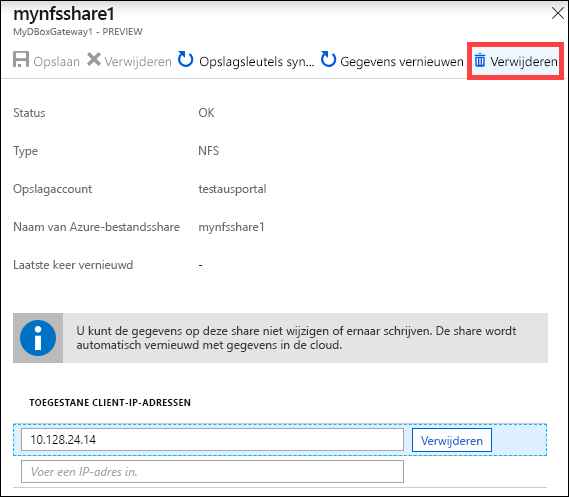
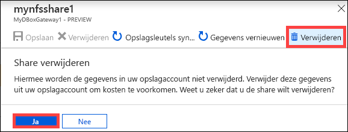
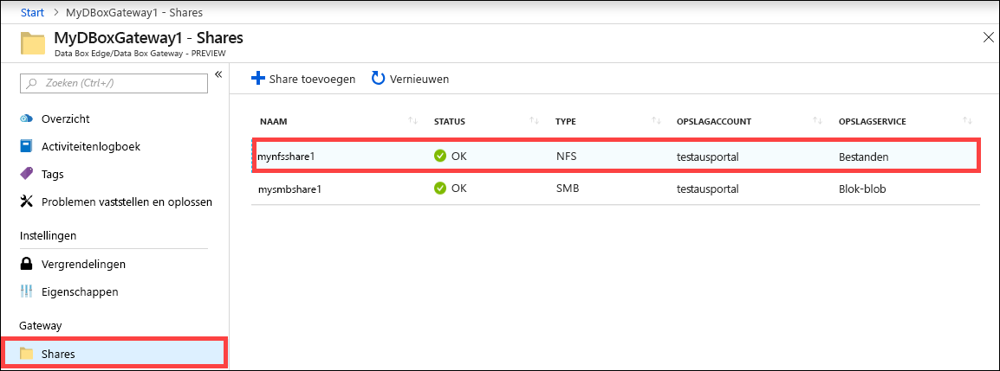
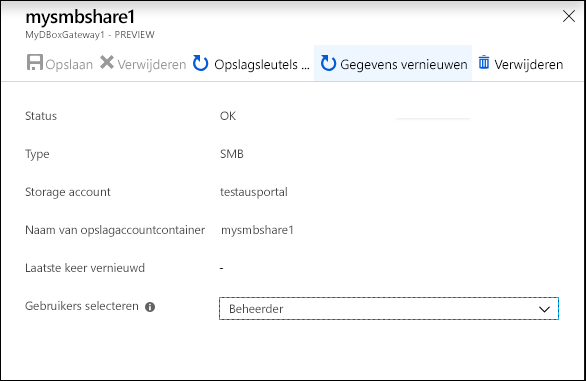
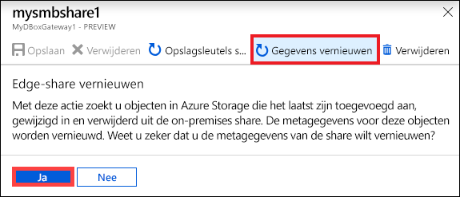
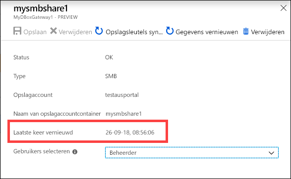
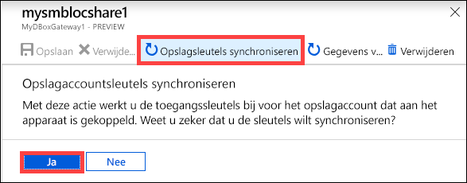

# De Azure Portal gebruiken om shares te beheren in uw Azure Data Box Gateway 

Dit artikel beschrijft hoe u shares beheert in uw Azure Data Box Gateway. U kunt de Azure Data Box Gateway beheren via Azure Portal of via de lokale webinterface. Gebruik de Azure Portal om shares toe te voegen, te verwijderen of te vernieuwen of de opslagsleutel te synchroniseren voor het opslagaccount dat is gekoppeld aan de shares.

> [!IMPORTANT]
> - Data Box Gateway verkeert in de preview-fase. Lees de [Gebruiksvoorwaarden voor de preview](https://azure.microsoft.com/support/legal/preview-supplemental-terms/) voordat u deze oplossing bestelt en implementeert.

## Info over shares

Als u wilt gegevens wilt overdragen naar Azure, moet u shares maken in uw Azure Data Box Gateway. De shares die u toevoegt aan het Data Box Gateway-apparaat, zijn cloudshares. De gegevens uit deze shares worden automatisch geüpload naar de cloud. Alle cloudfuncties zoals het vernieuwen en synchroniseren van opslagsleutels worden toegepast op deze shares. Gebruik de cloudshares wanneer u wilt dat de apparaatgegevens automatisch naar uw opslagaccount in de cloud worden gepusht.

In dit artikel leert u het volgende:

> [!div class="checklist"]
> * Een share toevoegen
> * Een share verwijderen
> * Shares vernieuwen
> * Opslagsleutel synchroniseren

## Een share toevoegen

Voer in de Azure Portal de volgende stappen uit om een share te maken.

1. Ga in de Azure Portal naar uw Data Box Gateway-resource en navigeer vervolgens naar **Overzicht**. Klik op de opdrachtbalk op **+ Share toevoegen**.
2. Geef in **Share toevoegen** de instellingen voor de share op. Geef een unieke naam voor de share op.

    

    Namen van shares mogen alleen cijfers, kleine letters en afbreekstreepjes bevatten. De naam van de share moet tussen de 3 en 63 tekens bevatten en met een cijfer of letter beginnen. Elk afbreekstreepje moet worden voorafgegaan en gevolgd door een cijfer of letter.

3. Selecteer een **Type** voor de share. Het type kan **SMB** of **NFS** zijn. SMB is het standaardtype. SMB is het standaardtype voor Windows-clients; NFS wordt gebruikt voor Linux-clients. De opties wijken enigszins af, afhankelijk van welk type u kiest.

4. Geef het **opslagaccount** op waar de share zich bevindt. In het opslagaccount met de naam van de share wordt een container gemaakt, als deze nog niet bestaat. Als de container al bestaat, wordt de bestaande container gebruikt.

5. Kies de **Opslagservice** vanuit blok-blob, pagina-blob of bestanden. Het type service dat u kiest, is afhankelijk van de indeling waarin u de gegevens in Azure wilt opslaan. In dit geval kiezen we ervoor de gegevens als blok-blobs in Azure op te slaan, dus we selecteren **Blok-blob**. Als u **Pagina-blob** kiest, moet u ervoor zorgen dat uw gegevens op 512 bytes zijn uitgelijnd. VHDX is bijvoorbeeld altijd op 512 bytes uitgelijnd.

6. Deze stap hangt af van of u een SMB- of een NFS-share gaat maken.
    - **Als u een SMB-share maakt**: maak in het veld **All privilege local user** (Lokale gebruiker met alle bevoegdheden) een keuze uit **Nieuwe maken** of **Bestaande gebruiken**. Als u een nieuwe lokale gebruiker maakt, geeft u de **gebruikersnaam** en het **wachtwoord** op en bevestigt u het wachtwoord. Hiermee worden de bevoegdheden aan de lokale gebruiker toegewezen. Als u de bevoegdheden hier hebt toegewezen, kunt u Verkenner gebruiken om de bevoegdheden te wijzigen.

        

        Als u ervoor kiest om alleen alleen-lezen bewerkingen toe te staan voor deze share-gegevens, kunt u gebruikers opgeven met alleen-lezen machtigingen.
    - **Als u een NFS-share maakt**: geef de **IP-adressen op van de clients** die toegang hebben tot de share.

        

7. Klik op **Maken** om de share te maken. U ontvangt een melding als wordt begonnen met het maken van de share. Als de share met de opgegeven instellingen is gemaakt, wordt de blade **Shares** bijgewerkt in overeenstemming met de nieuwe share.
 
## Een share verwijderen

Voer in de Azure Portal de volgende stappen uit om een share te verwijderen.

1. Klik in de lijst met shares op de share die u wilt verwijderen.

    

2. Klik op **Verwijderen**. 

    

3. Klik op **Ja** als u om bevestiging wordt gevraagd.

    

De lijst met shares wordt bijgewerkt en de verwijderde share wordt niet meer weergegeven.

## Shares vernieuwen

Met de functie Vernieuwen kunt u de inhoud van een on-premises share vernieuwen. Wanneer u een share vernieuwt, wordt er een zoekopdracht gestart om de Azure-objecten te zoeken, inclusief blobs en bestanden die aan de cloud zijn toegevoegd na de laatste vernieuwing. Deze aanvullende bestanden worden vervolgens gebruikt om de inhoud te vernieuwen van de on-premises share op het apparaat. 

Voer in de Azure Portal de volgende stappen uit om een share te vernieuwen.

1.  Ga in de Azure Portal naar **Shares**. Klik op de share die u wilt vernieuwen.

    

2.  Klik op **Vernieuwen**. 

    
 
3.  Klik op **Ja** als u om bevestiging wordt gevraagd. Er wordt een taak gestart om de inhoud van de on-premises share te vernieuwen. 

    
 
4.  Terwijl het vernieuwen wordt uitgevoerd, is de optie Vernieuwen niet beschikbaar in het contextmenu. Klik op de taakmelding om de status van de vernieuwingstaak weer te geven.

5.  Hoe lang de vernieuwing duurt is afhankelijk van het aantal bestanden in de Azure-container en van het aantal bestanden op het apparaat. Zodra het vernieuwen is voltooid, wordt het tijdstempel van de share bijgewerkt. Zelfs als de vernieuwing niet geheel zonder fouten is uitgevoerd, wordt de bewerking als voltooid beschouwd en wordt het tijdstempel bijgewerkt. 

    
 
Als er een fout optreedt, wordt er een waarschuwing gegenereerd. De waarschuwing bevat meer informatie over de oorzaak en een aanbeveling om het probleem te verhelpen. De waarschuwing bevat ook een koppeling naar een bestand dat een volledig overzicht bevat van de fouten en van de bestanden die niet zijn bijgewerkt of verwijderd.

>[!IMPORTANT]
> In deze preview-versie is het niet mogelijk om meer dan één share tegelijk te vernieuwen.

## Opslagsleutels synchroniseren

Als de sleutels van uw opslagaccount zijn geroteerd, moet u de toegangssleutels voor opslag synchroniseren. Door een synchronisatie kan het apparaat de meest recente sleutels voor uw opslagaccount verkrijgen.

Voer in de Azure Portal de volgende stappen uit om uw toegangssleutel voor opslag te synchroniseren.

1. Ga in uw resource naar **Overzicht**. 
2. Klik in de lijst met shares op een share die is gekoppeld aan het opslagaccount dat u wilt synchroniseren. Klik op **Opslagsleutel synchroniseren**. 

     

3. Klik op **Ja** als u om bevestiging wordt gevraagd. Sluit het dialoogvenster wanneer de synchronisatie is voltooid.

     

>[!NOTE]
> U hoeft dit maar eenmaal te doen voor een gegeven opslagaccount. U hoeft deze actie niet te herhalen voor alle shares die zijn gekoppeld aan hetzelfde opslagaccount.

## Volgende stappen

- Meer informatie over [Gebruikers beheren via Azure Portal](data-box-gateway-manage-users.md).
