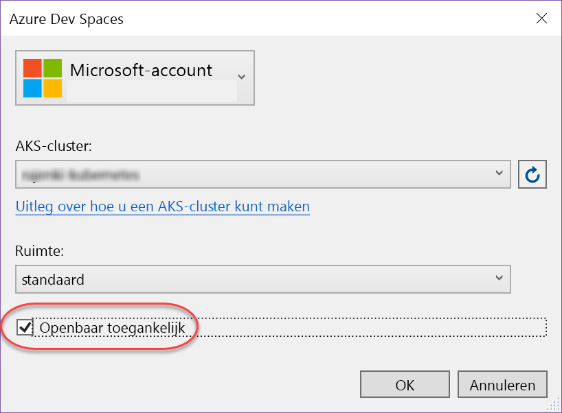

# Snelstartgids: Kubernetes-ontwikkelomgeving maken met Azure Dev Spaces (.NET Core en Visual Studio)

In deze handleiding leert u het volgende:

- Azure Dev Spaces instellen met een beheerd Kubernetes-cluster in Azure.
- Iteratief code ontwikkelen in containers met Visual Studio.
- Fouten opsporen in code die in uw cluster wordt uitgevoerd.

> [!Note]
> **Als u op enig moment niet verder kunt**, kunt u de [probleemoplossingssectie](troubleshooting.md) raadplegen of een opmerking op deze pagina plaatsen. U kunt ook de meer gedetailleerde [zelfstudie](get-started-netcore-visualstudio.md) proberen.

## Vereisten

- Een Kubernetes-cluster met Kubernetes 1.9.6, in de regio VS - oost, West-Europa of Canada - oost met Routering van HTTP-toepassing ingeschakeld.

  

- Visual Studio 2017 waarbij de workload Webontwikkeling is geïnstalleerd. Als u deze niet hebt geïnstalleerd, downloadt u deze [hier](https://aka.ms/vsdownload?utm_source=mscom&utm_campaign=msdocs).

## Azure Dev Spaces instellen

Installeer de [Visual Studio-extensie voor Azure Dev Spaces](https://aka.ms/get-azds-visualstudio).

## Verbinding maken met een cluster

Vervolgens maakt en configureert u een project voor Azure Dev Spaces.

### Een ASP.NET-web-app maken

Maak een nieuw project in Visual Studio 2017. Op dit moment moet het project een **ASP.NET Core-webtoepassing** zijn. Geef het project de naam **webfrontend**.

Selecteer de sjabloon **Web Application (Model-View-Controller)** en zorg dat **.NET Core** en **ASP.NET Core 2.0** zijn geselecteerd.

### Een ontwikkelomgeving maken in Azure

Open het project dat u zojuist hebt gemaakt en selecteer **Azure Dev Spaces** in de vervolgkeuzelijst met opstartinstellingen, zoals hieronder wordt weergegeven.

Controleer in het dialoogvenster dat vervolgens wordt weergegeven of u bent aangemeld bij het juiste account en selecteer vervolgens een bestaand cluster.

Laat de waarde in de vervolgkeuzelijst **Space** voorlopig op `default` staan. Schakel het selectievakje **Publicly Accessible** in zodat de web-app toegankelijk is via een openbaar eindpunt.

Klik op **OK** om het cluster te selecteren of een cluster te maken.

Als u een cluster kiest dat niet is geconfigureerd om te werken met Azure Dev Spaces, ziet u een bericht waarin wordt gevraagd of u dit wilt configureren.

Kies **OK**. 

### Bestanden bekijken die zijn toegevoegd aan het project
Terwijl u wacht totdat de ontwikkelomgeving is gemaakt, kunt u bekijken welke bestanden aan het project zijn toegevoegd toen u ervoor koos om een Azure Dev Spaces te gebruiken.

- Een map met de naam `charts` is toegevoegd, en in deze map is een [Helm-grafiek](https://docs.helm.sh) voor de toepassing klaargezet. Deze bestanden worden gebruikt om de toepassing in de ontwikkelomgeving te implementeren.
- `Dockerfile` bevat gegevens die nodig zijn om van de toepassing een pakket te maken met de standaard-Docker-indeling.
- `azds.yaml` bevat configuratiegegevens die nodig zijn voor de ontwikkelomgeving, bijvoorbeeld of de toepassing toegankelijk moet zijn via een openbaar eindpunt.

## Fouten opsporen in een Kubernetes-container
Zodra de ontwikkelomgeving is gemaakt, kunt u fouten oplossen voor de toepassing. Stel een onderbrekingspunt in de code in, bijvoorbeeld op regel 20 in het bestand `HomeController.cs`, waarbij de variabele `Message` wordt ingesteld. Druk op **F5** om de foutopsporing te starten. 

Visual Studio communiceert met de ontwikkelomgeving om de toepassing te compileren en te implementeren. Vervolgens wordt een browser geopend met de web-app. Het lijkt misschien alsof de container lokaal wordt uitgevoerd, maar dat is niet zo. De container wordt uitgevoerd in de ontwikkelomgeving in Azure. De reden voor het localhost-adres is dat Azure Dev Spaces een tijdelijke SSH-tunnel maakt naar de container die wordt uitgevoerd in Azure.

Klik boven aan de pagina op de koppeling **About** om het onderbrekingspunt te activeren. U hebt volledige toegang tot foutopsporingsgegevens (net als wanneer de code lokaal wordt uitgevoerd), zoals als de aanroep-stack, lokale variabelen, informatie over uitzonderingen, enzovoort.

## Volgende stappen

> [!div class="nextstepaction"]
> [Werken met meerdere containers en teamontwikkeling](get-started-netcore-visualstudio.md#call-another-container)