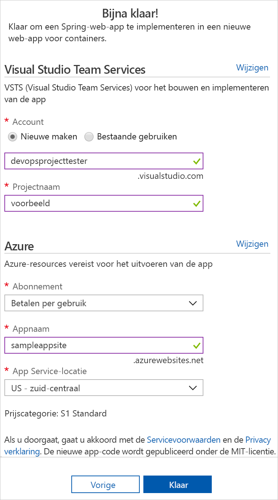
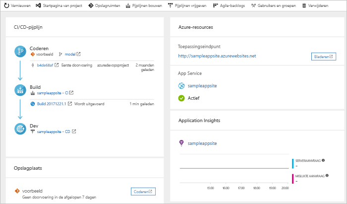

# Een CI/CD-pijplijn voor Java maken met het Azure DevOps-project

Het Azure DevOps-project biedt een vereenvoudigde ervaring voor het maken van Azure-resources en stelt een pijplijn in voor continue integratie (CI) en continue levering (CD) voor uw Java-app in Visual Studio Team Services (VSTS), de DevOps-oplossing van Microsoft voor Azure.  

Als u geen Azure-abonnement hebt, kunt u er gratis een krijgen via [Visual Studio Dev Essentials](https://visualstudio.microsoft.com/dev-essentials/).

## Aanmelden bij Azure Portal

Het Azure DevOps-project maakt een CI-/CD-pijplijn in VSTS.  U kunt gratis een **nieuw VSTS-account** maken of een **bestaand account** gebruiken.  Het DevOps-project maakt ook **Azure-resources** in het **Azure-abonnement** van uw keuze.

1. Meld u aan bij [Microsoft Azure Portal](https://portal.azure.com).

1. Kies het pictogram **Een resource maken** in de linkernavigatiebalk en zoek naar **DevOps-project**.  Kies **Maken**.

    

## Een voorbeeldtoepassing en Azure-service selecteren

1. Selecteer de **Java**-voorbeeldtoepassing.  De Java-voorbeelden omvatten een keuze uit verschillende toepassingsframeworks.

1. Het standaardvoorbeeldframework is **Spring**. Laat de standaardinstelling ongewijzigd en kies **Volgende**.  

1. **Web App for Containers** is het standaard implementatiedoel.  Het toepassingsframework dat u in de vorige stappen hebt gekozen bepaalt welk type implementatiedoel hier beschikbaar is voor de Azure-service.  Laat de standaardservice ongewijzigd en kies **Volgende**.
 
## VSTS en een Azure-abonnement configureren 

1. Maak een **nieuw** VSTS-account of kies een **bestaand** account.  Kies een **naam** voor uw VSTS-project.  Selecteer uw **Azure-abonnement** en **locatie** en kies een **naam** voor uw toepassing.  Als u klaar bent, kiest u **Gereed**.

    

1. In slechts enkele minuten wordt in Azure Portal het **projectdashboard** geladen.  Er wordt een voorbeeldtoepassing in een opslagplaats in uw VSTS-account ingesteld, er wordt een build uitgevoerd en uw toepassing wordt geïmplementeerd in Azure.  Dit dashboard biedt meer inzicht in uw **codeopslagplaats**, **VSTS-CI/CD-pijplijn** en uw **toepassing in Azure**.  Aan de rechterkant van het dashboard selecteert u **Bladeren** om de lopende toepassing weer te geven.

     
    
Het Azure DevOps-project configureert automatisch een CI-build en een versietrigger.  U bent nu klaar om samen met een team te werken aan uw Java-app met een CI/CD-proces dat automatisch uw meest recente werk in uw website implementeert.

## Codewijzigingen doorvoeren en CI/CD uitvoeren

Met het Azure DevOps-project is een Git-opslagplaats gemaakt in uw VSTS- of GitHub-account.  Volg de onderstaande stappen om de opslagplaats weer te geven en codewijzigingen in uw toepassing aan te brengen.

1. Selecteer aan de linkerkant van het DevOps-projectdashboard de koppeling voor uw **master** branch.  Met deze koppeling opent u een weergave in de zojuist gemaakte Git-opslagplaats.

1. Als u de kloon-URL van de opslagplaats wilt weergeven, selecteert u **Klonen** in de rechterbovenhoek van de browser. U kunt uw Git-opslagplaats klonen in uw favoriete IDE.  In de volgende stappen kunt u de webbrowser gebruiken om codewijzigingen rechtstreeks aan te brengen en door te voeren in de master branch.

1. Aan de linkerkant van de browser navigeert u naar het bestand **src/main/webapp/index.html**.

1. Selecteer **Bewerken** en breng een wijziging aan in de tekst.  Wijzig bijvoorbeeld een stuk tekst voor een van de div-tags.

1. Kies **Doorvoeren** en sla uw wijzigingen op.

1. Navigeer in uw browser naar het **Azure DevOps-projectdashboard**.  Als het goed is, ziet u nu dat er een build wordt gemaakt.  De zojuist aangebrachte wijzigingen worden automatisch in een build verwerkt en geïmplementeerd via een VSTS-CI/CD-pijplijn.

## De VSTS-CI/CD-pijplijn controleren

Met het Azure DevOps-project wordt automatisch een volledige VSTS-CI/CD-pijplijn in uw VSTS-account geconfigureerd.  U kunt de pijplijn verkennen en zo nodig aanpassen.  Volg de onderstaande stappen om vertrouwd te raken met de VSTS-build- en -releasedefinities.

1. Selecteer **Pijplijnen bouwen** **bovenin** het Azure DevOps-projectdashboard.  Met deze koppeling opent u een tabblad in de browser met de definitie van de VSTS-build voor het nieuwe project.

1. Beweeg de muisaanwijzer naar de rechterkant van de builddefinitie naast het veld **Status**. Selecteer het **weglatingsteken** dat wordt weergegeven.  Met deze actie wordt een menu geopend waarin u diverse acties kunt starten, zoals een nieuwe build in de wachtrij plaatsen, een build onderbreken en de builddefinitie bewerken.

1. Selecteer **Bewerken**.

1. In deze weergave **onderzoekt u de verschillende taken** voor uw builddefinitie.  De build voert verschillende taken uit, zoals het ophalen van bronnen uit de Git-opslagplaats, het herstellen van afhankelijkheden en het publiceren van uitvoer die wordt gebruikt voor implementaties.

1. Selecteer boven de builddefinitie de **naam van de builddefinitie**.

1. Wijzig de **naam** van uw builddefinitie in een gebruiksvriendelijkere naam.  Selecteer **Opslaan en wachtrij** en selecteer vervolgens **Opslaan**.

1. Selecteer onder de naam van uw builddefinitie de optie **Geschiedenis**.  U ziet een audittrail van recente wijzigingen voor de build.  VSTS houdt alle wijzigingen in de builddefinitie bij en biedt de mogelijkheid om versies te vergelijken.

1. Selecteer **Triggers**.  Het Azure DevOps-project maakt automatisch een CI-trigger en met elke doorvoering naar de opslagplaats wordt een nieuwe build gestart.  U kunt desgewenst kiezen of u vertakkingen van het CI-proces wilt opnemen of uitsluiten.

1. Selecteer **Retentie**.  Op basis van uw scenario kunt u beleidsregels opgeven om een bepaald aantal builds te behouden of te verwijderen.

1. Selecteer **Build en release** en kies **Releases**.  Het Azure DevOps-project heeft een VSTS-versiedefinitie gemaakt om implementaties naar Azure te beheren.

1. Selecteer links van de browser het **weglatingsteken** naast uw releasedefinitie en kies **Bewerken**.

1. De releasedefinitie bevat een **pijplijn** die het versieproces definieert.  Onder **Artefacten** selecteert u **Neerzetten**.  De builddefinitie die u in de vorige stappen hebt onderzocht, produceert de uitvoer die wordt gebruikt voor het artefact. 

1. Selecteer rechts van het pictogram **Neerzetten** het pictogram **Continue implementatietrigger**.  Deze releasedefinitie heeft een ingeschakelde CD-trigger die telkens een implementatie uitvoert wanneer er een nieuwe buildartefact beschikbaar is.  U kunt de trigger desgewenst uitschakelen, zodat uw implementaties handmatig moeten worden uitgevoerd. 

1. Selecteer aan de linkerkant van de browser de optie **Taken**.  De taken zijn de acties die in het implementatieproces worden uitgevoerd.  In dit voorbeeld is een taak gemaakt om te implementeren naar **Azure App Service**.

1. Selecteer aan de rechterkant van de browser de optie **Releases weergeven**.  In deze weergave wordt een versiesgeschiedenis weergegeven.

1. Selecteer het **weglatingsteken** naast een van uw versies en kies **Openen**.  Er zijn verschillende menu's die u in deze weergave kunt verkennen, zoals een versieoverzicht, gekoppelde werkitems en tests.

1. Selecteer **Doorvoeringen**.  In deze weergave worden de codedoorvoeringen getoond die zijn gekoppeld aan de specifieke implementatie. 

1. Selecteer **Logboeken**.  De logboeken bevatten nuttige informatie over het implementatieproces.  Ze kunnen worden weergegeven tijdens en na de implementaties.

## Resources opschonen

Wanneer u de Azure-app-service en verwante resources die in deze snelstart zijn gemaakt niet meer nodig hebt, kunt u ze verwijderen met de functionaliteit **Verwijderen** in het Azure DevOps-projectdashboard.

## Volgende stappen

Wanneer u uw CI/CD-proces in deze snelstart hebt geconfigureerd, zijn er automatisch een build- en releasedefinitie in uw VSTS-project gemaakt. U kunt deze build- en releasedefinities desgewenst wijzigen in overeenstemming met de behoeften van uw team. Zie deze zelfstudie voor meer informatie:

> [!div class="nextstepaction"]
> [CD-proces aanpassen](https://docs.microsoft.com/vsts/pipelines/release/define-multistage-release-process?view=vsts)
