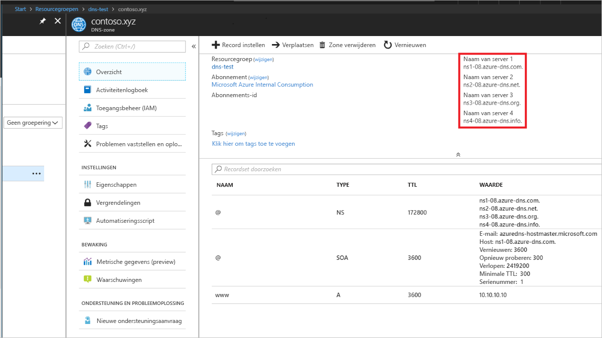

# <a name="quickstart-configure-azure-dns-for-name-resolution-using-the-azure-portal"></a>Snelstart: Azure DNS configureren voor naamomzetting met behulp van Azure Portal

 U kunt Azure DNS configureren voor het omzetten van hostnamen in uw openbare domein. Als u bijvoorbeeld de domeinnaam contoso.com hebt gekocht van een domeinnaamregistrar, kunt u Azure DNS configureren om het domein contoso.com te hosten en www.contoso.com om te zetten in het IP-adres van uw webserver of web-app.

In deze snelstart maakt u een testdomein en maakt u vervolgens een adresrecord met de naam 'www' dat wordt omgezet naar het IP-adres 10.10.10.10.

Het is belangrijk te weten dat de namen en IP-adressen die worden gebruikt in deze snelstart slechts voorbeelden zijn, en niet bedoeld zijn om een werkelijk scenario voor te stellen. Waar van toepassing worden echter ook werkelijke scenario's beschreven.

<!---
You can also perform these steps using [Azure PowerShell](dns-getstarted-powershell.md) or the cross-platform [Azure CLI](dns-getstarted-cli.md).
--->

Een DNS-zone bevat de DNS-records voor een bepaald domein. Als u uw domein wilt hosten in Azure DNS, moet u een DNS-zone maken voor die domeinnaam. Alle DNS-records voor uw domein worden vervolgens gemaakt binnen deze DNS-zone. De volgende stappen laten zien hoe u dit doet.

Als u nog geen abonnement op Azure hebt, maak dan een [gratis account](https://azure.microsoft.com/free/?WT.mc_id=A261C142F) aan voordat u begint.

## <a name="create-a-dns-zone"></a>Een DNS-zone maken

1. Meld u aan bij Azure Portal.
2. Klik linksboven op **+ Een resource maken**, vervolgens op **Netwerken** en daarna op **DNS-zone** om de pagina **DNS-zone maken** te openen.

    

4. Voer op de pagina **DNS-zone maken** de volgende waarden in en klik op **Maken**:


   | **Instelling** | **Waarde** | **Details** |
   |---|---|---|
   |**Naam**|contoso.xyz|De naam van de DNS-zone voor dit voorbeeld. U kunt elke gewenste waarde gebruiken voor deze snelstart, zolang deze nog niet is geconfigureerd op de Azure DNS-servers. Een werkelijke waarde zou een domein zijn dat u hebt gekocht via een domeinnaamregistrar.|
   |**Abonnement**|[Uw abonnement]|Selecteer een abonnement waarin de DNS-zone moet worden gemaakt.|
   |**Resourcegroep**|**Nieuwe maken:** dns-test|Maak een resourcegroep. De naam van de resourcegroep moet uniek zijn binnen het abonnement dat u hebt geselecteerd. |
   |**Locatie**|US - oost||

Het maken van de zone kan een paar minuten duren.

## <a name="create-a-dns-record"></a>Een DNS-record maken

Maak nu een nieuwe adresrecord (A-record). A-records worden gebruikt om de naam van een host om te zetten in een IPv4-adres.

1. Klik in het deelvenster **Favorieten** van Azure Portal op **Alle resources**. Klik op de pagina Alle resources op de DNS-zone **contoso.xyz**. Als het abonnement dat u hebt geselecteerd, al verschillende resources heeft, kunt u **contoso.xyz** invoeren in het vak **Filteren op naam…** voor eenvoudige toegang tot de DNS-zone.

1. Selecteer boven in de pagina **DNS-zone** de optie **+ Recordset** om de pagina **Recordset toevoegen** te openen.

1. Voer op de pagina **Recordset toevoegen** de volgende waarden in en klik op **OK**: In dit voorbeeld maakt u een A-record.

   |**Instelling** | **Waarde** | **Details** |
   |---|---|---|
   |**Naam**|www|Naam van de record. Dit is de naam die u wilt gebruiken voor de host die u wilt omzetten in een IP-adres.|
   |**Type**|A| Het type van de te maken DNS-record. A-records worden het meest gebruikt, maar er zijn andere recordtypen voor e-mailservers (MX), IPv6-adressen (AAAA), enzovoort. |
   |**TTL**|1|Time-to-Live van de DNS-aanvraag. Geeft aan hoelang DNS-servers en -clients een antwoord in de cache kunnen opslaan.|
   |**TTL-eenheid**|hours|Maateenheid van de TTL-waarde.|
   |**IP-adres**|10.10.10.10| Dit is het IP-adres waarnaar de A-record wordt omgezet. Dit is slechts een testwaarde voor deze snelstart. Voor een reëel voorbeeld zou u het openbare IP-adres van uw webserver invoeren.|


Omdat u in deze snelstart geen echte domeinnaam aanschaft, hoeft u Azure DNS niet als de naamserver te configureren bij uw domeinnaamregistrar. Maar in een reëel scenario wilt u dat iedereen op internet uw hostnaam kan omzetten om verbinding te maken met uw webserver of app. Zie [Een domein delegeren naar Azure DNS](dns-delegate-domain-azure-dns.md) voor meer informatie over dat reële scenario.


## <a name="test-the-name-resolution"></a>De naamomzetting testen

Nu je een testzone hebt met daarin een A-record, kunt u de naamomzetting testen met het hulpprogramma nslookup. 

1. Eerst moet u de Azure DNS-naamservers noteren die u met nslookup wilt gebruiken. 

   De naamservers voor uw zone worden vermeld op de pagina **Overzicht** van de DNS-zone. Kopieer de naam van een van de naamservers:

   

2. Open nu een opdrachtprompt en voer de volgende opdracht uit:

   ```
   nslookup <host name> <name server>
   
   For example:

   nslookup www.contoso.xyz ns1-08.azure-dns.com
   ```

Er verschijnt een pagina die er ongeveer uitziet als in de volgende schermafbeelding:


Hiermee wordt gecontroleerd of de naamomzetting correct werkt. www.contoso.xyz wordt omgezet naar 10.10.10.10, net zoals u hebt geconfigureerd.

## <a name="clean-up-resources"></a>Resources opschonen

Verwijder de resourcegroep **dns-test** als u deze niet langer nodig hebt, om de resources die u in deze snelstart hebt gemaakt, te verwijderen. Klik hiervoor op de resourcegroep **dns-test**en vervolgens op **Resourcegroep verwijderen**.


## <a name="next-steps"></a>Volgende stappen

> [!div class="nextstepaction"]
> [DNS-records voor een web-app in een aangepast domein maken](./dns-web-sites-custom-domain.md)