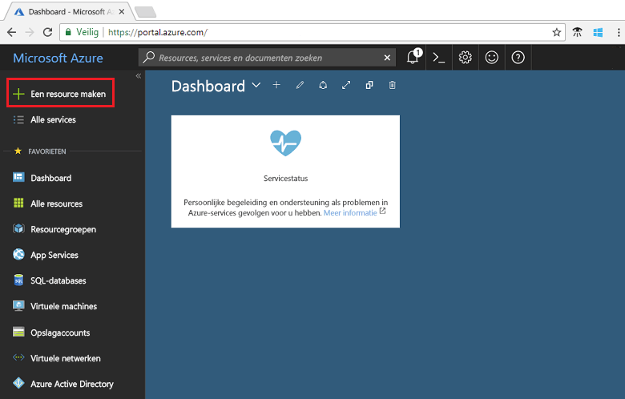
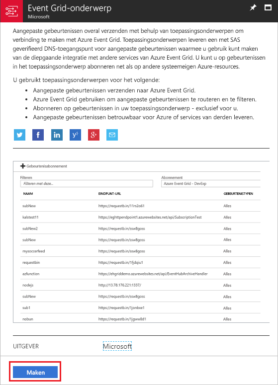
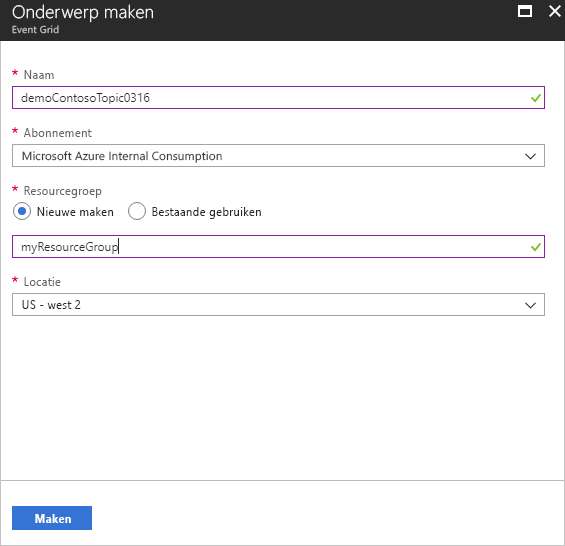
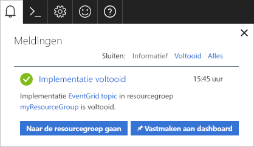
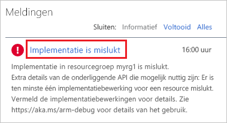
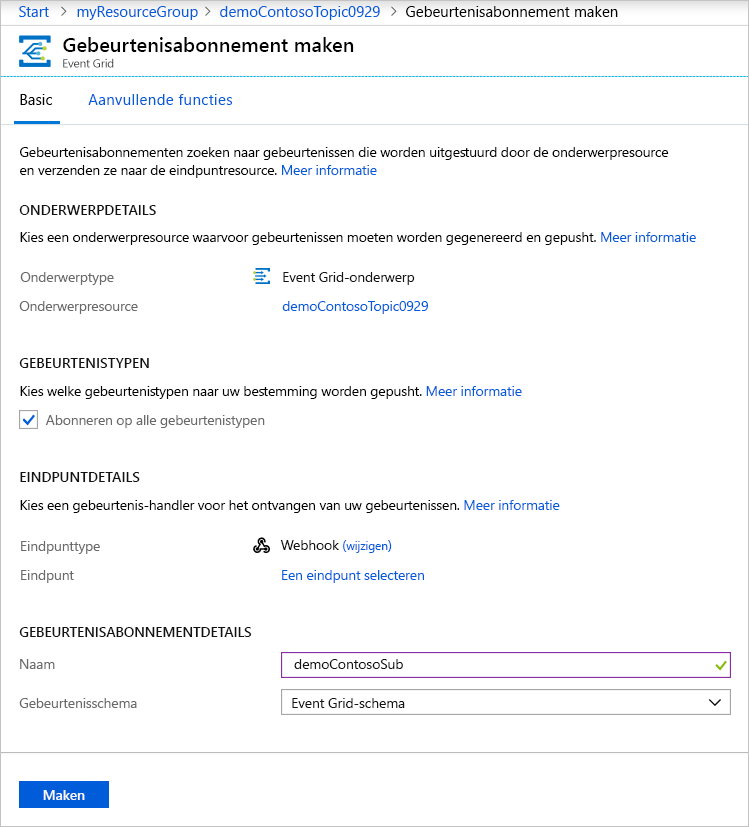

# <a name="create-and-route-custom-events-with-the-azure-portal-and-event-grid"></a>Aangepaste gebeurtenissen maken en routeren met behulp van Azure Portal en Event Grid

Azure Event Grid is een gebeurtenisservice voor de cloud. In dit artikel gebruikt u Azure Portal om een aangepast onderwerp te maken, u op het onderwerp te abonneren, en de gebeurtenis te activeren om het resultaat weer te geven. U verzendt de gebeurtenis naar een Azure-functie die de gegevens van de gebeurtenis registreert. Wanneer u klaar bent, ziet u dat de gebeurtenisgegevens naar een eindpunt zijn verzonden en zijn geregistreerd.

[!INCLUDE [quickstarts-free-trial-note.md](../../includes/quickstarts-free-trial-note.md)]

[!INCLUDE [event-grid-register-provider-portal.md](../../includes/event-grid-register-provider-portal.md)]

## <a name="create-a-custom-topic"></a>Een aangepast onderwerp maken

Een Event Grid-onderwerp biedt een door de gebruiker gedefinieerd eindpunt waarop u de gebeurtenissen kunt posten. 

1. Meld u aan bij [Azure Portal](https://portal.azure.com/).

1. Selecteer **Een resource maken** om een aangepast onderwerp te maken. 

   

1. Zoek naar *Event Grid-onderwerp* en selecteer dat uit de beschikbare opties.

   

1. Selecteer **Maken**.

   

1. Geef een unieke naam op voor het aangepaste onderwerp. De onderwerpnaam moet uniek zijn omdat deze wordt vertegenwoordigd door een DNS-vermelding. Gebruik niet de naam die in de afbeelding wordt weergegeven. Maak in plaats daarvan een eigen naam. Selecteer een van de [ondersteunde regio's](overview.md). Geef een naam op voor de resourcegroep. Selecteer **Maken**.

   

1. Nadat het aangepaste onderwerp is gemaakt, ziet u een melding dat de implementatie gelukt is.

   

   Is de implementatie mislukt, ga dan na waardoor de fout werd veroorzaakt. Selecteer **Implementatie mislukt**.

   

   Selecteer het foutbericht.

   

   De volgende afbeelding toont een implementatie die is mislukt omdat de naam van het aangepaste onderwerp al in gebruik is. Als u deze fout ziet, voert u de implementatie opnieuw uit met een andere naam.

   

## <a name="create-an-azure-function"></a>Een Azure-functie maken

Voordat u zich abonneert op het onderwerp, gaan we het eindpunt voor het gebeurtenisbericht maken. In dit artikel gebruikt u Azure Functions om een functie-app voor het eindpunt te maken.

1. Selecteer **Een resource maken** om een functie te maken.

   

1. Selecteer **Compute** en **Functie-app**.

   

1. Geef een unieke naam op voor de Azure-functie. Gebruik niet de naam die in de afbeelding wordt weergegeven. Selecteer de resourcegroep die u in dit artikel hebt gemaakt. Gebruik **Verbruiksabonnement** voor het hostingabonnement. Gebruik het voorgestelde nieuwe opslagaccount. U kunt Application Insights uitschakelen. Nadat u de waarden hebt opgegeven, selecteert u **Maken**.

   

1. Wanneer de implementatie is voltooid, selecteert u **Ga naar resource**.

   

1. Bij **Functies** selecteert u **+**.

   

1. Selecteer **Aangepaste functie** in de beschikbare opties.

   

1. Schuif omlaag totdat u **Trigger gebeurtenisraster** ziet. Selecteer **C#**.

   

1. Accepteer de standaardwaarden en selecteer **Maken**.

   

Uw functie is nu gereed voor het ontvangen van gebeurtenissen.

## <a name="subscribe-to-a-topic"></a>Abonneren op een onderwerp

U abonneert u op een onderwerp om Event Grid te laten weten welke gebeurtenissen u wilt traceren en waar de gebeurtenissen naartoe moeten worden gestuurd.

1. Selecteer **Event Grid-abonnement toevoegen** in uw Azure-functie.

   

1. Geef waarden op voor het abonnement. Selecteer **Event Grid-onderwerpen** als onderwerptype. Selecteer voor het abonnement en de resourcegroep het abonnement en de resourcegroep waar u uw aangepaste onderwerp hebt gemaakt. Selecteer bijvoorbeeld de naam van uw aangepast onderwerp. Het abonnee-eindpunt is vooraf ingevuld met de URL voor de functie.

   

1. Voordat u de gebeurtenis activeert, opent u de logboeken voor de functie zodat u de gebeurtenisgegevens kunt zien wanneer deze worden verzonden. Selecteer **Logboeken** onderaan uw Azure-functie.

   

Nu gaan we een gebeurtenis activeren om te zien hoe het bericht via Event Grid naar het eindpunt wordt gedistribueerd. Gebruik ter vereenvoudiging van dit artikel Cloud Shell om voorbeeldgebeurtenisgegevens naar het aangepaste onderwerp te verzenden. Meestal worden de gebeurtenisgegevens verzonden via een toepassing of Azure-service.

[!INCLUDE [cloud-shell-try-it.md](../../includes/cloud-shell-try-it.md)]

## <a name="send-an-event-to-your-topic"></a>Een gebeurtenis verzenden naar het onderwerp

Gebruik Azure CLI of PowerShell om een testgebeurtenis te verzenden naar uw aangepaste onderwerp.

Het eerste voorbeeld maakt gebruik van Azure CLI. In dit voorbeeld worden de URL en de sleutel voor het onderwerp, plus de voorbeeldgegevens van de gebeurtenis opgehaald. Gebruik de onderwerpnaam voor `<topic_name>`. Als u de volledige gebeurtenis wilt weergeven, gebruikt u `echo "$body"`. Het element `data` van de JSON is de nettolading van de gebeurtenis. Elke juist opgemaakte JSON kan in dit veld worden ingevoerd. U kunt het onderwerpveld ook gebruiken voor geavanceerd routeren en filteren. CURL is een hulpprogramma waarmee HTTP-aanvragen worden verzonden.

```azurecli-interactive
endpoint=$(az eventgrid topic show --name <topic_name> -g myResourceGroup --query "endpoint" --output tsv)
key=$(az eventgrid topic key list --name <topic_name> -g myResourceGroup --query "key1" --output tsv)

body=$(eval echo "'$(curl https://raw.githubusercontent.com/Azure/azure-docs-json-samples/master/event-grid/customevent.json)'")

curl -X POST -H "aeg-sas-key: $key" -d "$body" $endpoint
```

In het tweede voorbeeld wordt PowerShell gebruikt om gelijksoortige stappen uit te voeren.

```azurepowershell-interactive
$endpoint = (Get-AzureRmEventGridTopic -ResourceGroupName gridResourceGroup -Name <topic-name>).Endpoint
$keys = Get-AzureRmEventGridTopicKey -ResourceGroupName gridResourceGroup -Name <topic-name>

$eventID = Get-Random 99999

#Date format should be SortableDateTimePattern (ISO 8601)
$eventDate = Get-Date -Format s

#Construct body using Hashtable
$htbody = @{
    id= $eventID
    eventType="recordInserted"
    subject="myapp/vehicles/motorcycles"
    eventTime= $eventDate   
    data= @{
        make="Ducati"
        model="Monster"
    }
    dataVersion="1.0"
}

#Use ConvertTo-Json to convert event body from Hashtable to JSON Object
#Append square brackets to the converted JSON payload since they are expected in the event's JSON payload syntax
$body = "["+(ConvertTo-Json $htbody)+"]"

Invoke-WebRequest -Uri $endpoint -Method POST -Body $body -Headers @{"aeg-sas-key" = $keys.Key1}
```

U hebt de gebeurtenis geactiveerd en Event Grid heeft het bericht verzonden naar het eindpunt dat u hebt geconfigureerd toen u zich abonneerde. Bekijk de logboeken voor de gebeurtenisgegevens.


## <a name="clean-up-resources"></a>Resources opschonen

Als u verder wilt werken met deze gebeurtenis, schoon dan de resources die u in dit artikel hebt gemaakt, niet op. Verwijder anders de resources die u in dit artikel hebt gemaakt.

Selecteer de resourcegroep en klik op **Resourcegroep verwijderen**.

## <a name="next-steps"></a>Volgende stappen

U weet nu hoe u aangepaste onderwerpen maakt en hoe u zich abonneert op een gebeurtenis. Kijk waar Event Grid u nog meer bij kan helpen:

- [Over Event Grid](overview.md)
- [Blob Storage-gebeurtenissen naar een aangepast eindpunt op het web routeren](../storage/blobs/storage-blob-event-quickstart.md?toc=%2fazure%2fevent-grid%2ftoc.json)
- [Monitor virtual machine changes with Azure Event Grid and Logic Apps](monitor-virtual-machine-changes-event-grid-logic-app.md) (Wijzigingen in virtuele machines bewaken met Azure Event Grid en Logic Apps)
- [Big data streamen naar een datawarehouse](event-grid-event-hubs-integration.md)
